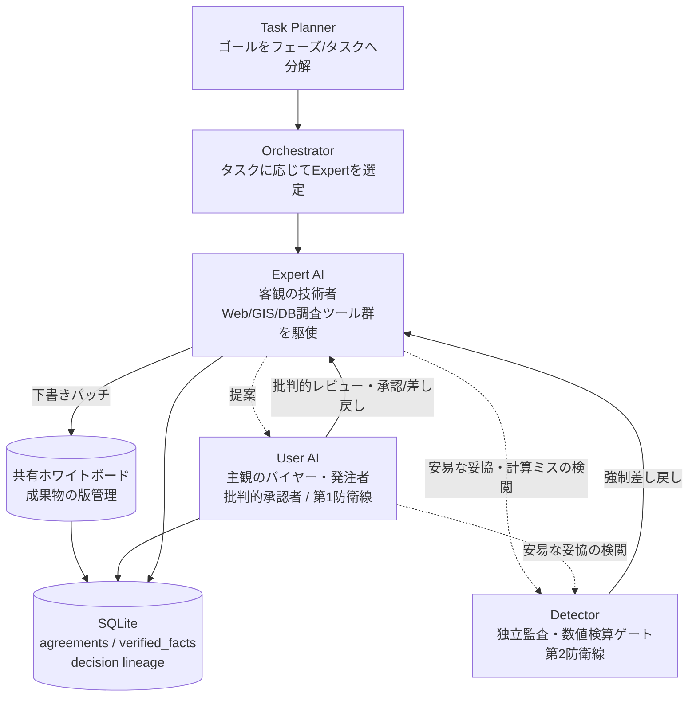

# CELA — Cognitive Experience Lineage-driven Agent System

**「何を決めたか」ではなく「なぜそう決め、なぜ他を捨てたか」を資産化するマルチエージェントAIシステム。**

CELAは、予算・法規制・住民感情のような複雑な利害と物理制約が衝突する意思決定（自治体の公共交通計画など）を、複数のAIエージェントが対立・監査し合いながら自律的に詰めていく実験的なプロジェクトです。LangGraphによるステートマシン上で、Expert（客観の技術者）・User AI（主観のバイヤー／発注者）・Detector（独立監査）・Task Planner（計画分解）などの役割が協調し、成果物と意思決定の理由を SQLite に外部化しながら議論を進めます。

> ⚠️ **開発ステータス**: 個人の実験・研究プロジェクトであり、本番運用を想定した完成品ではありません。単一の巨大モジュール（`cela_main.py`、1万6千行超）を中心に、日々の実行ログから見つかったバグ・設計欠陥を継続的に修正しながら進化させています。詳細な既知課題・設計判断は `docs/design/` 以下がSource of Truthです。

---

## なぜ普通のAIエージェントと違うのか

一般的な商用・OSSエージェント（Claude Code、Operator、Cursor 等）は「作業を高速に代行する手足」であり、会話履歴（スレッド）をSoTとして文脈を延命させます。CELAはそれとは異なる立ち位置で設計されています。

| 観点 | 一般的なエージェント | CELA |
|---|---|---|
| 立ち位置 | 作業自動化（Automation） | 自律的な調査・長期稼働 × 意思決定ガバナンス（Autonomous Investigation × Governance） |
| SoT（信頼できる情報源） | 会話ログ（メッセージ履歴） | 成果物（共有ホワイトボード）＋SQLiteの決定・事物DB。ただの外部メモリではなく、状態（`status`）と操作種別（`action_type`）をスキーマで強制した構造化ストア。会話はホワイトボードを書き換えるための使い捨ての手段 |
| コンテキスト管理 | 履歴の消極的トリミング（削り落とし） | 毎ターン完全ステートレスに起動し、Goal・決定系譜・ホワイトボード最新版から能動的に文脈を再構成（Hydrate）。思考中に気づいた矛盾・改善点も握りつぶさずissueとして起票し、後続タスクへ引き継ぐ |
| 同調バイアス | 妥協して中庸な結論に収束しがち | User AI（主観の徹底抗戦）× Detector（客観の司法監査）の二重防衛線で健全な摩擦を起こす |
| 失敗の記憶 | セッションを閉じると揮発 | 却下された提案とその理由（負の理由）もDBへ永続化し、同じ失敗の再発を防ぐ資産にする |

「ステートレスなAI呼び出し＋外部状態ストアによるメモリ拡張」自体は既知のエージェント設計パターンです。CELAの差別化点はその外部状態に**何をどう構造化して保存するか**にあります——決定事項を無秩序な履歴として積むのではなく、状態遷移そのものをスキーマで強制する設計です（詳細は後述のDecision Lineage参照）。

---

## なぜ長期稼働・大量成果物生成が可能なのか

会話履歴をそのまま積み上げていくステートフルな設計は、フェーズ・タスクを重ねるほどコンテキストが肥大化し、「コンテキストの中だるみ」（何が確定していて何が仮説か分からなくなる）を引き起こします。決定・否決・仮定・数値・状態変化をすべて生の履歴として保持しようとすると、AIはやがて何が正しいかを見失い、状態変化を忘れる・存在しない前提を捏造するといったハルシネーションを起こします。

CELAはこの問題に、履歴を伸ばし続けるのではなく**AIの動作モード自体をステートレスにする**ことで対処しています。ステートレスな各ターンで、必要な情報は都度SQLiteから能動的に取得・合成します。

- **Hydrate（能動的な文脈再構成）** — Goal・決定系譜（Decision Lineage）・ホワイトボード最新版から、そのターンに必要な文脈だけを都度組み立て直す。生の会話履歴をそのまま延命させない。
- **外部化・永続化（SQLite）** — 決定・却下案・会話履歴を `agreements` / `whiteboard_drafts` テーブルへ外部化するだけでなく、「事物」も性質ごとに構造を分けて保持する。数値・条件付き確認事項は `verified_facts`（変数名・値・単位・出典タスク・確認者を紐づけたキーバリュー的な事実台帳）、実世界の固有の物・場所・組織は `entities` / `entity_attributes`（正式名称・別名・属性を紐づけた事物レジストリ）と、別スキーマの2種類で管理し、性質の異なる情報を一つの雑多なテーブルに積み上げない。
- **必要最低限の情報注入** — 会話履歴は最小限に絞り、決定・否決・重要事実などを整理した情報を優先度の高い位置（末尾）へ注入する（BL-178/185）。
- **思考中の能動的な情報取得** — Web検索・GIS・実道路距離算出・過去の確認済み事実照会（`read_verified_fact`）などをLLM自身が呼び出す関数ツールとして公開し、思考を組み立てている最中に「これを確かめたい」と判断した瞬間にAI自身が能動的に呼び出す。ツール経由での能動的なDB検索自体は他のエージェント（社内ナレッジ検索・ユーザープロファイル参照など）にも見られる設計だが、CELAではその取得先が上記の構造化ストア（状態遷移が強制されたagreements、事実種別ごとに分離されたverified_facts/entities）に紐づいている点、かつ取得だけでなく気づきを`write_issue`で書き戻す双方向の流れになっている点が異なる。
- **気づきの資産化（issue化）** — 明示的に指示されていなくても、思考を組み立てる過程で気づいた矛盾や改善点を、その場で流さずに `write_issue` で起票し、握りつぶさずに後続タスクへ引き継ぐ（`DEFER`）。指示されていないことに気づいても、その場限りで消える思考メモにしない。

これらの組み合わせにより、タスクや思考のラウンド数を重ねてもコンテキスト肥大・崩壊やハルシネーションリスクを抑え、多数のタスク・成果物の生成とタスク間の情報維持を両立させています。

### なぜRAG（近似検索）ではなく構造化ストアなのか

意思決定・確認済み事実・決定系譜の検索には、あえて埋め込み類似度によるRAG的な近似検索を採用していません。これらが求めるのは「意味的に近い情報」ではなく「この変数の確定値」「このentityの現在状態」「この決定が何にSUPERSEDEされたか」といった厳密な一致・網羅的な追跡だからです。近似検索は意味的に似ているが別物の項目を取り違えるリスクを構造的に持ち、実際に本プロジェクトでも「乗用車の走行時間とバスの所要時間の混同」や「確認済み変数の取り違えによる金額ドリフト」といった、近似が悪化させうる種類の不整合が起きています。決定系譜のトレース（`trace_lineage`）も同様に、SUPERSEDE・却下関係を辿るグラフ探索であり、top-kの近似検索では監査に必要な網羅性（見落としがないこと）を保証できません。

唯一の例外は事物登録時の重複防止で、`entities`テーブルには文字列類似度による「もしかして」候補提示（`suggest_similar_entities`）があります。ただしこれは事実そのものの検索手段ではなく、新規登録前の重複作成を防ぐ補助的な確認用途に限定されています。

---

## アーキテクチャ概要



- **Task Planner** — 目標を独立して検証可能な「フェーズ／タスク」へ分解し、受入条件（acceptance_criteria）・依存関係（depends_on）・共有変数の所有（owns_variables）を明示する。
- **Expert AI** — 選定された専門分野の担当として実際にタスクを遂行する。web検索・Webページ取得・国土地理院API（ジオコーディング／標高／距離）・実世界事物レジストリ・Python REPL（機械的検算）などのツール群を自律的に使い分ける。
- **User AI（発注者役）** — 成果物を字面だけで検収せず、目標・フェーズ・タスクの意図を読み取って「何を具体化させるべきか」を判断し、Expertへの次の指示とレビューの両方を行う。
- **Detector（独立監査）** — 数値主張の機械的検算（LLMの暗算を信頼しない）と、ドメイン妥当性・思考プロセスの監査を担う第三者ゲート。
- **共有ホワイトボード＋SQLite** — 成果物は差分パッチで版管理され、決定（Decision/Directive/Deliverable）は理由（Why）・出典（citations）付きで永続化される。会話履歴はこの外部状態を再構成するための一時的な入力にすぎない。

---

## 主な特徴

- **Decision Lineage（判断の系譜）** — 外部状態ストアに「何でも積む」のではなく、状態遷移そのものをスキーマで強制する。`agreements` テーブルは `status`（`Proposed`／`Approved`／`Approved_with_Conditions`／`Rejected`／`Implicitly_Accepted`）と `action_type`（`CREATE`／`UPDATE`／`SUPERSEDE`）を組み合わせて「何についての状態変化か」「新規提案か、既存の上書き・置換か」を区別し、無秩序な重複追記をガードが拒否する。採用理由だけでなく却下された代替案とその理由も `status="Rejected"` として永続化され、汎用エッジテーブル（`relation_edges`）による系譜の再帰的な追跡（`trace_lineage`）も可能。
- **二重防衛線ガバナンス** — User AI（主観的検閲）とDetector（客観的司法監査）の摩擦により、なあなあな合意に流れることを防ぐ。
- **監査に基づく計画の再編成** — Task Plannerによる初期分解自体は他のエージェントにも見られるが、CELAは実行途中でissueの影響範囲を監査し、計画を部分的に再分解する。この再編成は計画の無言の上書きではなく、理由（reason_why）付きの`Decision`として`agreements`へ記録され、既に承認済みの成果物は破棄されず並存する（影響範囲外のタスクは無改訂のまま維持）。さらに、既に完了した過去タスクへ一時的に立ち戻る必要が生じた場合は、`task_focus_stack`による中断・自動復帰の状態機械（元タスクの成果物が再承認され次第、自動的に元タスクへ戻る）で扱う——場当たり的な文脈の飛び先変更ではない。
- **数値主張の機械的検算ゲート** — LLM自身の暗算を信頼せず、Python REPLでの再計算・一致確認を必須化。
- **自律的な現実世界調査ツール群** — Web検索／Webページ取得（PDF・Office文書対応）／国土地理院API（ジオコーディング・標高・距離）／実道路距離・所要時間の算出／実世界事物レジストリ。
- **ステートレス能動再構成（Hydrate）** — 毎ターン、SQLiteから目的・決定系譜・成果物最新版を都度合成してコンテキストを組み立てる。
- **一時停止・再開** — LangGraph公式checkpointerによる実行の中断・再開（`--resume`）、任意時点へのtime travel（`--list-checkpoints`）。
- **人間へのエスカレーション** — AIだけでは確定できない実地調査事項をissueとして起票し、別プロセス・別ターミナルから確定値を回答できるCLI（`--pending-human-input` / `--answer-human-input`）。
- **自己文書化されたプロジェクト運営** — 要件・設計・実装タスク・意思決定（理由必須）・進捗を `docs/design/` 以下でレイヤー分離して管理し、AI自身の作業ルールも `AGENTS.md` として明文化。

---

## セットアップ

```bash
pip install -r requirements.txt
# テスト実行も行う場合
pip install -r requirements-dev.txt
```

Python 3.11以降を想定しています。

### 環境変数

利用するLLMプロバイダに応じてAPIキーを設定してください（複数プロバイダをモデルごとに使い分ける構成です）。

| 変数 | 用途 |
|---|---|
| `GEMINI_API_KEY` | Gemini（メインの推論用途） |
| `GEMINI_API_KEY_AUDITOR` | Gemini（監査役用の別キー） |
| `DSEEK_V4_FLASH_USER_KEY` | OpenRouter経由のモデル呼び出し |
| `DSEEK_V4_FLASH_AUDITOR_KEY` | OpenRouter経由の監査役モデル呼び出し |
| `FLM_BASE_URL` | ローカルOpenAI互換エンドポイント（省略時 `http://localhost:52625/v1`） |

---

## 使い方

```bash
# 新規ドライラン開始（既定のゴール文で実行）
python cela_main.py

# 別のゴール文で実行
python cela_main.py --goal-file docs/goal/your_scenario.md

# Ctrl+Cで一時停止したランを再開
python cela_main.py --resume <run_id>

# チェックポイント履歴を確認し、任意時点から再開
python cela_main.py --list-checkpoints <run_id>
python cela_main.py --resume <run_id> --checkpoint-id <checkpoint_id>

# 実地調査待ちのissueを確認・回答
python cela_main.py --pending-human-input <run_id>
python cela_main.py --answer-human-input <run_id> --topic "..." --value "..." --source "..."

# 確定事実・決定の監査レポート（値・理由・出典・系譜）
python cela_main.py --audit-report <run_id> --ref "agreement:<id>"
```

---

## テスト

```bash
python -m pytest tests/ -q
```

`tests/` にはオフライン（LLM呼び出しなし）のスモークテストが多数含まれます。一部のテストは実LLM呼び出しを伴うため、詳細は `AGENTS.md` §17（テスト規律）を参照してください。

---

## ドキュメント

要件・設計・実装タスク・意思決定はすべて `docs/design/` を正（Source of Truth）として管理しています。

| 読むもの | 内容 |
|---|---|
| [docs/design/README.md](docs/design/README.md) | ドキュメント索引・運用モデル |
| [docs/design/STATUS.md](docs/design/STATUS.md) | 現在のフェーズ・直近の進捗 |
| [docs/design/要件定義書_v35.md](docs/design/要件定義書_v35.md) | 要件・設計思想のマスター文書 |
| [docs/design/back_log/issue_backlog.md](docs/design/back_log/issue_backlog.md) | 実装タスク・既知バグ（BL-xxx） |
| [docs/design/decision_log.md](docs/design/decision_log.md) | 意思決定とその理由（D-xxx） |
| [AGENTS.md](AGENTS.md) | AIコーディングエージェント自身の作業規約（このプロジェクトを開発する際のルール） |

---

## ライセンス

現時点でライセンスファイルは未設定です。
