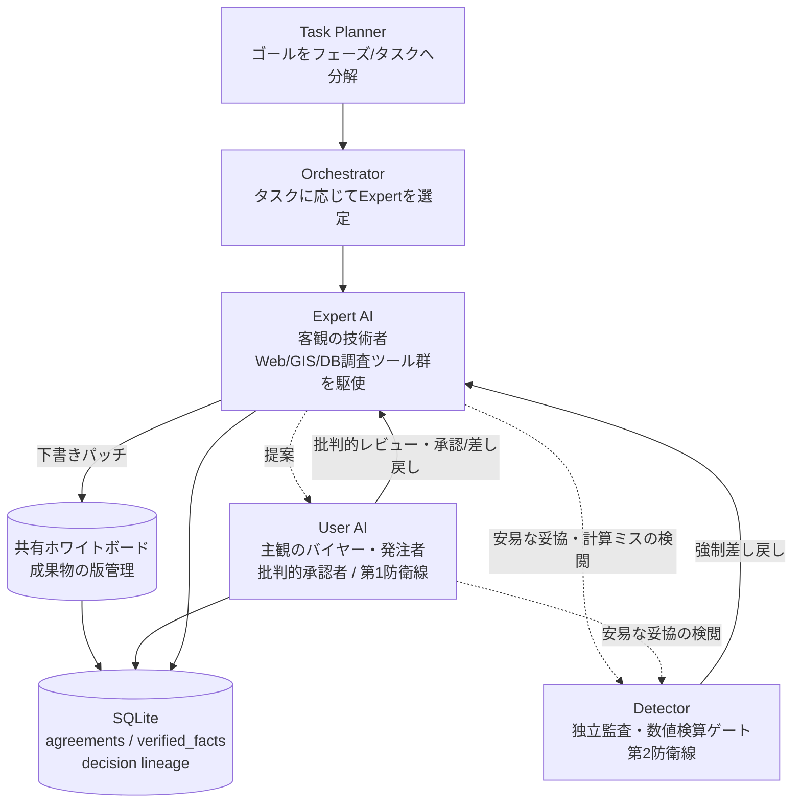

# CELA — Cognitive Experience Lineage-driven Agent System

**「何を決めたか」ではなく「なぜそう決め、なぜ他を捨てたか」を資産化するマルチエージェントAIシステム。**

CELAは、予算・法規制・住民感情のような複雑な利害と物理制約が衝突する意思決定（自治体の公共交通計画など）を、複数のAIエージェントが対立・監査し合いながら自律的に詰めていく実験的なプロジェクトです。LangGraphによるステートマシン上で、Expert（客観の技術者）・User AI（主観のバイヤー／発注者）・Detector（独立監査）・Task Planner（計画分解）などの役割が協調し、成果物と意思決定の理由を SQLite に外部化しながら議論を進めます。

> ⚠️ **開発ステータス**: 個人の実験・研究プロジェクトであり、本番運用を想定した完成品ではありません。単一の巨大モジュール（`cela_main.py`、1万6千行超）を中心に、日々の実行ログから見つかったバグ・設計欠陥を継続的に修正しながら進化させています。詳細な既知課題・設計判断は `docs/design/` 以下がSource of Truthです。

---

## なぜ普通のAIエージェントと違うのか

一般的な商用・OSSエージェント（Claude Code、Operator、Cursor 等）は「作業を高速に代行する手足」であり、会話履歴（スレッド）をSoTとして文脈を延命させます。CELAはそれとは異なる立ち位置で設計されています。

| 観点 | 一般的なエージェント | CELA |
|---|---|---|
| 立ち位置 | 作業自動化（Automation） | 意思決定ガバナンス（Governance） |
| SoT（信頼できる情報源） | 会話ログ（メッセージ履歴） | 成果物（共有ホワイトボード）＋SQLiteの決定DB。会話はホワイトボードを書き換えるための使い捨ての手段 |
| コンテキスト管理 | 履歴の消極的トリミング（削り落とし） | 毎ターン完全ステートレスに起動し、Goal・決定系譜・ホワイトボード最新版から能動的に文脈を再構成（Hydrate） |
| 同調バイアス | 妥協して中庸な結論に収束しがち | User AI（主観の徹底抗戦）× Detector（客観の司法監査）の二重防衛線で健全な摩擦を起こす |
| 失敗の記憶 | セッションを閉じると揮発 | 却下された提案とその理由（負の理由）もDBへ永続化し、同じ失敗の再発を防ぐ資産にする |

---

## アーキテクチャ概要



- **Task Planner** — 目標を独立して検証可能な「フェーズ／タスク」へ分解し、受入条件（acceptance_criteria）・依存関係（depends_on）・共有変数の所有（owns_variables）を明示する。
- **Expert AI** — 選定された専門分野の担当として実際にタスクを遂行する。web検索・Webページ取得・国土地理院API（ジオコーディング／標高／距離）・実世界事物レジストリ・Python REPL（機械的検算）などのツール群を自律的に使い分ける。
- **User AI（発注者役）** — 成果物を字面だけで検収せず、目標・フェーズ・タスクの意図を読み取って「何を具体化させるべきか」を判断し、Expertへの次の指示とレビューの両方を行う。
- **Detector（独立監査）** — 数値主張の機械的検算（LLMの暗算を信頼しない）と、ドメイン妥当性・思考プロセスの監査を担う第三者ゲート。
- **共有ホワイトボード＋SQLite** — 成果物は差分パッチで版管理され、決定（Decision/Directive/Deliverable）は理由（Why）・出典（citations）付きで永続化される。会話履歴はこの外部状態を再構成するための一時的な入力にすぎない。

---

## 主な特徴

- **Decision Lineage（判断の系譜）** — 採用された理由だけでなく、却下された代替案とその理由も `agreements` テーブルへ `status="Rejected"` として永続化。汎用エッジテーブル（`relation_edges`）による系譜の再帰的な追跡（`trace_lineage`）も可能。
- **二重防衛線ガバナンス** — User AI（主観的検閲）とDetector（客観的司法監査）の摩擦により、なあなあな合意に流れることを防ぐ。
- **数値主張の機械的検算ゲート** — LLM自身の暗算を信頼せず、Python REPLでの再計算・一致確認を必須化。
- **自律的な現実世界調査ツール群** — Web検索／Webページ取得（PDF・Office文書対応）／国土地理院API（ジオコーディング・標高・距離）／実道路距離・所要時間の算出／実世界事物レジストリ。
- **ステートレス能動再構成（Hydrate）** — 毎ターン、SQLiteから目的・決定系譜・成果物最新版を都度合成してコンテキストを組み立てる。
- **一時停止・再開** — LangGraph公式checkpointerによる実行の中断・再開（`--resume`）、任意時点へのtime travel（`--list-checkpoints`）。
- **人間へのエスカレーション** — AIだけでは確定できない実地調査事項をissueとして起票し、別プロセス・別ターミナルから確定値を回答できるCLI（`--pending-human-input` / `--answer-human-input`）。
- **自己文書化されたプロジェクト運営** — 要件・設計・実装タスク・意思決定（理由必須）・進捗を `docs/design/` 以下でレイヤー分離して管理し、AI自身の作業ルールも `AGENTS.md` として明文化。

---

## セットアップ

```bash
pip install -r requirements.txt
# テスト実行も行う場合
pip install -r requirements-dev.txt
```

Python 3.11以降を想定しています。

### 環境変数

利用するLLMプロバイダに応じてAPIキーを設定してください（複数プロバイダをモデルごとに使い分ける構成です）。

| 変数 | 用途 |
|---|---|
| `GEMINI_API_KEY` | Gemini（メインの推論用途） |
| `GEMINI_API_KEY_AUDITOR` | Gemini（監査役用の別キー） |
| `DSEEK_V4_FLASH_USER_KEY` | OpenRouter経由のモデル呼び出し |
| `DSEEK_V4_FLASH_AUDITOR_KEY` | OpenRouter経由の監査役モデル呼び出し |
| `FLM_BASE_URL` | ローカルOpenAI互換エンドポイント（省略時 `http://localhost:52625/v1`） |

---

## 使い方

```bash
# 新規ドライラン開始（既定のゴール文で実行）
python cela_main.py

# 別のゴール文で実行
python cela_main.py --goal-file docs/goal/your_scenario.md

# Ctrl+Cで一時停止したランを再開
python cela_main.py --resume <run_id>

# チェックポイント履歴を確認し、任意時点から再開
python cela_main.py --list-checkpoints <run_id>
python cela_main.py --resume <run_id> --checkpoint-id <checkpoint_id>

# 実地調査待ちのissueを確認・回答
python cela_main.py --pending-human-input <run_id>
python cela_main.py --answer-human-input <run_id> --topic "..." --value "..." --source "..."

# 確定事実・決定の監査レポート（値・理由・出典・系譜）
python cela_main.py --audit-report <run_id> --ref "agreement:<id>"
```

---

## テスト

```bash
python -m pytest tests/ -q
```

`tests/` にはオフライン（LLM呼び出しなし）のスモークテストが多数含まれます。一部のテストは実LLM呼び出しを伴うため、詳細は `AGENTS.md` §17（テスト規律）を参照してください。

---

## ドキュメント

要件・設計・実装タスク・意思決定はすべて `docs/design/` を正（Source of Truth）として管理しています。

| 読むもの | 内容 |
|---|---|
| [docs/design/README.md](docs/design/README.md) | ドキュメント索引・運用モデル |
| [docs/design/STATUS.md](docs/design/STATUS.md) | 現在のフェーズ・直近の進捗 |
| [docs/design/要件定義書_v35.md](docs/design/要件定義書_v35.md) | 要件・設計思想のマスター文書 |
| [docs/design/back_log/issue_backlog.md](docs/design/back_log/issue_backlog.md) | 実装タスク・既知バグ（BL-xxx） |
| [docs/design/decision_log.md](docs/design/decision_log.md) | 意思決定とその理由（D-xxx） |
| [AGENTS.md](AGENTS.md) | AIコーディングエージェント自身の作業規約（このプロジェクトを開発する際のルール） |

---

## ライセンス

現時点でライセンスファイルは未設定です。
