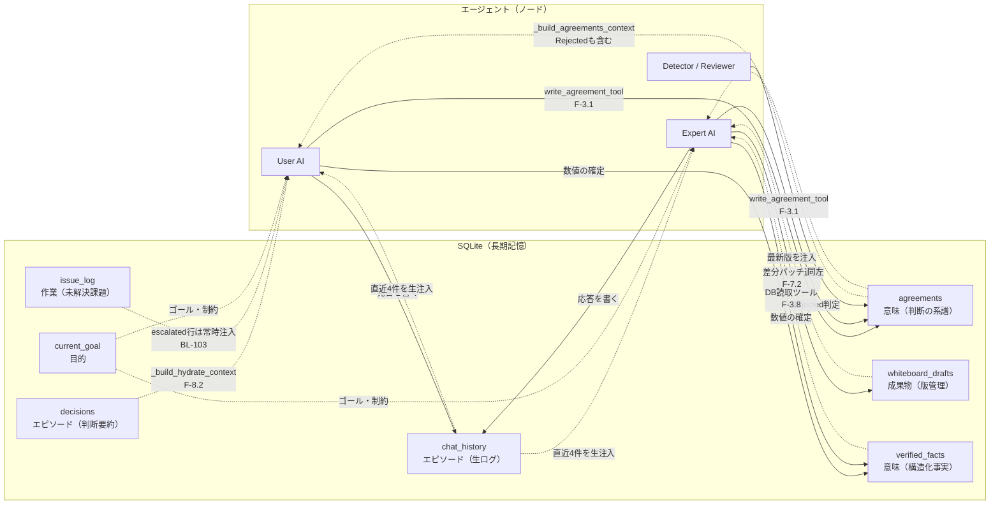
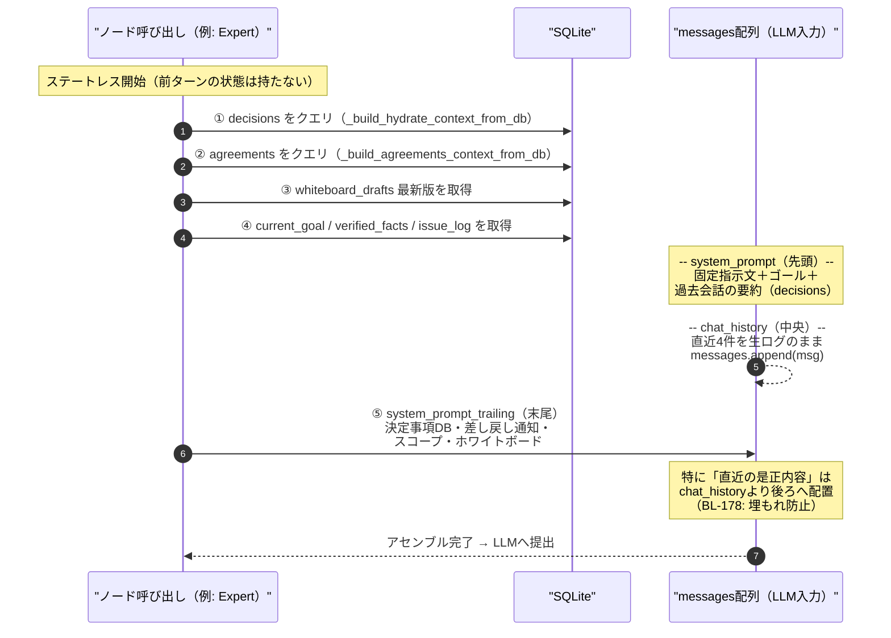
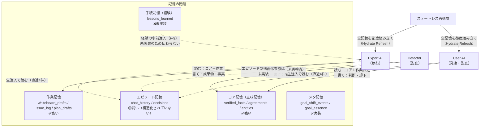
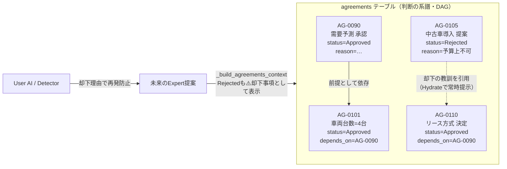
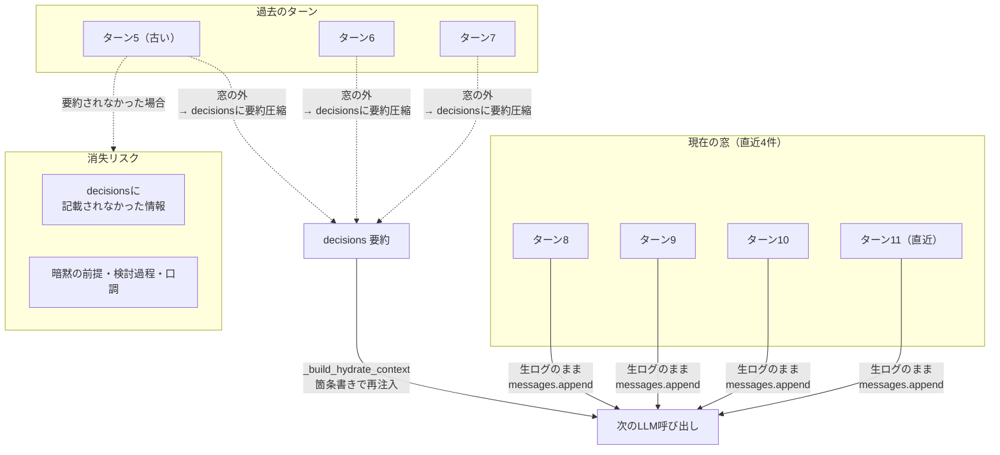

# CELAにおける長期記憶の実装 — 4つの技術分類マッピング

> **本記事の位置づけ**: `docs/blog/blog_topics.md` A-1「ステートレスAI呼び出し×DB再構成で『長期記憶』を実現する」の深掘り版。
> 開発中のマルチエージェントシステム「CELA」が、AIの長期記憶技術の各アプローチをどのように実装しているかを整理する。

---

## 1. はじめに — CELAの「記憶」の設計思想

CELA（Cognitive Experience Lineage-driven Agent）は、複数のLLM（大規模言語モデル）が議論しながら成果物を編纂するマルチエージェントシステムである。その最大の特徴は**「記憶を保持する」のではなく「記憶を毎回組み立て直す」**という設計にある。

従来のチャット型AIが会話履歴をすべて保持し続けるステートフル方式を取るのに対し、CELAは各ノード呼び出しを完全にステートレス（単発LLM呼び出し）とし、SQLiteデータベースから必要な情報だけを能動的にクエリしてコンテキストを合成する。この「ステートレス能動再構成（F-8）」は、記憶に関するOSの仮想記憶管理（MemGPT/Lettaのアプローチ）に類似するが、実装の詳細は大きく異なる。

本記事では、最新のAI長期記憶技術の4分類（外部DB/RAG型、エージェント/ミドルウェア統合型、モデル内部拡張型、パラメータ更新型）を用いて、CELAのどの部分がどの分類に該当し、どの分類がなぜ採用されていないかを整理する。

---

## 2. 外部DB/RAG型 — CELAの主軸

CELAの長期記憶は、**外部データベースSQLite**に大きく依存する。ベクトルデータベースやグラフデータベースを用いたRAG（Retrieval-Augmented Generation）は現状採用されておらず、代わりに構造化テーブルへのクエリによる再構成が中心である。

### 2.1 SQLite 3 完全永続化

CELAは起動時に `init_db()` で15のテーブルを自動生成する。データベースファイルは `cela.db` で、WAL（Write-Ahead Logging）モードで動作する。全テーブルが `CREATE TABLE IF NOT EXISTS` で定義され、システムが停止しても永続化される。

| テーブル | 用途 | 役割（記憶の種類） |
| :--- | :--- | :--- |
| `agreements` | 合意・判断の系譜（DecisionPair） | **意味記憶**：決定内容と理由の構造化保存 |
| `decisions` | 判断ログ（監査証跡） | **エピソード記憶**：時系列の判断記録 |
| `whiteboard_drafts` | 成果物の下書き（バージョン管理） | **成果物記憶**：完成形の版管理 |
| `plan_drafts` | タスク計画の下書き管理 | **計画記憶**：計画書の版管理 |
| `chat_history` | 会話履歴 | **エピソード記憶**：生の対話ログ |
| `current_goal` | 現在の絶対目標 | **タスク記憶**：頂下の哲学・制約 |
| `verified_facts` | 検証済み事実（数値・パラメータ） | **意味記憶**：構造化された事実知識 |
| `goal_shift_events` | ゴール変容記録 | **メタ記憶**：目標変更の履歴 |
| `goal_escalations` | 前提矛盾エスカレーション記録 | **例外記憶**：制約矛盾の発見記録 |
| `goal_essence` | 本質目標分析結果 | **メタ記憶**：目標の根本分析 |
| `issue_log` | 未解決課題の追跡 | **作業記憶**：未解決懸念の永続化 |
| `goal_drafts` | ゴール文書の版管理 | **目標記憶**：目標文章の変遷 |
| `scheduling_drafts` | タスク集中スケジュールの版管理 | **計画記憶**：タスク優先順位の記録 |
| `entities` | 実世界事物のレジストリ | **エンティティ記憶**：固有名詞と正典表記 |
| `entity_attributes` | 事物の属性（出典付き） | **エンティティ記憶**：属性と出典の構造化 |

**合計15テーブル**。全テーブルに `run_id` カラムがあり、実行回ごとの隔離が可能である。

#### 図解：15テーブルと「記憶の伝わり方」の全体像

下図は、CELAの各ノード（LLM呼び出し）が、会話・判断・成果物・事実という4系統の情報を、どのテーブルから「書き込み」され、どのテーブルから「読み出し」されて次ターンへ伝わるかを示す。破線が書き込み（記銘）、実線が読み出し（想起・再構成）の経路である。



**図の読み方**: 情報は「書いただけ」では次ターンに伝わらない。**ステートレス再構成のたびに、DBから読み出してプロンプトへ組み直す**ことで初めて、エージェント間をまたいだ記憶の伝承が成立する。`whiteboard_drafts`（成果物）と`agreements`（判断の系譜）が「正典（SoT）」であり、`chat_history`は「生ログ」として直近のみ参照される。

### 2.2 構造化事実ストア（verified_facts）— F-3.9 実装済み

`verified_facts` テーブルは、要件F-3.9（構造化ファクトストア）を実装している。基本スキーマに加え、`_ensure_verified_facts_r3a_columns()` マイグレーションで `reason`（理由）・`citations`（引用元JSON）・`confidence`（confirmed/provisional）列が追加される。

```sql
-- 基本スキーマ（init_db）
CREATE TABLE IF NOT EXISTS verified_facts (
    variable_name TEXT NOT NULL,
    value TEXT NOT NULL,
    unit TEXT DEFAULT '',
    source_task_id TEXT, source_phase_id TEXT,
    confirmed_by TEXT, confirmed_at REAL,
    run_id TEXT NOT NULL,
    PRIMARY KEY (run_id, variable_name)
);
-- マイグレーションで追加（_ensure_verified_facts_r3a_columns）
ALTER TABLE verified_facts ADD COLUMN reason TEXT DEFAULT '';
ALTER TABLE verified_facts ADD COLUMN citations TEXT DEFAULT '[]';
ALTER TABLE verified_facts ADD COLUMN confidence TEXT DEFAULT 'confirmed';
```

これにより、要件定義上の理想形 `{topic, value, reason, citations: [...]}` の4つ組が実現されている。トピック名（`variable_name`）で検索すれば、値・理由・出典が常にセットで得られる。`confidence` は `confirmed`（確定）と `provisional`（暫定）の2値のみで、暫定値は関連する制約（予算等）に変化があった際の再検討候補として扱われる。

### 2.3 agreementsのcitations列（BL-188）

`agreements` テーブルにも `_ensure_agreements_citations_column()` マイグレーションで `citations` 列（引用元JSON配列）が追加されている。verified_factsのcitationsが構造化ファクト（confirmed_variables経由）に限られていたのに対し、Decision/Deliverable本体そのものにも構造化されたソース欄を持たせるための拡張である。

### 2.4 lessons_learnedとRAG（未実装）

要件定義書F-9は「類似経験（Lessons Learned）のRAG検索」を謳っている。SQLiteのベクトル拡張 `sqlite-vec` をロードしてセマンティック類似検索を行う設計だが、**現時点では `cela_main.py` にこの実装は存在しない**。`lessons_learned` テーブル自体が `CREATE TABLE IF NOT EXISTS` に含まれておらず、RAG機能は**設計ドキュメント上の要件定義に留まる**。

### 2.5 実装状況サマリ

| 外部DB/RAG型の要素 | 実装状態 |
| :--- | :--- |
| SQLiteテーブル群（15テーブル） | ✅ 実装済み |
| 検索インデックス（run_id横断） | ✅ 実装済み |
| 構造化ファクト（verified_facts: reason/citations/confidence） | ✅ 実装済み（F-3.9） |
| agreementsのcitations列 | ✅ 実装済み（BL-188） |
| RAG（sqlite-vec/lessons_learned） | ❌ 未実装（要件定義のみ） |
| ベクトル検索 | ❌ 未実装 |
| グラフDB（Neo4j等） | ❌ 未実装 |

---

## 3. エージェント/ミドルウェア統合型 — 第二の主軸

CELAの記憶システムで特筆すべきは **「エージェント/ミドルウェア統合型」領域**である。OSのメモリ管理（RAM/ディスクの階層）を持たせるMemGPT的アプローチに近いが、CELAはLangGraphのグラフ構造で実装している。

### 3.1 ステートレス能動再構成（OSメモリ管理のアナロジ）

CELAの各LLM呼び出しは、会話履歴を一切保持しない。代わりに `_build_hydrate_context_from_db()` 関数が、SQLiteの `decisions` テーブルから判断ログをクエリし、コンテキスト文字列として注入する。同様に `_build_agreements_context_from_db()` が `agreements` テーブルから合意・決定・成果物を整形して注入する。

```python
def _build_hydrate_context_from_db(conn, run_id, config) -> str:
    # SQLiteからdecisionsを取得し、旧list版と同一のロジックでコンテキスト文字列化する
    return _build_hydrate_context(get_decisions_from_db(conn, run_id), config)

def _build_agreements_context_from_db(conn, run_id) -> str:
    # SQLiteからagreementsを取得し、Rejectedも却下事項として含める既存挙動維持で文字列化する
    return _build_agreements_context(get_agreements_from_db(conn, run_id))
```

`_build_agreements_context` の実装では、以下の処理が行われる：

- **Freeze済み（is_frozen=1）の項目を先頭に配置**（R5 F-8.3）。chat_history_window等のトリミングでFrozen項目が窓の外へ押し出されないよう、常に確実にコンテキスト上位へ含める。
- **statusに応じたアイコン・ラベル**（✅確定合意 / 🤔提案検討中 / ⚠️却下事項 / 📄成果物 / 🔒Freeze済み）
- **reason_why（理由）・evidence（根拠）・citations（出典）を表示**（BL-064/BL-188）
- **直近1件のSuperseded版を差分として1行追記**（BL-050）。全履歴を出すとトークンコストが膨らむため、直前版のみに絞る。

**各テーブル → クエリ → アセンブル → プロンプト注入** という一連の流れは、MemGPTが「主記憶装置（コンテキスト）」と「二次記憶装置（Vector DB）」の間でページングを行う概念と同一だが、CELAはベクトル類似度ではなくSQLの構造化クエリ（`WHERE run_id=? AND status!='Superseded'`）で記憶を検索する。

#### 図解：ステートレス能動再構成 — 1ターン内の「記憶の組み立て」順序

CELAの各LLM呼び出しは、状態を持たずに始まり、**DBからクエリした情報を「先頭（固定指示）」「中央（直近会話）」「末尾（是正内容）」の3層に組み立てて**注入される。BL-104/BL-178の設計上、`chat_history`は常に物理的に後方へ置かれ、`system_prompt_trailing`（決定事項DB・差し戻し等の是正内容）が**そのさらに後ろ**に置かれる。



**図の読み方**: ①〜④が「DBに残った記憶の読み出し」、⑤が「今回のターンで確実に最後に読ませたい是正内容」である。**会話の連続性はchat_historyの生注入**（中央）が担い、**判断の連続性はdecisions/agreementsの再構成**（先頭＋末尾）が担う。この2つが合わさって、ステートレスでも議論が途切れない。

### 3.2 非対称メモリ圧縮（F-8.1）— 要件定義のみ

要件定義書F-8.1は、会話履歴の圧縮に独自の非対称ルールを定義している：

- **Userの質問・発言**: 一切要約せず **生データ（Raw）** のまま保持
- **AIの応答**: 前置きや冗長表現を削ぎ落し、**意思決定の要点のみ要約（Summarized）**

しかし、**この非対称圧縮は現状の `cela_main.py` には実装されていない**。`_build_hydrate_context` は `decisions` テーブルの判断ログを整形するのみで、会話履歴（`chat_history`）のUser生データ/AI要約という非対称処理はコード上に存在しない。要件定義上の設計であり、実装は未着手である。

### 3.3 記憶の階層分け（エピソード記憶 × 意味記憶 × 手続記憶）

CELAのテーブル設計は、認知アーキテクチャの3分類ではある意味で自然に分離している：

| 記憶の種類 | CELA上のテーブル | 認知機能 |
| :--- | :--- | :--- |
| **エピソード記憶** | `chat_history`, `decisions` | 履歴や判断の時系列 |
| **意味記憶** | `agreements`, `verified_facts`, `current_goal` | 「車両は4台」という構造化知識 |
| **手続記憶** | `lessons_learned`（未実装） | 「どうやって計算するか」の教訓 |
| **ワーキングメモリ** | `whiteboard_drafts`（最新版のみ） | 現在作業中の成果物 |
| **メタ記憶** | `goal_shift_events`, `goal_essence` | 目標変更の意識や「本質は何だったか」 |

#### 図解：記憶の種類ごとの「書き込み元 → 読み出し先」

下図は、CELAを認知アーキテクチャの記憶階層に見立てたときに、**どのエージェントがどの記憶を書き、どのエージェントがそれを読むか**を示す。太枠が「強い（実装済み・恒常参照）」、点線枠が「弱い（未実装・部分参照）」である。



**図の読み方**: コア記憶・作業記憶・メタ記憶は「読む」経路が確立しており強い。**エピソード記憶と手続記憶は「読む」経路が弱い**——エピソードは生ログの直近4件しか読まれず、手続記憶（lessons_learned）に至っては書き込むテーブル自体が存在しない。これが8.8節で「弱いのはエピソード記憶」と診断したことの図示である。

### 3.4 記憶の統合・更新メカニズム

**SUPERSEDE方式（無破壊版管理）**:
`agreements` テーブルでは、旧レコードを物理アップデートせず `status='Superseded'` に変更し、新たな行を `status='Approved'` で挿入する。旧レコードの内容は破壊されず、`depends_on` による追跡が常に可能である。これにより、過去にどんな判断があったかを常にクエリできる。

**Freeze機能（F-8.3: 📌）**:
`is_frozen=1` フラグが立ったアグリーメントは、Hydrate時の検索結果から常に除外されず、永久にコンテキストに残り続ける。既存の「説明拒否分（地雷条件）」や「神の決定」が、コンテキスト溢れで落ちるのを防ぐ。実装は `freeze_agreement()` / `_freeze_agreement_tool_impl()` で提供される。

### 3.5 時間減衰と自動セイリエンス（F-8.4、未実装）

NPU-Context-Saverプロジェクトで実運用実績を持ち、CELAの要件定義にも記載されているが、F-8.4（時間減衰検索・ターン自動セイリエンス固定・時系列復元読み）は現状の `cela_main.py` には実装されていない。会話履歴へのタイムスタンプ付与は全テーブルで行われているが、減衰重みや自動ピン留めのロジックは存在しない。

---

## 4. 該当しない分類

### 4.1 モデルアーキテクチャ内部拡張型

- **該当しない理由**: CELAはLLMの内部構造（アテンション機構、KVキャッシュ、状態空間モデル等）を一切変更しない。モデルは外部APIとしてしか接続されておらず、内部に長期記憶を保持する能力は存在しない。CELAのアプローチは「モデル自体の記憶能力」ではなく、「システム全体の記憶能力」に依存する。

### 4.2 パラメータ更新型

- **該当しない理由**: CELAはファインチューニングやナレッジ編集（ROME/MEMIT）を一切行わない。モデルの重みは固定的であり、更新はプロンプトレベルで行われる。

### 4.3 なぜこれらの分類は採用されていないか

CELAは「モデルは使い捨ての推論エンジン」という立場を取っている。システムの中核はモデルではなく、**外部の構造化データとプロンプト合成アーキテクチャ**にある。モデル内部拡張やパラメータ更新を行うと以下の2つのデメリットが発生する：

1. **モデル依存性の増加**: 特定のモデルに記録が固定され、より高性能なモデルへの移行が難しくなる
2. **監査性の低下**: モデル内部の重みが反映する知識は、外部DBの行よりも検証可能でなく、監査ギャップを生む

---

## 5. CELA独自の記憶モデル — 判断系譜（Decision Lineage）

### 5.1 「何を決めたか」と「なぜ決めたか」の物理分離

CELAの最もユニークな記憶メカニズムは、F-3.5で定義される **DecisionPair** である。すなわち、各合意レコードに `decision_what`（決定内容）と `reason_why`（理由）を物理的に別カラムで保存する。

だが、真に特筆すべきは **「負の理由（Rejected）」の資産化**にある（F-3.6）。

```
✅ status="Approved" + decision_what + reason_why （なぜ採用したか）
✅ status="Rejected" + decision_what + reason_why （なぜ却下したか）
```

この「却下された提案内容」と「却下理由」をセット（DecisionPair）で残留させることにより、過去の議論経路が否定された痕跡を未来に伝え、同一の誤り再発防止と「近道」を実現する。一般的なDB/RAG型システムでは「成功した事実は保存するが、失敗した代替案は保存しない」という構想だが、CELAは逆に「負の履歴こそが貴重な知産である」と定義している。

### 5.2 DAG系譜（depends_on）

`agreements` テーブルは、`depends_on` カラムによって決定のDAG（有向非巡回グラフ）を形成する：

- 各合意は「前に依存している合意」を持つ
- 例: `AG-0101`（車両台数決定）は `AG-0090`（需要予測承認）に依存している
- これにより、「この判断は何の前提の上に立っているのか」を遡及できる

通常のグラフDB（Neo4j型）ではないが、DAG系譜の制御は「関係性ネットワークをテーブルが追跡する」という点で、GraphRAGの思想に共通する。

#### 図解：Decision Lineage — 「正の理由」と「負の理由」が次世代へ伝わる経路

下図は、CELAの記憶の中で最も特徴的な「判断の系譜」が、**Approved（正）とRejected（負）の両方をDecisionPairとして残し、depends_onでDAGを形成して、未来の提案に伝わる**様子を示す。負の理由（却下）こそが資産（F-3.6）である点に注目する。



**図の読み方**: 未来のExpertは、`_build_agreements_context`を通じて**Approved（✅確定合意）とRejected（⚠️却下事項）の両方**をまとめて読む。これにより「4台で解が存在しない」という過去の結論（AG-0101の系譜）と「中古車は却下された」という負の履歴（AG-0103）が、**会話を遡らずとも**次の提案に自動的に伝わる。これが要件定義v35の「判断の系譜（Decision Lineage）」の実体である。

### 5.3 GoalShiftEvent — なぜを変えたのか

目標（`current_goal`）が矛盾やエスカレーションで変更された場合、**なぜ変更されたか（Why Shifted）** を `goal_shift_events` テーブルに記録する：

```sql
-- スキーマから抜粋
shift_id TEXT PRIMARY KEY,
shift_kind TEXT NOT NULL,          -- scope_expand / narrow / architecture_pivot 等
from_goal_state TEXT NOT NULL,     -- 変更前の目標
to_goal_state TEXT NOT NULL,       -- 変更後の目標
reason_why TEXT NOT NULL,          -- なぜ変更したか
evidence TEXT,                     -- 根拠となったシミュレーション結果等
triggered_by TEXT NOT NULL         -- MCTS_Fork_Result / Human_Override 等
```

これは「ゴールを変えた」という事実だけでなく、「その変更に責任を問える根拠」を追求することで、将来の監査や説明責任に備えることを意図している。

### 5.4 4分類の中の系譜の位置付け

| 分類 | 該当要素 |
| :--- | :--- |
| ✅ 外部DB/RAG型 | SQLite 15テーブル、verified_facts、構造化クエリ |
| ✅ エージェント/ミドルウェア統合型 | ステートレス能動再構成（decisions/agreementsのDBクエリ）、SUPERSEDE、Freeze |
| ❌ モデル内部拡張型 | — |
| ❌ パラメータ更新型 | — |
| **✨ CELA独自の系譜** | **DecisionPair (What/Why分離)、負の理由の資産化、DAG系譜、GoalShiftEvent** |

---

## 6. 実装のリアル：要件定義と実装のギャップ

本記事では分類整理を主目的としたが、要件定義と実装の間にはギャップが存在する。以下に実装状況を区別して記述する：

| 機能 | 要件定義 | 実装（2026-08-13） | 備考 |
| :--- | :--- | :--- | :--- |
| SQLiteテーブル | ✅ 完全設計 | ✅ 実装済み（15テーブル） | `init_db()` で確認 |
| Hydrate Refresh 5節 | F-8.2 | 🟡 部分実装 | `_build_hydrate_context_from_db()` はdecisionsのみ、`_build_agreements_context_from_db()` はagreementsのみ。完全な5節構造（What/Why/Current/Next/Open）ではない |
| write_agreement_tool | F-3.1 | ✅ 実装済み | `_write_agreement_impl()` / `_commit_agreement_from_tool()` |
| DecisionPair（What/Why分離） | F-3.5 | ✅ 実装済み | `agreements.decision_what / reason_why` |
| 負の理由の資産化 | F-3.6 | ✅ 実装済み | `status="Rejected"` を `_build_agreements_context` で表示 |
| 非対称メモリ圧縮 | F-8.1 | ❌ 未実装 | 要件定義のみ。`_build_hydrate_context` はdecisions整形のみで、User生/AI要約の非対称処理はコード上に存在しない |
| Freeze | F-8.3 | ✅ 実装済み | `freeze_agreement()` / `_freeze_agreement_tool_impl()` / `_build_agreements_context` の先頭配置 |
| GoalShiftEvent | F-22.4 | ✅ 実装済み | `db_append_goal_shift_event()` / `detect_goal_shift()` |
| 構造化ファクト（reason/citations/confidence） | F-3.9 | ✅ 実装済み | `_ensure_verified_facts_r3a_columns()` / `upsert_verified_fact()` |
| agreementsのcitations列 | BL-188 | ✅ 実装済み | `_ensure_agreements_citations_column()` / `_build_agreements_context` の出典表示 |
| エンティティレジストリ | BL-204 | ✅ 実装済み | `entities` / `entity_attributes` テーブル |
| Lessons Learned RAG（sqlite-vec） | F-9 | ❌ 未実装 | 設計要件を定義しただけ |
| 時間減衰検索・自動セイリエンス | F-8.4 | ❌ 未実装 | NPU-Context-Saverでの実績済み |

---

## 7. まとめと読者の教訓

CELAの長期記憶システムは、既存の4分類のうち「外部DB/RAG型」と「エージェント/ミドルウェア統合型」を組み合わせ、さらに独自の系譜記憶「Decision Lineage」を追加したハイブリッド構成である。モデル内部拡張型やパラメータ更新型は意図的に避け、「推論可能な間接化された知識」を外部DBによる構造化データ（行）として保存している。

興味深いのは、CELAのスタッキングにおいて**ベクトルDBやRAGが中心的役割を果たしていない**ことである。多くの最新AIアプリが「ベクトル類似度検索」をデフォルトで採用する中、CELAでは**SQLクエリによる構造化抽出**が主であり、ベクトルRAGはlessons_learned用に設計のみで実装されていない。これは「LLMで文章を比較するよりもDBカラム内を検索する方が速く、かつ監査可能である」という判断によるものである。

---

## 8. 改善提案 — 「ステートレス型マルチエージェントで複数タスクを破綻なくこなす」という目的から見た長期記憶の次の一手

本記事の執筆時点（2026-08-13）の実装を踏まえ、CELAの**本来の目的**——「ステートレス型マルチエージェントで、高度で複数のタスクを破綻なくこなす」——から見て、長期記憶がどうあるべきかを再考する。要件定義のF番号に合わせるのではなく、目的達成に必要な記憶の役割から逆算して提案する。

### 8.1 目的の再確認 — ステートレス型の本質的な弱点と、それを記憶でどう補うか

CELAは「各ノード呼び出しをステートレス（単発LLM呼び出し）にする」ことで、コンテキスト肥大化・先祖返り・同調バイアスを防ぐ設計を取る。**ただし、完全な文脈断絶は実際には起こらない**。`chat_history` は直近N件（`chat_history_window=4`）が**生ログのまま**毎回プロンプトのmessages配列に直接注入されるため（`recent_history = state["chat_history"][-config["chat_history_window"]:]` → `messages.append(msg)`）、会話自体は途切れず比較的スムーズに継続する（BL-104/BL-178で、`[system, ...chat_history]` という配列構造上chat_historyが常に物理的に後ろに来るよう設計されている）。

ステートレス型の本質的な弱点は、会話の「流れ」ではなく、以下にある：

1. **「残る」情報の選択性リスク**: 生ログで継続するのは直近4件のみであり、それより古い会話は `_build_hydrate_context_from_db`（decisionsの要約）に**圧縮されて**引き継がれる。つまり、判断ログ（decisions）に記録されていない情報（暗黙の前提、却下された代替案の検討過程の詳細、口調のニュアンス）は構造的に失われうる
2. **タスク間の引き継ぎの脆弱性**: 複数タスクを順次こなす際、前タスクの成果・教訓・未解決事項を確実に次タスクへ引き継ぐ必要があるが、ステートレスではこれがDBの質に依存する
3. **高度なタスクの文脈依存性**: 高度なタスクほど「なぜこの結論に至ったか」の文脈が重要になるが、フラットなDBでは文脈が失われやすい

長期記憶の役割は、**この3つの弱点を補い、複数タスクを破綻なくこなすための「引き継ぎの確実性」を担保すること**である。以下、この目的から見た提案を整理する。

#### 図解：情報が「どの範囲まで生きたまま伝わり、どこで失われるか」

下図は、ステートレス再構成における**情報の保持・圧縮・消失の境界**を可視化する。直近4件（`chat_history_window=4`）は生ログのまま伝わるが、それを過ぎた会話はdecisionsの要約に圧縮され、その要約にも拾われなかった情報（暗黙の前提・検討過程・口調）は構造的に失われる。



**図の読み方**: **窓（4件）の中は完全に伝わり、窓の外は要約を介して伝わる**。8.4節の非対称メモリ圧縮（F-8.1）は、この「窓の外」のUser発言を生データのまま残すことで、圧縮によるニュアンス喪失を防ごうとする要件定義だが、現状未実装である。8.8補足意見（Claude）が指摘する「記銘（encoding）の強化」は、この図の「decisions要約」に**より濃い情報を最初から書き込む**ことで、消失リスク領域そのものを縮めるアプローチである。

### 8.2 タスク間の「引き継ぎ」を確実にする — 依存関係の明示化（推奨度: 高）

**現状の問題**: 複数タスクを順次こなす際、前タスクの成果（`verified_facts`）・未解決事項（`issue_log`）・教訓（`lessons_learned`未実装）が、次タスクへ確実に引き継がれる保証がない。`_build_task_scope_context` は現在フェーズ内のタスクのみを走査するため、**フェーズをまたぐ依存参照が構造的に解決できない**（要件定義F-3.8で指摘済み、BL-035）。

**提案**: `verified_facts` に `depends_on` 列（JSON配列）を追加し、事実間の依存関係をDAGとして表現する。これにより「このタスクの成果は、どの前タスクの成果に依存しているか」を機械的に追跡できる。さらに、タスク遷移時に「前タスクの成果・未解決事項・教訓」を明示的に引き継ぐ「タスク引き継ぎパケット」を生成する仕組みを追加する。

**期待効果**: フェーズをまたぐ依存参照の解決、タスク間の成果・教訓の確実な引き継ぎ、複数タスクを破綻なくこなすための基盤。

### 8.3 過去の失敗を「経験のDNA」として伝承する — lessons_learnedの実装（推奨度: 高）

**現状の問題**: ステートレス型では、過去のプロジェクトで犯した失敗・技術的罠の教訓がセッション終了とともに失われる。要件定義F-9は「経験のDNA伝承」を謳っているが、`lessons_learned` テーブル自体が未実装である。複数タスクを破綻なくこなすには、**同じ失敗を繰り返さない**ことが不可欠だが、現状はそれが担保されていない。

**提案**: `lessons_learned` テーブルを追加し、失敗が発生した際に `[状況] → [とった手段] → [結果] → [教訓]` の形式で保存する。次回起動時・タスク開始時に、類似する失敗パターンを事前注入する（RAG検索）。`sqlite-vec` 拡張をロードしてセマンティック類似検索を実装する。

**期待効果**: 過去の失敗の再発防止、類似タスクでの教訓の再利用、複数タスクをこなすほど賢くなる「経験の蓄積」。

### 8.4 ステートレス再構成の質を高める — 非対称メモリ圧縮の実装（推奨度: 中）

**現状の問題**: ステートレス型では毎回DBから再構成するため、**再構成の質がそのままタスクの質に直結する**。要件定義F-8.1は「Userは生データ、AIは要約」という非対称圧縮を定義しているが、実装されていない。現在の `_build_hydrate_context` は `decisions` 整形のみであり、会話履歴（`chat_history`）の直近4件は生ログのまま直接注入される（このため直近の会話のニュアンスは保持される）。ただし、**窓（4件）より古い会話はdecisionsの要約に圧縮されて引き継がれる**ため、その範囲の「Userの生の発言」は構造的に失われうる。

**提案**: `chat_history` から直近N件のUser発言は生データ、AI応答は要約として抽出する関数を実装する。`CHAT_HISTORY_WINDOW=4` の設定値は既に存在する。

**期待効果**: コンテキストのトークン消費を削減しつつ、人間の要求のニュアンス（特に窓より古い会話）を保持できる。ステートレス再構成の質が向上し、高度なタスクの文脈が保たれる。

### 8.5 タスクの「現在地」を常に把握する — 進行状況の一元管理（推奨度: 中）

**現状の問題**: 複数タスクを破綻なくこなすには、**「今どのタスクのどの段階にいるか」を常に把握**する必要がある。現状は `whiteboard_drafts`（成果物の版管理）と `issue_log`（未解決課題）が別々に存在し、タスクの進行状況を一元的に把握する仕組みがない。ステートレス型では、再構成のたびに「現在地」を正確に復元できることが重要である。

**提案**: タスクの進行状況（未着手/進行中/完了/保留）を一元管理する `task_status` テーブルを追加し、`whiteboard_drafts` / `issue_log` / `verified_facts` と紐付ける。タスク遷移時に「現在地」を明示的に記録・復元する。

**期待効果**: 複数タスクの進行状況の可視化、ステートレス再構成時の「現在地」の正確な復元、タスクの取りこぼし防止。

### 8.6 テーブル統合の検討（推奨度: 低）

**現状の問題**: 現在15テーブルあり、`whiteboard_drafts` / `plan_drafts` / `goal_drafts` / `scheduling_drafts` はすべて「版管理文書」という同一パターンを持つ。テーブル数が多いと、ステートレス再構成時のクエリが複雑化し、タスクの破綻リスクが高まる。

**提案**: 版管理文書系（whiteboard/plan/goal/scheduling）を `versioned_documents` 1テーブルに統合し、`doc_type` 列で区別する。これにより再構成時のクエリが単純化される。

**期待効果**: スキーマの単純化、再構成時のクエリ簡素化、タスクの破綻リスク低減。

### 8.7 MemGPT移行の考察 — 「初めからMemGPTを使えばもっと高性能で楽？」への回答

本記事の冒頭で、CELAのステートレス能動再構成は「OSの仮想記憶管理（MemGPT/Lettaのアプローチ）に類似する」と述べた。では、**初めからMemGPTを使えば、より高性能で楽に実現できたのだろうか？** この問いに対する考察を整理する。

#### MemGPTの設計思想との根本的な違い

MemGPT（現Letta）は、**単一エージェントのコンテキスト管理**を目的とする。LLMをOSのように扱い、コンテキストウィンドウをRAM、外部DBをDiskと見立て、モデル自身が関数呼び出しで記憶をページングする。その記憶モデルは以下に集約される：

- **コア記憶（Core Memory）**: ユーザーの好み・属性など固定的な事実
- **作業記憶（Working Memory）**: 現在のタスクに関する上下文
- **エピソード記憶（Archival/Recall Memory）**: 過去の会話の履歴（ベクトル検索）

一方、CELAの目的は**マルチエージェントの合意形成と責任追跡（ガバナンス）**である。複数のLLM（User AI / Expert / Detector / Reviewer等）が議論し、その結果を「誰が・何を・なぜ決めたか」として追跡可能にすることが核心である。

#### CELAの核心がMemGPTに置き換えられない3つの理由

1. **Decision Lineage（判断の系譜）がMemGPTに存在しない**
   MemGPTは「情報を忘れない/思い出す」ことに特化しており、「この提案はなぜ却下されたか」「この判断はどの前提に依存しているか」という**判断と理由の系譜**を構造化して保存・参照する概念がない。CELAの`agreements`（What/Why分離、負の理由の資産化、depends_onによるDAG）はMemGPTでは実現できない。

2. **二重防衛線（監査）の実行主体が複数エージェント**
   CELAの品質保証は、単一モデルの記憶能力ではなく、**User AI（第1防衛線）とDetector（第2防衛線）という独立した監査エージェントの役割分担**に依存する。MemGPTは単一エージェントのフレームワークであり、エージェント間の監査・差し戻し・ロールバックというCELAのガバナンス構造を提供しない。

3. **共有ホワイトボードの版管理とロールバック**
   CELAの`whiteboard_drafts`は、複数エージェントが協働して編纂する成果物をバージョン管理し、Detectorのmajor判定でロールバックする。MemGPTは単一エージェントの会話記憶であり、複数エージェントが共有する成果物の一貫性・監査というCELAの要件をカバーしない。

#### MemGPTを「補完」として使う場合の可能性

完全な置き換えは上記の理由で成立しないが、**補完**としては以下の可能性がある：

- **各エージェントの個別セッション記憶**: 各エージェント（Expert等）の個別コンテキスト管理をMemGPTに委譲し、長期の作業詳細を保持させる。CELAはエージェント間の合意（SoT）と監査だけに集中できる。
- **ベクトル検索の追加**: MemGPTのアーカイバル記憶（ベクトル検索）を、未実装の`lessons_learned` RAG（F-9）の実装基盤として利用する。

ただし、この補完アプローチでも、**エージェント間の共有メモリと合意のSoT（Source of Truth）はCELAのSQLiteが担い続けるべき**である。MemGPTの記憶は単一エージェント視点のものであり、複数エージェント間で合意された事実・判断の正典（正典表記）を一元管理することはできない。BL-204の`entities`（正典表記レジストリ）が示す通り、CELAの価値は「複数エージェントが**同じ事実**を参照できること」にあり、これはエージェント個別の記憶では保証できない。

#### 結論

「初めからMemGPTを使えばもっと高性能で楽？」という問いへの回答は、**「高性能かどうかは目的に依存し、CELAの核心（マルチエージェントの合意・監査・系譜）はMemGPTでは実現できない」**となる。MemGPTは**単一エージェントのコンテキスト管理を最適化するツール**であり、CELAは**複数エージェントの合意と責任を管理する基盤**である。レイヤーが異なるため、「置き換え」ではなく「（将来、個別セッション記憶やベクトル検索の実装基盤として）補完」が適切な関係性である。

### 8.8 MemGPT的な記憶分類から見たCELAの現在地 — 「弱いのはエピソード記憶？」

ここまでの検討を踏まえ、CELAの長期記憶を**MemGPTが定義する記憶階層**（コア記憶 / 作業記憶 / エピソード記憶）で再分類すると、次のようになる。これは「CELAのどこが強く、どこが弱いか」を構造的に見るためのフレームワークである。

| 記憶の種類 | MemGPTでの役割 | CELAに該当する要素 | 現状評価 |
| :--- | :--- | :--- | :--- |
| **コア記憶**（意味記憶） | ユーザーの好み・属性など**固定的な事実** | `verified_facts`（検証済み数値・パラメータ）、`agreements`（確定・却下の判断）、`current_goal`（絶対目標）、`entities`（正典表記の事物レジストリ） | ✅ **強い**。事実と判断が「値・理由・出典」付きで構造化されている（F-3.9） |
| **作業記憶** | 現在のタスクに関する**状況** | `whiteboard_drafts`（成果物の最新版）、`issue_log`（未解決課題）、`chat_history`（直近会話）、`plan_drafts`（タスク計画） | ✅ **強い**。`chat_history` 直近4件は生ログのまま毎回プロンプトに直接注入され、会話の連続性は保たれる（`recent_history = state["chat_history"][-config["chat_history_window"]:]` → `messages.append(msg)`） |
| **エピソード記憶** | 過去のやり取り・イベントの**文脈履歴** | `chat_history`（生ログのみ）、`decisions`（判断ログ） | 🟡 **弱い**。後述 |

この分類で見ると、ユーザーの直感（「弱いのはエピソード記憶？」）は**正確に的を射ている**。以下、その弱さの内実を分析する。

#### エピソード記憶が弱い3つの理由

1. **chat_historyは「生ログの蓄積」であり「文脈履歴」ではない**
   `chat_history` は文字通り会話の生ログを時系列で蓄積するだけである。「どの会話が重要な決定に至ったか」「どのイベントが失敗の転換点だったか」という**構造化されたイベント情報**がない。過去のやり取りを「物語（ストーリー）として再構成する」仕組みが存在しない。

2. **非対称メモリ圧縮（F-8.1）が未実装**
   要件定義では「Userは生データ、AIは要約」という非対称圧縮を定義しているが実装されていない。この圧縮こそがエピソード記憶の「要約・構造化」を担うはずだが、**過去の会話をエピソードとして圧縮・保管する処理が存在しない**。結果としてchat_historyは容量が増えるだけで、エピソード記憶として機能しない。

3. **時間減衰検索（F-8.4）が未実装**
   要件定義では「決定・否決ターンの自動セイリエンス固定・時系列復元読み」を定義しているが実装されていない。**「重要なイベント（決定・否決）は過去でも確実にヒットする」という、エピソード記憶の核心機能**が欠落している。すべての会話が同じ重みで扱われるため、重要度による想起ができない。

#### エピソード記憶の弱点が「複数タスクを破綻なくこなす」に与える影響

- **タスク間の「なぜ」の引き継ぎが弱い**: 前タスクで「この数値はこう決めたが、そのときどのような検討過程があったか」をエピソードとして参照できない。`verified_facts`（コア記憶）から結果の値は取得できるが、**検討過程の文脈**は失われる。
- **失敗からの学習が弱い**: 「過去にこの方法で失敗した」というエピソードが構造化されていないため、同じ失敗を繰り返すリスクが残る（`lessons_learned` RAGが未実装なのも同じ問題の一側面）。

#### エピソード記憶を強化する提案

エピソード記憶を強化するには、以下の3つが有効である：

1. **決定・否決イベントの「エピソード化」**: `chat_history` から、決定（Approved）・否決（Rejected）・エスカレーション（major差し戻し）に至った会話断片を自動抽出し、`episodes` テーブルとして構造化保存する。各エピソードに `{trigger, context, decision, outcome}` を持たせる。
2. **非対称メモリ圧縮（F-8.1）の実装**: 過去のAI応答を要約して `chat_history` の圧縮版を生成し、エピソードとして参照可能にする。
3. **時間減衰検索（F-8.4）の実装**: エピソード検索に時間減衰を適用し、決定・否決ターンは自動的に高セイリエンスとして残す。

この「エピソード記憶の強化」は、第8.7節の優先順位のうち「タスク間の引き継ぎ」と「lessons_learnedの実装」の**下支え**となる。エピソード記憶が構造化されれば、タスク間の「なぜ」の引き継ぎと失敗からの学習の両方が機能する。

#### 補足意見（Claude、2026-08-13、BL-219/220の実例を踏まえて）

エピソード記憶が弱いという診断そのものには同意する。ただし、対策の**優先順位**については一段軽い代替案を先に検討すべきだと考える。

上記の提案1（決定・否決イベントの自動エピソード化）は、実装すると「生ログから自動抽出した断片を、後から類似度や関連度で想起する」という構造になりやすく、これは本記事7章がCELAの強みとして挙げた「ベクトルRAGの曖昧さを避け、明示リンクで因果を追跡する」という設計原則と綱引きになる。エピソードの自動抽出・自動想起は、それ自体が「どの断片が正しい文脈か」というRAG特有の再判定コストを持ち込む。

同日に実装したBL-219/220は、この綱引きを回避できる軽い代替案の具体例になっている。task_plan_reviewerが`think`ツールの`scratch_concerns`で「この数値は要検算」と懸念を示していたにもかかわらず、その懸念がどこにも構造化記録として残らず後続タスクから参照不能だった（BL-219）。これは一見「エピソード記憶が無いから過去の議論を辿れない」問題に見えるが、実際の原因は**生ログが無いことではなく、意思決定の瞬間に十分な形で書き残す指示がプロンプト側に無かったこと**だった。対策も、エピソード検索機構を新設するのではなく、「最終出力の直前にscratch_concernsを整理し、既存の懸念欄（`observations`等）かissue_logへ書き残す」よう全16箇所のプロンプトへ指示を追加するだけで完結した（BL-220、`_scratch_concerns_closure_instruction`）。

この実例から言えるのは、エピソード記憶の弱さの少なくとも一部は「想起（retrieval）の弱さ」ではなく「記銘（encoding）の弱さ」だということである。想起を強化する（エピソード自動抽出・時間減衰検索）前に、まず記銘を強化する（`decisions.reason_why`をその場でもっと濃く書かせる、BL-220のパターンを他の「書いたが誰も読まない」記録へ横展開する）方が、コストが低く、RAG的な曖昧さも持ち込まない。8.8の提案1・3（エピソード自動抽出・時間減衰検索）は将来的な検討課題として残しつつ、着手順としては「記銘の強化」を先に置くことを推奨する。

### 8.9 グラフDB化の是非 — 「verified_factsはグラフDBでノードとネットワークを組むのが王道？」への回答

Geminiの分類に「グラフデータベース / GraphRAG：エンティティの関係性をノードとエッジとして保持するナレッジグラフ技術」という説明がある。この説明を踏まえると、「`verified_facts`（およびCELAの事実記憶全般）は、グラフDBでちゃんとノード・ネットワークを組むのが王道ではないか？」という問いが生まれる。この問いに対する考察を整理する。

#### 現在のCELAに既に存在する「グラフ的要素」

CELAは完全なグラフDBを導入していないが、**グラフ的な構造は既にSQLite上に散在している**：

| グラフDBの概念 | CELAの現状 | 実装上の位置 |
| :--- | :--- | :--- |
| **ノード（エンティティ）** | `entities` テーブル（正典表記の事物レジストリ）、`agreements`（判断）、`verified_facts`（検証済み事実） | 既に存在 |
| **属性** | `entity_attributes`（事物の属性＋出典）、`verified_facts`（value/unit/confidence/reason/citations） | 既に存在 |
| **エッジ（関係性）** | `agreements.depends_on`（DAG）、`entity_attributes.source_task_id`、`verified_facts.source_task_id` | 部分的に存在。**エンティティ間の関係を明示するテーブルはない** |
| **関係の辿り（トラバーサル）** | `depends_on` による遡及、`suggest_similar_verified_facts`（トークン一致検索） | 限定的 |

つまり、CELAは「ノードと属性」は持つが、**「エンティティ間の明示的なエッジ」と「関係性のネットワークを辿るトラバーサル」が欠けている**。ユーザーの問いはこのギャップを正確に指摘している。

#### グラフDB化に賛成する理由

1. **事実の依存関係の追跡が自然になる**: 「車両台数=4台」が「需要予測=120人/日」に依存する、という関係は、グラフのエッジとして表現するのが最も自然である。`verified_facts` に `depends_on` 列を追加する現在の提案（第8.2節）は、まさに「グラフをSQLite上で擬似的に実装する」ことである。
2. **変更影響範囲の機械的追跡**: ある事実を更新した際、「どの事実・どの決定が影響を受けるか」をグラフ走査（BFS/DFS）で自動検出できる。これはBL-036（数値ドリフト）・BL-037（根拠が辿れない）で発生した問題の本質的な解決策である。
3. **矛盾検出の自動化**: エッジを辿って前提の変化を検出し、「この前提が変わったから、これに依存する決定は再検討が必要」というアラートを自動生成できる。

#### グラフDB化に反対する理由（軽い代替案の検討）

1. **CELAの規模・要件に対して過剰**: CELAの対象は単一プロジェクト（1つの架空自治体の自動運転バス導入等）であり、エンティティ数は数百〜数千規模である。この規模はリレーショナルDBの再帰CTE（WITH RECURSIVE）やJSONの `depends_on` で十分に扱える。Neo4j等の専用グラフDBを導入するほどの規模ではない。
2. **軽量性・単一ファイル・監査性が失われる**: CELAの強みは「SQLite 1ファイル + WAL + 監査可能な行」にある。グラフDB（Neo4j等）を導入すると、実行環境の複雑化・バックアップ戦略の変更・トランザクション整合性の再設計が必要になる。AGENTS.md §16.1の教訓（重い解決策の前に軽い代替案を検討する）に照らすと、軽量策が先である。
3. **CELAの核心は「合意の監査」であり「関係性の探索」ではない**: CELAの価値はDecision Lineage（誰が・何を・なぜ決めたか）の追跡であり、これは `agreements.depends_on` のDAGで既に実現されている。グラフDBが得意とする「多段の関係性探索（3ホップ先の関連）」は、CELAの現在のユースケースでは稀である。
4. **既存の`entities`がノードの役割を担っている**: BL-204で導入された`entities`（正典表記レジストリ）は、まさに「名前を持つ実世界の事物を一級市民として保持する」ノードである。`entity_attributes`は属性である。**残るのはエッジの明示化だけ**であり、これはグラフDB全体を導入せずとも追加できる。

#### 推奨する中間策 — 「グラフ思考のリレーショナル実装」

結論として、**完全なグラフDB（Neo4j等）への移行は推奨しない**。しかし、ユーザーの問い（「ノード・ネットワークを組むのが王道では」）も正当である。両者を調停する**中間策**を提案する：

1. **`entity_relations` テーブルの追加**: エンティティ間の関係を明示的に表現するエッジテーブルを追加する。
   ```sql
   CREATE TABLE IF NOT EXISTS entity_relations (
       run_id TEXT NOT NULL,
       from_entity_id TEXT NOT NULL,    -- 起点エンティティ
       to_entity_id TEXT NOT NULL,      -- 終点エンティティ
       relation_type TEXT NOT NULL,     -- "depends_on" / "produces" / "constrains" 等
       reason TEXT DEFAULT '',          -- なぜこの関係が存在するか（Decision Lineageの精神）
       citations TEXT DEFAULT '[]',     -- 出典
       PRIMARY KEY (run_id, from_entity_id, to_entity_id, relation_type)
   );
   ```
2. **SQLiteの再帰CTEでトラバーサル**: 関係の辿りには `WITH RECURSIVE` を使用する。SQLiteは再帰CTEをネイティブサポートしており、専用のグラフDBを導入せずとも多段の関係性探索が可能である。
3. **verified_factsをentitiesへ統合する方向性**: ある段階で `verified_facts`（変数名→値のフラットストア）を、`entities`（実体）と `entity_attributes`（属性）に統合する。これにより「車両台数」はエンティティ「車両」の属性として表現され、他の属性（車両単価・運行間隔など）との関係がエッジで結ばれる。

この中間策は、**グラフDBの「思考（ノード・エッジ・トラバーサル）」を、CELAの「軽量・監査可能・単一ファイル」という設計思想を保ったままSQLite上で実装する**ものである。ユーザーの指摘通り、関係性のネットワークを辿る能力はCELAに欠けており、それを SQLite 上で最小コストで追加するのが「王道」の実現方法である。

| アプローチ | コスト | 監査性 | トラバーサル能力 | 推奨度 |
| :--- | :--- | :--- | :--- | :--- |
| 完全なグラフDB（Neo4j等）移行 | 高 | 中（独自トランザクション） | ✅ 強力 | 低 |
| **SQLite + entity_relations + 再帰CTE（中間策）** | 中 | ✅ 高い（行ベース監査） | ✅ 十分（再帰CTE） | **高** |
| 現状維持（depends_on JSONのみ） | 低 | ✅ 高い | ⚠️ 限定的 | 中 |

#### 補足意見（Claude、2026-08-13、BL-219の実例を踏まえて）

「完全なグラフDBへの移行は不要、SQLite上でentity_relations＋再帰CTEの中間策」という結論には同意する。その上で、同日発生したBL-219の実例が、この中間策が解くべき問題を具体的に裏付けているので付記する。

BL-219では、task_plannerが計画立案の段階で「1日の需要は約8,000〜9,000人」という自己流の概算を`acceptance_criteria`の自由記述テキストへ埋め込み、後続タスク（task_1_4）がこの数字を意識せず独立に検算した結果、偶然にも近い値（8,555人）へ着地した。この「本当に独立な導出か、無自覚なアンカリングか」を機械的に判別する手段は現状存在しない。

これはまさに本節の賛成理由②（変更影響範囲の機械的追跡）が指す状況である。もし`verified_facts`に「この暫定値は、どの後続タスクの`owns_variables`と衝突しうるか」を表すエッジ（`entity_relations`相当、`relation_type="anchors"`のような関係）があれば、task_1_4が同じ変数名を確定させた瞬間に「先行する暫定値と近い／遠い」を機械的にフラグでき、アンカリングの疑いを人間がログを読んで気づく（今回のように）のではなくシステム側で検出できる。BL-219の対策（`confirmed_variables`への構造化登録、BL-220の`_scratch_concerns_closure_instruction`）は「記録を残す」層までしか実装しておらず、「残った記録同士の関係を辿って矛盾や疑わしい一致を検出する」層——つまり本節が提案する`entity_relations`＋トラバーサル——はまだ無い。次の一手があるとすれば、`verified_facts`のprovisional値と、それを実際に確定させたタスクの値を結ぶエッジを`entity_relations`に持たせ、両者の乖離・一致を再帰CTEではなく単純な差分チェックで検出する、という8.2節の提案（`verified_facts.depends_on`）と本節の中間策を接続する具体的な最初の一歩になる。

### 8.10 優先順位サマリ（目的ベース、2026-08-13再整理）

8.8/8.9の補足意見と、本記事執筆後に実際に着手されたBL-219〜222を反映し、「実装状況」列を追加して再整理する。**記銘（encoding）を先に直す**という8.8の結論どおり、想起（retrieval）系の重い施策（エピソード自動抽出・時間減衰検索）は優先度を下げた。実装済みの項目を上へ、目的への貢献度と実装状況の両方が見える順に並べる。

| 提案 | 目的との関係 | 推奨度 | コスト | 効果 | 実装状況（2026-08-13） |
| :--- | :--- | :--- | :--- | :--- | :--- |
| **記銘の強化**（decisions/scratch_concernsの書き込み時点を濃くする、8.8補足意見） | なぜの引き継ぎ／複数タスクを破綻なくこなす | 高 | 低 | 想起機構を足す前に「そもそも書き残せているか」を直す。RAG的曖昧さを持ち込まない | ✅ **部分実装済み**（BL-219: task_plannerの暫定値をconfirmed_variablesへ構造化登録／BL-220: `_scratch_concerns_closure_instruction`を think保有16箇所へ機械的適用） |
| タスク間の引き継ぎ（依存関係の明示化） | 複数タスクを破綻なくこなす | 高 | 中 | フェーズ横断の依存解決 | ❌ 未着手 |
| lessons_learnedの実装 | 同じ失敗を繰り返さない | 高 | 中 | 経験の蓄積・再発防止 | ❌ 未着手 |
| グラフ思考のリレーショナル実装（entity_relations） | 事実・決定の関係追跡 | 中 | 中 | BL-036/BL-037の本質的解決、BL-219型アンカリング（8,500人問題）の機械検出 | 🟡 **基盤データは部分実装済み**（BL-219のconfirmed_variablesがエッジの片側に必要な素材を既に提供）、エッジ自体（entity_relationsテーブル）は未着手 |
| 非対称メモリ圧縮の実装 | ステートレス再構成の質向上 | 中 | 低 | 文脈保持＋トークン削減 | ❌ 未着手 |
| タスク進行状況の一元管理 | 現在地の把握 | 中 | 中 | 取りこぼし防止 | ❌ 未着手 |
| エピソード自動抽出・時間減衰検索（8.8の提案1・3） | エピソード記憶の完全な実現 | 低（記銘強化を先に検証してから） | 高 | 想起の構造化 | ❌ 未着手（8.8補足意見により意図的に後回し） |
| テーブル統合 | 再構成の簡素化 | 低 | 中 | クエリ簡素化 | ❌ 未着手 |
| MemGPTの補完的利用 | 個別セッション記憶の効率化 | 低 | 高 | コンテキスト管理の最適化 | ❌ 未着手 |

#### この表のスコープ外（別の目的を持つ隣接施策）

本表は8.1で定めた目的（複数タスクを破綻なくこなす）に対する優先順位であり、以下は**目的が異なる**ため意図的に含めていない。

- **BL-221**（web_fetchの容量上限緩和・キャッシュ全文grep）: 長期記憶ではなく外部情報取得の効率化が目的。
- **BL-222**（`--audit-report` CLI、人間監査UX）: AI自身の記憶ではなく、**既に構造化済みの記憶（verified_facts/agreements）を人間が検査するための読み取りビュー**。長期記憶の「保存」は改善しないが、「保存されている記憶の可監査性」を高める点で本記事のテーマと隣接する。本文への注釈埋め込み（脆い）ではなくDB直読の別ビューを選んだ経緯はD-199を参照。

**参照リンク**:
- 関連ブログ記事: `docs/blog/blog_topics.md` A-1（ステートレス×DB再構成）
- **要件定義**: `docs/design/要件定義書_v35.md` F-3, F-6, F-8, F-9
- **設計文書**: `docs/design/r4/cela_r4_design.md`, `docs/design/r5/cela_r5_design_v2.md`
- **実装コード**: `cela_main.py`（`init_db` / `_build_hydrate_context_from_db` / `_ensure_verified_facts_r3a_columns` 等）
- **本記事執筆後の関連実装**: BL-219/220/221/222（`docs/design/back_log/issue_backlog.md`）、D-196〜199（`docs/design/decision_log.md`）
