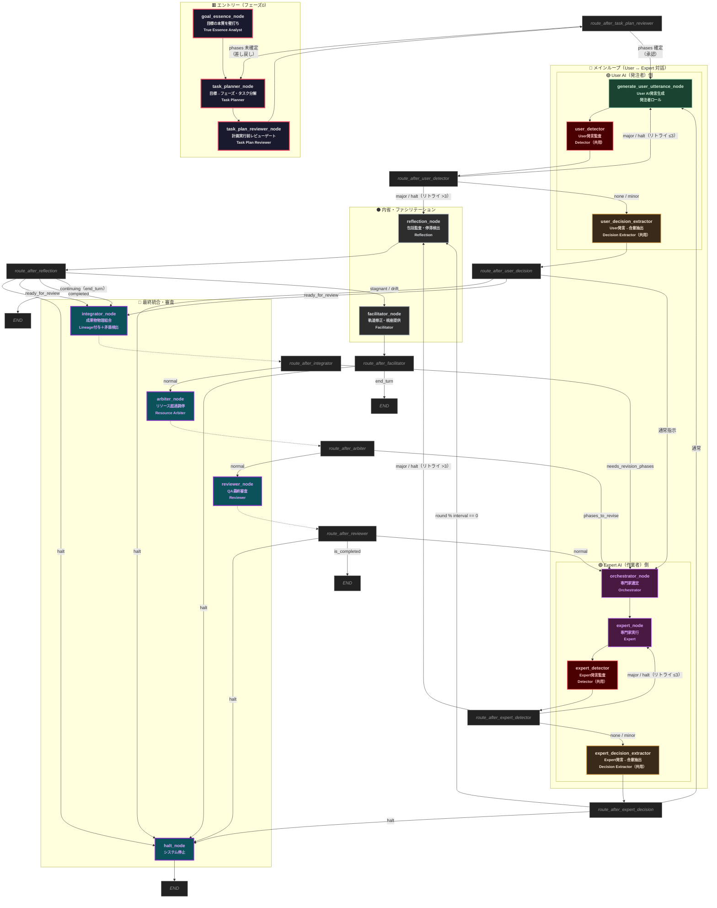
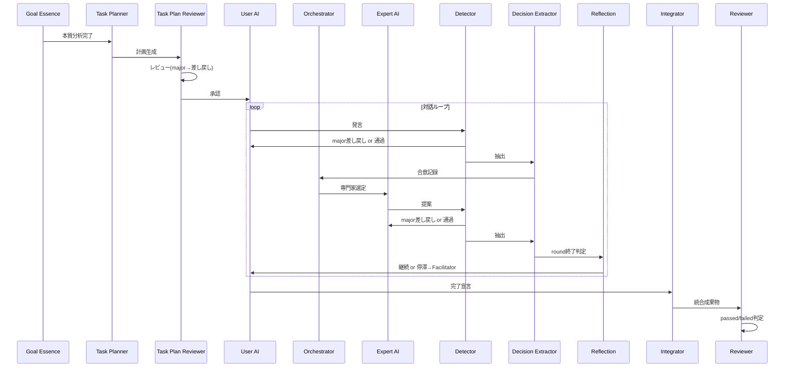

# CELA — ノード・アーキテクチャ図

## ノード一覧

| # | ノード名 | グラフ上のラベル | 役割 | 使用される関数 |
|---|----------|------------------|------|----------------|
| 1 | `goal_essence_node` | 🟥 Entry | 目標の本質を壁打ち | `call_goal_essence_analyst()` |
| 2 | `task_planner_node` | 🟥 Entry | 目標→フェーズ・タスク分解 | `call_task_planner()` |
| 3 | `task_plan_reviewer_node` | 🟥 Entry | 計画実行前レビューゲート | `call_task_plan_reviewer()` |
| 4 | `generate_user_utterance_node` | 🟢 User | User AI発言生成（発注者役） | `generate_user_utterance()` |
| 5 | `user_detector` | 🔴 Detector | User発言の安全性・制約監査 | `detector_node()` / `call_detector()` |
| 6 | `user_decision_extractor` | 🟠 Extractor | User発言から合意・決定を抽出 | `decision_extractor_node()` / `call_decision_extractor()` |
| 7 | `orchestrator_node` | 🟣 Expert | タスクに最適な専門家を選定 | `call_orchestrator()` |
| 8 | `expert_node` | 🟣 Expert | 選定された専門家がタスクを実行 | `call_expert()` |
| 9 | `expert_detector` | 🔴 Detector | Expert提案の安全性・制約監査 | `detector_node()` / `call_detector()` |
| 10 | `expert_decision_extractor` | 🟠 Extractor | Expert発言から合意・決定を抽出 | `decision_extractor_node()` / `call_decision_extractor()` |
| 11 | `reflection_node` | ⚫ Audit | 包括監査（停滞・ドリフト・完了判定） | `call_reflection()` |
| 12 | `facilitator_node` | ⚫ Audit | 議論の軌道修正・視座提供 | `call_facilitator()` |
| 13 | `integrator_node` | 🔷 Final | 全成果物の物理結合＋矛盾検出 | `call_integrator()` + `verify_budget_arithmetic()` |
| 14 | `arbiter_node` | 🔷 Final | リソース超過時の再配分調停 | `call_resource_arbiter()` |
| 15 | `reviewer_node` | 🔷 Final | QA最終審査（passed / failed） | `call_reviewer()` |
| 16 | `halt_node` | 🔷 Final | 直ちにシステムを停止 | — |

## ルーティング判断一覧

| 判断関数 | 出発ノード | 分岐先候補 | 判定条件 |
|----------|-----------|------------|----------|
| `route_after_task_plan_reviewer` | `task_plan_reviewer` | `task_planner` / `generate_user_utterance` | phases クリア(major)なら差し戻し、確定なら次へ |
| `route_after_user_detector` | `user_detector` | `generate_user_utterance` / `user_decision_extractor` / `reflection` | major→リトライ≤3は差し戻し、>3は内省へ。none/minorは抽出へ |
| `route_after_user_decision` | `user_decision_extractor` | `halt` / `integrator` / `orchestrator` | halt最優先→ready_for_review(完了宣言)は統合へ→通常は専門家選定へ |
| `route_after_expert_detector` | `expert_detector` | `expert` / `expert_decision_extractor` / `reflection` | major→リトライ≤3は差し戻し、>3は内省へ。none/minorは抽出へ |
| `route_after_expert_decision` | `expert_decision_extractor` | `halt` / `reflection` / `generate_user_utterance` | halt最優先→roundがintervalで割り切れれば内省→通常はUser AIへ |
| `route_after_reflection` | `reflection` | `halt` / `facilitator` / `integrator` / END | halt最優先→ready_for_review→stagnant→completed→終了 |
| `route_after_integrator` | `integrator` | `orchestrator` / `arbiter` | 改訂必要なら専門家選定へ戻る、正常なら調停へ |
| `route_after_arbiter` | `arbiter` | `orchestrator` / `reviewer` | 再配分が必要なら専門家選定へ戻る、完了ならQA審査へ |
| `route_after_facilitator` | `facilitator` | `halt` / END | halt→停止、通常は終了（次のラウンドへ） |
| `route_after_reviewer` | `reviewer` | `halt` / END / `orchestrator` | halt→停止、passed→完了、failed→修正のため専門家選定へ |

## 主要な処理の流れ（サマリー）

## 備考

- **Detector**・**Decision Extractor** は1つの関数（`detector_node` / `decision_extractor_node`）を使い回しており、グラフ上のエイリアス（`user_detector`, `expert_detector`, `user_decision_extractor`, `expert_decision_extractor`）で役割を区別している。
- **Detector**は2段構成: (1)ドメイン妥当性レビュー（前提・設計の現実性）→ (2)数値監査（F-2.6 python_repl検算）。統合時に重篤な方を採用。
- **Reflection**は呼び出し契機が3つある: (a) `route_after_user_detector`でUserが3回差し戻された場合、(b) `route_after_expert_detector`でExpertが3回差し戻された場合、(c) `route_after_expert_decision`で定期監査（round_count % interval == 0）。
- **route_after_facilitator**・**route_after_reflection** の「end_turn」と「END」は、グラフを1回で完了（`app.invoke()`）させる場合は `END`、`app.stream()` で複数回呼ぶ場合は外部ループが state を保持したまま次のイテレーションを開始する。