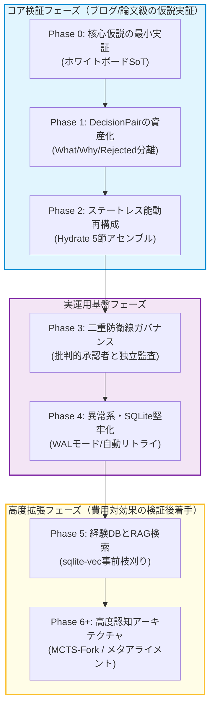

# 開発ロードマップ: CELA (Cognitive Experience Lineage-driven Agent)
# 最終更新: 2026-07-16 (V23.3 アーキテクチャ準拠・MVP検証優先フェーズ分割版)

> **基本方針**: 「作ってみた」で終わらせず、各フェーズの完了条件を「従来型（会話ストリーム依存）エージェントとの数値的比較実験（A/Bテスト）」とする。コアとなる仮説（フェーズ0〜2）が実証されない限り、次フェーズの高度機能へは進まない**アジャイル・仮説検証型**のロードマップを採用する。

---

## 全体マイルストーン

---

## Phase 0: 核心仮説の最小実証 (MVP)
**目的**: 「会話ストリームSoT」から「ホワイトボードSoT」への置き換えだけで、本当に速度と同調バイアスが改善するかを検証する。これが崩れたら以降の全設計が無意味になる最重要フェーズ。

* **タスク**:
    * `whiteboard_drafts` テーブルのみ実装 (F-7.1)。バージョン管理と差分パッチ適用 (F-7.2)。
    * Expert 1体・User AI 1体の最小構成でLangGraphを構築（orchestrator等は省略）。
* **完了条件 (A/Bテスト)**:
    * 既存の「会話ストリーム全文監査」バージョンと「差分パッチ監査（CELA）」バージョンを同一タスクで走らせる。
    * **CELA版がトークン消費・所要時間において明確に速く、かつ最終成果物の質が劣化していないことを数値で確認できること。**

## Phase 1: DecisionPairの資産化 (Why / Why Rejected の分離)
**目的**: 「判断の系譜」というコア差別化要素を最小構成で実装し、却下案の再利用が実際に手戻りを減らすかを検証する。

* **タスク**:
    * `agreements` テーブル実装 (F-3.5, 3.6)。
    * `write_agreement_tool` をAIに持たせ、システム最終フィルター（インターセプター）を実装 (F-3.1, 3.2)。
* **完了条件**:
    * 同じ制約に再度ぶつかったタスクで、AIが「既に却下された案（Rejected）」を記憶しており、絶対に再提案しない（＝系譜が実際に参照・機能している）ことをログで確認できること。

## Phase 2: ステートレス・アクティブ再構成 (Hydrate 5節)
**目的**: 会話履歴のトリミングと文脈復元が、実運用のセッション断絶（新スレッド移行等）に耐えるかを検証する。

* **タスク**:
    * 非対称メモリ圧縮ルールの実装（AI=要約、User=生ログ） (F-8.1)。
    * Hydrate Refresh 5節プロトコル (What/Why/Current/NEXT/Open) のアセンブル実装 (F-8.2)。
    * Freeze (📌) 機能の実装 (F-8.3)。
* **完了条件**:
    * 意図的にセッションを切断して新規スレッドで再開した際、5節のアセンブルだけで前回の文脈（却下案や絶対制約含む）を100%正しく復元し、先祖返りなく議論を再開できること。

---
*(※ここでPhase 0〜2の検証結果をまとめ、技術ブログや論文の初期データとする)*
---

## Phase 3: 二重防衛線ガバナンスの本格化
**目的**: User AI（第1防衛線）とDetector（第2防衛線）の役割分離が、実際に同調バイアスを抑えるか検証する。

* **タスク**:
    * User AIの「批判的承認者化（主観的検閲＋論理監査）」プロンプトの本格実装 (F-1.4)。
    * Detector（独立監査）による予算上限等のグローバル制約チェックの実装 (F-2.1)。
    * Reflection（3ターンごとのマクロ監査）の導入 (F-2.2)。
* **完了条件**:
    * 意図的に「予算超過だが当事者AI同士が妥協しがちな」テストケースを投入し、Detectorが確実に看破して差し戻すことを確認できること。

## Phase 4: 異常系・リトライ・SQLite堅牢化
**目的**: 実運用・長時間稼働に耐えるインフラ基盤を固める（地味だが後回しにするとデバッグ地獄になる部分）。

* **タスク**:
    * SQLite WALモード、タイムアウト60秒、シングルライターキューの組み込み (F-13)。
    * 差し戻しリトライ、強制停止（Halt）、API指数バックオフ実装 (F-4)。
    * ファイル上書き保護機能の実装 (F-3.3)。

## Phase 5: Lessons Learned (経験DB) と RAG
**目的**: 過去プロジェクトの失敗が、別プロジェクトで実際に回避されるかを検証する。

* **タスク**:
    * `lessons_learned` テーブル実装、失敗時の構造化保存 (F-5.3)。
    * `sqlite-vec` を用いたSQLネイティブ・ハイブリッド検索の実装 (F-9.1, F-14)。
    * 事前枝刈り（Pruning）の実装 (F-9.2)。
* **完了条件**:
    * 別プロジェクト（別ドメイン）を立ち上げた際、類似の失敗パターンをRAGで事前に検知し、未然に回避するルートをAIが選択できること。

---

## Phase 6以降: 高度機能 (検証後判断)
**目的**: 以下の機能群は「実装コストが極めて高い」ため、Phase 0〜5が実際に価値を生んでいると実証できてから着手判断を行う。

* **F-10.6 MCTS-Fork (平行宇宙シミュレーション)**:
    * 実装コストが非常に高い割に、「本当にイノベーションが生まれるか」の評価指標が未確立のため保留。
* **F-21 ステークホルダー主観エミュレーション**:
    * `target_topics` を用いた中間テーブル (F-21.2) の設計は完了しているが、モデルが複数ペルソナをどこまで正確に演じきれるかの事前検証が必要。
* **F-22 哲学・市場のメタ能動アライメント**:
    * 自律センシング（OpportunityScout）＋プロアクティブピッチは、システムというより「人間側がAIの自律ピッチをどう受け入れ、ジャッジするか」の運用フロー設計が先に必要なため保留。
* **F-10.2〜10.4 脱バイアス制御 (悪魔の代弁者等)**:
    * Phase 3の「二重防衛線」だけで同調バイアスが十分に抑えられた場合、過剰機能（オーバーエンジニアリング）になる可能性があるため、テスト結果を見て判断する。
