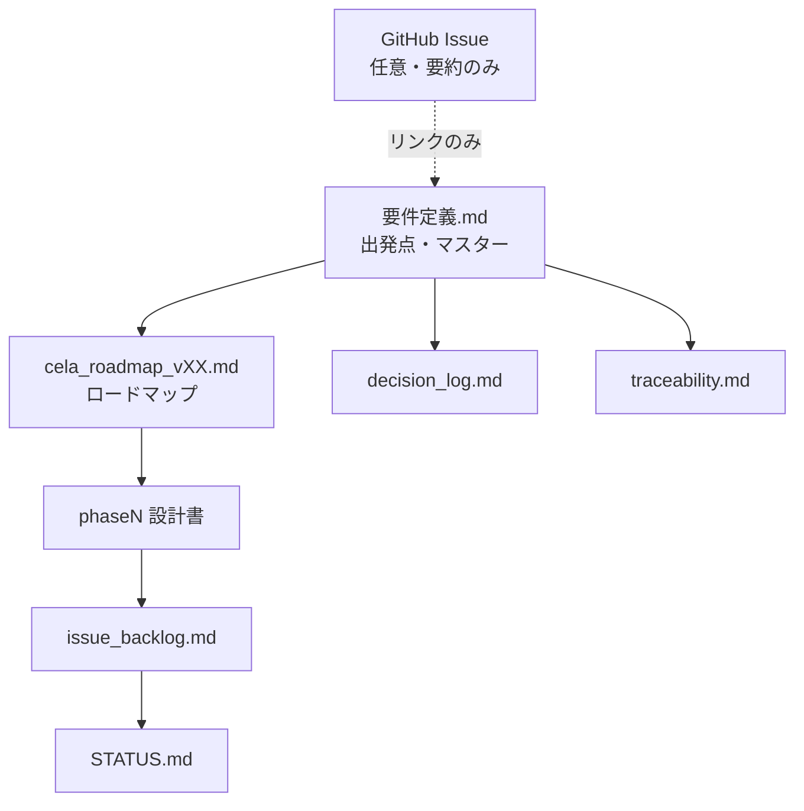

# FEATURE_NAME — ドキュメント索引

> このファイルは機能ドキュメントの **索引** と **Source of Truth 定義** です。  
> 新規プロジェクトでは `FEATURE_NAME` を実機能名にリネームしてください。

---

## ドキュメントの役割（運用モデル）

本プロジェクトは **ハイブリッド型（docs 正）** で管理する。

| レイヤ | 置き場 | 役割 |
|--------|--------|------|
| **要件の出発点・作業用マスター** | [要件定義書_v35.md](要件定義書_v35.md) | 背景・タスク・完了条件・調査結果。**設計フェーズの正**。「何を作るべきか」のみを持ち、実装状況は持たない（下記マップへ分離） |
| **実装状況（要件⇔実コードの乖離）** | [requirements_gap_map.md](requirements_gap_map.md) | **実装状況の唯一の正**。F-1〜F-22・DBスキーマ§4を実コードのみを根拠に照合（全判定に`file:line`証拠）。判定は✅/🟡/❌に加え**⚠️「名前だけ実装」**・**🗑️「死蔵」**（D-201） |
| **構造的負債の監査** | [bl_history_audit.md](bl_history_audit.md) | BL全史の洗い直し。パッチ密度・欠陥クラス別の再発回数・「解決済みだが再発した」連鎖。定点観測スクリプトは`scripts/bl_patch_density.py` |
| **実装ロードマップ・Phase** | [cela_roadmap_v25.md](cela_roadmap_v25.md) | Phase分解・完了条件 |
| **詳細設計・実装仕様** | `r0_planning/` `r1_r2_r3b_core/` `r4/` `r5/` `phase6plus/` | R番号（ロードマップの実装単位）ごとの How・制約・テスト観点 |
| **未決・実装タスク** | [issue_backlog.md](back_log/issue_backlog.md) | BL-xxx（バグ、未実装、未確定） |
| **意思決定** | [decision_log.md](decision_log.md) | **決定理由必須**（Why。BL の「何を直すか」とは分離） |
| **意思決定の系譜（対話）** | [decision_lineage.md](decision_lineage.md) | `decision_log.md` の D-xxx を導いた議論の経緯（誰が何を主張し、誰が決めたか。AI起点の提案も明記）。D-xxx/BL-xxx と相互リンク |
| **進捗・完了判定** | [STATUS.md](STATUS.md) / [phase_gates.md](phase_gates.md) / [traceability.md](traceability.md) | 今どこか、いつ Done か、要件カバレッジ |
| **展開** | [rollout_plan.md](rollout_plan.md) | 本番導入（不要なら削除） |
| **任意: エピック入口** | GitHub Issue（短文） | 外部向け要約 + 本 README へのリンクのみ |
| **任意: 外部プロジェクト参考メモ（未決）** | [npu_context_saver_reference_notes.md](../refs/npu_context_saver_reference_notes.md) | 前身プロジェクト（NPU-Context-Saver）から輸入を検討中のアイデア。**未決定・議論用**、正式な要件ではない |

**要点:** 要件の詳細詰めはリポジトリ内 `docs/` で行う。GitHub Issue に全詳細を書き溜めしない。Issue は後付けでもよい。

---

## まず読むもの

| 優先 | ファイル | 用途 |
|------|---------|------|
| 1 | **[STATUS.md](STATUS.md)** | 今のフェーズ・ブロッカー・次アクション |
| 2 | **[要件定義書_v35.md](要件定義書_v35.md)** | 要件マスター |
| 3 | **[issue_backlog.md](back_log/issue_backlog.md)** | 実装タスク・未確定（BL-xxx） |
| 4 | **[phase_gates.md](phase_gates.md)** | Phase / プロジェクト完了の定義 |

---

## ドキュメントの正（Source of Truth）

| 種別 | 正 | 補足 |
|------|-----|------|
| 要件・受け入れ条件 | **本ディレクトリ**（特に `要件定義.md`） | Issue は要約のみ |
| エージェントとの要件詰め | `要件定義.md` | ここを更新 |
| 実装タスク・バグ | `issue_backlog.md` | レビュー指摘も BL |
| 意思決定 | `decision_log.md` | 決定後に関連 BL を `done` へ |
| 進捗サマリー | `STATUS.md` | マイルストーン時に更新 |
| Phase 完了判定 | `phase_gates.md` | |
| 要件カバレッジ・試験要約 | `traceability.md` | T-* |
| 展開 | `rollout_plan.md` | 任意 |

---

## 外部トラッカー（GitHub Issue 等）との同期

設計フェーズでは **ローカル `docs/` が先行** する。毎保存の自動同期は行わない。

| タイミング | 操作 |
|-----------|------|
| 要件・仕様を詰める | `要件定義.md` および該当 `phase*/` を更新。決定は `decision_log.md` |
| 実装タスクが出た | `issue_backlog.md` に BL 起票 |
| Phase 完了・要件凍結 | 任意で Issue 本文サマリーを更新 |
| プロジェクト Close | `phase_gates.md` と `traceability.md` の受け入れ条件達成後 |

**Issue に書く内容（推奨）:** 背景（数行）、完了条件（箇条書き）、本 README へのリンク。  
**Issue に書かない内容:** Phase 詳細、プロトコル全文、バックログ、レビュー全文。

**過去コメント:** 全面編集しない。方針変更は新規コメントまたは先頭注記のみ。

---

## 実装フェーズ（R番号で統一、D-036で再編）

> **注記（2026-07-21、D-036）**: `docs/design/phaseN/`という旧フォルダ命名は、v23時代の「Phase番号」概念の残骸で、現行のロードマップR番号（R1〜R5）と対応が取れず混乱の原因になっていた（例: 旧`phase3/`フォルダの中身は実際にはR5設計書だった）。フォルダ名をR番号に一本化し、「Phase」という言葉は`phase_gates.md`の完了判定文脈でのみ使う。

| ロードマップ単位 | 内容 | 状態 | ドキュメント |
|-------|------|------|-------------|
| R0（旧Phase 0） | 方針・調査 | 完了 | [r0_planning/](r0_planning/) |
| R1・R2・R3b | SQLite永続化・ツール呼び出し基盤・自律的DB書き込み | R1・R2完了、R3b未着手 | [r1_r2_r3b_core/](r1_r2_r3b_core/) |
| R3a | 自律的DB/ファイル読み取り（F-3.8/F-3.9、★D-036新設） | 未着手 | （設計書はこれから作成、`r3a/`予定） |
| R4 | ホワイトボード差分パッチ化 | 未着手 | [r4/](r4/) |
| R5 | 新規要件群（思考ログ監査/Freeze/GoalShiftEvent） | 未着手 | [r5/](r5/) |
| Phase 6以降 | 高度拡張フェーズ（経験DB・RAG等、費用対効果検証後） | 未着手・保留 | [phase6plus/](phase6plus/) |

---

## 試験メモの置き場

| 内容 | 置き場 |
|------|--------|
| PASS/FAIL 要約 | [traceability.md](traceability.md) T-* |
| 失敗・次に直すこと | [issue_backlog.md](back_log/issue_backlog.md) BL-* |
| 手順・環境の詳細 | `phaseN/phaseN_dryrun.md` |
| 生ログ | プロジェクトで決めたログディレクトリ |

---

## 関連コード（記入）

| 種別 | パス |
|------|------|
| （主要実装） | （記入） |
