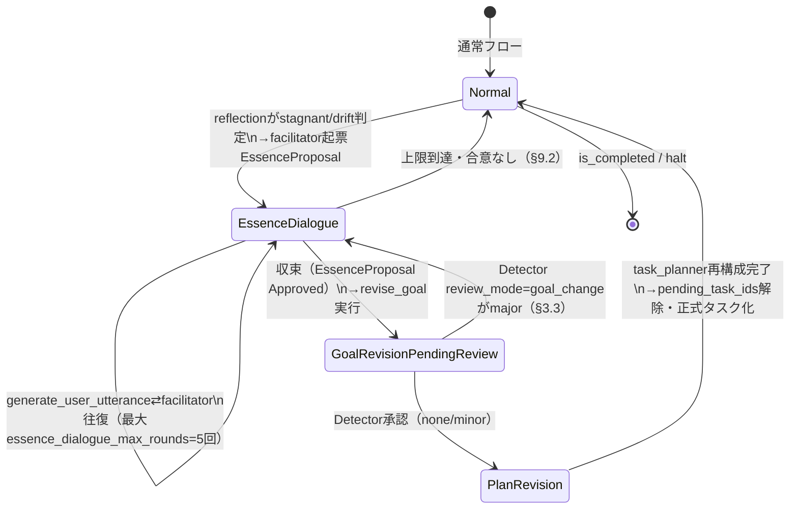

# BL-126/BL-130/BL-131 基本設計: 前提再交渉ワークフロー・Expert相談チャネル・task_id検証

**関連:** [BL-126](../issue_backlog.md#bl-126-bl-086の前提エスカレーションはexpertのリアクティブな経路に限定されておりfacilitatoruser-aiがゴール制約自体を能動的に問い直すプロアクティブな創造的議論モードが未設計), [BL-130](../issue_backlog.md#bl-130-expertが成果物を出さずにuser-aiへ質問相談できる双方向チャネルが未設計現状はuserexpertへの一方向指示のみ), [BL-131](../issue_backlog.md#bl-131-task_plannerの正式なフェーズタスク計画に存在しないtask_idtask_1_1_review等でwrite_agreementwhiteboardが作成されてしまう構造的リスク)、[BL126_review.md](BL126_review.md)（別AIによる設計レビュー）、decision_lineage.md 論点76・78・79

**状態:** 設計完了・v2（レビュー反映済み）・実装は未着手（コード変更は行っていない）

**改訂履歴:** v1（初版保存）→ v2（別AIレビュー`BL126_review.md`の指摘17件を反映。設計上のバグ2件を修正、抜け5件を補完、気づき7件を反映、確認事項3件に確定回答。あわせてBL-131の実装設計（task_id/phase_id実在チェック・target_topic必須化）とTOOL_DISPATCHのstate受け渡し設計を新規追加）

## Context

`log/2026-07-29/1322`ドライランのレビューで、Facilitatorが3件の根本的な実現不可能性（労基法上の人件費下限、予算の二重計上、受入基準自体が予算上限超過）を`escalate_premise_concern`で正式にエスカレーションしたにもかかわらず、その後Facilitatorが自由記述で提案した「制約見直し要求書」タスク（`task_1_1_review`）が、task_plannerの正式な計画に一度も登録されないまま、Expertによって244行・6バージョンの成果物として実行されてしまうという事象が観測された。

その後の`log/2026-07-29/1708`ドライランでも同型の現象が再現しており（`task_1_1_review`が11バージョンまで積み上がり、Reflectionが`stagnant`と正式判定した上でFacilitatorへ差し戻された）、本設計が対象とする問題が実際に繰り返し実害を生んでいることが確認されている。

ユーザーはこれを踏まえ、(a) Facilitator↔User AIが数ラウンド対話して方向性を模索→User承認（旧目標を残しつつ注釈追加、理由記載必須）→Detector確認→Task Planner再構成→正式タスク化、という順序立ったワークフロー（BL-126）、(b) Expertが成果物を出さずにUser AIへ質問・相談できる循環（BL-130）、を新たに設計したいと提起した。あわせて、`write_agreement`が`task_id`をtask_plannerの正式な計画（`state["phases"]`）と一切照合しておらず、任意のtask_idで成果物が作れてしまう構造的な穴（BL-131、今回の事象の直接原因）も発見された。

本設計は、既存コードの詳細調査（Explore agent）とPlan agentによる設計案、および別AIによる独立レビュー（`BL126_review.md`）を踏まえたもの。

## 前提となる現状のコード構造（調査済み）

- **BL-086ツール群**（`ESCALATE_PREMISE_CONCERN_TOOL`/`RESOLVE_PREMISE_CONCERN_TOOL`/`REVISE_GOAL_TOOL`/`FREEZE_AGREEMENT_TOOL`、cela_main.py:1366-1650）: `revise_goal`は`state["goal"]`を**全文上書き**する仕組み（`_apply_text_edits`によるold_text/new_text編集は行うが、goal自体のバージョン履歴テーブルは存在しない）。**Facilitatorはツールを一切持たない**（自由記述のみ）。
  - **[BL126_review §10.1で指摘・訂正]** `FREEZE_AGREEMENT_TOOL`はD-045時点ではデッドコードだったが、**BL-086の実装で既にUser AIのツールリストに再配線済み**（cela_main.py:6256行目付近: `tools=[..., FREEZE_AGREEMENT_TOOL, ...]`）。本設計の初版がBL-086実装より前の調査時点の記述を引きずっていたための誤り。以降「Facilitatorはツールを一切持たない」という記述はfacilitator_nodeについてのみ正しい。
- **`facilitator_node`**（:7285付近）: `route_after_reflection`からstagnant/drift判定でのみ発火。1回の呼び出し＝1メッセージで完結し、User AIとの往復ループは存在しない。`facilitation_count>3`でハード停止。
- **`task_planner_node`**（:6498付近）: `turn_count==1 and not phases`でのみ発火するガード。**ラン途中での計画全体の再構成経路は現状存在しない**（resource_arbiter/integratorの再計画フラグはorchestratorへ戻すのみで、task_plannerには戻らない）。
- **`write_agreement`**（`_write_agreement_impl`/`_commit_agreement_from_tool`）: `depends_on`のID存在チェックはあるが、**`task_id`/`phase_id`が`state["phases"]`に実在するかは一切チェックしていない**。これがBL-131の直接原因（詳細は§2.5）。
- **`round_count`**: `generate_user_utterance_node`（cela_main.py:6322付近）でのみ加算。Detector/Reflection/Facilitatorは含まれない（確認済み、新規カウンター不要）。
- **`TOOL_DISPATCH`**（cela_main.py:2177付近）: R2実装時に導入された、ツール名→ハンドラのモジュールレベル辞書。ハンドラは`args`のみを受け取り、`state`にはアクセスできない（`_query_AI_live`が`LineageState`を知らない汎用エンジンとして設計されているため）。実行時に必要な`run_id`/`task_id`/`phases`/`caller_role`は、ノード関数側が呼び出し直前に設定するモジュールレベルglobal（`_CURRENT_RUN_ID`/`_CURRENT_TASK_ID`/`_CURRENT_PHASES`/`_CURRENT_CALLER_ROLE`）経由で受け渡している（BL-099で既に指摘済みの技術的負債）。詳細と改修方針は§2.6。

## 設計方針（ユーザー承認済みの決定事項）

- **Facilitatorは完全なツールループ化**（Expert/User AI同様、複数ツール呼び出し可能なノードにする）。自身で`escalate_premise_concern`等を呼べるようにする。これにより`_CURRENT_CALLER_ROLE`へ`"facilitator"`を追加し、`escalate_premise_concern`等の権限チェック（現在`expert`/`user`のみ許可）に`facilitator`を追加する必要がある。
- **目標（goal）の注釈は既存の`revise_goal`ツールを流用**する。新規ツールは作らない。`edits`パラメータについて、BL-126経由（`source=="essence_dialogue"`等の由来）の場合は`new_text`が`old_text`を包含する（純粋な追記）ことを検証するルールを追加し、「旧文を残しつつ注釈」を機械的に担保する。

## 1. `LineageState`への追加フィールド

| フィールド | 型 | 初期値 | 意味 |
|---|---|---|---|
| `essence_dialogue_active` | `bool` | `False` | Facilitator↔User AIの本質対話モード中フラグ |
| `essence_dialogue_round` | `int` | `0` | 本質対話の往復回数（`facilitation_count`とは別カウンタ、混同しない） |
| `essence_dialogue_max_rounds` | `int` | `5`（§11で確定） | 本質対話の上限 |
| `pending_goal_revision` | `dict \| None` | `None` | 対話収束後、承認待ちの目標改定案（`proposal_id`/`annotation_text`/`reasoning`/`essence_dialogue_summary`） |
| `goal_revision_pending_review` | `bool` | `False` | Userが承認しDetectorの目標変更レビュー待ちの状態 |
| `pending_task_ids` | `list[str]` | `[]` | Facilitatorの対話中に仮登録されたtask_id（Task Plannerが正式採用/却下するまでの許可リスト） |
| `expert_consultation_mode` | `bool` | `False` | Expertが「質問のみ・成果物なし」を宣言した今ターンのフラグ |
| `expert_pending_question` | `str` | `""` | Expertの質問文（User AIのプロンプトへ提示） |
| `plan_revision_reason` | `str` | `""` | ラン途中の計画再構成トリガー時の理由（`reviewer_feedback`と役割は別） |
| `plan_revision_count` | `int` | `0` | **[v2追加、§11で確定]** ラン途中再構成の実行回数。`task_plan_reviewer_node`の差し戻し上限（既存2回、BL-087 Stage2）と同型のカウンタとして、無限差し戻しループを防ぐ。 |
| `phases_superseded` | `list[dict]` | `[]` | 削除ではなく「supersede」された旧phase/taskの記録（`{task_id, phase_id, reason, superseded_at_round, superseded_by_task_id}`。**[v2修正、§1.3]** `phase_id`を追加——task_idだけではフェーズをまたぐsupersedeの追跡が不完全なため。） |

いずれも`LineageState`へ明示的に宣言必須（LangGraphは未宣言キーを伝播しない、BL-038の教訓）。

### 1.1 〜 1.4: BL126_review指摘への回答（v2で追加）

**§1.1 初期値の不在（設計上のバグ、修正済み）:** 現状の`LineageState`はTypedDict（`total=True`がデフォルト、全フィールド必須）であり、フィールド宣言だけでは初期値が保証されない。**`total=False`への変更は行わない**（既存の全フィールドの必須性を崩すと影響範囲が広すぎる）。代わりに、上表の「初期値」列の通り、初期state生成箇所（cela_main.py:7835行目付近、`run_ai_vs_ai_loop`内の`state: LineageState = {...}`）に全フィールドを明示的に追加する。`--resume`で復元される既存run（本フィールドを持たない古いcheckpoint）については、`_load_checkpoint`直後に`state.setdefault(field, default)`で後方互換的に補完する。

**§1.2 `essence_dialogue_active`と`escalation_active`の優先順位（抜け、確定）:** 両フラグは以下の優先順位で扱う——**`escalation_active`（BL-096のissue escalation）が`True`の間は、Essence Dialogueの新規開始を抑制する**（`facilitator_node`のツールループ内で`PROPOSE_ESSENCE_DIALOGUE`相当の提案を出す前に`escalation_active`をチェックし、Trueなら通常のエスカレーション解決を優先させるプロンプト誘導を行う）。逆に、Essence Dialogue進行中（`essence_dialogue_active=True`）に新規のescalationが発生した場合は許容する（本質対話中にExpertが新たな前提矛盾へ気づく可能性は排除すべきでないため）。つまり非対称: エスカレーション→本質対話は待たせる、本質対話→エスカレーションは許可する。

**§1.4 `pending_task_ids`の整合性リスク（抜け、確定）:** Task Plannerが`pending_task_ids`に存在しないtask_idを新規に発明した場合、これはtask_plannerの正式な計画策定権限の範囲内の正当な動作（`pending_task_ids`はあくまで「まだ正式化されていないが仮に使ってよい」という許可リストであり、Task Planner自身が新しいtask_idを追加すること自体は制約しない）。ただし、Facilitatorが対話中に`pending_task_ids`へ登録したtask_id（例: `task_1_1_review`）が、Task Planner再構成後の`state["phases"]`に**一切登場しなかった場合**（黙って却下された場合）は、`phases_superseded`ではなく新設の軽量ログ（`plan_revision_note`のような文字列、または既存`issue_log`への軽微な記録、§12.2参照）に「対話で提案されたtask_idが正式採用されなかった」旨を残し、後続のExpert/Detectorが混乱しないようにする。

## 2. 新規/変更ツール

- **Facilitator用ツールリスト新設**: `[THINK_TOOL, ESCALATE_PREMISE_CONCERN_TOOL]`。`facilitator_node`をExpert/User AI同様のツールループ構造に変更。
- **本質対話の提案（`PROPOSE_ESSENCE_DIALOGUE`）— [v2修正、§2.1]**: 独立した新規ツールとして起こさず、**`WRITE_AGREEMENT_TOOL`の`entry_type`に`"EssenceProposal"`を追加**する形で実装する（BL126_review §2.1の改善案を採用）。理由: (1) 新規テーブル・新規ツールスキーマを増やさずに既存の`agreements`テーブル・権限チェック（`_check_write_permission`）の枠組みをそのまま再利用できる、(2) `topic`/`reason_why`/`evidence`など既存パラメータがそのまま「何を・なぜ本質から問い直すか」の記述に転用できる。`facilitator`ロールに対し`entry_type="EssenceProposal"`は`status="Proposed"`のみ許可する権限行を`_check_write_permission`に追加する。このagreementが書き込まれたことを`facilitator_node`の呼び出し元（`route_after_reflection`/新設の逆方向エッジ）が検知して`essence_dialogue_active=True`へ遷移させる。
- **Expert用相談ツール（`ASK_USER_QUESTION_TOOL`）— [v2修正、§2.2、命名を統一]**: 「成果物を出さず質問する」ことを宣言する新規ツール。他ツール（`ESCALATE_PREMISE_CONCERN_TOOL`等）と同じ命名規則（大文字スネークケース＋`_TOOL`サフィックス）に統一する。`question_text`（必須）・`blocking_reason`（必須、acceptance_criteria遂行に本当に必要な理由）。呼ばれると`expert_consultation_mode=True`・`expert_pending_question`をセット。Expertの既存ツールリスト（:4764付近）・`light_system_prompt`のツール一覧文言（:4752-4755付近）の両方に追加が必要（片方だけ更新すると齟齬が生まれる）。BL-130の`expert_consultation_mode`時のDetector軽量パスと重複定義しないよう、フラグのセット元はこのツールハンドラの1箇所のみとする。
- **`revise_goal`の拡張**: 既存の「Open escalationが前提」という制約に加え、`pending_goal_revision`（本質対話収束後の提案）からの発火も許可。`source=="essence_dialogue"`の場合、`new_text`が`old_text`を包含すること（純粋追記）を検証する。**[v2追記、§2.3]** この包含検証ロジックは現状の`_apply_text_edits`（cela_main.py:9000行目付近）には存在しない。実装時に新規追加が必要（`new_text.startswith(old_text)`のような単純な前方一致ではなく、`old_text`が`new_text`の部分文字列として完全に含まれることを確認する形にする——追記は末尾とは限らず、`## [ANNOTATION vN]`セクションを適切な位置に挿入するケースもあるため）。

### 2.5 BL-131実装設計（task_id/phase_id検証）— v2で新規追加

現状、`_write_agreement_impl`（cela_main.py:1875）の`required`配列にも`depends_on`型のID存在チェック（1909-1916行目）にも、`phase_id`/`task_id`の実在性は含まれていない。3点の実装を追加する。

**(1) task_id実在チェック:**

```python
# 4.5. task_id/phase_id整合性チェック（BL-131）
if args["entry_type"] in ("Directive", "Deliverable"):
    tid = args.get("task_id") or task_id  # 既存の_CURRENT_TASK_IDフォールバックを維持
    if not tid:
        return {"success": False, "error": "entry_type='Directive'/'Deliverable'にはtask_idが必須です"}
    task_obj = _find_task_by_id(phases, tid)  # phasesはstate["phases"]（§2.6でstate経由取得に変更）
    if task_obj is None and tid not in pending_task_ids:  # BL-126のpending_task_ids
        return {"success": False, "error": f"task_id '{tid}' はtask_plannerの正式な計画に存在しません。既存のtask_idを使うか、正式なタスク化を経てください。"}
```

`entry_type="Decision"`（ゴール直下の一般的な合意事項、`EssenceProposal`含む）は既存通りtask_id任意のままにする——タスクに紐づかない全体決定まで書けなくなる副作用を避けるため。

**(2) phase_id/task_idペアの扱い — [ユーザー議論で方針転換]**: 当初「`expected_phase != given_phase`ならエラーで拒否する」設計を検討したが、`apply_whiteboard_patch`が`get_latest_whiteboard(conn, run_id, phase_id, task_id)`という**(phase_id, task_id)の組**でしか最新版を検索しない構造（cela_main.py:3306）自体が、誤ったphase_id指定時に「該当なし」と誤判定してバージョンが1から再スタートしてしまう真因と特定できたため、**拒否ではなく検索方法自体を修正する**方針に変更した。

`plan_drafts`側には既に`get_latest_plan_draft_by_task_id`という「task_idはrun_id内で一意という命名規約を前提に、phase_idを問わず検索する」設計の前例が存在する（cela_main.py:3344付近）。`get_latest_whiteboard`もこれに揃える:

```python
def get_latest_whiteboard(conn: sqlite3.Connection, run_id: str, phase_id: str, task_id: str) -> dict | None:
    """[R4] 指定task_idの最新バージョンの{version, content}を返す。存在しなければNone。
    [BL-131] task_idはrun_id内で一意という命名規約を前提に、phase_idはWHERE句に含めず
    task_id単独で検索する（get_latest_plan_draft_by_task_idと同じ設計）。呼び出し元が
    誤ったphase_idを渡しても「該当なし」と誤判定してバージョンが1から再スタートする
    事故（1708ログのtask_1_1_reviewで観測）を防ぐ。ただし呼び出し元が渡したphase_idと
    実際に保存されているphase_idが食い違う場合は、計画ミス・引数ミスの兆候として警告する。
    """
    row = conn.execute(
        "SELECT version, content, phase_id AS stored_phase_id FROM whiteboard_drafts "
        "WHERE run_id=? AND task_id=? ORDER BY version DESC LIMIT 1",
        (run_id, task_id)
    ).fetchone()
    if row is None:
        return None
    if phase_id and row["stored_phase_id"] and row["stored_phase_id"] != phase_id:
        print(f"  ⚠️ [Whiteboard phase_id不一致] task_id='{task_id}'の既存版はphase_id="
              f"'{row['stored_phase_id']}'で保存されていますが、今回'{phase_id}'が渡されました。"
              f"task_idの命名規約により正しい版として扱いますが、呼び出し元の引数を確認してください。")
    return {"version": row["version"], "content": row["content"]}
```

- `phase_id`パラメータは関数シグネチャに残す（既存7箇所の呼び出し元を変更不要）。WHERE句からは外し、食い違い検知にのみ使う。
- `apply_whiteboard_patch`（新バージョンのINSERT時）は、呼び出し元が渡したphase_idをそのまま保存する（勝手に補正しない）。**役割分担**: 「保存時は緩く受け止めて壊れないようにする（この関数）」「入口では厳しく検証する（§2.5(1)の`write_agreement`時のtask_id実在チェック）」に分離する。`apply_plan_patch`のget_latest呼び出し箇所も同じ理由でtask_id単独検索へ統一する。
- インデックス`idx_wb_run ON whiteboard_drafts(run_id, phase_id, task_id)`は`(run_id, task_id)`検索でも先頭一致で使えるため実用上問題なし（再構築不要）。

**(3) `target_topic`必須化（新規発見）:** `entry_type in ("Decision","Directive")`のUPDATE/SUPERSEDEでは、`target_topic`省略時に**`topic`（今回渡した新しい値）にフォールバック**する実装になっている（cela_main.py:1744, 1795: `target_topic = args.get("target_topic", topic)`）。これは「更新対象」と「更新後の内容」を取り違えており、LLMが`target_topic`を書き忘れると既存topicを検索できず実質的に空振りUPDATEになる（エラーにもならず気づきにくい）。`action_type in ("UPDATE","SUPERSEDE") and entry_type != "Deliverable"`の場合、`target_topic`を必須パラメータとする（Deliverableは既にBL-084でphase_id/task_idベースに切り替え済みのため対象外）。

### 2.6 TOOL_DISPATCHのstate受け渡し設計 — v2で新規追加

**背景**: `_write_agreement_impl`等のツールハンドラが`state["phases"]`を参照する必要が生じたが（§2.5(1)）、現状の`TOOL_DISPATCH`はモジュールレベルの辞書で`args`しか受け取れず、`run_id`/`task_id`/`phases`は各ノード関数がその都度設定するグローバル（`_CURRENT_RUN_ID`/`_CURRENT_TASK_ID`/`_CURRENT_PHASES`）経由で受け渡している。この方式はR2実装時に「`_query_AI_live`をLineageState非依存の汎用エンジンに保つ」という設計判断から生まれたが、以降の機能追加（BL-086, BL-095, BL-096, BL-101, BL-104）のたびに新しいグローバルが1個ずつ追加され続け、BL-099で既に技術的負債として記録されている。BL-131の実装（`state["phases"]`参照）を機に、**グローバルをこれ以上増やさず、`state`を明示的に受け渡す方式へ切り替える**。

**変更方針:**

1. `_query_AI_live`のシグネチャに`state: dict | None = None`と`caller_role: str = ""`を追加（デフォルト値ありのため既存の全呼び出し元は無変更でも動作する）。
2. ツール実行箇所（cela_main.py:2731行目付近、`result = handler(args)`）を`result = handler(args, state)`に変更する。
3. `TOOL_DISPATCH`の各エントリを`lambda args: fn(args, ...)`から`lambda args, state: fn(args, ...)`へ統一する。`state`を使わないハンドラ（`python_repl`, `think`等）は単に第2引数を無視する: `"think": lambda args, state: _think_handler(args)`。
4. `state`を必要とするハンドラ（`write_agreement`, `escalate_premise_concern`, `resolve_premise_concern`, `revise_goal`, `freeze_agreement`）は、`_CURRENT_RUN_ID`/`_CURRENT_TASK_ID`/`_CURRENT_PHASES`の代わりに`state["run_id"]`/`state.get("current_task_id","")`/`state.get("phases",[])`を直接参照するよう書き換える。これにより**`_CURRENT_RUN_ID`/`_CURRENT_TASK_ID`/`_CURRENT_PHASES`の3グローバルは廃止**できる（BL-099の一部解消）。
5. `_CURRENT_CALLER_ROLE`は「どのノードが呼んでいるか」という、`state`（会話・計画の中身）とは独立した「呼び出し文脈」の情報であるため、`state`に含めるのではなく`caller_role`という別の明示引数として`_query_AI_live`に渡す（既存のグローバル設定コードをこの新しい明示引数へ置き換える）。
6. 各ノード関数（`call_expert`/`call_detector`/`call_facilitator`/`generate_user_utterance`等、いずれも`state: LineageState`を既に引数として持っている）は、`_query_AI_live(...)`呼び出し箇所に`state=state, caller_role="expert"`（各ノードの役割文字列）を追加するだけでよい。

**影響範囲**: `_query_AI_live`のシグネチャ変更（後方互換、デフォルト値あり）、`TOOL_DISPATCH`の5エントリのラムダ書き換え、各ハンドラ関数の内部参照置き換え（`_CURRENT_RUN_ID`等→`state[...]`）、約15箇所ある`_query_AI_live`呼び出し元への`state=`/`caller_role=`引数追加。**これはBL-131単体よりもスコープが大きい横断的リファクタであり、BL-131実装の一部として着手するか、独立したBLとして先行させるかは実装着手時に確定する**（実装順序§8で位置づけを明記）。

## 3. グラフノード・ルーティングの変更

- **BL-130（Expert相談チャネル）**: Expertノードが`expert_consultation_mode`/`expert_pending_question`を状態へ反映。`expert_detector_node`・`expert_decision_extractor`は`expert_consultation_mode`時に厳格な監査・抽出をスキップ（Detectorは軽量パス、Decision Extractorは何も抽出しない）。`route_after_expert_detector`/`route_after_expert_decision`に新分岐を追加し、`generate_user_utterance`へ直行させる。`generate_user_utterance_node`は`expert_pending_question`を検出しUser AIのプロンプトへ明示的に提示、消費後にフラグをリセット。

### 3.1 本質対話ループのエッジ設計 — [v2修正、設計上のバグを解消]

現状の`route_after_facilitator`（cela_main.py:7770行目付近）は既に4分岐（`"halt"`/`"reflection"`/`"integrator"`/`"generate_user_utterance"`）を持ち、`facilitator→generate_user_utterance`という向きのエッジは**既存**である。本設計の実質的な新規性は、Facilitatorがツールループ化されるのに伴い、**逆方向（`generate_user_utterance`→`facilitator`）のエッジが新たに必要になる**という点であり、v1の記述「新規ループエッジ`facilitator ⇄ generate_user_utterance`」は既存/新規の区別が曖昧だった。v2では以下の通り明確化する:

- **既存のまま変更しない**: `facilitator → (halt | reflection | integrator | generate_user_utterance)` という`route_after_facilitator`の4分岐。
- **新規追加**: `generate_user_utterance`の直後（`route_after_user_detector`より手前、または`user_detector`自体の分岐条件として）に、`if state.get("essence_dialogue_active"): return "facilitator"` という新しい条件分岐を追加する。これにより、本質対話モード中はUser AIの発言がDetectorの通常監査をスキップして直接Facilitatorへ戻り、`essence_dialogue_round`が上限（5回）に達するかFacilitatorが`EssenceProposal`（§2）を確定するまで往復する。
- **収束後の離脱条件**: Facilitatorが`write_agreement(entry_type="EssenceProposal", status="Approved")`相当（Userの承認を経た確定）を検知するか、`essence_dialogue_round >= essence_dialogue_max_rounds`に達したら、`essence_dialogue_active=False`にリセットして通常フロー（`user_detector`経由）へ復帰する。

### 3.2 `facilitation_count>3`とツールループ化の関係 — [v2追記、気づきへの回答]

Facilitatorのツールループ化後も、1回の`facilitator_node`呼び出し内で複数回ツールを呼べるようになるが、`facilitation_count += 1`は`facilitator_node`関数の**呼び出しごとに1回**しか実行されない（ツールループ内の個々のツール呼び出しごとにインクリメントされるわけではない）ため、ツールループ化によって`facilitation_count>3`のhalt条件が意図せず早期に発火するリスクはない。ただし、Essence Dialogueモードで`facilitator`が往復のたびに呼ばれる場合（§3.1）、この往復も`facilitator_node`の呼び出し回数としてカウントされ`facilitation_count`を消費する。**Essence Dialogue中は`facilitation_count`を加算しない**（本質対話の往復は「議論が停滞・逸脱している」ことの兆候ではなく、意図的な合意形成プロセスであるため）よう、`facilitator_node`冒頭に`if not state.get("essence_dialogue_active"): state["facilitation_count"] += 1`という条件分岐を追加する。

### 3.3 Detector目標変更レビューが`major`を返した場合のルーティング — [v2追記、設計上のバグを解消]

`goal_revision_pending_review`→Detector`review_mode="goal_change"`→`major`（却下）だった場合の遷移を以下の通り定義する:

- `major`判定時は`goal_revision_pending_review`を維持したまま`pending_goal_revision`を**破棄せず**、Detectorのコメント（却下理由）を`pending_goal_revision`へ追記した上で`essence_dialogue_active=True`へ**再度戻す**（Facilitator↔Userの対話へ差し戻し、`essence_dialogue_round`は0にリセットしない——上限5回は「本質対話1セッションあたり」の総枠として扱う）。
- `essence_dialogue_max_rounds`を再度使い切って`major`が解消しない場合は、通常のreflection経路（`discussion_status="stagnant"`）へ落とし、最終的な`facilitation_count>3`のHALT安全弁に委ねる（無限に目標変更を試み続けることを防ぐ）。
- `none`/`minor`（承認）の場合のみ、既存記述通り`plan_revision_reason`をセットしTask Plannerへ進む。

## 4. 目標（goal）のバージョニング

`whiteboard_drafts`/`plan_drafts`と同型の**新規`goal_drafts`テーブル**を追加する。`apply_goal_patch`/`get_latest_goal_draft`は**現状のコードに存在せず新規追加が必要**（`apply_whiteboard_patch`/`apply_plan_patch`をテンプレートとする。§2.5(2)で修正した「task_id単独検索」方式は`goal_drafts`には該当しない——goalは単一の文書であり複数task_idを持たないため）。`state["goal"]`は「現在有効な本文」を保持したまま（既存の参照元に影響を与えない）、`goal_drafts`が追記のみの版管理・全文履歴を担う。「旧文を残しつつ注釈」は、`revise_goal`が`new_content = old_content + "\n\n## [ANNOTATION vN] " + annotation + "\n理由: " + reasoning`という追記ルールで`apply_goal_patch`へ渡すことで実現する。

**[v2追記、§4.2への回答]** `state["goal"]`の全消費箇所は実装着手時に`grep -n 'state\["goal"\]\|state\.get("goal"'`で機械的に再列挙し、本設計書またはコードコメントに列挙する（v1の「9箇所」という記述は具体的なリストを伴っておらず検証不能だったため、v2では数値の断定を避け「実装時に列挙」に変更）。

**[BL-132を踏まえた補足]**: `whiteboard_drafts`/`plan_drafts`は`(phase_id, task_id)`のみで版管理されており`topic`列を持たない。`goal_drafts`は単一の目標文書のみを扱うため本質的にこの問題は生じないが、実装時に誤って複数の異なる文書を`goal_drafts`の同一キーへ混在させないよう注意する（1708ログで`task_1_1_review`の`whiteboard_drafts`版チェーンに複数の異なる文書が混在し、Expertが繰り返し「初版作成」から書き直す混乱の一因になったことが示唆されており、同型の設計ミスを避ける）。

## 5. Detectorの「目標変更レビュー」モード

`call_detector`に`review_mode: Literal["task_output", "goal_change"]`パラメータを追加（デフォルト`"task_output"`、`goal_revision_pending_review`時のみ`"goal_change"`）。**[v2追記、§5.1への回答]** `call_detector`は既に6個以上のキーワード引数を持つが、`target_role`と同じキーワード引数方式（`**kwargs`への統合は行わない）を維持する——理由: 既存の全呼び出し元が明示的なキーワード引数で書かれており一貫性があるため、ここだけ`kwargs`化すると可読性がかえって下がる。既存パスには一切影響しない別プロンプト分岐とする。目標変更モードでの判断基準（罠の形で明記、D-094の設計原則に準拠）：
- 旧文が置換でなく追記として保持されているか
- 理由づけが提起された懸念の重大さに見合っているか
- 変更が提起された懸念の範囲内に収まっているか（スコープ逸脱がないか）
- **新しい目標文の数値的な最適性そのものは評価しない**（それは後続の通常タスク遂行で検証される）——過剰な監査は不要な差し戻しを招くため明示的に除外する

**[v2追記、§5.2への回答]** BL-119（「今回success=0」を「過去にも一切未反映」と誤判定した罠）と同根のリスクがここにも存在しうる——例えば「今回のgoal_change監査でDetectorが差分を確認できなかった」ことを「変更が全く反映されていない」と誤判定するケース。目標変更モードのプロンプトにも、BL-119と同型の罠説明（「今回の監査対象は直近の変更のみであり、過去に既に登録済みの内容と重複していても正常」）を追加する。

出力契約は既存の`{"risk":..., "constraint_issue":..., "comment":...}`と同型を維持。

## 6. Task Plannerのラン途中再構成

- ガード緩和: `if (turn_count==1 and not phases) or state.get("plan_revision_reason")`。**[v2修正、§6.1]** `plan_revision_reason`のクリアは、消費「後」ではなく**Task Plannerノードの先頭（ガード判定直後）**で行う（`plan_reviewer_feedback`の既存クリアパターンとは異なる箇所に配置する——理由: チェックポイント再開時・ノード再実行時に「消費後クリア」だと、クリア前に中断された場合は再開時に同じ`plan_revision_reason`が再度残ってしまい多重発火するリスクがあるため、先頭で即座にクリアしてから処理を進める方が安全）。あわせて`plan_revision_count += 1`を同じ箇所で実行する。
- `call_task_planner`に`existing_phases`・`revision_reason`パラメータを追加。プロンプトで「関係ない既存タスクには触れず、影響を受けるタスクのみをsupersede/追加すること」を明示。
- **「削除ではなくsupersede」— [v2修正、§6.2]**: 該当task/phaseは`state["phases"]`から除去しつつ`state["phases_superseded"]`へ記録する。監査証跡としての`write_agreement`呼び出しは**`entry_type="Directive"`、`action_type="SUPERSEDE"`**を指定する（`entry_type="Deliverable"`のSUPERSEDEは既にBL-080で「ホワイトボード全文置換」という別の意味を持つ経路であり、Task Plannerが計画上のタスクそのものを廃止する行為とは意味が異なるため混同しない。Deliverable自体の扱いは、そのtask_idに紐づくホワイトボードが存在すれば`phases_superseded`と合わせて残す＝削除しない）。`integrator_node`はsuperseded task_idの成果物を最終統合から除外するよう確認が必要。
- **[v2追記、§11(3)で確定]** ラン途中再構成は`task_plan_reviewer_node`（既存の実行前ゲート）を**スキップせず通す**。ただし、Task Plannerの再構成後の計画がTask Plan Reviewerで再度差し戻される無限ループを防ぐため、`plan_revision_count`が上限（**2回**、既存の`plan_reviewer_retry_count`上限と同型）を超えた場合は、差し戻し指摘が残っていても計画を承認して進行する（`task_plan_reviewer_node`の既存差し戻し上限ロジックをそのまま再利用できる）。

## 7. Reflectionへの迎合（collusion）監査基準の追加

`call_reflection`のでっちあげ監査ブロック直後に、判断基準ベースの新パラグラフを追加する。譲歩・方針転換の回数を数えるのではなく「その転換の重大さに見合った理由づけがあるか」を問う形で記述する（本文はD-094の「判断基準と罠」トーンに合わせて日本語で作成、既存の`discussion_status`/`note`出力契約は変更しない）。

**[v2追記、§7への回答]** 現状の`call_reflection`はJSON出力パース失敗時のfallbackが`stagnant`固定であり（**BL-120、`open`**）、これ自体が単なる安全側フォールバックではなく実害を生んでいることが1420ログで確認済み。迎合監査基準の追加とBL-120の修正は独立して実装可能だが、**BL-120が未修正のままだと、迎合監査基準を追加してもパース失敗時には一律`stagnant`（＝迎合していないと同じ扱い）に落ちてしまい、新基準が実際に機能しているか検証しづらい**。実装順序上、BL-120を先に（または同時に）修正することを推奨する（§8で明記）。

## 8. 実装順序（推奨）— v2で依存関係を明確化

1. **BL-131**（task_id/phase_id検証、`get_latest_whiteboard`のtask_id単独検索化、`target_topic`必須化、`pending_task_ids`）: 最小・独立。ただしBL-126が後で使う許可リスト機構を最初から組み込んでおく（後からの手戻りを避けるため）。**[v2追記、§8.1への回答]** `_CURRENT_TASK_ID`はFacilitatorノードでの設定の一貫性が現状未確認（BL-132でdetector_nodeの全履歴再出力は修正済みだが、facilitator_node内のtask_id設定は別途要確認）。BL-131の`task_id`実在チェックが機能するには、facilitatorがwrite_agreementを呼ぶ経路で正しい`task_id`/`current_task_id`が渡ることが前提となるため、§2.6のTOOL_DISPATCH state化リファクタと合わせて着手する（stateから直接`current_task_id`を引けるようになれば、グローバル設定漏れの心配自体がなくなる）。
2. **BL-130**（Expert相談チャネル）: BL-131と並行可能、独立性高い。
3. **BL-120の修正**（Reflectionのパース失敗fallback）: BL-126 Stage D（迎合監査基準の追加）の前提として、Stage Dより前に着手する。**[v2追記、§8.2への回答]** BL-132（detector_nodeの全履歴再出力バグ）は既に`done`だが、BL-126 Stage B（Detector目標変更レビューモード）着手前に、BL-132適用後の実ドライランでdetector_nodeの出力が安定していることを確認する。
4. **BL-126 Stage A**（`goal_drafts`テーブルとバージョニング基盤のみ、対話ロジックなし）: 既存の反応的`revise_goal`経路にも先に適用し動作確認。
5. **BL-126 Stage B**（Detector目標変更レビューモード）: 既存の反応的経路で先に検証してから対話モードに繋げる。**[v2確定、§11(2)]** 反応的`revise_goal`経路にも適用する（新しいプロアクティブ経路のみに限定しない）——限定した場合、BL-086経由の反応的`revise_goal`がDetectorの監査を素通りする非対称が生じるため。
6. **BL-126 Stage C**（Task Plannerのラン途中再構成、supersede機構、`task_plan_reviewer_node`通過＋`plan_revision_count`上限2回）。
7. **BL-126 Stage D**（Facilitatorのツールループ化＋本質対話ループエッジ＋迎合監査基準）: 最も規模が大きく新規性が高いため最後。BL-120修正が前提（§7）。

## 9. 未定義のエッジケース（v2で新規追加）

**§9.1 Essence Dialogue中の他ノード発火**: `essence_dialogue_active=True`の間、外側whileループが`round_count % reflection_interval == 0`でReflectionを発火させようとした場合は、**Essence Dialogueを優先しReflectionをスキップする**（本質対話は既に「議論の方向性を問い直す」という、Reflectionが本来担う役割の一部を代替しているため、二重に監査を挟む必要性が薄い）。Essence Dialogue収束後、次のround_countの倍数で通常通りReflectionが発火する。

**§9.2 `essence_dialogue_max_rounds`到達後の収束失敗**: 上限（5回）に達してもFacilitatorの提案がUser AIに承認されず`pending_goal_revision`もセットされなかった場合は、`essence_dialogue_active=False`に戻し通常フローへ復帰する（強制的に収束方向へ誘導しない）。この場合、対話の内容自体は`chat_history`に残るため、次にReflectionが発火した際「本質対話を試みたが合意に至らなかった」という事実は`stagnant`判定の材料として自然に参照される。

## 10. 状態遷移図（v2で新規追加、§12.1への回答）



## 11. 確認事項への確定回答（旧「残る要確認事項」— v2で確定）

1. **`essence_dialogue_max_rounds`の具体的な上限値**: **5回**。BL-087 Stage2のtask_plan_reviewer差し戻し上限2回という先例より多いリトライ予算が必要だが、過剰な上限はstagnant判定を遅らせるため5回とする。
2. **目標変更レビューモードを既存の反応的`revise_goal`経路にも適用するか**: **適用する**。適用しない場合、BL-086経由の反応的`revise_goal`がDetectorの監査を素通りする非対称が生じるため。
3. **ラン途中再構成が`task_plan_reviewer_node`を通るかスキップするか**: **通す（スキップしない）**。ただし`plan_revision_count`が上限2回を超えた場合は差し戻し指摘が残っていても承認する（§6）。

## 12. その他の改善提案（v2で新規追加）

**§12.2 BL-096（issue_log）との統合の余地**: `issue_log`（BL-096、未解決のまま後続へ引き継ぐ軽微な指摘の管理）と本設計のEssence Dialogueは、どちらも「未解決のまま後続に引き継ぐ情報」という性質を共有する。Essence Dialogueで出た議論のうち、正式な目標改定には至らなかったが記録価値のある論点（例: §1.4の「Facilitatorが提案したtask_idが正式採用されなかった」）は、新規の専用フィールドを増やさず既存の`issue_log`（`severity="minor"`, `topic`にessence_dialogueであることを示す接頭辞）へ書き込む形で統合することを推奨する。専用の新規テーブル化は本設計のスコープでは行わない。

## 検証方法

- 各Stageごとに`python -m py_compile cela_main.py`、既存オフラインスモークテスト（`test_r3_smoke.py`等）Pass。
- Stage単位で新規テストを追加（BL-131の検証ロジック・`get_latest_whiteboard`のtask_id単独検索化の回帰テスト、BL-130のconsultation modeルーティング、BL-126各Stageの状態遷移、§2.6のTOOL_DISPATCHリファクタ後も既存ツール呼び出しが全て動作することを確認する回帰テスト）。
- 実LLM再ドライランで、`task_1_1_review`のような計画外task_id発生が防止されること、Expertの相談ターンで成果物監査がスキップされること、本質対話→正式タスク化のフローが機能することを確認する（1708ログのような「同一task_idへの多文書混在」「stagnant判定後の未解決繰り返し」が解消されるかを重点確認）。
- `docs/design/back_log/issue_backlog.md`のBL-126/130/131を本設計v2完了済みとして更新、`python scripts/check_docs_consistency.py`で確認。
