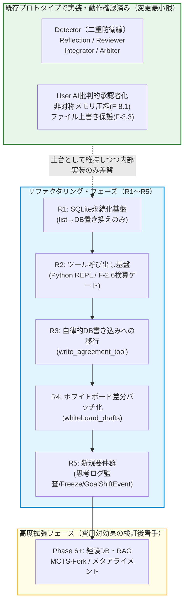

# 開発ロードマップ: CELA (Cognitive Experience Lineage-driven Agent)
# 最終更新: 2026-07-17 (V24.0 既存プロトタイプ・リファクタリング前提版)

> **基本方針の変更点（v23→v24）**: v23は「ゼロから最小構成を新規構築する」MVP検証型ロードマップだったが、開発者が既に運用している既存プロトタイプ（`linage_orcha_aiai_4pat_agent_state_change10.py`）には、Detector・Reflection・Reviewer・Integrator・Arbiterを含む多くの機能がすでに実装・動作確認済みであることが判明した（要件定義書v26 付録B参照）。したがって本ロードマップは**新規構築ではなく既存プロトタイプのリファクタリング**として再編する。「作ってみた」で終わらせず、各フェーズの完了条件を数値的な比較実験（A/Bテスト）とする基本姿勢は維持する。

---

## 全体マイルストーン（既存プロトタイプ ⇔ リファクタリングフェーズの対応）

**重要な方針転換**: v23の「Phase 0〜2」は「Expert 1体・User AI 1体の最小構成を新規に組む」ことを前提としていたが、これは撤回する。既存プロトタイプのDetector/Reflection/Reviewer/Integrator/Arbiterは実運用ログで高い検出精度が確認されており（過去のログ監査セッション参照）、これらを剥ぎ取って単純化することはリファクタリングの原則（動いているものを壊さない）に反する。したがって以下、R1〜R5をロードマップの主軸とする。

---

## R1: SQLite永続化基盤（旧Phase 0〜1相当）
**目的**: 既存プロトタイプの状態管理（Python list上の `decisions` / `agreements`）を、変更を最小限に留めたままSQLiteへ置き換える。ノード構成・グラフ構造（LangGraph）は一切変更しない。

* **タスク**:
    * `agreements`テーブル（要件定義書4.2フルスキーマ準拠。`decision_what`/`reason_why`だけでなく`evidence`, `phase_id`, `is_frozen`, `depends_on`, `resource_claims`を含む）をSQLiteに実装。
    * `decisions`テーブル（4.1）を実装し、`make_decision()`関数の出力先をlist appendからSQLite INSERTへ置き換える。
    * `whiteboard_drafts`（4.4）テーブルを追加するが、**この時点ではまだ書き込みロジックは実装しない**（テーブル定義のみ先行、R4で実装に着手）。
    * WALモード・タイムアウト60秒（F-13）をこの段階で有効化しておく（後続フェーズでの並行書き込みに備える）。
* **完了条件 (A/Bテスト)**:
    * 既存の「Python list版」と「SQLite版」で同一タスクを走らせ、**`decisions`/`agreements`の中身が完全一致すること**（保存先を変えただけで挙動が変わっていないことの回帰確認）。
    * プロセスを強制終了→再起動した場合に、SQLite版のみ`agreements`の内容が保持されていること。

## R2: ツール呼び出し基盤・機械的検算ゲート（旧Phase 4の一部を前倒し）
**目的**: `query_AI`にFunction Calling / Tool Use対応を追加し、実証実験（要件定義書付録A.3〜A.5）で確認された「機械的検算ゲート（F-2.6）」を、既存の正規表現ベース`verify_budget_arithmetic`から置き換える。

* **タスク**:
    * `query_AI`にPython REPL実行ツールを追加。
    * `call_detector`・`call_reviewer`のプロンプトに、agent.md実験で効果検証済みの「数値主張は必ずツールで検算せよ」ルールを追加（付録A.5の知見をそのまま反映）。
    * `verify_budget_arithmetic`（固定パターンの正規表現マッチ）は、Python REPLベースの汎用検算に置き換え後、廃止するか併用するかをA/Bで判断する。
* **完了条件**:
    * 意図的に数値矛盾を仕込んだ成果物（`RETRY_BASE_DELAY`実験と同種のシナリオ）に対し、Detector/Reviewerが**5試行中5試行で矛盾を検出すること**（付録A.5の実測値を合格基準として流用）。
    * トークン消費量の増加が実測でき、非機能要件N-6（検証精度とコストのトレードオフ）の数値を本システムでも取得すること。

## R3: 自律的DB書き込みへの移行（旧Phase 1相当、v19設計転換の実装）
**目的**: 現状の`decision_extractor_node`（事後抽出型）を、`write_agreement_tool`によるAI自身の能動的書き込み（F-3.1, F-3.2）に置き換える。要件定義書v19で宣言された設計転換を、実コードに反映する。

* **タスク**:
    * `write_agreement_tool`のJSONスキーマを、要件定義書4.2の`agreements`フルスキーマに準拠させる（Phase1設計書v1にあった簡略スキーマは使用しない。`entry_type`に`Deliverable`を含め、`abstraction_level`/`scope`/`time_axis`/`depends_on`/`resource_claims`もツール引数に含める）。
    * システム最終フィルター（F-3.2、バリデーション・インターセプター）を実装。構造チェックと`depends_on`のリレーション整合性チェックを行う。
    * `decision_extractor_node`は即時廃止せず、**`write_agreement_tool`による自律書き込みと並走させ、両者の抽出結果の一致率を計測する期間を設ける**。一致率が十分高いことを確認してから`decision_extractor_node`を段階的に縮小する。
* **完了条件**:
    * 同じ制約に再度ぶつかったタスクで、AIが既に却下された案（Rejected）を再提案しないことをログで確認（旧Phase1の完了条件を踏襲）。
    * `write_agreement_tool`による自律抽出と`decision_extractor_node`による事後抽出の一致率が事前に定めた閾値（例: 90%）を超えること。

## R4: ホワイトボード差分パッチ化（旧Phase 0の核心仮説、既存コードへの適用）
**目的**: 既存の`integrator_node`（最後に全成果物を一括結合する方式）を、Expertが逐次差分パッチを当てる方式（F-7.2）へ移行する。

* **タスク**:
    * `whiteboard_drafts`への書き込みロジックを実装（R1で先行定義したテーブルを実際に使用開始）。
    * Expertのプロンプトを「全文書き換え」から「現在の下書きに対する差分パッチ提示」へ変更。
    * バージョン管理とロールバック（F-7.3）：Detectorがmajor判定を出した場合、直前バージョンへの物理ロールバックを実装。
    * 高品質初版ドラフト生成ルール（F-7.4）：ホワイトボード初版のみ、既存の`model_agent`より高性能なモデルに一度だけ生成させる運用も本フェーズで試験導入する。
* **完了条件 (A/Bテスト)**:
    * 既存の「会話ストリーム全文監査→最後に一括結合」版と、「ホワイトボード差分パッチ」版を同一タスクで走らせ、**トークン消費・所要時間が明確に改善し、かつ成果物の質が劣化していないこと**を数値で確認する（v23のPhase 0完了条件を、既存コードへの適用という形で踏襲）。

## R5: 新規要件群の実装
**目的**: 本要件定義書の実証実験（付録A）から新たに生まれた要件を追加する。

* **タスク**:
    * F-2.1拡張（思考プロセス監査）：Detectorに`internal_thought_process`を渡す構造を追加。ただし付録A.5で確認した通り、思考ログの監査だけでは数値検証を保証できないため、**F-2.6（R2実装済み）との併用を必須とする**。
    * F-3.7（思考ログの強制記録）実装。
    * Freeze機能（F-8.3）：`is_frozen`フラグのHydrateアセンブルへの反映。
    * GoalShiftEvent（`goal_shift_events`テーブル、要件定義書付録参照）実装。
    * F-5.5（思考内エージェント化ループ）は本フェーズでは**設計検証のみ**行い、実装は費用対効果を見てPhase 6以降に判断する（未実証の構想であるため）。

---
*(※ここでR1〜R4の検証結果をまとめ、技術ブログや論文の初期データとする — 旧v23の方針を踏襲)*
---

## Phase 6以降: 高度機能（検証後判断）
**目的**: 以下の機能群は実装コストが極めて高いため、R1〜R5が実際に価値を生んでいると実証できてから着手判断を行う。この節は旧v23から変更なし。

* **F-9系（Lessons Learned RAG）**: `lessons_learned`テーブル実装、`sqlite-vec`によるハイブリッド検索。過去プロジェクトの失敗が別プロジェクトで実際に回避されるかを検証してから本格導入判断。
* **F-10.6 MCTS-Fork（平行宇宙シミュレーション）**: 実装コストが非常に高い割に、「本当にイノベーションが生まれるか」の評価指標が未確立のため保留。
* **F-21 ステークホルダー主観エミュレーション**: `target_topics`を用いた中間テーブル設計は完了しているが、モデルが複数ペルソナをどこまで正確に演じきれるかの事前検証が必要。
* **F-22 哲学・市場のメタ能動アライメント**: 自律センシング＋プロアクティブピッチは、人間側の受け入れ・ジャッジ運用フロー設計が先に必要なため保留。
* **F-10.2〜10.4 脱バイアス制御（悪魔の代弁者等）**: 既存プロトタイプのDetector/Reflection（二重防衛線）だけで同調バイアスが十分に抑えられている可能性が高いため（過去の運用ログで高精度が確認済み）、オーバーエンジニアリングになる可能性が高い。R1〜R5完了後、追加が本当に必要かをテスト結果で判断する。
* **F-5.5 思考内エージェント化ループ**: R5で設計検証のみ実施。本格実装はコスト対効果（トークン消費増加分と検出精度改善分の比較）を見てから判断する。

---

## 未確定の前提（要件定義書付録B.4と同一、ここでも明記）

- R1〜R5は、既存コードの`LangGraph`構造（ノード・条件分岐）自体は維持し、内部実装のみ差し替える方針とする。
- モデル構成（現行は`deepseek-v4-flash`をUser/Agent/Auditorの全役割に使用）の見直しは、R1〜R4の完了条件（A/Bテスト）の結果を見てから、R5以降で判断する。
