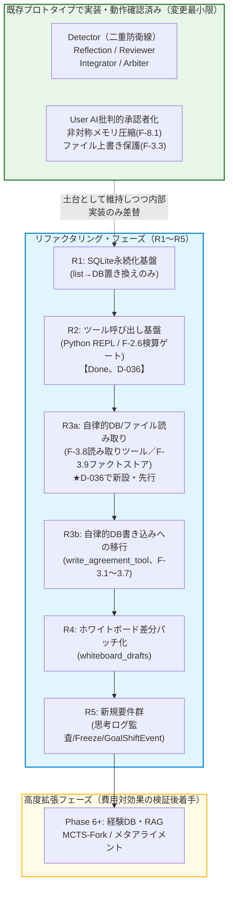

# 開発ロードマップ: CELA (Cognitive Experience Lineage-driven Agent)
# 最終更新: 2026-07-21 (D-036: R2クローズ・R3内部再編（R3a読み取り系優先）版)

> **v24→v25での変更点**: 各R番号（R1〜R4）のタスク項目に、詳細設計書（`cela_r1_r2_r3b_design_v7.md`、`cela_r4_design.md`）の該当節番号を明記し、ロードマップと設計書の紐づけを明示化した。これにより「要件定義書→ロードマップ→設計書→実装」の各階層が節番号レベルで参照し合える状態にする。

> **D-036（2026-07-21）でのR3再編**: T-10（全18タスク完走ドライラン）のレビューで発見したBL-035（フェーズ横断`verified_facts`参照不能）・BL-036（財務・需要数値ドリフト）・BL-037（`reason_why`の薄さ）は、いずれもR3が本来想定していた「自律的DB**書き込み**」ではなく「自律的DB/ファイル**読み取り**」の欠落に起因していた。既存のR3スコープ（`write_agreement_tool`、F-3.1〜F-3.7）はそのまま維持しつつ、v35.1/v35.2で新規追加した読み取り系要件（F-3.8: 自律読み取りツール、F-3.9: 構造化ファクトストア）をR3内で**先行実装するサブフェーズR3a**として新設する。指標C（収束性とコストのトレードオフの定量比較）はBL-023同様、比較対象ベースラインの用意がコストに見合わないとの判断により、Phase 1（D-002）と同じ扱いでR2を「構造的完了」としてクローズし、R3a完了後の再ドライランでBL-035/036/037の解消を定量確認する形に振り替える。詳細は[decision_log.md D-036](decision_log.md)・[decision_lineage.md 論点40](decision_lineage.md)を参照。

> **基本方針の変更点（v23→v24）**: v23は「ゼロから最小構成を新規構築する」MVP検証型ロードマップだったが、開発者が既に運用している既存プロトタイプ（`cela_main.py`）には、Detector・Reflection・Reviewer・Integrator・Arbiterを含む多くの機能がすでに実装・動作確認済みであることが判明した（要件定義書v26 付録B参照）。したがって本ロードマップは**新規構築ではなく既存プロトタイプのリファクタリング**として再編する。「作ってみた」で終わらせず、各フェーズの完了条件を数値的な比較実験（A/Bテスト）とする基本姿勢は維持する。

---

## 全体マイルストーン（既存プロトタイプ ⇔ リファクタリングフェーズの対応）

**重要な方針転換**: v23の「Phase 0〜2」は「Expert 1体・User AI 1体の最小構成を新規に組む」ことを前提としていたが、これは撤回する。既存プロトタイプのDetector/Reflection/Reviewer/Integrator/Arbiterは実運用ログで高い検出精度が確認されており（過去のログ監査セッション参照）、これらを剥ぎ取って単純化することはリファクタリングの原則（動いているものを壊さない）に反する。したがって以下、R1〜R5をロードマップの主軸とする。

---

## R1: SQLite永続化基盤（旧Phase 0〜1相当）
**詳細設計**: `cela_r1_r2_r3b_design_v7.md`（またはそれ以降の最新版）§2, §3.6, §6を参照。
**目的**: 既存プロトタイプの状態管理（Python list上の `decisions` / `agreements`）を、変更を最小限に留めたままSQLiteへ置き換える。ノード構成・グラフ構造（LangGraph）は一切変更しない。

* **タスク**（詳細は設計書§2, §3.6）:
    * `agreements`テーブル（要件定義書4.2フルスキーマ準拠。`decision_what`/`reason_why`だけでなく`evidence`, `phase_id`, `is_frozen`, `depends_on`, `resource_claims`, `internal_thought_process`を含む）をSQLiteに実装。
    * `decisions`テーブル（4.1）を実装し、`make_decision()`関数の出力先をlist appendからSQLite INSERTへ置き換える。
    * `whiteboard_drafts`（4.4、`task_id`含む）テーブルを追加するが、**この時点ではまだ書き込みロジックは実装しない**（テーブル定義のみ先行、R4で実装に着手）。
    * WALモード・タイムアウト60秒（F-13）をこの段階で有効化しておく（後続フェーズでの並行書き込みに備える）。
    * `system_prompt=[]`バグの修正（設計書§6）。
* **完了条件 (A/Bテスト、詳細は設計書§3.6.2、impl_Plan.md §7)**:
    * record & replay スタブ（キー=`(label, call_seq)`、ミス時は即例外）により、**`decisions`/`agreements`の件数・topic集合・status分布・登録順序が構造一致すること**（「完全一致」はLLMの非決定性により原理的に不可能なため撤回。詳細はimpl_Plan.md §7参照）。
    * プロセスを強制終了後、`sqlite3 cela.db "SELECT count(*) FROM agreements WHERE run_id='<killしたrun_id>'"` で行が残存していること（レジューム機構はR1範囲外）。

## R2: ツール呼び出し基盤・機械的検算ゲート（旧Phase 4の一部を前倒し）
**詳細設計**: `cela_r1_r2_r3b_design_v7.md` §3.4, §3.5を参照。
**目的**: `query_AI`にFunction Calling / Tool Use対応を追加し、実証実験（要件定義書付録A.3〜A.5）で確認された「機械的検算ゲート（F-2.6）」を、既存の正規表現ベース`verify_budget_arithmetic`から置き換える。

* **タスク**（詳細は設計書§3.5）:
    * `query_AI`にPython REPL実行ツールを追加。既存の`response_format=json_object`固定指定との競合を解消する方式（設計書§3.5.1）でノードごとにモードを切り替える。
    * `call_detector`・`call_reviewer`のプロンプトに、agent.md実験で効果検証済みの「数値主張は必ずツールで検算せよ」ルールを追加（付録A.5の知見をそのまま反映）。
    * Python REPLのサンドボックス仕様（設計書§3.5.3：タイムアウト5秒、許可モジュールのホワイトリスト化等）に従い実装。
    * `verify_budget_arithmetic`（固定パターンの正規表現マッチ）は、Python REPLベースの汎用検算に置き換え後、廃止するか併用するかをA/Bで判断する。
* **完了条件（詳細は設計書§5の指標C・D）**:
    * 意図的に数値矛盾を仕込んだ成果物（`RETRY_BASE_DELAY`実験と同種のシナリオ）に対し、Detector/Reviewerが**5試行中5試行で矛盾を検出すること**（付録A.5の実測値を合格基準として流用）。
    * トークン消費量の増加が実測でき、非機能要件N-6（検証精度とコストのトレードオフ）の数値を本システムでも取得すること。

* **完了・クローズ（2026-07-21、D-036）**: 指標D（5/5検出）はT-7/T-8で実測達成済み。BL-023 Phase A適用後、全18タスク・全6フェーズの完走を実ドライラン（T-10）で確認。指標C（変更前後の定量比較）は、比較対象となるBL-023適用前ベースラインの用意コストが見合わないため、Phase 1（D-002）と同様に**構造的完了をもってR2をクローズし、指標Cの実測はR3a完了後の再ドライランへ振り替える**。詳細は[phase_gates.md P2-2](phase_gates.md)を参照。

## R3: 自律的DB読み取り・書き込みへの移行（旧Phase 1相当、v19設計転換の実装＋D-036によるR3a新設）
**詳細設計**: `cela_r1_r2_r3b_design_v7.md` §3.2, §3.2.1, §3.3, §3.4.1（R3b）、`cela_r4_design.md`（R3a・R3bとR4の依存関係、★D-036追記）を参照。
**目的**: T-10ドライランのレビューで発見したBL-035（フェーズ横断`verified_facts`参照不能）・BL-036（財務・需要数値ドリフト）・BL-037（`reason_why`の薄さ）は、いずれも「自律的**読み取り**」の欠落が根本原因であり、元々のR3スコープ（`write_agreement_tool`による自律**書き込み**）だけでは解消しない。したがって、R3を**R3a（読み取り系、先行実装）→R3b（書き込み系、旧来のR3スコープ）**の2段階に再編する（D-036）。

### R3a: 自律的DB/ファイル読み取り（★D-036新設、F-3.8・F-3.9）
**目的**: `decision_extractor_node`置き換えという大きな書き込みパイプライン変更を伴わない、既存動作を壊さない**追加型**の変更を先行実装し、実害が確認済みのBL-035/036/037を最短経路で解消する。

* **タスク**:
    * F-3.8（自律的読み取りツール）: `_build_task_scope_context`のフェーズ横断`depends_on`解決バグ（BL-035）を、パッチではなく本ツールによる能動的なフェーズ横断`verified_facts`参照・Deliverableファイル読み取りで解消する。
    * F-3.9（構造化ファクトストア）: `verified_facts`を`{topic, value, reason, citations}`へ拡張し、`reason`に確定（confirmed）/暫定（provisional）の区別を持たせる。BL-036（数値ドリフト）・BL-037（`reason_why`の薄さ）の解消経路とする。
* **完了条件**:
    * BL-035/BL-036/BL-037と同一構成での再ドライランを実施し、Phase 6の最終統合ステップで財務・需要数値が承認済みの根拠（task_3_1/3_2等）と一致すること、Detectorが「根拠が不明」と判断する頻度が有意に減少することを確認する。
    * このR3a完了後の再ドライランをもって、指標C（収束性とコストのトレードオフ、R2版とR3a版の比較）を実測する。

### R3b: 自律的DB書き込みへの移行（旧来のR3スコープ、F-3.1〜F-3.7）
**目的**: 現状の`decision_extractor_node`（事後抽出型）を、`write_agreement_tool`によるAI自身の能動的書き込み（F-3.1, F-3.2）に置き換える。要件定義書v19で宣言された設計転換を、実コードに反映する。R3a完了後に着手する。

* **タスク**（詳細は設計書§3.2〜3.4.1）:
    * `write_agreement_tool`のJSONスキーマを、要件定義書4.2の`agreements`フルスキーマに準拠させる（`entry_type`に`Deliverable`を含め、`abstraction_level`/`scope`/`time_axis`/`depends_on`/`resource_claims`もツール引数に含める。`status`に`Approved_with_Conditions`/`Implicitly_Accepted`、`action_type`に`SUPERSEDE`も含める）。
    * システム最終フィルター（F-3.2、バリデーション・インターセプター）をツールラッパー関数として実装（LangGraphノードは追加しない）。構造チェックと`depends_on`のリレーション整合性チェック、および「呼び出し元ロール×要求status」のホワイトリスト方式の権限チェックを行う。
    * `Rejected`の書き込み権限をUser AI・Detector・Reviewer・Arbiterの4ノードに実装する（`Approved`はUser AIのみ）。
    * `decision_extractor_node`は撤廃せず、**「各役割のAIが自身でツールを呼び出すのが基本経路、書き漏れ時の予備的セーフティネット」として位置づける**（旧v23〜v24の「一致率90%による段階移行」方針は撤回。設計書§3.3参照）。
* **完了条件（詳細は設計書§5の指標A・E・F）**:
    * 同じ制約に再度ぶつかったタスクで、AIが既に却下された案（Rejected）を再提案しないことをログで確認（旧Phase1の完了条件を踏襲）。
    * `write_agreement_tool`による自律書き込みのカバレッジが暫定閾値（80%）以上、`decision_extractor_node`による取りこぼし率が20%以下であること（設計書§5、指標E。**旧「一致率90%」という基準は撤回済み**）。

## R4: ホワイトボード差分パッチ化（旧Phase 0の核心仮説、既存コードへの適用）
**詳細設計**: `cela_r4_design.md`を参照。
**目的**: 既存の`integrator_node`（最後に全成果物を一括結合する方式）を、Expertが逐次差分パッチを当てる方式（F-7.2）へ移行する。**前提はR3a＋R3b（旧来のR3を2段階化したもの）の完了**（D-036、`cela_r4_design.md`冒頭の前提注記を参照）。

* **タスク**:
    * `whiteboard_drafts`への書き込みロジックを実装（R1で先行定義したテーブルを実際に使用開始）。
    * Expertのプロンプトを「全文書き換え」から「現在の下書きに対する差分パッチ提示」へ変更。
    * バージョン管理とロールバック（F-7.3）：Detectorがmajor判定を出した場合、直前バージョンへの物理ロールバックを実装。
    * 高品質初版ドラフト生成ルール（F-7.4）：ホワイトボード初版のみ、既存の`model_agent`より高性能なモデルに一度だけ生成させる運用も本フェーズで試験導入する。
* **完了条件 (A/Bテスト)**:
    * 既存の「会話ストリーム全文監査→最後に一括結合」版と、「ホワイトボード差分パッチ」版を同一タスクで走らせ、**トークン消費・所要時間が明確に改善し、かつ成果物の質が劣化していないこと**を数値で確認する（v23のPhase 0完了条件を、既存コードへの適用という形で踏襲）。

## R5: 新規要件群の実装
**目的**: 本要件定義書の実証実験（付録A）から新たに生まれた要件を追加する。

* **タスク**:
    * F-2.1拡張（思考プロセス監査）：Detectorに`internal_thought_process`を渡す構造を追加。ただし付録A.5で確認した通り、思考ログの監査だけでは数値検証を保証できないため、**F-2.6（R2実装済み）との併用を必須とする**。
    * F-3.7（思考ログの強制記録）実装。
    * Freeze機能（F-8.3）：`is_frozen`フラグのHydrateアセンブルへの反映。
    * GoalShiftEvent（`goal_shift_events`テーブル、要件定義書付録参照）実装。
    * F-5.5（思考内エージェント化ループ）は本フェーズでは**設計検証のみ**行い、実装は費用対効果を見てPhase 6以降に判断する（未実証の構想であるため）。

---
*(※ここでR1〜R4の検証結果をまとめ、技術ブログや論文の初期データとする — 旧v23の方針を踏襲)*
---

## Phase 6以降: 高度機能（検証後判断）
**目的**: 以下の機能群は実装コストが極めて高いため、R1〜R5が実際に価値を生んでいると実証できてから着手判断を行う。この節は旧v23から変更なし。

* **F-9系（Lessons Learned RAG）**: `lessons_learned`テーブル実装、`sqlite-vec`によるハイブリッド検索。過去プロジェクトの失敗が別プロジェクトで実際に回避されるかを検証してから本格導入判断。
* **F-10.6 MCTS-Fork（平行宇宙シミュレーション）**: 実装コストが非常に高い割に、「本当にイノベーションが生まれるか」の評価指標が未確立のため保留。
* **F-21 ステークホルダー主観エミュレーション**: `target_topics`を用いた中間テーブル設計は完了しているが、モデルが複数ペルソナをどこまで正確に演じきれるかの事前検証が必要。
* **F-22 哲学・市場のメタ能動アライメント**: 自律センシング＋プロアクティブピッチは、人間側の受け入れ・ジャッジ運用フロー設計が先に必要なため保留。
* **F-10.2〜10.4 脱バイアス制御（悪魔の代弁者等）**: 既存プロトタイプのDetector/Reflection（二重防衛線）だけで同調バイアスが十分に抑えられている可能性が高いため（過去の運用ログで高精度が確認済み）、オーバーエンジニアリングになる可能性が高い。R1〜R5完了後、追加が本当に必要かをテスト結果で判断する。
* **F-5.5 思考内エージェント化ループ**: R5で設計検証のみ実施。本格実装はコスト対効果（トークン消費増加分と検出精度改善分の比較）を見てから判断する。

---

## 未確定の前提（要件定義書付録B.4と同一、ここでも明記）

- R1〜R5は、既存コードの`LangGraph`構造（ノード・条件分岐）自体は維持し、内部実装のみ差し替える方針とする。
- モデル構成（現行は`deepseek-v4-flash`をUser/Agent/Auditorの全役割に使用）の見直しは、R1〜R4の完了条件（A/Bテスト）の結果を見てから、R5以降で判断する。
