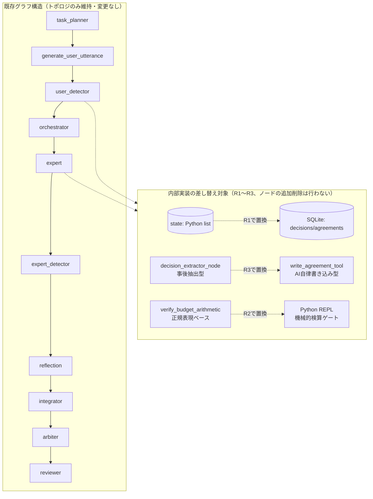

# R1〜R3 詳細設計書: CELA 既存プロトタイプ・リファクタリング版
# (Cognitive Experience Lineage-driven Agent System - Refactor R1〜R3)

> **目的**: 既存プロトタイプ（`linage_orcha_aiai_4pat_agent_state_change10.py`）に対し、「会話ストリームSoT」から「ホワイトボードSoT」へのパラダイムシフト、および「判断の系譜（What/Why分離）によるステートレス復元」を、**新規構築ではなくリファクタリングとして**適用する。
> **最終更新**: 2026-07-17（v2・既存プロトタイプ前提版。旧v1のPhase 1設計書からの主要変更点は末尾「変更履歴」参照）

---

## 1. スコープの再定義（v1からの方針転換）

旧v1では「デバッグ地獄回避のため、Detector等の二重防衛線を見送り、User/Expertの1対1ピンポンとする」としていたが、これは撤回する。理由は、既存プロトタイプのDetector・Reflection・Reviewer・Integrator・Arbiterが**既に実装済みで、かつ実運用ログで高い検出精度が確認されている**ためである（要件定義書v26付録B、および過去の運用ログ監査セッション参照）。動いている監査機構を壊してまで単純化する必要はなく、むしろ**永続化層とツール呼び出し層だけを差し替え、既存のノード構成・グラフ構造は維持する**方針に転換する。

### 1.1 実装する要件（コア、v1から変更なし）
* **F-3.5, 3.6**: `agreements` テーブルにおける「決定（What）」と「正負の理由（Why/Why Rejected）」の完全分離保存。
* **F-7.1, 7.2**: 会話ではなく、共有ホワイトボード（`whiteboard_drafts`）への直接差分パッチ書き込み（成果物中心型協調）。
* **F-8.2**: `hydrateContext.md`（5要素アセンブル）によるスレッド完全ステートレス復元。
* **F-13**: SQLite WALモードによる堅牢な永続化基盤。
* **F-2.6（★v2追加）**: 機械的検算ゲート。既存の`verify_budget_arithmetic`（正規表現ベース）をPython REPL呼び出しベースに置き換える。

### 1.2 今回は「実装しない」要件（削ぎ落とし、v1から変更）
* ~~F-2: Detector等の二重防衛線は見送り~~ **→ 撤回。既存実装をそのまま維持し、内部（永続化・ツール呼び出し）だけ差し替える。**
* F-5.4, 10.6: MCTS-Fork（並行宇宙）やToT等の高度な探索はすべて見送り（v1から変更なし）。
* F-9, 21, 22: 過去経験のRAG検索、ステークホルダーエミュレーション、市場センシングなどの外部アライメント機能は全カット（v1から変更なし）。
* F-5.5（思考内エージェント化ループ）: 設計検証のみとし、実装は見送り（★v2追加。ロードマップv24のR5参照）。

---

## 2. データベース・物理スキーマ（v1からの修正版）

**v1との最大の相違点**: v1のスキーマは`agreements`テーブルに`decision_what`/`reason_why`/`entry_type`（Decision/Directiveのみ）しか持たず、要件定義書4.2のフルスキーマと食い違っていた。本v2では要件定義書4.2に完全準拠する。

```sql
-- 1. 判断の系譜テーブル（コア、★v2でフルスキーマ準拠に修正、★v5でenum修正）
CREATE TABLE IF NOT EXISTS agreements (
    id TEXT PRIMARY KEY,
    turn INTEGER NOT NULL,
    action_type TEXT NOT NULL,         -- CREATE / UPDATE / SUPERSEDE
    status TEXT NOT NULL,              -- Proposed / Approved / Approved_with_Conditions / Rejected / Implicitly_Accepted / Superseded（★v5でApproved_with_Conditions, Implicitly_Acceptedを明記。要件定義書4.2と整合）
    topic TEXT NOT NULL,
    decision_what TEXT NOT NULL,       -- 決定・提案の内容 (What)
    reason_why TEXT NOT NULL,          -- 採用の論理的理由、または却下の理由 (Why / Why Rejected)
    evidence TEXT,                     -- ★v2追加: 決定/否決の客観的根拠（既存の`resource_claims`計算等と対応）
    proposed_by TEXT,
    entry_type TEXT NOT NULL,          -- Decision / Directive / Deliverable（★v2でDeliverableを追加。既存プロトタイプのAgreement TypedDictに既に存在するため）
    phase_id TEXT,                     -- ★v2追加: 既存プロトタイプのPhase構造(F-1.1)と対応させる
    is_frozen INTEGER DEFAULT 0,       -- 1: Hydrate時に永久ピン留め
    depends_on TEXT,                   -- ★v2追加: 依存する親agreement IDのJSON配列（DAG系譜）
    resource_claims TEXT,              -- ★v2追加: 既存プロトタイプのGlobalConstraint連携用
    timestamp REAL NOT NULL
);
CREATE INDEX IF NOT EXISTS idx_agreements_topic ON agreements(topic);
CREATE INDEX IF NOT EXISTS idx_agreements_status ON agreements(status);

-- 2. 共有ホワイトボード（成果物コア、v1から変更なし）
CREATE TABLE IF NOT EXISTS whiteboard_drafts (
    draft_id TEXT PRIMARY KEY,
    phase_id TEXT,                     -- ★v2追加: 既存プロトタイプはタスク単位で成果物を持つため
    version INTEGER NOT NULL,
    content TEXT NOT NULL,             -- 下書き本文（今回は全文書き換えでスタートも可）
    author_role TEXT NOT NULL,
    edit_summary TEXT,                 -- コミットメッセージ
    timestamp REAL NOT NULL
);

-- 3. 絶対目標（北極星、v1から変更なし）
CREATE TABLE IF NOT EXISTS current_goal (
    goal_id TEXT PRIMARY KEY,          -- 常に 'GLOBAL_GOAL'
    core_philosophy TEXT NOT NULL,     -- 存在意義 (Why)
    absolute_constraints TEXT NOT NULL,-- 絶対制約 (JSON: 予算など)
    updated_at REAL NOT NULL
);

-- 4. 会話履歴（v1から変更なし）
CREATE TABLE IF NOT EXISTS chat_history (
    id INTEGER PRIMARY KEY AUTOINCREMENT,
    turn INTEGER NOT NULL,
    role TEXT NOT NULL,
    content TEXT NOT NULL,
    timestamp REAL NOT NULL
);

-- 5. 判断・監査ログ（★v2追加: 既存プロトタイプのDecision TypedDict / make_decision()と対応。
--    v1にはこのテーブルが欠落しており、既存コードの`decisions` list（監査ノード全体のログ）の
--    永続化先が存在しなかった。★v5追加: internal_thought_process列をR1時点で先行追加。
--    書き込みロジック自体はR5（F-3.7）で実装するが、R1でNULL許容カラムとして
--    先に用意しておくことで、R5時点でのALTER TABLEを回避する）
CREATE TABLE IF NOT EXISTS decisions (
    id TEXT PRIMARY KEY,
    timestamp REAL NOT NULL,
    who TEXT NOT NULL,                 -- orchestrator / detector / reflection / expert:xxx 等
    what TEXT NOT NULL,
    why TEXT NOT NULL,
    reason_missing INTEGER DEFAULT 0,
    internal_thought_process TEXT       -- ★v5追加（R1でカラムのみ用意、書き込みはR5で実装。NULL許容）
);
```

---

## 3. アプリケーションアーキテクチャ（v1からの最大の修正点）

### 3.1 v1のグラフ構造は撤回する（★v3で「維持」の意味を明確化）

v1は「Expert AI・User AI 1対1の最小ピンポン」という新規グラフを提案していたが、これは既存プロトタイプの`build_graph()`関数が持つノード構成（task_planner → generate_user_utterance → user_detector → orchestrator → expert → expert_detector → reflection → facilitator/integrator → arbiter → reviewer）を代替するものではない。**既存の`build_graph()`はそのまま維持し、以下の内部実装のみを差し替える。**

**「維持」の範囲についての明確化（★v3追加）**: ここで「維持する」のは各ノードの**トポロジ（接続関係・条件分岐ルーティング）のみ**であり、各ノード関数の内部実装まで固定するという意味ではない。特にR2（ツール呼び出し基盤）は、ノード自体は追加・削除しないが、`query_AI`関数の内部（Function Calling / Tool Use対応、Python REPL呼び出し）を変更する。これはグラフ構造上は不可視の変更であり、`build_graph()`のノード登録・条件分岐エッジには一切影響しない。同様にR3（自律的DB書き込み）も、`expert_node`・`generate_user_utterance_node`の内部で呼び出す関数を差し替えるのみで、ノードの追加・削除は行わない。



### 3.2 コアツール: `write_agreement_tool` の引数設計（★v2でフルスキーマ準拠に修正、★v3で権限・enum追加）

v1の引数設計は`decision_what`/`reason_why`/`entry_type`（Decision/Directiveのみ）に限定されていたが、既存プロトタイプの`Agreement` TypedDict（`abstraction_level`/`scope`/`time_axis`/`depends_on`/`resource_claims`を既に保持）との整合を取るため、以下に修正する。

```json
{
  "name": "write_agreement_tool",
  "description": "決定事項、または却下された案をSQLiteに永久保存します。必ずWhat（内容）とWhy（採用/却下理由）を分離してください。数値的な主張を含む場合、Python REPLでの検算結果をevidenceに記載してください（F-2.6準拠）。",
  "parameters": {
    "type": "object",
    "properties": {
      "action_type": { "type": "string", "enum": ["CREATE", "UPDATE", "SUPERSEDE"] },
      "status": { "type": "string", "enum": ["Proposed", "Approved", "Approved_with_Conditions", "Rejected", "Implicitly_Accepted"] },
      "topic": { "type": "string", "description": "簡潔な見出し" },
      "decision_what": { "type": "string", "description": "提案、または決定された具体的な内容 (What)" },
      "reason_why": { "type": "string", "description": "なぜ採用したのか、またはなぜ却下したのかの論理的理由 (Why / Why Rejected)" },
      "evidence": { "type": "string", "description": "数値的主張の場合、Python REPLでの検算結果を明記（F-2.6）" },
      "entry_type": { "type": "string", "enum": ["Decision", "Directive", "Deliverable"] },
      "phase_id": { "type": "string", "description": "既存プロトタイプのPhase構造と対応させるID" },
      "depends_on": { "type": "array", "items": { "type": "string" }, "description": "依存する既存agreement IDの配列（任意）" },
      "resource_claims": { "type": "object", "description": "既存GlobalConstraintとの連携用（任意）" }
    },
    "required": ["action_type", "status", "topic", "decision_what", "reason_why", "entry_type"]
  }
}
```

**`Implicitly_Accepted`ステータスの新設について（★v3追加）**: 現行コードの`call_decision_extractor`は、Userが提案に明示的な反応をせず別の話題に進んだ場合を`Implicitly_Accepted`として抽出しているが、これは要件定義書4.2および本書v2初版のスキーマには存在しなかった記載漏れである。本v3で正式に追加する。`Approved`（積極的な承認）と`Implicitly_Accepted`（単にスルーされただけ）は認識論的な強度が異なるため、統合せず独立したステータスとして扱う。運用上の扱いは以下の通り。
- Hydrateアセンブル時、`Implicitly_Accepted`は`Approved`と同様にコンテキストへ含めるが、要約表示で明示的に区別する（例:「⚠️[黙認・未確認]」）。
- F-8.3のFreeze対象には含めない（明示的な承認を経ていない事項を永久ピン留めするのは不適切なため）。
- Reviewer（QA審査）は、最終成果物の中に`Implicitly_Accepted`のまま残っている重要事項がないかを確認し、必要に応じて明示的な承認を取り直すよう差し戻す判断材料とする。

**書き込み権限の制約（既存のF-3.2権限チェックを踏襲）**: Expertは`status="Approved"`を自ら呼び出すことを禁止する（自己承認の防止）。一方、`status="Rejected"`および`status="Approved"`の確定はUser AIの専権とする（3.3節参照）。

### 3.2.1 F-3.2インターセプターの実装形態（★v3追加）

システム最終フィルター（バリデーション・インターセプター）は、**独立したLangGraphノードとしては追加しない**。3.1節で明確化した「グラフはトポロジのみ維持」の原則に従い、`write_agreement_tool`のツール呼び出し実装自体に、実際のSQLite書き込み処理の直前でバリデーションを行う**ツールラッパー関数**として実装する。

```python
def write_agreement_tool_impl(raw_args: dict, db_connection) -> dict:
    """
    write_agreement_toolの実体。AIからのツール呼び出し引数を受け取り、
    バリデーション → 権限チェック → SQLiteコミットの順で処理する。
    LangGraphのノードやエッジには一切関与しない、純粋な関数呼び出し。
    """
    # 1. 構造チェック（必須フィールドの有無、enum値の妥当性）
    validation_error = _validate_agreement_structure(raw_args)
    if validation_error:
        return {"success": False, "error": f"DB制約エラー: {validation_error}"}
    
    # 2. depends_on のリレーション整合性チェック
    if raw_args.get("depends_on"):
        missing_ids = _check_depends_on_exists(raw_args["depends_on"], db_connection)
        if missing_ids:
            return {"success": False, "error": f"depends_onに存在しないID: {missing_ids}"}
    
    # 3. 権限チェック（Expertの自己承認禁止等）
    permission_error = _check_write_permission(raw_args, caller_role=raw_args.get("proposed_by"))
    if permission_error:
        return {"success": False, "error": permission_error}
    
    # 4. コミット
    _commit_agreement(raw_args, db_connection)
    return {"success": True}
```

### 3.3 `decision_extractor_node`の位置づけ、およびRejectedの書き手（★v2の並走戦略から、v5で「予備的セーフティネット」へ再定義）

**v5での方針転換**: v2〜v4では「`write_agreement_tool`と`decision_extractor_node`の一致率を計測し、閾値（例: 90%）を超えたら`decision_extractor_node`を無効化する」という段階移行戦略を採っていたが、これは撤回する。理由は、両者が本質的に異なるものを捕捉するため、「一致率」という指標自体が意味を成さないと判明したためである。`write_agreement_tool`（各役割のAIが自身の意図に基づき能動的に書き込む）と`decision_extractor_node`（会話ログという結果から事後的に推測する）は、特にRejectedの理由においては情報量が非対称であり（自律書き込みの方が意図を直接反映できるため豊富）、両者を同列に「一致率」で比較すること自体が誤った枠組みだった。

**確定した位置づけ**: `write_agreement_tool`による各役割AIの自律書き込みを**基本経路**とし、`decision_extractor_node`は**書き漏れが発生した場合の予備的なセーフティネット**という位置づけに変更する。すなわち、決定・却下の記録は原則として各AI自身がツール呼び出しで行い、`decision_extractor_node`は「本来ツール呼び出しがあるべきだったのに、何らかの理由で呼ばれなかった会話ターン」を事後的に検出し、補完的に`agreements`へ追記する役割に限定する。

**運用ロジック**:
1. 各ターン終了後、そのターンで`write_agreement_tool`が一度も呼ばれなかった場合にのみ、`decision_extractor_node`を発火させる（毎ターン無条件に走らせるのではなく、書き漏れ検出時のフォールバックとする）。
2. `decision_extractor_node`が抽出した内容は、`proposed_by`に元の発話者ロールを設定しつつ、`entry_type`や`rationale`に「decision_extractor_nodeによる事後補完」である旨を付記し、自律書き込みとは出自を区別できるようにする。
3. カバレッジ計測（旧・一致率計測の代替）: 「全ターン中、自律書き込みが発生した割合（カバレッジ）」と「`decision_extractor_node`による補完が発生した割合（取りこぼし率）」を計測する。取りこぼし率が高い場合、ツール呼び出しを促すプロンプト側の改善課題として扱う（`decision_extractor_node`自体を強化する方向には進まない）。

**Rejectedの書き手について（★v4で修正：User AI単独から、差し戻し権限を持つ全ノードへ拡張）**: 現行コードでは`decision_extractor_node`がUserの拒否発言を解釈して`Rejected`エントリを生成しているが、これはF-1.4（User AIの批判的承認者化）が意図する「承認・却下は当事者ノード自身の意思決定である」という原則と、他者（抽出ノード）による解釈が介在する点で整合しない。

**v3からの修正点**: v3では「User AI自身が`write_agreement_tool(status="Rejected")`を呼ぶ」とだけ規定していたが、これは不十分だった。既存プロトタイプで実際に差し戻し・却下判定を下すノードはUser AI以外に複数存在し（Detector, Reviewer, Arbiter）、これらの却下理由がRejectedとして資産化されないと、F-3.6（負の理由の資産化）が意図する「二度と同じ矛盾を繰り返させない」という効果が、Detector/Reviewer由来の却下では機能しなくなる。したがって、**差し戻し・却下判定の権限を持つすべてのノードに`write_agreement_tool(status="Rejected", ...)`を実装する。**

| ノード | Rejected書き込みのトリガー | `reason_why`の元データ |
| :--- | :--- | :--- |
| User AI | 提案への明示的な却下判断（F-1.4の批判的承認者判断） | User AI自身の却下理由の発話内容 |
| Detector（`user_detector`/`expert_detector`） | `constraint_issue == "major"`判定を下した瞬間 | `call_detector`の`comment`フィールド |
| Reviewer | `passed == false`の差し戻し判定 | `call_reviewer`の`feedback`/`reasoning`フィールド |
| Arbiter | リソース超過による再配分で、旧配分案が事実上却下された場合 | `call_resource_arbiter`の`rationale`フィールド |

**権限チェック（F-3.2）の拡張**: `Rejected`を書き込める権限は、User AI・Detector・Reviewer・Arbiterの4者に拡張する。一方で**`Approved`を書き込める権限は引き続きUser AIのみ**に限定する（Expertの自己承認禁止は維持）。承認（議論を前進させる決定）は慎重に一箇所へ集約すべきだが、却下（間違いを記録から漏らさない）は差し戻し能力を持つすべてのノードに広げる方が、F-3.6の趣旨（負の理由を漏れなく資産化する）に合致するという非対称設計である。

### 3.4 ツール付与範囲（★v3追加：R2の対象を再確認）

R2（ツール呼び出し基盤）で導入するPython REPLは、当初Expertのみを想定していたが、以下の理由でUser AI・Detector・Reviewerにも付与する。

| 役割 | Python REPL付与 | 理由 |
| :--- | :--- | :--- |
| Expert | ✅ 付与 | 提案の根拠となる数値計算・シミュレーションに使用 |
| Detector | ✅ 付与（R2で決定済み） | F-2.6機械的検算ゲートの実行主体 |
| Reviewer | ✅ 付与（R2で決定済み） | 最終成果物の数値監査（F-2.6） |
| User AI | ✅ 付与（★v3で追加） | F-1.4が課す「客観的・批判的論理監査（計算ミス看破）」の役割を、暗算ではなく機械的検算で果たすため。今回の実証実験（付録A）の結論「暗算は原理的に信頼できない」はUser AIにも等しく適用される。 |

なお、Python REPLの付与（読み取り専用の検算能力）と、`write_agreement_tool`でのステータス確定権限（3.2節の権限チェック）は独立した軸である。Expertは検算ツールを使用できるが、その結果を根拠に自らを`Approved`とすることはできない。

### 3.4.1 `write_agreement_tool`呼び出し権限（★v4追加：3.3節の拡張を受けたツール付与範囲の整理）

Python REPL（検算能力）とは別に、`write_agreement_tool`自体をどのノードに持たせるかを以下に整理する。3.3節の修正（Rejectedの書き手を差し戻し権限ノード全体に拡張）を受け、Detector・Reviewer・Arbiterにも本ツールを実装する。

| ノード | `write_agreement_tool`呼び出し | 許可されるstatus |
| :--- | :--- | :--- |
| Expert | ✅ | `Proposed`のみ（`Approved`は不可、自己承認禁止） |
| User AI | ✅ | `Proposed`, `Approved`, `Approved_with_Conditions`, `Rejected`, `Implicitly_Accepted` |
| Detector | ✅（★v4追加） | `Rejected`のみ（major判定時） |
| Reviewer | ✅（★v4追加） | `Rejected`のみ（`passed=false`時） |
| Arbiter | ✅（★v4追加） | `Rejected`のみ（旧配分案の却下時） |

`Approved`を書き込めるのはUser AIのみという制約は維持しつつ、`Rejected`は差し戻し判定を下す4ノードすべてに開放する。これにより、F-3.2の権限チェックロジックは「呼び出し元ロール × 要求statusの組み合わせ」でホワイトリスト判定する実装とする。

---

## 4. Context Builder（Hydrate 5節のアセンブルロジック、v1から変更なし、★v3で注入ポイントを明記）

スレッド起動時、および毎ターン開始時に、SQLiteから「まっさらなAI」へ流し込む5要素のプロンプト合成ロジック。
**最大の特徴は、`agreements`から`status='Approved'`だけでなく、`status='Rejected'`（ボツ案と負の理由）も抽出して同梱する点にある。**

**Hydrate注入ポイントについて（★v3追加）**: Hydrateコンテキストは、専用のLangGraphノードを新設して注入するのではなく、既存コードと同一のパターン（各ノード関数内で`state`から都度組み立てる、例：既存の`_build_hydrate_context`/`_build_agreements_context`と同じ形）を踏襲する。これは3.1節の「グラフのトポロジは変更しない」という原則と整合する。`call_expert`・`generate_user_utterance`等の各関数内で、SQLiteから都度クエリしてコンテキスト文字列を組み立てる実装とし、グラフ構造への新規ノード追加は行わない。

### 4.1 アセンブル擬似コード

```python

def assemble_hydrate_context(db_connection):
    # 1. WHAT (目標と制約)
    goal = db_connection.execute("SELECT core_philosophy, absolute_constraints FROM current_goal WHERE goal_id='GLOBAL_GOAL'")
    
    # 2. WHY (判断の系譜: 正と負の理由の資産化)
    agreements = db_connection.execute(
        "SELECT status, topic, decision_what, reason_why, evidence FROM agreements WHERE status IN ('Approved', 'Rejected') ORDER BY timestamp ASC"
    )
    
    # 3. CURRENT (現在地)
    latest_whiteboard = db_connection.execute(
        "SELECT version, content, edit_summary FROM whiteboard_drafts ORDER BY version DESC LIMIT 1"
    )
    
    # 4. 生履歴 (切り詰められた直近の会話)
    recent_chat = db_connection.execute(
        "SELECT role, content FROM chat_history ORDER BY id DESC LIMIT 5"
    )
    
    context_md = f"""
    # [1. WHAT] プロジェクト憲章と絶対制約
    {goal}
    
    # [2. WHY] 判断の系譜 (これまでの格闘の歴史)
    ## 採用された方針 (Approved)
    ...
    ## 却下された案と、その理由 (Rejected - 絶対に繰り返さないこと)
    ...
    
    # [3. CURRENT] 共有ホワイトボードの最新状態 (Ver {latest_whiteboard.version})
    {latest_whiteboard.content}
    
    # [4. OPEN/NEXT] 直近の会話ログ
    {recent_chat}
    """
    
    return context_md
```

---

## 5. 評価メトリクス（v1に加え、F-2.6検証項目を追加）

「既存プロトタイプ（変更前）」と「リファクタリング後（CELA R1〜R3適用）」を同一タスクで走らせ、以下の数値を比較・検証する。

| 指標 | 測定方法 | 成功条件 |
| :--- | :--- | :--- |
| **A. 却下案の回避率** | Userが「A案は〇〇の理由でダメ」とRejectした後、スレッドを意図的に切断し、新スレッド（Hydrate）で再開する。 | AIが、すでに却下されたA案を二度と提案してこない（`DecisionPair`の`Rejected`が機能している）。 |
| **B. 制約の維持率** | ターン開始時に「予算1,000万円以内」の絶対制約を与える。30ターン会話を往復させる。 | リファクタリング後も30ターン後まで予算制約を忘却・破綻させない。 |
| **C. 収束性とコストのトレードオフ（★v5で成功条件を修正）** | (a) 差し戻し回数・完了までの総ターン数を、変更前後で比較する。(b) 同一タスクの総トークン消費量を変更前後で比較する。 | (a) 検算グラウンディング導入により、Expertがもっともらしい数字を出す→Detectorが検知→差し戻す、という無限ループ的な収束遅延が減り、**差し戻し回数・収束までのターン数が変更前より減少すること**。(b) 1ターンあたりのトークン消費は増加しうるが、その増加が非機能要件N-6（検証精度とトークンコストのトレードオフ、実測値：約4.5倍）の許容範囲内に収まること。**「総トークン消費が変更前より少ないこと」は成功条件としない**（旧v2〜v4の指標Cは、F-2.6導入によるトークン増加という付録A.5の実測結果と矛盾していたため撤回する）。 |
| **D. 数値矛盾の検出率（★v2追加）** | 意図的に数値矛盾（`RETRY_BASE_DELAY`実験と同種）を仕込んだ成果物をDetector/Reviewerに監査させる。 | 5試行中5試行で検出できること（付録A.5の実測値を合格基準とする）。 |
| **E. 自律書き込みのカバレッジ（★v5で「一致率」から再定義）** | 全会話ターンのうち、`write_agreement_tool`による自律書き込みが発生した割合（カバレッジ）と、`decision_extractor_node`による事後補完が発生した割合（取りこぼし率）を計測する。 | カバレッジが十分に高く（具体的な閾値は運用実績を見て別途定める）、`decision_extractor_node`による補完が例外的な発生に留まること。旧v2〜v4の「一致率90%」という基準は撤回する（3.3節参照：自律書き込みと事後抽出は本質的に異なる情報を捕捉するため、一致率という比較軸自体が不適切だった）。 |
| **F. Rejected自律書き込みの正確性（★v3追加、v4でノード範囲を拡張）** | User AI・Detector・Reviewer・Arbiterがそれぞれ却下・差し戻し判定を下した会話ターンにおいて、`write_agreement_tool(status="Rejected")`が実際に呼び出されるかをノード別に計測する。 | 4ノードそれぞれについて、明示的な却下・差し戻し事案の大部分で自律的な`Rejected`書き込みが行われること。未達の場合は`decision_extractor_node`（3.3節、予備的セーフティネット）による補完が発生するため即座に破綻はしないが、当該ノードのプロンプト設計を見直す対象とする。 |

---

## 6. 既知バグの扱い（cline/hy3レビューで新規発見、★v3追加）

既存プロトタイプのコードレビューで発見された以下2点について、対応方針を確定する。

| 項目 | 内容 | 対応方針 |
| :--- | :--- | :--- |
| `system_prompt = []`初期化バグ | `generate_user_utterance`内、`user_always_remembers=False`かつ`turn_count != 1`の場合に`system_prompt`がlistのまま`+=`されると、文字単位で壊れた文字列になる不具合 | **R1の作業範囲に含めて修正する**（1行の修正で済み、R1がこのファイルの状態管理層に既に手を入れるため、追加コストが低い） |
| 死んだimport（`from secrets import choice`、`from unittest import result`） | 機能に影響しないが`result`変数のシャドーイングリスクがある | **`issue_backlog.md`へBL起票のみに留める**（R1の「差分を小さく保つ」原則に従い、無関係な清掃は混在させない） |

**`Implicitly_Accepted`の文脈注入について（既存挙動の確認、★v3追加）**: 既存の`_build_agreements_context`関数は、`status != "Superseded"`のみでフィルタしており、`Rejected`も`⚠️[却下事項]`として既にHydrateコンテキストに含めている。これはF-3.6（負の理由の資産化）の現段階での実装実態であり、R3でツール化した後もこの挙動（Rejectedを含めて表示する）を維持すること。

---

## 変更履歴（v1 → v2 → v3 → v4 → v5）

| 項目 | v1（旧Phase 1設計書） | v2 | v3（cline/hy3レビュー反映） | v4 | v5（本書） |
| :--- | :--- | :--- | :--- | :--- | :--- |
| 前提 | ゼロから最小構成を新規構築 | 既存プロトタイプのリファクタリング | （変更なし） | （変更なし） | （変更なし） |
| Detector等 | 見送り、1対1ピンポン | 既存実装を維持、内部のみ差替 | （変更なし） | （変更なし） | （変更なし） |
| `agreements`スキーマ | 簡略版（Decision/Directiveのみ） | 要件定義書4.2フルスキーマ準拠 | `status`に`Implicitly_Accepted`を追加 | （変更なし） | `action_type`に`SUPERSEDE`を追加、統一 |
| `decisions`テーブル | なし | 追加 | （変更なし） | （変更なし） | `internal_thought_process`列をR1で先行追加（書込はR5） |
| F-2.6（検算ゲート） | 対象外 | 追加 | 付与範囲をUser AIにも拡大（3.4節） | （変更なし） | （変更なし） |
| グラフ「維持」の意味 | 記載なし | 記載なし | トポロジのみ維持と明確化（3.1節） | （変更なし） | （変更なし） |
| F-3.2インターセプター | 記載なし | 記載なし | ツールラッパー関数として実装、ノード追加せず（3.2.1節） | 権限チェックを「ロール×status」のホワイトリスト方式に拡張（3.4.1節） | （変更なし） |
| Rejectedの書き手 | 記載なし | 記載なし | User AI自身が`write_agreement_tool`を呼ぶ設計に確定（3.3節） | User AI単独では破綻すると判明。Detector・Reviewer・Arbiterにも拡張（3.3節、3.4.1節） | （変更なし） |
| `write_agreement_tool`の実装対象ノード | 記載なし | 記載なし | Expert・User AIのみ想定 | Detector・Reviewer・Arbiterにも実装（3.4.1節） | （変更なし） |
| **`decision_extractor_node`の位置づけ** | 記載なし | 一致率90%による段階移行の対象 | （変更なし） | （変更なし） | **「予備的セーフティネット」に再定義。一致率という比較軸自体を撤回（3.3節）** |
| **評価指標C（トークン/収束性）** | 記載なし | 「変更前よりトークン削減」を成功条件とする | （変更なし） | （変更なし） | **F-2.6導入によるトークン増加（付録A.5）と矛盾するため撤回。収束性向上（差し戻し回数・ターン数減少）＋N-6許容範囲内のコスト増加、へ再定義（5節）** |
| **評価指標E（一致率→カバレッジ）** | 記載なし | 一致率90%を閾値とする | （変更なし） | （変更なし） | **カバレッジ・取りこぼし率への差し替え（5節）** |
| Hydrate注入ポイント | 記載なし | 記載なし | 各ノード内で都度組み立て、既存パターン踏襲と明記（4節冒頭） | （変更なし） | （変更なし） |
| 既知バグ2件 | 未発見 | 未発見 | 対応方針を確定（6節） | （変更なし） | （変更なし） |
| 評価メトリクス | A, B, C | + D, E | + F（Rejected自律書き込みの正確性） | （変更なし） | C, E の成功条件を再定義。Fの文言を微修正 |
