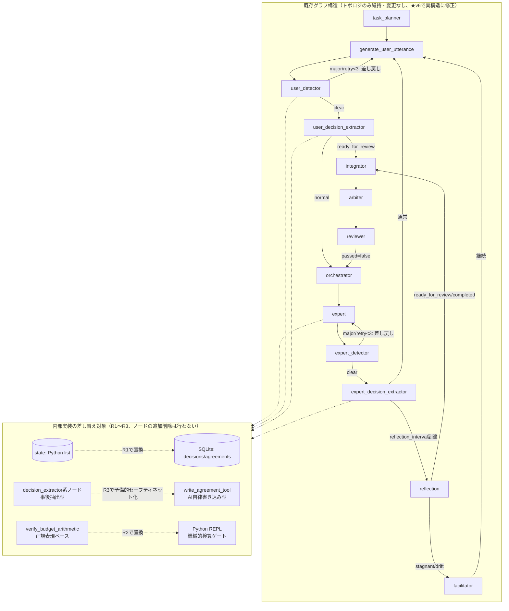

# R1〜R3 詳細設計書: CELA 既存プロトタイプ・リファクタリング版
# (Cognitive Experience Lineage-driven Agent System - Refactor R1〜R3)

> **目的**: 既存プロトタイプ（`cela_main.py`）に対し、「会話ストリームSoT」から「ホワイトボードSoT」へのパラダイムシフト、および「判断の系譜（What/Why分離）によるステートレス復元」を、**新規構築ではなくリファクタリングとして**適用する。
> **最終更新**: 2026-07-17（v7・ロードマップ（`cela_roadmap_v24.md`）とのR番号対応表を新設。実装着手時はこの対応表で「今どの節を実装すればよいか」を確認すること）

---

## 0. ロードマップとの対応表（★v7新設）

本書はロードマップ（`cela_roadmap_v24.md`）のR1・R2・R3の3フェーズ分をまとめて詳細化したものである。実装着手時に、ロードマップのどのフェーズが本書のどの節に対応するかが分かるよう、以下に対応表を示す。**実装は必ずこの表の左列（R番号）の順序で進め、対応する節だけを参照すること。** R4・R5は別紙（`cela_phase2_design_R4.md`、`cela_phase3_design_R5_v2.md`）を参照。

| ロードマップのフェーズ | 本書の該当節 | 実装時に触るべき範囲 |
| :--- | :--- | :--- |
| **R1: SQLite永続化基盤** | §2（DBスキーマ全体）、§3.6（R1実装の技術詳細）、§6（既知バグの扱い） | `agreements`/`whiteboard_drafts`/`current_goal`/`chat_history`/`decisions`のCREATE TABLE、SQLite接続管理、`state["agreements"]`のSQLite移行、`system_prompt=[]`バグ修正。**この段階では§3.2〜3.5（ツール呼び出し関連）には一切触れない** |
| **R2: ツール呼び出し基盤・機械的検算ゲート** | §3.4（ツール付与範囲）、§3.5（R2実装の技術詳細） | `query_AI`のFunction Calling対応、`response_format`との競合解消、Python REPLのサンドボックス実装、Detector/Reviewer/User AIへのツール付与 |
| **R3: 自律的DB書き込みへの移行** | §3.2（`write_agreement_tool`引数設計）、§3.2.1（F-3.2インターセプター）、§3.3（`decision_extractor_node`の位置づけ・Rejectedの書き手）、§3.4.1（`write_agreement_tool`呼び出し権限） | `write_agreement_tool`の実装、バリデーションラッパー、Detector/Reviewer/Arbiterへの`Rejected`書き込み権限付与、`decision_extractor_node`の予備的セーフティネット化 |
| **R1〜R3共通** | §1（スコープ）、§3.1（グラフ構造）、§4（Hydrateアセンブル）、§5（評価メトリクス）、§5.1（テスト手順） | フェーズを跨いで参照する前提・原則。§4のHydrateはR1のSQLite基盤を使うが、Rejected情報の充実度はR3完了後に高まる（段階的に情報量が増える） |

**進め方の推奨**: R1着手時は上表の「R1」行に列挙された節だけを実装対象とし、他の節（R2・R3該当分）は**読まない・触らない**。これにより、Cline等での実装セッションが必要以上に広い範囲を参照して混乱するのを防ぐ。R1完了後（評価メトリクスA・B・Cで回帰確認を終えた後）、R2に進む。

---

## 1. スコープの再定義（v1からの方針転換、★全体像・R1〜R3共通）

旧v1では「デバッグ地獄回避のため、Detector等の二重防衛線を見送り、User/Expertの1対1ピンポンとする」としていたが、これは撤回する。理由は、既存プロトタイプのDetector・Reflection・Reviewer・Integrator・Arbiterが**既に実装済みで、かつ実運用ログで高い検出精度が確認されている**ためである（要件定義書v26付録B、および過去の運用ログ監査セッション参照）。動いている監査機構を壊してまで単純化する必要はなく、むしろ**永続化層とツール呼び出し層だけを差し替え、既存のノード構成・グラフ構造は維持する**方針に転換する。

### 1.1 実装する要件（コア、v1から変更なし）
* **F-3.5, 3.6**: `agreements` テーブルにおける「決定（What）」と「正負の理由（Why/Why Rejected）」の完全分離保存。
* **F-7.1, 7.2**: 会話ではなく、共有ホワイトボード（`whiteboard_drafts`）への直接差分パッチ書き込み（成果物中心型協調）。
* **F-8.2**: `hydrateContext.md`（5要素アセンブル）によるスレッド完全ステートレス復元。
* **F-13**: SQLite WALモードによる堅牢な永続化基盤。
* **F-2.6（★v2追加）**: 機械的検算ゲート。既存の`verify_budget_arithmetic`（正規表現ベース）をPython REPL呼び出しベースに置き換える。

### 1.2 今回は「実装しない」要件（削ぎ落とし、v1から変更）
* ~~F-2: Detector等の二重防衛線は見送り~~ **→ 撤回。既存実装をそのまま維持し、内部（永続化・ツール呼び出し）だけ差し替える。**
* F-5.4, 10.6: MCTS-Fork（並行宇宙）やToT等の高度な探索はすべて見送り（v1から変更なし）。
* F-9, 21, 22: 過去経験のRAG検索、ステークホルダーエミュレーション、市場センシングなどの外部アライメント機能は全カット（v1から変更なし）。
* F-5.5（思考内エージェント化ループ）: 設計検証のみとし、実装は見送り（★v2追加。ロードマップv24のR5参照）。

---

## 2. データベース・物理スキーマ（v1からの修正版）【対応: R1】

**v1との最大の相違点**: v1のスキーマは`agreements`テーブルに`decision_what`/`reason_why`/`entry_type`（Decision/Directiveのみ）しか持たず、要件定義書4.2のフルスキーマと食い違っていた。本v2では要件定義書4.2に完全準拠する。

**★v8（R1実装計画レビュー反映）**: 全セッションテーブルに `run_id TEXT NOT NULL` 列を追加。`agreements.decision_what` / `agreements.reason_why` は R1 の「壊さない」優先で `TEXT DEFAULT ''`（NOT NULL 回避）。`decisions` / `agreements` の PRIMARY KEY 制約を外し（id はタイムスタンプベースの文字列で一意だが、R1 では run_id との複合で管理）。接続は `isolation_level=None`（自動コミット）＋ WAL + timeout=60。`current_goal` は run_id なし・跨実行で引き継ぐ単一レコード（R1 は定義のみ、書き込み/読み出し未実装）。`whiteboard_drafts` / `chat_history` も R1 は定義のみ。

```sql
-- 1. 判断の系譜テーブル（コア、★v2でフルスキーマ準拠に修正、★v5でenum修正、★v6でinternal_thought_process追加、★v8でrun_id追加・NOT NULL緩和）
CREATE TABLE IF NOT EXISTS agreements (
    id TEXT,                            -- ★v8: PRIMARY KEY制約を外す（run_idとの複合で管理）
    turn INTEGER NOT NULL,
    action_type TEXT NOT NULL,         -- CREATE / UPDATE / SUPERSEDE
    status TEXT NOT NULL,              -- Proposed / Approved / Approved_with_Conditions / Rejected / Implicitly_Accepted / Superseded（★v5でApproved_with_Conditions, Implicitly_Acceptedを明記。要件定義書4.2と整合）
    topic TEXT NOT NULL,
    decision_what TEXT DEFAULT '',     -- ★v8: NOT NULL→DEFAULT ''（R1は「壊さない」優先。既存でcontentが欠けるdictが流れてくるリスクを避ける。NOT NULL強化はR3のTypedDictリネーム時）
    internal_thought_process TEXT,     -- ★v6追加: R1でNULL許容カラムとして先行追加、書き込みはR5（F-3.7）で実装
    reason_why TEXT DEFAULT '',        -- ★v8: NOT NULL→DEFAULT ''（同上）
    evidence TEXT,                     -- ★v2追加: 決定/否決の客観的根拠
    proposed_by TEXT,
    entry_type TEXT NOT NULL,          -- Decision / Directive / Deliverable
    phase_id TEXT,
    is_frozen INTEGER DEFAULT 0,       -- 1: Hydrate時に永久ピン留め
    depends_on TEXT,                   -- ★v2追加: 依存する親agreement IDのJSON配列（DAG系譜）
    resource_claims TEXT,              -- ★v2追加: 既存プロトタイプのGlobalConstraint連携用
    timestamp REAL NOT NULL,
    run_id TEXT NOT NULL               -- ★v8追加: セッション分離用。全クエリにWHERE run_id=?を付与
);
CREATE INDEX IF NOT EXISTS idx_agreements_run_topic ON agreements(run_id, topic);    -- ★v8: run_id複合化
CREATE INDEX IF NOT EXISTS idx_agreements_run_status ON agreements(run_id, status);  -- ★v8: run_id複合化

-- 2. 共有ホワイトボード（成果物コア、★v6でtask_idを復活、★v8でrun_id追加。R1は定義のみ・書き込みはR4）
CREATE TABLE IF NOT EXISTS whiteboard_drafts (
    draft_id TEXT,
    phase_id TEXT NOT NULL,
    task_id TEXT NOT NULL,             -- ★v6追加: v2〜v5で誤って欠落していたため復元
    version INTEGER NOT NULL,
    content TEXT NOT NULL,
    author_role TEXT NOT NULL,
    edit_summary TEXT,
    timestamp REAL NOT NULL,
    run_id TEXT NOT NULL               -- ★v8追加
);
CREATE INDEX IF NOT EXISTS idx_wb_run ON whiteboard_drafts(run_id, phase_id, task_id);  -- ★v8: run_id複合化

-- 3. 絶対目標（北極星、goal_idは常に'GLOBAL_GOAL'固定。run_idなし・跨実行で引き継ぐ単一レコード。R1は定義のみ・書き込み/読み出し未実装）
-- 【設計判断の根拠】current_goalは常にgoal_id='GLOBAL_GOAL'の1レコードのみをUPSERTし続け、
-- 「現在の状態（Current）」の単一の情報源とする。ゴールがピボットした際の履歴は、
-- current_goal自体には持たせず、goal_shift_eventsテーブル（Event Sourcing）に退避する。
-- これはHydrateアセンブル時のコンテキスト汚染（古いゴールを誤って参照するリスク）を防ぐための
-- 意図的な設計であり、要件定義書4.8の旧コメント「'G-' + 識別子」はこの決定以前の記述のまま
-- 更新されていなかった記載漏れである（本設計書のGLOBAL_GOAL固定が正、要件定義書側をv34で修正）。
CREATE TABLE IF NOT EXISTS current_goal (
    goal_id TEXT PRIMARY KEY,          -- 常に 'GLOBAL_GOAL'
    core_philosophy TEXT NOT NULL,     -- 存在意義 (Why)
    absolute_constraints TEXT NOT NULL,-- 絶対制約 (JSON: 予算など)
    updated_at REAL NOT NULL
);

-- 4. 会話履歴（★v8でrun_id追加。R1はlist維持・テーブル定義のみ）
CREATE TABLE IF NOT EXISTS chat_history (
    id INTEGER PRIMARY KEY AUTOINCREMENT,
    turn INTEGER NOT NULL,
    role TEXT NOT NULL,
    content TEXT NOT NULL,
    timestamp REAL NOT NULL,
    run_id TEXT NOT NULL               -- ★v8追加
);

-- 5. 判断・監査ログ（★v2追加: 既存プロトタイプのDecision TypedDict / make_decision()と対応。
--    v1にはこのテーブルが欠落しており、既存コードの`decisions` list（監査ノード全体のログ）の
--    永続化先が存在しなかった。★v5追加: internal_thought_process列をR1時点で先行追加。
--    書き込みロジック自体はR5（F-3.7）で実装するが、R1でNULL許容カラムとして
--    先に用意しておくことで、R5時点でのALTER TABLEを回避する。★v8でrun_id追加）
CREATE TABLE IF NOT EXISTS decisions (
    id TEXT,                            -- ★v8: PRIMARY KEY制約を外す（run_idとの複合で管理）
    timestamp REAL NOT NULL,
    who TEXT NOT NULL,                 -- orchestrator / detector / reflection / expert:xxx 等
    what TEXT NOT NULL,
    why TEXT NOT NULL,
    reason_missing INTEGER DEFAULT 0,
    internal_thought_process TEXT,      -- ★v5追加（R1でカラムのみ用意、書き込みはR5で実装。NULL許容）
    run_id TEXT NOT NULL               -- ★v8追加
);
CREATE INDEX IF NOT EXISTS idx_decisions_run ON decisions(run_id);  -- ★v8追加
```

---

## 3. アプリケーションアーキテクチャ（v1からの最大の修正点）

### 3.1 v1のグラフ構造は撤回する【対応: R1〜R3共通の前提】（★v3で「維持」の意味を明確化、★v6で図を実構造に修正）

v1は「Expert AI・User AI 1対1の最小ピンポン」という新規グラフを提案していたが、これは既存プロトタイプの`build_graph()`関数が持つノード構成を代替するものではない。**既存の`build_graph()`はそのまま維持し、以下の内部実装のみを差し替える。**

**「維持」の範囲についての明確化（★v3追加）**: ここで「維持する」のは各ノードの**トポロジ（接続関係・条件分岐ルーティング）のみ**であり、各ノード関数の内部実装まで固定するという意味ではない。特にR2（ツール呼び出し基盤）は、ノード自体は追加・削除しないが、`query_AI`関数の内部（Function Calling / Tool Use対応、Python REPL呼び出し）を変更する。これはグラフ構造上は不可視の変更であり、`build_graph()`のノード登録・条件分岐エッジには一切影響しない。同様にR3（自律的DB書き込み）も、`expert_node`・`generate_user_utterance_node`の内部で呼び出す関数を差し替えるのみで、ノードの追加・削除は行わない。

**図の訂正について（★v6、Cline/hy3レビュー指摘⑤）**: v2〜v5の図は`task_planner → generate_user_utterance → user_detector → orchestrator → expert → expert_detector → reflection → integrator → arbiter → reviewer`という単純な直列で描かれていたが、実際の`build_graph()`（`cela_main.py`）には以下が存在し、図から欠落していた。
- `user_decision_extractor`・`expert_decision_extractor`という独立したノードが、各Detectorの後段に存在する
- Detectorが`major`判定を出した場合、`generate_user_utterance`・`expert`へ戻る自己ループ（差し戻し）がある
- `reflection`から`facilitator`への分岐（停滞・ドリフト時）がある

以下の図はこれらを反映した修正版である。



### 3.2 コアツール: `write_agreement_tool` の引数設計【対応: R3】（★v2でフルスキーマ準拠に修正、★v3で権限・enum追加）

v1の引数設計は`decision_what`/`reason_why`/`entry_type`（Decision/Directiveのみ）に限定されていたが、既存プロトタイプの`Agreement` TypedDict（`abstraction_level`/`scope`/`time_axis`/`depends_on`/`resource_claims`を既に保持）との整合を取るため、以下に修正する。

```json
{
  "name": "write_agreement_tool",
  "description": "決定事項、または却下された案をSQLiteに永久保存します。必ずWhat（内容）とWhy（採用/却下理由）を分離してください。数値的な主張を含む場合、Python REPLでの検算結果をevidenceに記載してください（F-2.6準拠）。",
  "parameters": {
    "type": "object",
    "properties": {
      "action_type": { "type": "string", "enum": ["CREATE", "UPDATE", "SUPERSEDE"] },
      "status": { "type": "string", "enum": ["Proposed", "Approved", "Approved_with_Conditions", "Rejected", "Implicitly_Accepted"] },
      "topic": { "type": "string", "description": "簡潔な見出し" },
      "decision_what": { "type": "string", "description": "提案、または決定された具体的な内容 (What)" },
      "reason_why": { "type": "string", "description": "なぜ採用したのか、またはなぜ却下したのかの論理的理由 (Why / Why Rejected)" },
      "evidence": { "type": "string", "description": "数値的主張の場合、Python REPLでの検算結果を明記（F-2.6）" },
      "entry_type": { "type": "string", "enum": ["Decision", "Directive", "Deliverable"] },
      "phase_id": { "type": "string", "description": "既存プロトタイプのPhase構造と対応させるID" },
      "depends_on": { "type": "array", "items": { "type": "string" }, "description": "依存する既存agreement IDの配列（任意）" },
      "resource_claims": { "type": "object", "description": "既存GlobalConstraintとの連携用（任意）" }
    },
    "required": ["action_type", "status", "topic", "decision_what", "reason_why", "entry_type"]
  }
}
```

**`Implicitly_Accepted`ステータスの新設について（★v3追加）**: 現行コードの`call_decision_extractor`は、Userが提案に明示的な反応をせず別の話題に進んだ場合を`Implicitly_Accepted`として抽出しているが、これは要件定義書4.2および本書v2初版のスキーマには存在しなかった記載漏れである。本v3で正式に追加する。`Approved`（積極的な承認）と`Implicitly_Accepted`（単にスルーされただけ）は認識論的な強度が異なるため、統合せず独立したステータスとして扱う。運用上の扱いは以下の通り。
- Hydrateアセンブル時、`Implicitly_Accepted`は`Approved`と同様にコンテキストへ含めるが、要約表示で明示的に区別する（例:「⚠️[黙認・未確認]」）。
- F-8.3のFreeze対象には含めない（明示的な承認を経ていない事項を永久ピン留めするのは不適切なため）。
- Reviewer（QA審査）は、最終成果物の中に`Implicitly_Accepted`のまま残っている重要事項がないかを確認し、必要に応じて明示的な承認を取り直すよう差し戻す判断材料とする。

**書き込み権限の制約（既存のF-3.2権限チェックを踏襲）**: Expertは`status="Approved"`を自ら呼び出すことを禁止する（自己承認の防止）。一方、`status="Rejected"`および`status="Approved"`の確定はUser AIの専権とする（3.3節参照）。

### 3.2.1 F-3.2インターセプターの実装形態【対応: R3】（★v3追加）

システム最終フィルター（バリデーション・インターセプター）は、**独立したLangGraphノードとしては追加しない**。3.1節で明確化した「グラフはトポロジのみ維持」の原則に従い、`write_agreement_tool`のツール呼び出し実装自体に、実際のSQLite書き込み処理の直前でバリデーションを行う**ツールラッパー関数**として実装する。

```python
def write_agreement_tool_impl(raw_args: dict, db_connection) -> dict:
    """
    write_agreement_toolの実体。AIからのツール呼び出し引数を受け取り、
    バリデーション → 権限チェック → SQLiteコミットの順で処理する。
    LangGraphのノードやエッジには一切関与しない、純粋な関数呼び出し。
    """
    # 1. 構造チェック（必須フィールドの有無、enum値の妥当性）
    validation_error = _validate_agreement_structure(raw_args)
    if validation_error:
        return {"success": False, "error": f"DB制約エラー: {validation_error}"}
    
    # 2. depends_on のリレーション整合性チェック
    if raw_args.get("depends_on"):
        missing_ids = _check_depends_on_exists(raw_args["depends_on"], db_connection)
        if missing_ids:
            return {"success": False, "error": f"depends_onに存在しないID: {missing_ids}"}
    
    # 3. 権限チェック（Expertの自己承認禁止等）
    permission_error = _check_write_permission(raw_args, caller_role=raw_args.get("proposed_by"))
    if permission_error:
        return {"success": False, "error": permission_error}
    
    # 4. コミット
    _commit_agreement(raw_args, db_connection)
    return {"success": True}
```

### 3.3 `decision_extractor_node`の位置づけ【対応: R3】、およびRejectedの書き手（★v2の並走戦略から、v5で「予備的セーフティネット」へ再定義）

**v5での方針転換**: v2〜v4では「`write_agreement_tool`と`decision_extractor_node`の一致率を計測し、閾値（例: 90%）を超えたら`decision_extractor_node`を無効化する」という段階移行戦略を採っていたが、これは撤回する。理由は、両者が本質的に異なるものを捕捉するため、「一致率」という指標自体が意味を成さないと判明したためである。`write_agreement_tool`（各役割のAIが自身の意図に基づき能動的に書き込む）と`decision_extractor_node`（会話ログという結果から事後的に推測する）は、特にRejectedの理由においては情報量が非対称であり（自律書き込みの方が意図を直接反映できるため豊富）、両者を同列に「一致率」で比較すること自体が誤った枠組みだった。

**確定した位置づけ**: `write_agreement_tool`による各役割AIの自律書き込みを**基本経路**とし、`decision_extractor_node`は**書き漏れが発生した場合の予備的なセーフティネット**という位置づけに変更する。すなわち、決定・却下の記録は原則として各AI自身がツール呼び出しで行い、`decision_extractor_node`は「本来ツール呼び出しがあるべきだったのに、何らかの理由で呼ばれなかった会話ターン」を事後的に検出し、補完的に`agreements`へ追記する役割に限定する。

**運用ロジック**:
1. 各ターン終了後、そのターンで`write_agreement_tool`が一度も呼ばれなかった場合にのみ、`decision_extractor_node`を発火させる（毎ターン無条件に走らせるのではなく、書き漏れ検出時のフォールバックとする）。
2. `decision_extractor_node`が抽出した内容は、`proposed_by`に元の発話者ロールを設定しつつ、`entry_type`や`rationale`に「decision_extractor_nodeによる事後補完」である旨を付記し、自律書き込みとは出自を区別できるようにする。
3. カバレッジ計測（旧・一致率計測の代替）: 「全ターン中、自律書き込みが発生した割合（カバレッジ）」と「`decision_extractor_node`による補完が発生した割合（取りこぼし率）」を計測する。取りこぼし率が高い場合、ツール呼び出しを促すプロンプト側の改善課題として扱う（`decision_extractor_node`自体を強化する方向には進まない）。

**Rejectedの書き手について（★v4で修正：User AI単独から、差し戻し権限を持つ全ノードへ拡張）**: 現行コードでは`decision_extractor_node`がUserの拒否発言を解釈して`Rejected`エントリを生成しているが、これはF-1.4（User AIの批判的承認者化）が意図する「承認・却下は当事者ノード自身の意思決定である」という原則と、他者（抽出ノード）による解釈が介在する点で整合しない。

**v3からの修正点**: v3では「User AI自身が`write_agreement_tool(status="Rejected")`を呼ぶ」とだけ規定していたが、これは不十分だった。既存プロトタイプで実際に差し戻し・却下判定を下すノードはUser AI以外に複数存在し（Detector, Reviewer, Arbiter）、これらの却下理由がRejectedとして資産化されないと、F-3.6（負の理由の資産化）が意図する「二度と同じ矛盾を繰り返させない」という効果が、Detector/Reviewer由来の却下では機能しなくなる。したがって、**差し戻し・却下判定の権限を持つすべてのノードに`write_agreement_tool(status="Rejected", ...)`を実装する。**

| ノード | Rejected書き込みのトリガー | `reason_why`の元データ |
| :--- | :--- | :--- |
| User AI | 提案への明示的な却下判断（F-1.4の批判的承認者判断） | User AI自身の却下理由の発話内容 |
| Detector（`user_detector`/`expert_detector`） | `constraint_issue == "major"`判定を下した瞬間 | `call_detector`の`comment`フィールド |
| Reviewer | `passed == false`の差し戻し判定 | `call_reviewer`の`feedback`/`reasoning`フィールド |
| Arbiter | リソース超過による再配分で、旧配分案が事実上却下された場合 | `call_resource_arbiter`の`rationale`フィールド |

**権限チェック（F-3.2）の拡張**: `Rejected`を書き込める権限は、User AI・Detector・Reviewer・Arbiterの4者に拡張する。一方で**`Approved`を書き込める権限は引き続きUser AIのみ**に限定する（Expertの自己承認禁止は維持）。承認（議論を前進させる決定）は慎重に一箇所へ集約すべきだが、却下（間違いを記録から漏らさない）は差し戻し能力を持つすべてのノードに広げる方が、F-3.6の趣旨（負の理由を漏れなく資産化する）に合致するという非対称設計である。

### 3.4 ツール付与範囲【対応: R2（Python REPL）＋R3（write_agreement_tool、3.4.1参照）】（★v3追加：R2の対象を再確認）

R2（ツール呼び出し基盤）で導入するPython REPLは、当初Expertのみを想定していたが、以下の理由でUser AI・Detector・Reviewerにも付与する。

| 役割 | Python REPL付与 | 理由 |
| :--- | :--- | :--- |
| Expert | ✅ 付与 | 提案の根拠となる数値計算・シミュレーションに使用 |
| Detector | ✅ 付与（R2で決定済み） | F-2.6機械的検算ゲートの実行主体 |
| Reviewer | ✅ 付与（R2で決定済み） | 最終成果物の数値監査（F-2.6） |
| User AI | ✅ 付与（★v3で追加） | F-1.4が課す「客観的・批判的論理監査（計算ミス看破）」の役割を、暗算ではなく機械的検算で果たすため。今回の実証実験（付録A）の結論「暗算は原理的に信頼できない」はUser AIにも等しく適用される。 |

なお、Python REPLの付与（読み取り専用の検算能力）と、`write_agreement_tool`でのステータス確定権限（3.2節の権限チェック）は独立した軸である。Expertは検算ツールを使用できるが、その結果を根拠に自らを`Approved`とすることはできない。

### 3.4.1 `write_agreement_tool`呼び出し権限【対応: R3】（★v4追加：3.3節の拡張を受けたツール付与範囲の整理）

Python REPL（検算能力）とは別に、`write_agreement_tool`自体をどのノードに持たせるかを以下に整理する。3.3節の修正（Rejectedの書き手を差し戻し権限ノード全体に拡張）を受け、Detector・Reviewer・Arbiterにも本ツールを実装する。

| ノード | `write_agreement_tool`呼び出し | 許可されるstatus |
| :--- | :--- | :--- |
| Expert | ✅ | `Proposed`のみ（`Approved`は不可、自己承認禁止） |
| User AI | ✅ | `Proposed`, `Approved`, `Approved_with_Conditions`, `Rejected`, `Implicitly_Accepted` |
| Detector | ✅（★v4追加） | `Rejected`のみ（major判定時） |
| Reviewer | ✅（★v4追加） | `Rejected`のみ（`passed=false`時） |
| Arbiter | ✅（★v4追加） | `Rejected`のみ（旧配分案の却下時） |

`Approved`を書き込めるのはUser AIのみという制約は維持しつつ、`Rejected`は差し戻し判定を下す4ノードすべてに開放する。これにより、F-3.2の権限チェックロジックは「呼び出し元ロール × 要求statusの組み合わせ」でホワイトリスト判定する実装とする。

---

## 3.5 R2実装の技術詳細【対応: R2】（★v6新設：Cline/hy3レビュー指摘③への回答）

これまでの記述は「Function Calling / Tool Use対応を追加する」という方針レベルに留まっていた。以下に実装レベルの技術詳細を補う。

### 3.5.1 既存`query_AI`との競合の解消

既存の`query_AI`関数は、`STRUCTURED_OUTPUT_LABEL_KEYWORDS`に該当するノード（detector, decision extractor, reflection, orchestrator）に対して`response_format={"type": "json_object"}`を固定指定している。この`response_format=json_object`モードと、Tool Calling（`tools`パラメータ経由の関数呼び出し）は、多くのプロバイダ実装において**排他的、または組み合わせ動作が不安定**であるため、単純にツール定義を追加するだけでは動作しない。

**解決方針**: ノードの役割に応じて、以下のいずれかのモードを排他的に選択する形にリファクタリングする。

| ノード | モード | 理由 |
| :--- | :--- | :--- |
| Detector, Reviewer, Arbiter | **Tool Callingモード**（`tools`指定、`response_format`は指定しない） | F-2.6の検算実行が主目的であり、判定結果（risk/constraint_issue等）はツール呼び出し後の最終メッセージからテキストパース、または専用の`report_judgment_tool`という別のツールとして定義し、判定結果自体もツール引数として構造化して受け取る（`response_format`によるJSON強制を、ツール引数のJSON Schemaによる強制に置き換える） |
| Expert, User AI | **Tool Callingモード** | `write_agreement_tool`・Python REPLの呼び出しが主目的。自然文の応答と混在させる（本文の会話文の後にツール呼び出しが続く、あるいはその逆）ため、既存の自然文応答パターンとの親和性が高い |
| Orchestrator | **現状維持（`response_format=json_object`のまま）** | 専門家選択という単純なJSON出力のみで完結し、ツール呼び出しを必要としないため、変更不要 |
| Decision Extractor | **段階的に廃止対象**（3.3節参照。予備的セーフティネットとして残す間は現状の`json_object`モードのまま） | ツール呼び出しへの移行対象外 |

### 3.5.2 LangGraphでのツール呼び出し実装方式

LangGraphの標準的な`ToolNode`（`langgraph.prebuilt.ToolNode`）を新規ノードとして追加するのではなく（3.1節の「ノード追加はしない」方針を優先するため）、**各既存ノード関数内で、OpenAI互換APIの`tools`パラメータと`tool_calls`レスポンスを直接ハンドリングする**方式を採る。

```python
def call_expert_with_tools(expert_name: str, state: LineageState, config: Appconfig,
                             tools: list[dict], client: OpenAI, model: str) -> dict:
    """
    既存のcall_expertを拡張。toolsパラメータを渡し、tool_callsが返ってきた場合は
    ループ内で実行し、結果をメッセージ履歴に追加してから最終応答を得る。
    """
    messages = _build_expert_messages(expert_name, state, config)  # 既存ロジック流用
    
    max_tool_iterations = 5  # 無限ループ防止
    for _ in range(max_tool_iterations):
        response = client.chat.completions.create(
            model=model, messages=messages, tools=tools, temperature=0.7
        )
        choice = response.choices[0]
        if choice.finish_reason != "tool_calls":
            return {"content": choice.message.content, "messages": messages}
        
        # tool_callsをローカルで実行し、結果をmessagesに追加して再度呼び出す
        messages.append(choice.message.model_dump())
        for tool_call in choice.message.tool_calls:
            result = _dispatch_tool_call(tool_call, db_connection=...)  # write_agreement_tool / python_repl等
            messages.append({
                "role": "tool", "tool_call_id": tool_call.id,
                "content": json.dumps(result, ensure_ascii=False)
            })
    
    raise RuntimeError(f"ツール呼び出しが{max_tool_iterations}回を超えて収束しませんでした")
```

`bind_tools`（LangChain系のラッパー）は使用せず、既存コードが素のOpenAI SDK（`OpenAI`クライアント）を直接使っている構成に合わせ、`tools`/`tool_calls`をSDKレベルで直接扱う。これにより既存の`query_AI`関数からの変更差分を最小化する。

### 3.5.3 Python REPLのサンドボックス仕様

F-2.6・F-5.1で言及されるPython REPLは、任意のコード実行を許すと安全性・安定性のリスクがあるため、以下の制約を課す。

| 項目 | 仕様 |
| :--- | :--- |
| 実行方式 | サブプロセス（`subprocess.run`）による分離実行。既存プロセスの名前空間・状態を汚染しない |
| タイムアウト | 5秒（検算・簡易シミュレーション用途であり、長時間計算は想定しない） |
| 許可モジュール | 標準ライブラリの`math`, `statistics`, `datetime`, `json`のみをホワイトリスト化。`os`, `sys`, `subprocess`, `socket`等のI/O・システム制御系モジュールは`import`をブロックする（静的解析またはAST検査で事前フィルタ） |
| 出力サイズ制限 | 標準出力を10KB程度に制限（長大な出力によるコンテキスト圧迫を防止） |
| ネットワークアクセス | 不可（検算・シミュレーション用途のためネットワークI/Oは不要） |

---

## 3.6 R1実装の技術詳細【対応: R1】（★v6新設：Cline/hy3レビュー指摘④への回答）

### 3.6.1 SQLite接続管理（F-13準拠、★v8でisolation_level=None追加・module-levelシングルトン化）

```python
import sqlite3

_DB_CONN = None  # ★v8: module-level シングルトン。state には持たない（シリアライズ不可・スレッド親和性のため）

def get_db_connection(db_path: str = "cela.db") -> sqlite3.Connection:
    conn = sqlite3.connect(db_path, timeout=60.0, isolation_level=None)  # ★v8: 自動コミット
    conn.execute("PRAGMA journal_mode=WAL;")        # F-13: WALモード
    conn.execute("PRAGMA synchronous=NORMAL;")
    conn.row_factory = sqlite3.Row
    return conn

def get_active_conn() -> sqlite3.Connection:
    """★v8: 各ノード内からシングルトン接続を取得。state を経由しないためシリアライズ問題なし。"""
    if _DB_CONN is None:
        raise RuntimeError("DB connection is not initialized.")
    return _DB_CONN
```

**接続ライフサイクル（★v8）**: `run_ai_vs_ai_loop` 冒頭で `_DB_CONN = get_db_connection(db_path)` を初期化、ループ終了時に `try/finally` で `_DB_CONN.close()`。`LineageState` には `db_conn` ではなく **`run_id: str` と `db_path: str` のみ**を保持する（`sqlite3.Connection` はシリアライズ不可・`check_same_thread=True` の既定を持ち、将来の LangGraph checkpointer / R11 フォーク実行で破綻するため）。

**シングルライターキューの実装方針**: 既存プロトタイプはLangGraphの逐次実行（単一スレッド）であるため、R1時点では複数スレッドからの同時書き込みは発生しない。したがって、シングルライターキュー（バックグラウンドの書き込み専用スレッド経由での直列化）の本格実装は、R1では見送り、R5以降でF-11（非同期並行スレッド化・MCTS-Fork）に着手する段階まで不要とする。R1では単純な`sqlite3.connect`の使い回し（WALモード＋タイムアウト＋自動コミット）で十分と判断する。

### 3.6.2 `state["agreements"]`からSQLiteへの移行手順（★v8でrun_id追加・回帰確認を構造一致に修正）

既存コードで`state["agreements"].append(...)`が直接呼ばれている箇所（`decision_extractor_node`内、複数箇所）を、以下の手順で置き換える。

1. **ラッパー関数の導入**: `state["agreements"].append(agreement_dict)`をそのまま`db_append_agreement(agreement_dict, conn, run_id)`に置換する薄いラッパーを用意し、呼び出し側のコード変更を最小化する。`db_append_agreement` は既存 `content`/`rationale` を `decision_what`/`reason_why` にマッピングして INSERT（自動コミット）。
2. **読み出し側の置換**: `_build_agreements_context(state["agreements"])`のような、`state["agreements"]`をイテレートしている箇所は、`_build_agreements_context_from_db(conn, run_id)`に置換し、SQLiteへのSELECTクエリで同等のフィルタリング（`status != "Superseded"`等）＋ `WHERE run_id=?` を行う。全クエリは `ORDER BY id` で登録順序を保証。
3. **`state`からの`agreements`キー撤去（★v8で意図を明記）**: 上記1・2が完了した時点で、`LineageState` TypedDictから`agreements`フィールドと`decisions`フィールドを**意図的に削除**する。理由は、DB化し忘れた参照漏れを `KeyError` で機械的に検出し、静かな乖離（空 list でたまたま動いてしまう）を防ぐため。代わりに `run_id: str` と `db_path: str` を追加。Connection は module-level シングルトン（3.6.1節）のため state には持たない。
4. **回帰確認（★v8で「完全一致」から「構造一致」に修正）**: 評価メトリクスA（§5参照）は、LLM出力の非決定性により「完全一致」が原理的に達成不可能であるため、**record & replay スタブ化**（`query_AI` に REPLAY_MODE を追加、キー＝`(label, call_seq)`、キャッシュミス時は即例外）により、件数・topic集合・status分布・登録順序の構造的一致を検証する。詳細は `cela_phase1_impl_Plan.md` §7 参照。

### 3.6.3 Hydrateコンテキストの受け渡しインターフェース（★v8でrun_idパラメータ追加）

`assemble_hydrate_context`（§4のアセンブル擬似コード）は、呼び出し元（`call_expert`、`generate_user_utterance`等）に対して、以下のシグネチャで文字列を返すインターフェースとする。

```python
def assemble_hydrate_context(conn: sqlite3.Connection, run_id: str, phase_id: str | None = None) -> str:
    """
    戻り値: Hydrate 5節形式のMarkdown文字列。
    呼び出し元は、既存のsystem_prompt構築ロジック（call_expert内のsystem_prompt += ...）の
    該当箇所を、この関数の戻り値に置き換えるだけでよい。
    run_id: セッション識別子。全クエリにWHERE run_id=?を付与。
    phase_id引数はオプションで、特定フェーズに絞ったwhiteboard_draftsの取得に使う
    （省略時は最新のグローバルなdraftを取得）。
    """
```

既存コードの`_build_hydrate_context`・`_build_agreements_context`は、この`assemble_hydrate_context`内部のサブルーチンとして統合し、外部から見えるインターフェースは1関数に集約する。

---

## 4. Context Builder【対応: R1（SQLite基盤を使用）。Rejected情報の充実度はR3完了後に向上】（Hydrate 5節のアセンブルロジック、v1から変更なし、★v3で注入ポイントを明記）

スレッド起動時、および毎ターン開始時に、SQLiteから「まっさらなAI」へ流し込む5要素のプロンプト合成ロジック。
**最大の特徴は、`agreements`から`status='Approved'`だけでなく、`status='Rejected'`（ボツ案と負の理由）も抽出して同梱する点にある。**

**Hydrate注入ポイントについて（★v3追加）**: Hydrateコンテキストは、専用のLangGraphノードを新設して注入するのではなく、既存コードと同一のパターン（各ノード関数内で`state`から都度組み立てる、例：既存の`_build_hydrate_context`/`_build_agreements_context`と同じ形）を踏襲する。これは3.1節の「グラフのトポロジは変更しない」という原則と整合する。`call_expert`・`generate_user_utterance`等の各関数内で、SQLiteから都度クエリしてコンテキスト文字列を組み立てる実装とし、グラフ構造への新規ノード追加は行わない。

### 4.1 アセンブル擬似コード

```python

def assemble_hydrate_context(conn, run_id):
    # 1. WHAT (目標と制約) — current_goal は run_id なし・跨実行で引き継ぐ
    goal = conn.execute("SELECT core_philosophy, absolute_constraints FROM current_goal WHERE goal_id='GLOBAL_GOAL'")
    
    # 2. WHY (判断の系譜: 正と負の理由の資産化) ★v8: WHERE run_id=? 追加
    agreements = conn.execute(
        "SELECT status, topic, decision_what, reason_why, evidence FROM agreements WHERE run_id=? AND status IN ('Approved', 'Rejected') ORDER BY id", (run_id,)
    )
    
    # 3. CURRENT (現在地) ★v8: WHERE run_id=? 追加
    latest_whiteboard = conn.execute(
        "SELECT version, content, edit_summary FROM whiteboard_drafts WHERE run_id=? ORDER BY version DESC LIMIT 1", (run_id,)
    )
    
    # 4. 生履歴 (切り詰められた直近の会話) ★v8: WHERE run_id=? 追加
    recent_chat = conn.execute(
        "SELECT role, content FROM chat_history WHERE run_id=? ORDER BY id DESC LIMIT 5", (run_id,)
    )
    
    context_md = f"""
    # [1. WHAT] プロジェクト憲章と絶対制約
    {goal}
    
    # [2. WHY] 判断の系譜 (これまでの格闘の歴史)
    ## 採用された方針 (Approved)
    ...
    ## 却下された案と、その理由 (Rejected - 絶対に繰り返さないこと)
    ...
    
    # [3. CURRENT] 共有ホワイトボードの最新状態 (Ver {latest_whiteboard.version})
    {latest_whiteboard.content}
    
    # [4. OPEN/NEXT] 直近の会話ログ
    {recent_chat}
    """
    
    return context_md
```

---

## 5. 評価メトリクス【対応: R1〜R3共通（各指標の対応フェーズは表内に記載）】（v1に加え、F-2.6検証項目を追加）

「既存プロトタイプ（変更前）」と「リファクタリング後（CELA R1〜R3適用）」を同一タスクで走らせ、以下の数値を比較・検証する。

| 指標 | 対応フェーズ | 測定方法 | 成功条件 |
| :--- | :--- | :--- | :--- |
| **A. 却下案の回避率** | R3（Rejected自律書き込みが前提） | Userが「A案は〇〇の理由でダメ」とRejectした後、スレッドを意図的に切断し、新スレッド（Hydrate）で再開する。 | AIが、すでに却下されたA案を二度と提案してこない（`DecisionPair`の`Rejected`が機能している）。 |
| **B. 制約の維持率** | R1（Hydrate基盤）＋R3（Rejected/Approvedの資産化） | ターン開始時に「予算1,000万円以内」の絶対制約を与える。30ターン会話を往復させる。 | リファクタリング後も30ターン後まで予算制約を忘却・破綻させない。 |
| **C. 収束性とコストのトレードオフ（★v5で成功条件を修正）** | R2（検算ゲート導入の効果測定） | (a) 差し戻し回数・完了までの総ターン数を、変更前後で比較する。(b) 同一タスクの総トークン消費量を変更前後で比較する。 | (a) 検算グラウンディング導入により、Expertがもっともらしい数字を出す→Detectorが検知→差し戻す、という無限ループ的な収束遅延が減り、**差し戻し回数・収束までのターン数が変更前より減少すること**。(b) 1ターンあたりのトークン消費は増加しうるが、その増加が非機能要件N-6（検証精度とトークンコストのトレードオフ、実測値：約4.5倍）の許容範囲内に収まること。**「総トークン消費が変更前より少ないこと」は成功条件としない**（旧v2〜v4の指標Cは、F-2.6導入によるトークン増加という付録A.5の実測結果と矛盾していたため撤回する）。 |
| **D. 数値矛盾の検出率（★v2追加）** | R2 | 意図的に数値矛盾（`RETRY_BASE_DELAY`実験と同種）を仕込んだ成果物をDetector/Reviewerに監査させる。 | 5試行中5試行で検出できること（付録A.5の実測値を合格基準とする）。 |
| **E. 自律書き込みのカバレッジ（★v5で「一致率」から再定義、★v6で暫定閾値を設定）** | R3 | 全会話ターンのうち、`write_agreement_tool`による自律書き込みが発生した割合（カバレッジ）と、`decision_extractor_node`による事後補完が発生した割合（取りこぼし率）を計測する。 | **暫定閾値（★v6追加）**: カバレッジ80%以上、取りこぼし率20%以下を初期の暫定基準とする（既存プロトタイプでの`decision_extractor_node`単独運用時のカバレッジ実績がまだ計測されていないため、R2〜R3の初回実測値を基準に、この暫定値自体を見直す）。カバレッジが暫定閾値を継続的に下回る場合、`decision_extractor_node`を「予備」から「主経路の一部」へ格上げする再検討を行う。旧v2〜v4の「一致率90%」という基準は撤回する（3.3節参照）。 |
| **F. Rejected自律書き込みの正確性（★v3追加、v4でノード範囲を拡張）** | R3 | User AI・Detector・Reviewer・Arbiterがそれぞれ却下・差し戻し判定を下した会話ターンにおいて、`write_agreement_tool(status="Rejected")`が実際に呼び出されるかをノード別に計測する。 | 4ノードそれぞれについて、明示的な却下・差し戻し事案の大部分で自律的な`Rejected`書き込みが行われること。未達の場合は`decision_extractor_node`（3.3節、予備的セーフティネット）による補完が発生するため即座に破綻はしないが、当該ノードのプロンプト設計を見直す対象とする。 |

### 5.1 テスト・ドライラン手順【対応: R1〜R3共通】（★v6新設：Cline/hy3レビュー指摘⑦⑧への回答）

`AGENTS.md`の「Test/Dry-run Notes Placement」ルール（Pass/fail summaryは`traceability.md`、失敗・次の修正は`issue_backlog.md`、手順・環境詳細は`phaseN/phaseN_dryrun.md`）に従い、以下のテスト構成を採る。

| 指標 | テスト方式 | 実行手順の格納先 |
| :--- | :--- | :--- |
| A（却下案の回避率）、B（制約の維持率） | シナリオベースの手動/半自動テスト。過疎地域バスシナリオ（既存プロトタイプの実行例）を用いた再現手順をスクリプト化 | `phase1/phase1_dryrun.md`（新規作成） |
| C（収束性とコストのトレードオフ） | 同一タスクを変更前後で複数回（最低5試行）実行し、ターン数・トークン消費量をログから集計する自動集計スクリプト | `phase1/phase1_dryrun.md` |
| D（数値矛盾の検出率） | `pytest`による自動テスト。条件Dと同型の数値矛盾入りコードを固定のテストフィクスチャとして用意し、Detector/Reviewerの判定結果を自動アサーション | `tests/test_f26_detection.py`（新規作成）、結果サマリーは`traceability.md`（T-*） |
| E（カバレッジ）、F（Rejected正確性） | 実行ログから`write_agreement_tool`呼び出し回数と`decision_extractor_node`発火回数を自動集計するログ解析スクリプト | `traceability.md`（T-*）にサマリーを記録 |

各テストで発見された失敗・不具合は`issue_backlog.md`にBL-xxxとして起票し、要件定義書本文（本設計書含む）には実装タスクの詳細を書き込まない（`AGENTS.md`のレイヤー規律に従う）。

---

## 6. 既知バグの扱い【対応: R1】（cline/hy3レビューで新規発見、★v3追加）

既存プロトタイプのコードレビューで発見された以下2点について、対応方針を確定する。

| 項目 | 内容 | 対応方針 |
| :--- | :--- | :--- |
| `system_prompt = []`初期化バグ（★v6で発火条件を訂正） | `generate_user_utterance`内、`user_always_remembers=False`かつ`turn_count != 1`の場合に`system_prompt`がlistのまま`+=`されると、文字単位で壊れた文字列になる不具合（TypeError含む）。**訂正**: 本番configは`user_always_remember=True`であり、この場合`turn_count`によらず`system_prompt`が文字列として再代入される分岐を通るため、**現行の本番設定ではこのバグは発火しない潜在バグである**。当初「発火する不具合」として記述していたのは不正確だった。 | 潜在バグではあるが**R1の作業範囲に含めて修正する**方針は維持する（1行の修正で済み、将来`user_always_remember=False`の設定を使う場合に備えて先に直しておく方が安全。R1がこのファイルの状態管理層に既に手を入れるため追加コストも低い） |
| 死んだimport（`from secrets import choice`、`from unittest import result`） | 機能に影響しないが`result`変数のシャドーイングリスクがある | **`issue_backlog.md`へBL起票のみに留める**（R1の「差分を小さく保つ」原則に従い、無関係な清掃は混在させない） |

**`Implicitly_Accepted`の文脈注入について（既存挙動の確認、★v3追加）**: 既存の`_build_agreements_context`関数は、`status != "Superseded"`のみでフィルタしており、`Rejected`も`⚠️[却下事項]`として既にHydrateコンテキストに含めている。これはF-3.6（負の理由の資産化）の現段階での実装実態であり、R3でツール化した後もこの挙動（Rejectedを含めて表示する）を維持すること。

---

## 変更履歴（v1 → ... → v6 → v7 → v8）

v7での主な変更: §0を新設し、ロードマップ（cela_roadmap_v24.md → v25で本書への逆参照を追加）のR1/R2/R3と、本書の各節との対応表を明記。各章タイトルに【対応: R番号】タグを追加。評価メトリクス表（§5）に「対応フェーズ」列を追加。ロードマップ側R1〜R3のタスク項目にも本書の節番号を逆参照として追加し、双方向の紐づけを確立（ユーザー指摘：要件定義書→ロードマップ→設計書の粒度で情報が紐づいているべきという方針に基づく）。R3の完了条件（ロードマップ側）を、設計書で既に確定していた「一致率90%」撤回・カバレッジ方式への変更に合わせて更新。

**★v8（R1実装計画レビュー反映）**: 全テーブルDDLに `run_id TEXT NOT NULL` 列を追加（§2）。`agreements.decision_what` / `agreements.reason_why` を `TEXT DEFAULT ''` に緩和（NOT NULL 回避）。`decisions` / `agreements` の PRIMARY KEY 制約を解除。`current_goal`・`whiteboard_drafts`・`chat_history` に「R1は定義のみ」の位置づけを明記（§2）。SQLite接続管理を `isolation_level=None`（自動コミット）に変更し、`_DB_CONN` module-level シングルトンに変更（state非経由）（§3.6.1）。`state["agreements"]`移行手順にrun_id追加、キー削除理由（KeyError検出）を明記、回帰確認をrecord & replayスタブ化に変更（§3.6.2）。Hydrateインターフェースにrun_idパラメータ追加（§3.6.3）。Hydrateアセンブル擬似コードの全クエリに `WHERE run_id=?` 追加・`ORDER BY id` に統一（§4.1）。ロードマップv25のR1完了条件を構造一致に修正（cela_roadmap_v25.md）。実装計画 `cela_phase1_impl_Plan.md` を新規作成。

## 変更履歴（v1 → v2 → v3 → v4 → v5 → v6 → v8）

| 項目 | v1 | v2 | v3（cline/hy3レビュー第1弾反映） | v4 | v5 | v6（本書、cline/hy3レビュー第2弾反映） |
| :--- | :--- | :--- | :--- | :--- | :--- | :--- |
| 前提 | ゼロから最小構成を新規構築 | 既存プロトタイプのリファクタリング | （変更なし） | （変更なし） | （変更なし） | （変更なし） |
| Detector等 | 見送り、1対1ピンポン | 既存実装を維持、内部のみ差替 | （変更なし） | （変更なし） | （変更なし） | （変更なし） |
| `agreements`スキーマ | 簡略版 | 要件定義書4.2フルスキーマ準拠（宣言のみ） | `status`に`Implicitly_Accepted`を追加 | （変更なし） | `action_type`に`SUPERSEDE`を追加 | **`internal_thought_process`列が欠落していたため追加。「準拠」を実態と一致させた** |
| `whiteboard_drafts`スキーマ | phase_idなし | phase_id追加 | （変更なし） | （変更なし） | （変更なし） | **`task_id`が誤って欠落していたため復元、複合インデックスも追加** |
| `current_goal.goal_id` | 記載なし | `GLOBAL_GOAL`固定 | （変更なし） | （変更なし） | （変更なし） | **要件定義書側の古い記述（'G-'+識別子）との不整合を発見し、要件定義書側をv34で修正（本設計書のGLOBAL_GOAL固定が正）** |
| `decisions`テーブル | なし | 追加 | （変更なし） | （変更なし） | `internal_thought_process`列を先行追加 | （変更なし） |
| F-2.6（検算ゲート） | 対象外 | 追加 | 付与範囲をUser AIにも拡大 | （変更なし） | （変更なし） | Python REPLのサンドボックス仕様を具体化（3.5.3節） |
| グラフ「維持」の意味 | 記載なし | 記載なし | トポロジのみ維持と明確化 | （変更なし） | （変更なし） | （変更なし） |
| **グラフ図の正確性** | 記載なし | 単純直列の簡略図 | （変更なし） | （変更なし） | （変更なし） | **`decision_extractor`系ノード・自己ループ・facilitator分岐が図から欠落していたため実構造に修正（3.1節）** |
| F-3.2インターセプター | 記載なし | 記載なし | ツールラッパー関数として実装 | 権限チェックをホワイトリスト化 | （変更なし） | （変更なし） |
| Rejectedの書き手 | 記載なし | 記載なし | User AI自身 | Detector・Reviewer・Arbiterにも拡張 | （変更なし） | （変更なし） |
| `decision_extractor_node`の位置づけ | 記載なし | 一致率90%による段階移行 | （変更なし） | （変更なし） | 「予備的セーフティネット」に再定義 | （変更なし。要件定義書F-3前文も同方針にv34で修正） |
| 評価指標C | 記載なし | トークン削減を成功条件 | （変更なし） | （変更なし） | 収束性向上＋コスト許容範囲へ再定義 | （変更なし） |
| 評価指標E | 記載なし | 一致率90% | （変更なし） | （変更なし） | カバレッジ・取りこぼし率へ | **暫定閾値（カバレッジ80%、取りこぼし率20%）を設定** |
| **R2実装の技術詳細** | 記載なし | 記載なし | 記載なし | 記載なし | 記載なし | **新設（3.5節）：response_format競合の解消方針、LangGraphでのツール呼び出し実装方式、Python REPLサンドボックス仕様** |
| **R1永続化層の技術詳細** | 記載なし | 記載なし | 記載なし | 記載なし | 記載なし | **新設（3.6節）：SQLite接続管理、`state["agreements"]`移行手順、Hydrateインターフェース定義** |
| **テスト・ドライラン手順** | 記載なし | 記載なし | 記載なし | 記載なし | 記載なし | **新設（5.1節）：AGENTS.mdのレイヤー規律に従ったテスト方式・格納先の定義** |
| 既知バグ2件 | 未発見 | 未発見 | 対応方針を確定 | （変更なし） | （変更なし） | **`system_prompt=[]`バグの発火条件を訂正（本番configでは発火しない潜在バグ）** |
| `internal_thought_process`の対象 | 記載なし | 記載なし | 記載なし | 記載なし | `decisions`のみ | **`agreements`側にも必要と判明、両テーブル対応に修正（R5設計書側も連動修正）** |
