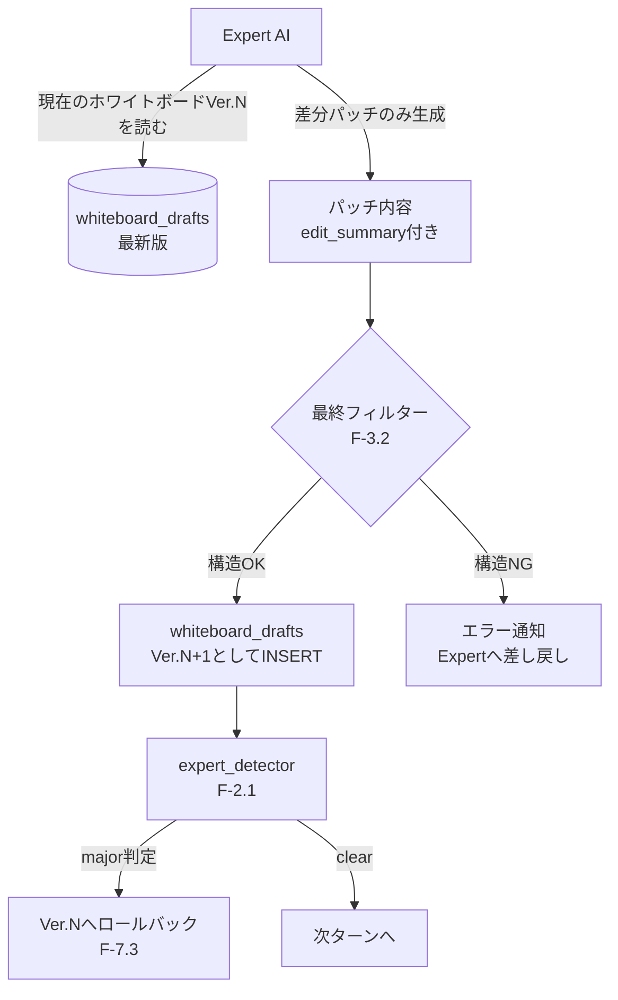

# R4 詳細設計書: ホワイトボード差分パッチ化
# (Cognitive Experience Lineage-driven Agent System - Refactor R4)

> **目的**: 既存プロトタイプの`integrator_node`（最後に全成果物を一括結合する方式）を、Expertが逐次差分パッチを当てる方式（F-7.2）へ移行する。R1〜R3（SQLite永続化・検算ゲート・自律的DB書き込み）が完了していることを前提とする。
> **最終更新**: 2026-07-17

---

## 1. 現状の問題（既存プロトタイプの動作）

既存の`integrator_node`は以下の方式で動作している。

```python
# 既存: integrator_node の要旨
deliverables = [a for a in state["agreements"] if a["entry_type"] == "Deliverable" and a["status"] == "Approved"]
master_document = []
for d in deliverables:
    master_document.append(f"## {d['topic']}\n{content_text}\n")
final_text = "\n".join(master_document)
result = call_integrator(state["goal"], final_text)
```

これは「各タスクの成果物が個別に`Approved`になった後、最後に一度だけ結合する」方式であり、以下の課題を持つ。

1. **結合は議論の最終盤（`reflection`が`completed`と判定した後）にしか走らない**。したがって、フェーズ間の矛盾（F-2.4 Integratorの本来の役割）は早期に発見されず、議論の終盤で初めて露呈する。
2. **成果物のバージョン管理がない**。`Agreement.content`は`UPDATE`のたびに上書き（Supersede）されるのみで、「Ver.3で何が起きたか」という履歴が失われる。
3. **差分ではなく全文書き換えが基本**。Expertは毎回、対象トピックの成果物全文を再生成する必要があり、トークン消費・不整合発生の両面で非効率。

---

## 2. 新設計：常時ホワイトボードへの差分パッチ

### 2.1 データフロー



### 2.2 `whiteboard_drafts`書き込みロジック

```python
def apply_whiteboard_patch(db_connection, phase_id: str, task_id: str, 
                             new_content: str, author_role: str, edit_summary: str) -> int:
    """
    現在の最新バージョンを取得し、新バージョンとしてINSERTする。
    全文書き換えではなく、Expertには「変更が必要なセクションのみ」を
    プロンプトで指示し、その結果をnew_contentとして受け取る想定。
    """
    latest = db_connection.execute(
        "SELECT version, content FROM whiteboard_drafts "
        "WHERE phase_id=? AND task_id=? ORDER BY version DESC LIMIT 1",
        (phase_id, task_id)
    ).fetchone()

    new_version = (latest["version"] + 1) if latest else 1

    db_connection.execute(
        "INSERT INTO whiteboard_drafts (draft_id, phase_id, task_id, version, content, author_role, edit_summary, timestamp) "
        "VALUES (?, ?, ?, ?, ?, ?, ?, ?)",
        (f"DF-{int(time.time()*1000)}", phase_id, task_id, new_version, new_content, author_role, edit_summary, time.time())
    )
    return new_version
```

### 2.3 ロールバック処理（F-7.3）

`expert_detector`がmajor判定を出した場合、直前バージョンを物理的に「正」として扱う。削除は行わず、**新しいレコードとして「ロールバック済みVer.N+1」を追加する**（削除するとDAGの追跡性が失われるため、監査ログとして残す方針とする）。

```python
def rollback_whiteboard(db_connection, phase_id: str, task_id: str, reason: str):
    latest_two = db_connection.execute(
        "SELECT version, content FROM whiteboard_drafts "
        "WHERE phase_id=? AND task_id=? ORDER BY version DESC LIMIT 2",
        (phase_id, task_id)
    ).fetchall()
    
    if len(latest_two) < 2:
        return  # ロールバック先がない（初版でのmajor判定は別途ハンドリング）
    
    prev_version_content = latest_two[1]["content"]
    apply_whiteboard_patch(
        db_connection, phase_id, task_id,
        new_content=prev_version_content,
        author_role="system_rollback",
        edit_summary=f"[ROLLBACK] Detector major判定により前バージョンへ復元: {reason}"
    )
```

**設計判断の理由**: ロールバックを「バージョン番号を巻き戻す」のではなく「同じ内容を新バージョンとして追記する」方式にしたのは、要件定義書N-2（トレーサビリティ：全判断ログをSQLiteに完全保存）の原則に従うため。バージョン番号を巻き戻すと、「Ver.4で何が却下されたか」という履歴自体が失われる。

### 2.4 Expertへのプロンプト変更（全文書き換え→差分指示）

既存の`call_expert`関数のsystem_promptに、以下を追加する。

```
【成果物の編集方針（★R4で追加）】
あなたは成果物の全文を毎回書き直す必要はありません。
現在のホワイトボード最新版（Ver.{latest_version}）を以下に示します。
ユーザーから指示されたセクションのみを修正し、変更した箇所とその理由を
edit_summaryとして明記してください。変更不要なセクションは
そのまま維持されるため、再掲する必要はありません。

【現在のホワイトボード Ver.{latest_version}】
{whiteboard_content}
```

### 2.5 高品質初版ドラフト生成ルール（F-7.4）の試験導入

ホワイトボードのVer.1（初版）のみ、既存の`model_agent`（`deepseek-v4-flash`）ではなく、より高性能なモデル（例：思考モデル）に生成させる運用を試験導入する。

```python
def generate_initial_draft(topic: str, requirements_context: str) -> str:
    """
    Ver.1のみ高性能モデルを使用。R2で追加したモデル切替ロジックを流用。
    """
    return query_AI(
        [{"role": "user", "content": f"以下の要件に基づき、{topic}の初版たたき台を作成してください。\n{requirements_context}"}],
        client=client_high_quality,   # ★新規: 高性能モデル用クライアント
        model=model_high_quality,
        label="Initial Draft Generator"
    )
```

**注記（要件定義書付録A.4より）**: 本ルールは"Skeleton-of-Thought"パターンから着想を得ているが役割は反転している（安い骨格＋高い肉付け、ではなく、高い初版＋安い反復）。既存の`MAX_TOKENS_BY_ROLE`・`LOW_TEMP_LABEL_KEYWORDS`の仕組みに、新しいラベル（`"initial_draft"`）を追加する形で実装する。

---

## 3. 完了条件（A/Bテスト）

| 指標 | 測定方法 | 成功条件 |
| :--- | :--- | :--- |
| フェーズ間矛盾の早期発見率 | Integratorの矛盾検知が、旧方式（議論終盤の一括結合時）とR4方式（各パッチ適用の都度）で、何ターン目に発見されるかを比較 | R4方式が旧方式より早いターンで矛盾を検出できること |
| トークン消費 | 同一タスクにおける総トークン消費量を、旧方式（全文書き換え）とR4方式（差分パッチ）で比較 | R4方式が明確に少ないこと（成果物が大きいタスクほど差が開くと予想） |
| ロールバックの正確性 | 意図的にmajor判定が出る内容をExpertに提案させ、ロールバック後のホワイトボード内容を検証 | ロールバック後の内容が、ロールバック前の正常バージョンと完全一致すること |
