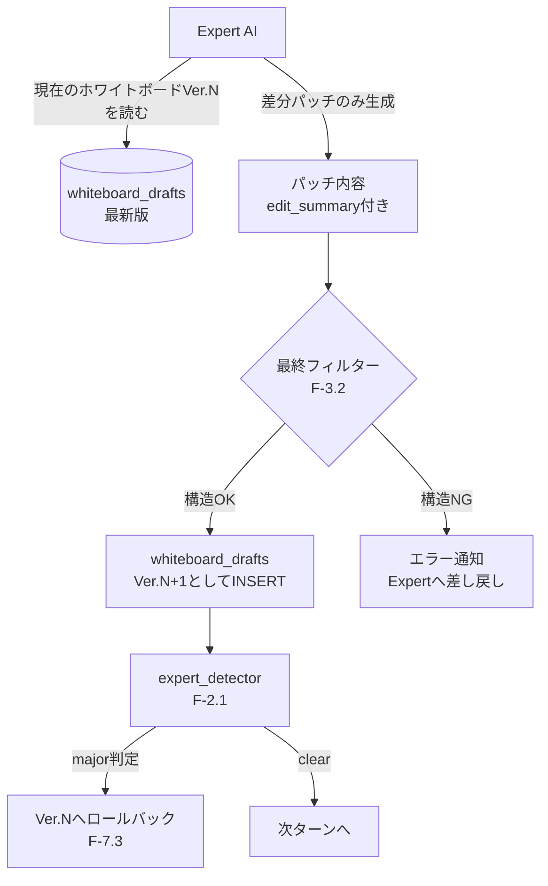

# R4 詳細設計書: ホワイトボード差分パッチ化
# (Cognitive Experience Lineage-driven Agent System - Refactor R4)

> **目的**: 既存プロトタイプの`integrator_node`（最後に全成果物を一括結合する方式）を、Expertが逐次差分パッチを当てる方式（F-7.2）へ移行する。R1〜R3（SQLite永続化・検算ゲート・自律的DB書き込み）が完了していることを前提とする。
> **最終更新**: 2026-07-22（R3a/R3b完了・着手決定を反映）

> **★2026-07-22追記（着手決定・前提充足の確認）**: R3a/R3bは完了済み（BL-039〜041の修正も反映済み、[decision_lineage.md 論点42](../decision_lineage.md)）。ドライランの長時間化・トークン消費による検証コストの高さを理由に、ユーザー判断によりR4に着手する（BL-041のfacilitator/Arbiter再設計より優先）。ホワイトボード差分パッチ化は決定・フェーズ横断情報構造化DB（BL-041/BL-018）とは独立して進行可能と判断。ただし以下2点は今後の調整対象として記録する：
> 1. **`integrator_node`が「卒業」するのは§1で述べる「最後に全成果物を一括結合するテキスト生成処理」のみであり、フェーズ横断の矛盾検知という役割自体は残る**（発火が「議論終盤に1回」から「パッチ適用の都度」に変わるだけ）。「Integrator自体の廃止」ではない。
> 2. BL-041設計書（`cela_facilitator_arbiter_redesign_BL041.md`）§3.1は「Integrator実行直前に`global_constraints`を集約する」という前提を置いているが、R4でIntegratorの発火タイミングが変わるため、その集約タイミングは本設計の実装後に再検討が必要（集約ロジック自体は`agreements.resource_claims`を読むだけなのでホワイトボード化と直接の技術的依存はない）。
> 3. **BL-034（Deliverableファイル保存のタイミング問題）・BL-040（ファイル名の`_Vn`バージョニング＋`old/`退避）との関係（実装時に決定・反映済み）**: per-task Deliverableの正本は`whiteboard_drafts`テーブルに一本化した（`agreements.decision_what`は`WHITEBOARD:{phase_id}:{task_id}`ポインタになる）。`save_deliverable_to_file`/`_archive_old_deliverable_file`（ファイルベースのバージョン管理）は削除せず、`integrator_node`が生成する1回限りの最終統合文書（バージョン管理不要、人間可読性のための出力）専用として残した。

> **★実装完了時追記（2026-07-22）**: 上記に基づき実装を完了。**Expertが提示する「変更箇所」をどう既存の完全版へマージするか**という、当初この設計書で未定義だった核心部分は、Claude Code自身のEditツールと同じ方式（`old_text`の完全一致検索→`new_text`への置換、一致しない/複数一致する場合はエラーを返しExpertに修正・再試行させる）で解決した。詳細は§2.4・§2.6、実装計画は`cela_r4_impl_Plan.md`を参照。

> **★D-036追記（2026-07-21）**: T-10ドライランのレビューで、R3が本来想定していた「自律的DB書き込み」だけでは、フェーズ横断の`verified_facts`参照不能（BL-035）・財務/需要数値ドリフト（BL-036）・`reason_why`の薄さ（BL-037）を解消できないことが判明したため、R3は**R3a（自律的DB/ファイル読み取り、F-3.8・F-3.9、先行実装）→R3b（自律的DB書き込み、`write_agreement_tool`、旧来のR3スコープ）**の2段階に再編された（詳細は`cela_roadmap_v25.md` R3節を参照）。本設計書冒頭の前提「R1〜R3が完了していることを前提とする」は、**R3a＋R3bの両方の完了**を指す。R4のExpertが「現在のホワイトボード最新版を読む」（§2.1）動作は、R3aで実装されるF-3.8自律読み取りツール・F-3.9構造化ファクトストアの上に構築されることが望ましく、R3a未完了のままR4に着手すると、ホワイトボード読み取りが旧来の`_build_task_scope_context`のフェーズ横断バグ（BL-035と同種）を再び踏む可能性がある。したがって実装順は必ずR3a→R3b→R4を守ること。

---

## 1. 現状の問題（既存プロトタイプの動作）

既存の`integrator_node`は以下の方式で動作している。

```python
# 既存: integrator_node の要旨
deliverables = [a for a in state["agreements"] if a["entry_type"] == "Deliverable" and a["status"] == "Approved"]
master_document = []
for d in deliverables:
    master_document.append(f"## {d['topic']}\n{content_text}\n")
final_text = "\n".join(master_document)
result = call_integrator(state["goal"], final_text)
```

これは「各タスクの成果物が個別に`Approved`になった後、最後に一度だけ結合する」方式であり、以下の課題を持つ。

1. **結合は議論の最終盤（`reflection`が`completed`と判定した後）にしか走らない**。したがって、フェーズ間の矛盾（F-2.4 Integratorの本来の役割）は早期に発見されず、議論の終盤で初めて露呈する。
2. **成果物のバージョン管理がない**。`Agreement.content`は`UPDATE`のたびに上書き（Supersede）されるのみで、「Ver.3で何が起きたか」という履歴が失われる。
3. **差分ではなく全文書き換えが基本**。Expertは毎回、対象トピックの成果物全文を再生成する必要があり、トークン消費・不整合発生の両面で非効率。

---

## 2. 新設計：常時ホワイトボードへの差分パッチ

### 2.1 データフロー



### 2.2 `whiteboard_drafts`書き込みロジック

```python
def apply_whiteboard_patch(conn, run_id: str, phase_id: str, task_id: str,
                            new_content: str, author_role: str, edit_summary: str) -> int:
    """
    現在の最新バージョンを取得し、new_content（マージ済みの完全版）を新バージョンとしてINSERTする。
    new_contentの構築方法（全文かold_text/new_text差分の適用結果か）は§2.4・§2.6を参照。
    """
    latest = get_latest_whiteboard(conn, run_id, phase_id, task_id)
    new_version = (latest["version"] + 1) if latest else 1

    conn.execute(
        "INSERT INTO whiteboard_drafts (draft_id, phase_id, task_id, version, content, author_role, edit_summary, timestamp, run_id) "
        "VALUES (?, ?, ?, ?, ?, ?, ?, ?, ?)",
        (f"DF-{int(time.time()*1000)}", phase_id, task_id, new_version, new_content, author_role, edit_summary, time.time(), run_id)
    )
    return new_version
```

### 2.3 ロールバック処理（F-7.3）

`expert_detector`がmajor判定を出した場合、直前バージョンを物理的に「正」として扱う。削除は行わず、**新しいレコードとして「ロールバック済みVer.N+1」を追加する**（削除するとDAGの追跡性が失われるため、監査ログとして残す方針とする）。

```python
def rollback_whiteboard(conn, run_id: str, phase_id: str, task_id: str, reason: str):
    rows = conn.execute(
        "SELECT version, content FROM whiteboard_drafts "
        "WHERE run_id=? AND phase_id=? AND task_id=? ORDER BY version DESC LIMIT 2",
        (run_id, phase_id, task_id)
    ).fetchall()

    if len(rows) < 2:
        return  # ロールバック先がない（初版でのmajor判定は別途ハンドリング）

    prev_version_content = rows[1]["content"]
    apply_whiteboard_patch(
        conn, run_id, phase_id, task_id,
        new_content=prev_version_content,
        author_role="system_rollback",
        edit_summary=f"[ROLLBACK] Detector major判定により前バージョンへ復元: {reason}"
    )
```

実装では、直前ターンでExpertがwhiteboard_draftsに書き込んだか（どのphase_id/task_idか）を`expert_node`がstateに保存し（`state["expert_last_whiteboard_edit"]`、BL-033の`_LAST_PYTHON_CALLS`と同じ「LangGraph単一プロセス同期実行前提」パターン）、次ターンで`constraint_issue=="major"`と判定された場合にこの情報を使ってロールバックする。

**設計判断の理由**: ロールバックを「バージョン番号を巻き戻す」のではなく「同じ内容を新バージョンとして追記する」方式にしたのは、要件定義書N-2（トレーサビリティ：全判断ログをSQLiteに完全保存）の原則に従うため。バージョン番号を巻き戻すと、「Ver.4で何が却下されたか」という履歴自体が失われる。

### 2.4 Expertへのプロンプト変更（全文書き換え→old_text/new_text差分）

既存の`call_expert`関数のsystem_prompt（フル版・軽量版の両方）に、`_build_task_scope_context`経由で以下を追加する。

```
【現在のホワイトボード Ver.{latest_version}（このタスクの成果物の最新版）】
{whiteboard_content}

【R4: 編集方針】上記を修正する場合、全文を書き直す必要はありません。write_agreementツールを
action_type='UPDATE', entry_type='Deliverable'で呼び、editsパラメータに
変更箇所のold_text/new_textのみを指定してください（old_textは上記本文と一字一句一致させること）。
大幅な構成変更の場合のみ、decision_whatに全文を渡してください。
```

`write_agreement`ツールの`edits`パラメータは`[{old_text, new_text, replace_all}]`の配列で、システム側は各`old_text`を現在のホワイトボード本文に対し完全一致検索し、`new_text`に置換する（§2.6参照）。`old_text`が本文中に見つからない、または`replace_all=false`で複数箇所に一致した場合はDBへの書き込みを行わずエラーを返し、Expertは同一ツールループ内で修正・再試行できる（既存のJSON引数パースエラー時の自己修復（D-009）と同じ仕組み）。

### 2.5 高品質初版ドラフト生成ルール（F-7.4）の試験導入

ホワイトボードのVer.1（初版）のみ、既存の`model_agent`（`deepseek-v4-flash`）ではなく、より高性能なモデル（例：思考モデル）に生成させる運用を試験導入する。

```python
def generate_initial_draft(topic: str, requirements_context: str) -> str:
    """
    Ver.1のみ高性能モデルを使用。R2で追加したモデル切替ロジックを流用。
    """
    return query_AI(
        [{"role": "user", "content": f"以下の要件に基づき、{topic}の初版たたき台を作成してください。\n{requirements_context}"}],
        client=client_high_quality,   # ★新規: 高性能モデル用クライアント
        model=model_high_quality,
        label="Initial Draft Generator"
    )
```

**注記（要件定義書付録A.4より）**: 本ルールは"Skeleton-of-Thought"パターンから着想を得ているが役割は反転している（安い骨格＋高い肉付け、ではなく、高い初版＋安い反復）。既存の`MAX_TOKENS_BY_ROLE`・`LOW_TEMP_LABEL_KEYWORDS`の仕組みに、新しいラベル（`"initial_draft"`）を追加する形で実装する。

**★スコープ外（2026-07-22決定）**: 本ルールは今回のR4実装には含めない。将来の拡張として本節はそのまま残すが、実装対象はまず§2.1〜2.4・2.6の差分パッチ化に限定する。

### 2.6 差分マージ方式の決定（当初未定義だった核心部分）

本設計書の初版では、Expertが提示する「変更箇所」を既存の完全版へどうマージするかが未定義だった（自由記述の部分修正をそのままDBに上書き保存すると、触れていない箇所の内容が失われる）。実装着手時にユーザーへ確認し、以下3方式を比較検討した。

| 方式 | 概要 | 採用可否 |
|---|---|---|
| 構造化セクション方式 | Deliverableを`{見出し: 本文}`のdictとして管理し、変更のあった見出しのみ送らせ、システムがdictマージする | 不採用（見出しの命名をExpertが一貫させる必要があり運用負荷が高い） |
| 常に全文再送 | 設計書の字義通り、Expertは毎回全文を出力し、バージョン管理・ロールバック機構だけを追加する | 不採用（トークン削減効果がほぼない） |
| **unified diff形式** | Expertが本物のdiff/patch形式を出力し、パッチ適用ライブラリで機械的に適用する | 不採用（LLMが生成するdiffはコンテキスト行のズレ等でパッチ適用に失敗しやすく、フォールバック処理が複雑） |
| **Claude Code Editツール方式（採用）** | `old_text`の完全一致検索→`new_text`へ置換。一致しない/複数一致する場合はエラーを返しExpertに修正させる | **採用** |

**採用理由**: Claude Code自身のEditツールと同じ方式を採用した。LLMに行番号やunified diff形式を要求せず、マージ処理も100%機械的（決定的）であるため、他方式よりも実装リスクが低い。一致失敗時のエラーは、既存の壊れたJSON引数のセルフリペア（D-009、`_query_AI_live`のツールループ内）と同じ「同一ターン内でLLMが修正・再試行する」パターンに乗せられる。

実装は`_apply_text_edits(current_content, edits)`（`cela_main.py`）: 各editの`old_text`が0件/複数件（`replace_all=False`時）ならエラーメッセージを返し、DBには一切書き込まない。全edit成功時のみ新バージョンとしてコミットする。

---

## 3. 完了条件（A/Bテスト）

| 指標 | 測定方法 | 成功条件 |
| :--- | :--- | :--- |
| フェーズ間矛盾の早期発見率 | Integratorの矛盾検知が、旧方式（議論終盤の一括結合時）とR4方式（各パッチ適用の都度）で、何ターン目に発見されるかを比較 | R4方式が旧方式より早いターンで矛盾を検出できること |
| トークン消費 | 同一タスクにおける総トークン消費量を、旧方式（全文書き換え）とR4方式（差分パッチ）で比較 | R4方式が明確に少ないこと（成果物が大きいタスクほど差が開くと予想） |
| ロールバックの正確性 | 意図的にmajor判定が出る内容をExpertに提案させ、ロールバック後のホワイトボード内容を検証 | ロールバック後の内容が、ロールバック前の正常バージョンと完全一致すること |
