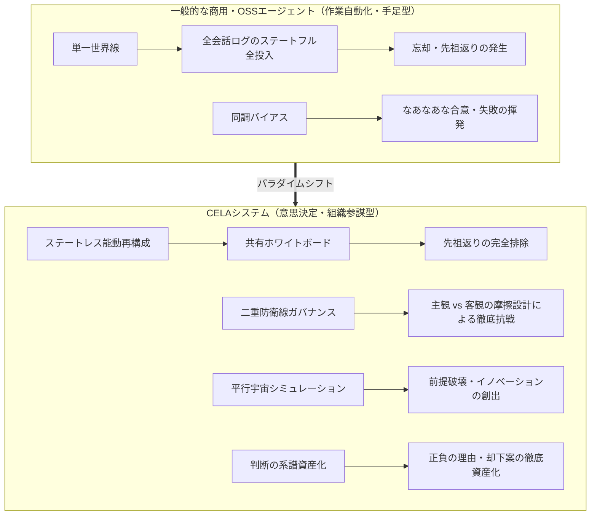
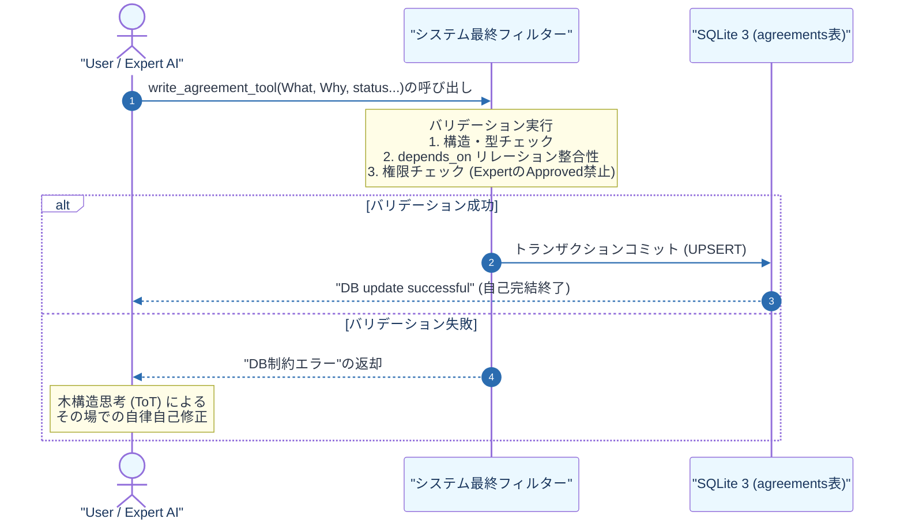
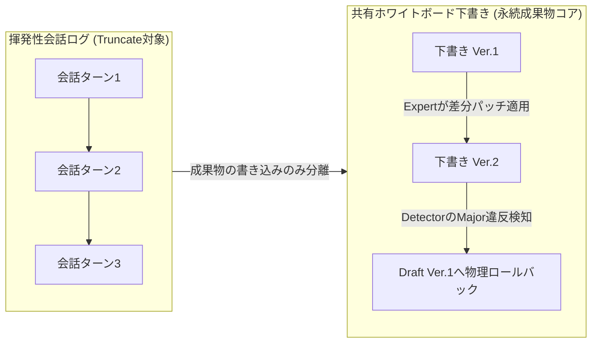
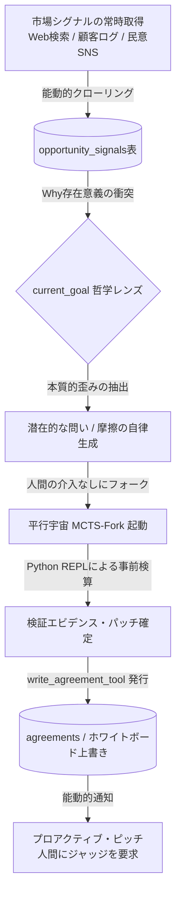
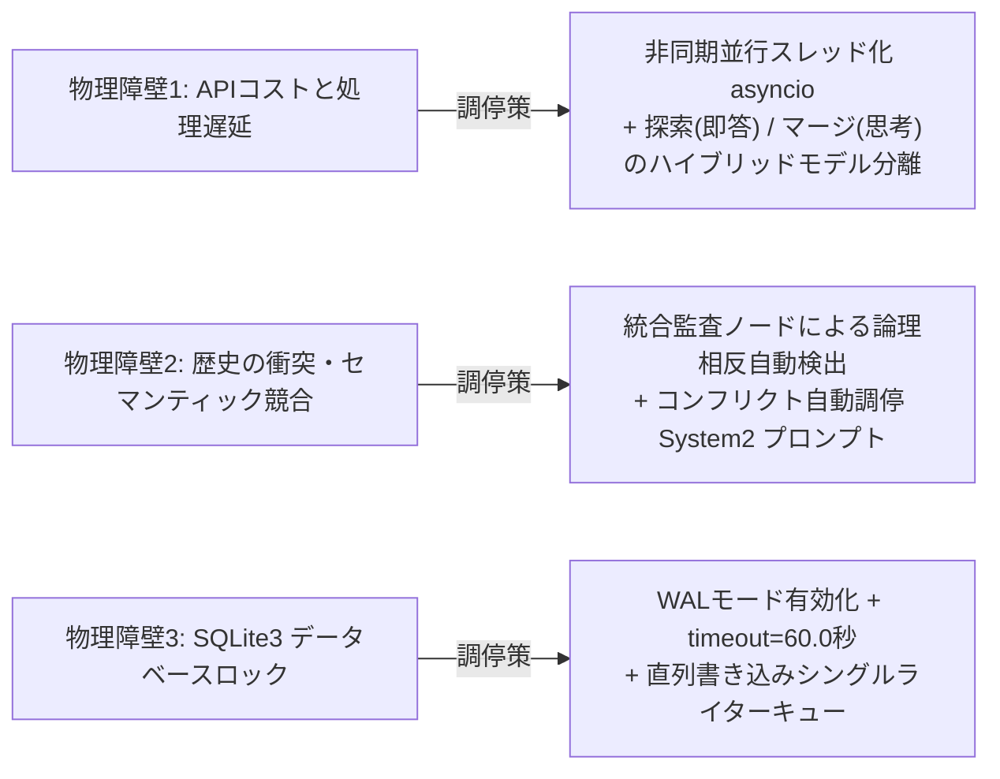

# 要件定義書: CELA — 認知型経験系譜駆動マルチエージェントシステム
# (Cognitive Experience Lineage-driven Agent System)

> **作成方法**: ソースコード `cela_main.py` (ver.10) のリバースエンジニアリング、および「Lineage (旧NPU Context Saver) 構想における『判断の系譜』・正負の理由の資産化・Hydrate 5節フォーマット」の完全統合設計
> **最終更新**: 2026-07-17（バージョン34.0・Cline(hy3)第2弾レビュー反映：current_goal記述修正、F-3前文修正）

---

## 1. システム概要

| 項目 | 内容 |
| :--- | :--- |
| **システム名** | CELA — 認知型経験系譜駆動マルチエージェントシステム (Cognitive Experience Lineage-driven Agent) |
| **目的** | 複雑な利害と物理制約が衝突する意思決定において、「何を決めたか（What）」だけでなく**「なぜ決めたか（正の理由：採用・成功）」と「なぜ他を却下したか（負の理由：不採用・否決・失敗）」の『判断の系譜（Decision Lineage）』を永続的な資産として蓄積**し、ハルシネーションなき要件定義と自律型先回り提案（プロアクティブピッチ）を実現する知能OS。 |
| **方式** | LangGraph ステートマシン + 階層型モデル制御 + 3レイヤー外部メモリ（SQLite 3による物理永続化 / 共有ホワイトボード / RAG対応 Lessons Learned DB） + 各世界線の動的マルチブランチ・オーケストレーション |
| **実行モード** | **ステートレス・アクティブ再構成モード（唯一の標準動作モード）** |

---

### 1.1 「コードの系譜」から「判断の系譜（Lineage）」へのパラダイムシフト

本システム「CELA」は、2026年現在の主要な商用・OSS自律型AIエージェントツール（Claude Code、OpenAI Operator/Codex、Cursor、CrewAI、AutoGPT等）と比較して、根本的に異なるパラダイム（立ち位置）に設計されている。

既存ツールが「作業を自動化する高性能な手足（シングルタスク実行機）」として、Gitを用いて「結果（コード）」の系譜を管理するツールであるならば、CELAは**「なぜその結果に至ったのか、そしてなぜ他の選択肢を棄却したのか」という『理由（Why）』の系譜を管理するOS**である。
正の理由（成功・採用）と、ボツになった負の理由（失敗・不採用）を構造化して保存・相互追跡可能にすることで、AIは人間と同等、あるいはそれ以上の「組織的記憶と説明責任」を獲得する。

【本システムの核心的処方箋】
CELAの設計は、「AI同士の雑談ストリームを情報のマスターデータ（SoT）とすることをやめ、全員で中央のホワイトボード（成果物）を直接編集・バージョン管理するGitのようなプロセスへ移行する」という一点に集約される。この移行により、監査コストは「発言全体」ではなく「今回の差分」のみに限定され、速度と同調バイアス抑制を同時に達成する。ただし差分単位の監査（Detector）だけでは「個々の変更は妥当だが積み重ねた結果として全体が崩壊する」という逆方向の失敗モードを防げないため、差分レベルの監査（第1・第2防衛線）と全体レベルの監査（Integrator/Reflection）という二層構造の監査を意図的に併設している。




| 比較軸 | 一般的な商用・OSSエージェント<br>(Claude Code, OpenAI Operator, Cursor等) | CELA<br>(認知型経験系譜駆動システム) |
| :--- | :--- | :--- |
| **主たる設計思想** | **作業自動化（Automation）**<br>人間から与えられたコード生成やWeb操作、リサーチのタスクを高速に代行する。 | **意思決定ガバナンス（Governance）**<br>複雑な物理制約（予算・納期等）と人間的価値観が衝突する中で、超合理的な要件定義書を自律編纂する。 |
| **協調モデル** | **会話・スレッド維持型（Conversational）**<br>単一のメッセージ履歴（スレッド）の保持期間を最大化することに注力し、チャットログの時系列（文脈の流れ）に依存して成果物の整合性を維持しようとする。コンテキストの肥大化によりスレッドを破棄せざるを得なくなった際、文脈が断絶するため、ユーザーが「これまでの議論の経緯」や「過去にボツになった代替案の理由」を新スレッドへ再プロンプトとして手動入力する初期化コスト（文脈の断絶）を伴う。 | **成果物中心型（Artifact-Centric）**<br>会話は成果物を書き換えるための「使い捨ての道具（パッチ生成手段）」と定義する。全エージェントが中央の「共有ホワイトボード（下書き）」を囲み、差分パッチ（F-7）のみを上書き適用して制御する。成果物（ホワイトボード）と意思決定の系譜はSQLite（外部State）に明示的に分離して外在化されているため、スレッドをいつでも破棄・新規移行でき、再起動後も最新のホワイトボードと系譜から瞬時に前ターンの文脈を復元して議論を再開できる。|
| **コンテキスト管理** | **履歴依存・延命管理（消極的トリミング）**<br>対話ストリーム（messages 配列）を SoT（信頼できる唯一の情報源）とし、裏でウインドウのスライドや要約を行ってコンテキストを維持する。これは「長大な履歴からの情報の削り落とし（引き算）」であるため、ターン数が累積すると「初期に確定した大前提」や「却下済みの仕様」のグラデーションが薄まり、先祖返りやハルシネーションが発生しやすくなる。 | **ステートレス能動再構成（F-8）**<br>エージェントは毎ターン完全にステートレスな状態で起動される。メッセージ履歴は直近数件に絞り込み、毎ターンSQLiteからクエリした「Goal（目的）」、「DecisionPair（正負の決定系譜）」、および現在の「Whiteboard（成果物の最新下書き）」から、最適化されたコンテキストを都度能動的に合成（Hydrate）する。これにより、常にモデルの最高解像度の推論性能を維持する。 |
| **同調バイアスの制御** | **同調（なあなあ）の発生**<br>エージェント同士が安易に相手の意見を肯定・妥協し、中庸で凡庸な設計に落ち着きやすい。 | **二重防衛線ガバナンス（F-2.1）**<br>User AIの主観的・論理的徹底抗戦 ＋ Detectorの第3者司法検閲により、健全な摩擦を起こす。 |
| **膠着（デッドロック）** | **フリーズ、または諦め**<br>予算制約などの矛盾に直面した際、無限ループに陥るか「解決不能」とエラーを出してハングアップする。 | **マルチブランチ並行世界シミュレーション（F-10.6）**<br>そもそも論に視座を引き上げ、複数の世界線ブランチをフォークさせて同時並行探索する。 |
| **経験の永続性** | **セッション限りの揮発性**<br>一度セッションを閉じると、過去に犯した手痛い失敗や技術的罠の教訓を綺麗さっぱり忘却する。 | **経験のDNA伝承（Lessons Learned: F-9）**<br>過去のプロジェクトでの「状況・手段・失敗・教訓」をSQLiteに蓄積。次回起動時にRAGで事前インジェクションする。 |

---

## 2. 機能要件

### F-1: マルチエージェント議論管理
CELAの処方箋は一点に集約される——会話ストリームというSoTを、Gitのようにバージョン管理された中央ホワイトボードに置き換えること。これにより監査は「差分単位」で完結し高速化するが、差分の妥当性チェック（Detector）だけでは全体崩壊を防げないため、全体整合性チェック（Integrator）を別レイヤーとして必須併設している。

```mermaid
graph TD
    subgraph SystemControl["LangGraph (システム制御)"]
        A[機械的な進行管理 / 挨拶の排除 / フェーズ遷移]
    end

    subgraph CoreAgents["対立と格闘モデル"]
        Expert[Expert AI<br>客観のエンジニア]
        User[User AI<br>主観のバイヤー / 第1防衛線]
        Detector[Detector<br>独立監査機関 / 第2防衛線]

        Expert -->|提案 / 下書きパッチ| User
        User -->|批判的論理監査 / 主観の盾| Expert
        
        Expert -.->|安易な妥協・予算超過等の検閲| Detector
        User -.->|安易な妥協・予算超過等の検閲| Detector
        Detector -->|強制差し戻し / 司法検閲| Expert
    end

    SystemControl -->|エージェント自律起動| CoreAgents
```



| ID | 要件 | 説明 |
| :--- | :--- | :--- |
| F-1.1 | タスクプランニング | 絶対目標（Goal）を複数の独立した「フェーズ」に分解する。各フェーズは3次元属性（抽象度・スコープ・時間軸）を持つ。 |
| F-1.2 | オーケストレーション | SQLiteの `agreements`（合意DB）の最新状態に基づき、現在のタスクに最も適したエキスパートを自動選択する。 |
| F-1.3 | エキスパート実行 | 選択されたエキスパートがタスクを遂行。自律DB書き込みツール（F-3.1）を駆使し、ホワイトボードおよび合意DBを直接更新する。 |
| F-1.4 | **ユーザーAI（発注者）発話生成の再定義（批判的承認者）** | **【責務の完全刷新】** 進行管理や挨拶などの余計な発話を一切禁止し、**「主観物価値観（こだわり・政治・人間的都合）」の注入**と、「冷徹な批判的論理監査（論理破綻・計算ミス・都合の良い前提の看破）」に特化させる。<br><br>**【批判的読解・検閲ルール】** User AIは「承認（Approve）権限を持つ絶対的なゲートキーパー」として、Expert AIの提示したホワイトボード（下書き）に対し、以下の2軸で厳格に突っ込み（批判）を加え、容易にApproveしてはならない：<br>1. **主観的・感情的検閲**: 「例：このシステムフローは、スマホを持たない高齢者住民を無視した独りよがりな設計になっていないか？」<br>2. **客観的・批判的論理監査**: 「例：このシミュレーションの計算結果は、前提条件である年間維持費3,000万円上限と本当に矛盾していないか？ 適当な数字でごまかしていないか？」 |
| F-1.5 | ターン制御と延長 | 最大 30 ターン（可変）の制約内で動作。QA（Reviewer）差し戻し時に 5 ターン自動延長（最大 3 回まで）。 |

---

### F-2: 監査・品質保証（ガバナンスと二重防衛線）
ハルシネーション（嘘）や議論の迷走、計算ミスを自律検知して制御する。

| ID | 要件 | 説明 |
| :--- | :--- | :--- |
| F-2.1 | **Detector（独立監査）と二重防衛線構造** | **【二重防衛線（Defense in Depth）の確立】**<br>・**第1防衛線 (User AIによる能動的検閲)**: 交渉の当事者として、主観の歪みや都合の良い前提条件を看破。不承認（Reject）または条件付き承認（Approved with Conditions）を突き返す。<br>・**第2防衛線 (Detectorによる客観的監査)**: 独立した第3者（司法）として、両者が妥協したり見落とした「倫理・安全リスク」および「物理上限（予算のtotal_cap超過）」を、会話履歴から直接検知して強制的に差し戻す。 【思考プロセス監査の追加】 Detectorは、提案された「決定（What）と理由（Why）」の表面的な整合性を見るだけでなく、背後にある internal_thought_process（思考過程ログ）を直接読み込む。「計算ツールを使っていないのに適当な数字を出している」「都合の悪い制約から意図的に目を逸らして結論を急いでいる」といった**AIの事後正当化（取り繕い）**を検知した場合、重度のハルシネーションと判定して強制差し戻し（major）を行う。<br><br>**【重要な限界と補完】** ただし、実証実験により、internal_thought_process内でAI自身が正しく検算していたとしても、それを読むDetector自身もまた別のLLMインスタンスである以上、暗算による検証には同様の誤りのリスクが伴うことが判明している。したがって、数値的主張の妥当性確認は本項の思考ログ監査だけに依拠せず、F-2.6（数値主張の機械的検算ゲート）による強制Python検算を必須の補完措置として併用する。|
| F-2.2 | Reflection（内省監査） | 3ターンごとにマクロなゴール監査を実行。議論の「収束（completed）」「停滞（stagnant）」「進行中」を判定。 |
| F-2.3 | Reviewer（QA審査） | 最終成果物を絶対目標と照合し、網羅性・検証データ（具体的な数値・根拠）の有無を厳格に審査。不合格時はリテイク。 |
| F-2.4 | Integrator（統合監査） | 各タスクの成果物を物理結合し、フェーズ間・タスク間の論理的・数値的な横断矛盾を自動チェック。 |
| F-2.5 | Resource Arbiter（資源調停） | グローバル制約（予算等のtotal_cap）の超過を自動計算し、フェーズ間の再配分案を提示。 |
| F-2.6 | **数値主張の機械的検算ゲート（強制Python検算）（★V24新規、V25検証結果反映）** | **【設計根拠】** 実証実験（条件D、後述の付録A参照）において、Detector・Reviewerの両監査ノードを通過した成果物に数値的矛盾（合計待機時間の計算誤り）が残存する事例が確認された。これは、LLMが自然言語内の暗算（mental arithmetic）を高い確率で誤りうる一方、その誤りを検算・検出する役割を同じくLLM（たとえ思考モデルであっても）に委ねた場合、検出に失敗しうることを示す。<br><br>**【強制ルール】** Detector（F-2.1）およびReviewer（F-2.3）は、監査対象のホワイトボード下書きまたはagreementsレコード（`evidence`欄等）に数値的主張（合計・比率・閾値比較等）が含まれる場合、**LLM自身の暗算結果を信頼して承認判定を行うことを禁止**する。当該数値主張は必ずPython REPL（F-5.1）を呼び出して機械的に再計算し、その結果と成果物中の記述が一致することを確認したうえでなければ、承認（Approved）判定を行ってはならない。不一致が検出された場合は無条件でmajor判定とし、差し戻す。<br><br>**【適用範囲】** 本ゲートはDetector/Reviewerに限らず、Integrator（F-2.4、横断的な数値整合性チェック時）およびArbiter（F-2.5、予算超過判定時）にも同様に適用する。<br><br>**【追加検証（付録A.5）で判明した効果】** 本ルールをエージェント指示ファイル（`agent.md`相当）に1行明記するだけの最小実装でも、5試行中5試行で数値矛盾の検出とPython検算の実行が確認され、低コストモデルでも高い一貫性を持つ結果が得られた。<br><br>**【追加検証で判明した残存課題】** (1) 本ゲートは「LLMの暗算」を「機械的な計算」に置き換えるものであり、その計算コード自体（エージェントが都度生成するPythonコード）に誤りがあった場合の正しさまでは保証しない。重要な計算については、エージェントに都度コードを書かせるのではなく、事前にレビュー済みの固定ユーティリティ関数を呼び出させる設計を今後検討する。(2) ツール呼び出しと複数回の思考ステップの発生により、トークン消費量が同一タスクで約4.5倍（約20k→約90k）に増加することを確認した。ただし低コストモデルを検証ループの主体に据える設計（F-5.2）を前提とすれば、実務上のコスト影響は限定的と評価される。 |

---

### F-3: 自律的合意・決定管理と「判断の系譜」の資産化（★大幅拡張、★v34で決定経路の位置づけを修正）
外部の独立した書記ノードによる事後抽出を**基本経路から外し**、エージェント自身にDB/ファイル操作の手足（ツール）を与えることを主たる決定経路とする。同時に、意思決定のWhat/Whyを完全分離し資産化する。

**注記（v34、実装計画（Phase1〜R3設計書）とのすり合わせにより修正）**: 当初「完全撤廃」と記述していたが、実装計画側での検討（Phase1〜R3設計書v5 §3.3）により、書記ノード（`decision_extractor_node`相当）を物理的に削除するのではなく、**「各役割のAIが自身でツールを呼び出すのが基本経路であり、書記ノードはツール呼び出しが行われなかった場合の予備的なセーフティネットとして残す」**という、より安全な移行方針に修正した。これは無条件の撤廃よりも、移行期間中の書き漏れリスクを許容しないための現実的な調整であり、思想（自律的書き込みを主とする）自体は変えていない。



| ID | 要件 | 説明 |
| :--- | :--- | :--- |
| F-3.1 | **自律的DB書き込み（Tool Calling）の内包** | **【抽出ノードの撤廃】** User AIおよびExpert AIに対し、合意（Decision）、指示（Directive）、成果物（Deliverable）をSQLiteへ直接書き込むための専用ツール（`write_agreement_tool`）を装備させる。 AIは自問自答の末に確定した結論を、第三者のパースを介さず、**自らの意志で直接データベースにインジェクション（UPSERT）**する。 |
| F-3.2 | **システム最終フィルター（ガードレール）** | **【バリデーション・インターセプター】** AIがツールを叩いてSQLiteにデータを書き込もうとした瞬間、システム（LangGraphのラップロジック）が「最終フィルター」として割り込み、以下の機械的バリデーションを実行する：<br>1. **構造チェック**: 3次元属性、proposed_by、entry_type などの必須フィールドの有無。<br>2. **リレーション整合性**: depends_on に指定された過去の合意IDが実際にDB内に実在するかの整合性。<br>エラーが検知された場合、SQLiteへのコミットを拒否し、AIへ「DB制約エラー」として即時通知してその場で自己修正（ToT）を強いる。 |
| F-3.3 | ファイル上書き保護と引き継ぎ | Deliverable（成果物）の更新時、AIから新しい本文の提示がない、あるいは短い要約のみが出力された場合、最終フィルターが自動的に既存のファイルパス（FILE_PATH:）を検出してロックし、次バージョンへ物理パスを安全に引き継ぐ。 |
| F-3.4 | 成果物ファイルの自律生成 | AIが `entry_type="Deliverable"` としてツールを発行した際、最終フィルターは本文を `log/deliverables/` 配下にMarkdownファイルとして自動物理保存し、生成されたファイルパスをSQLiteの `content` フィールドに格納する。 |
| F-3.5 | **DecisionPair と AI Reason の完全分離（★V23新規）** | AIが合意DBにデータを書き込む際、`hypothesis_decision` の記述を**「決定内容（Decision_What: What）」**と**「採用の理由（Reason_Why: Why）」**に物理カラムレベルで厳格に分離する。単なる直感的出力や結果の書き下しを許さず、論理的な背後関係・選択因子の説明責任を強制記録する。 |
| F-3.6 | **「負の理由（Rejected）」の徹底資産化（★V23新規）** | 提案や世界線がUser AI（またはDetector）によって却下（Reject）された場合、単にエラーメッセージとして流すのではない。**「提案内容（What）」と「却下された理由（Why Rejected）」をセット（DecisionPair）としてSQLiteの `agreements` 表に status="Rejected" で永久保存する**。これにより、「過去のボツ案とその否決理由」が未来の同じミスの再発や無駄な手戻りを防ぐ強力なアクティブ知財となる。 |
| F-3.7 | **思考過程（スクラッチパッド）の強制露出と透過的記録（【新規追加】** | エージェント（User/Expert）が write_agreement_tool を呼び出す際、必ずその手前のテキスト出力（<think> タグや思考用スクラッチパッド領域）で「どのような検証・計算を経てその結論に至ったか」を言語化させる。システムはツール実行をフックした際、この直前の思考テキストをキャプチャし、agreements テーブルの internal_thought_process に保存する。 |

---

### F-4: 異常系ハンドリング

| ID | 要件 | 説明 |
| :--- | :--- | :--- |
| F-4.1 | 差し戻しリトライ | User/Expertが「major（制約矛盾）」判定を受けた場合、直近のNG発言を履歴（およびSQLiteメッセージテーブル）からポップし、3回までリトライを許可。 |
| F-4.2 | 割り込み強制停止 | highリスク（倫理違反）検知時は即時にHalt（強制停止）。QA差し戻しおよびファシリテーションが3回超過時も停止。 |
| F-4.3 | APIリトライ | 接続失敗や高負荷エラー発生時、指数バックオフ（[8, 16, 32, 64, 128]秒）を用いて最大5回自動リトライ。 |

---

### F-5: 認知アーキテクチャとハイブリッド探索

| ID | 要件 | 説明 |
| :--- | :--- | :--- |
| F-5.1 | リアルタイムツールグラウンディング（★v5でグラウンディング付与範囲を拡大） | エキスパートノード（手足・即答型）が、実データ取得用の「Web検索」および、厳密な数値シミュレーション用の「Python REPL」を実行できるようにする。**加えて、F-2.6（機械的検算ゲート）の実行主体としてDetector・Reviewerにも、また客観的・批判的論理監査（F-1.4）を暗算に頼らず遂行するためUser AIにもPython REPLを付与する。**収束性向上の観点から、検算グラウンディングは特定ノードに限定せず、数値的根拠を扱いうるすべての役割に提供することが望ましい。 |
| F-5.2 | 思考モードの動的ルーティング | 全ノードで一律に思考モデルを使用するのを避け、以下のように役割分担を行う。<br>・**司令塔・監査役**（PM, Detector, Reflection, Reviewer）: 「思考モード（o1, DeepSeek-R1等）」を使用。<br>・**実行部隊**（Expertロール）: 「即答モード（GPT-4o, deepseek-v4-flash等）」を使用。 |
| F-5.3 | 経験の構造化保存 | 議論の失敗が発生した際、`[状況] ➔ [とった手段] ➔ [結果] ➔ [教訓]` の形式で「経験のグラフ構造（JSON）」に変換し、外部の `lessons_learned` テーブルに蓄積する。 |
| F-5.4 | セマンティックMCTSとToTのハイブリッド探索 | ・**ミクロ（ToT型ローカル探索）**: 1つのフェーズ内では、直近の「分かれ目」に戻ってやり直すToT（DFS）を適用（`retry_count`による差し戻し）。<br>・**マクロ（MCTS型グローバルワープ）**: 議論の膠着（`deadlock_counter >= 3`）が発生した際、SQLiteから過去の失敗の原因（失敗のDNA）を抽出し、類似した「失敗パターンの回避策（アナロジー）」を動的にコンテキストに補間。視野の広い代替手段を創出する。 |
| F-5.5 | **思考内エージェント化ループ（Intra-Thought Agentic Loop）（★V25新規）** | **【着想の背景】** 思考モード（`<think>`ログ）を観察すると、モデルは短い自己対話を逐次的に繰り返しながら情報収集・条件整理を行い、プロンプト的な文脈を内部で太らせていき、十分な情報が揃った時点で最終出力を確定するという、**AIエージェントのミニチュア版を単一モデルの内部で実行している**ような振る舞いを見せる。この観察に基づき、この構造を単一モデル内に閉じ込めず、実際に異なる性能のモデルへ物理的に分割する。<br><br>**【動作フロー】**<br>1. **軽量モデル（情報収集フェーズ）**: コードの読解、条件の洗い出し、仮説の列挙など、生成負荷の高い情報収集作業を軽量・安価なモデルに担わせる。モデルが「情報収集完了」と判断した場合、明示的なマーカー（例: `<READY_FOR_REVIEW/>`）を出力することを義務付け、これをフェーズ終了の機械的トリガーとする。<br>2. **中堅モデル（最終出力・監査フェーズ）**: 軽量モデルが生成した思考ログ（情報収集の全過程）を丸ごとプロンプトとして受け取り、(a) 最終出力の確定、(b) 思考ログ内の数値的主張に対するF-2.6準拠の機械的検算、の両方を行う。情報が不十分と判断した場合は、不足点を明示して軽量モデルへ差し戻す（差し戻し先は軽量モデルであるため、リトライの都度、高コストな中堅モデルを再呼び出しする必要がない）。<br><br>**【設計根拠】** 本要件は、生成タスク（情報収集）と検証タスク（最終判断・数値監査）の間に存在する本質的な非対称性——「一から生成するより、既存の解を制約と照合する方が認知的に軽い」という、CELAの実運用（Detectorの検出精度）でも確認された性質——を、ノード間の役割分担（F-5.2）よりさらに一段階細かい、単一の思考プロセス内の粒度で応用するものである。ただし、軽量モデルの思考ログ自体にもCoT不誠実性（F-2.6参照）のリスクが伴うため、中堅モデル側の監査は本項の思考ログ監査だけに依拠せず、F-2.6の機械的検算ゲートを必須の補完措置として適用する。<br><br>**【検証状況】** 本要件は現時点で構想段階であり、既存の投機的デコーディング（Speculative Decoding）研究がトークンレベルで示す「軽量モデルが下書きし、大型モデルが検証する」という非対称性を、意味論的・論理単位に応用したものと位置づけられる。総コスト面での優位性（高性能モデル1回 vs 軽量モデルの複数回情報収集+中堅モデルの検証）は、本要件定義書執筆時点では未実証であり、今後の検証課題とする（付録A.4参照）。 |

---

## 2.1 高度意思決定＆認知制御システム要件

### F-6: SQLite 3 完全永続化とステートレス・アクティブ再構成

CELAシステムは、コンテキスト・トークンの爆発的増加や「却下された古いアイデアのゾンビ化（仕様の先祖返り）」を防ぐため、従来の生ログ全蓄積型（ステートフル動作）を完全に排除する。
代わりに、**「SQLite永続化に基づくステートレス・アクティブ再構成（5要素アセンブル）」を唯一の標準動作**とし、データの堅牢性と超高密度なコンテキスト制御を両立させる。

| ID | 要件 | 説明 |
| :--- | :--- | :--- |
| F-6.1 | スキーマ自動生成 | システム起動時、指定のSQLiteデータベースファイル（`lineage_orchestrator.db`）に自動接続し、全物理テーブル（後述）が存在しない場合はDDLを実行して自動生成する。 |
| F-6.2 | トランザクション制御 | LangGraphの各ノードが実行・完了するたびに、インメモリ状態の差分をSQLiteの対応テーブルに即時UPSERTし、トランザクションを明示的にコミットする。 |
| F-6.3 | ステートレス・ブートストラップ | メッセージ履歴の切り詰め（Truncate）が行われた際、SQLiteの `agreements` 表から「確定合意されたデータ（Approved）」のみを抽出・アセンブルし、完全にクリーンで知的な状態からコンテキストを自律的に復元する。 |

---

### F-7: 共有ホワイトボード（下書き）パターン



| ID | 要件 | 説明 |
| :--- | :--- | :--- |
| F-7.1 | 下書き（たたき台）の分離 | 会話ログとは完全に切り離された、現在作成中の成果物そのものの物理テキスト（Markdown形式）を `whiteboard_drafts` テーブルにバージョン管理付きで保存する。 |
| F-7.2 | 差分パッチ（セクション）修正 | エキスパートAI（Expert）は、一から成果物全文を書き直すのではなく、現在のホワイトボードのテキストから「ユーザーに指示されたセクション（章・行）」のみを特定して差分書き込みを行う。 |
| F-7.3 | バージョン管理とロールバック | 単発監査（Detector）により、新しく更新された下書き（例: Ver.4）にmajor判定（制約違反）が出された場合、Ver.4の下書きをSQLite上から破棄し、前バージョン（Ver.3の正常な状態）へホワイトボードの状態を即座にロールバックする。 |
| F-7.4 | **高品質初版ドラフト生成ルール（★V25新規）** | ホワイトボードの初版（Ver.1）は、以降のバージョンで差分パッチを当てる担当（Expert、即答モデル）とは別に、より高性能な思考モデルに一度だけ生成させる。これにより、以降の差分パッチ作業（F-7.2）を担う即答モデルは、最初から質の高い文脈・構造を土台として反復作業に専念でき、たたき台の質の低さに起因する手戻りを削減する。<br><br>**【着想の位置づけ】** 本要件は、既存の"Skeleton-of-Thought"パターン（軽量モデルが骨格を高速生成し、フロンティアモデルが複雑なセクションを肉付けする、体感速度改善のための手法）から着想を得たが、**役割の主従を意図的に反転させたものである**。Skeleton-of-Thoughtが「安い骨格＋高い肉付け」によるレイテンシ改善を狙うのに対し、本要件は「高品質な骨格（初版）＋安い肉付け（以降の差分パッチ）」による**総コスト削減**を狙う、独立した設計判断である。両者を混同しないこと。 |

---

### F-8: Hydrate Refresh 5節に基づくコンテキスト能動再構成（★完全刷新）

AIのコンテキスト忘却と「会話の調子（チューニング）」の喪失を防ぐため、Lineageメソッドに基づく厳格な5節構造でプロンプトを能動的に再構成（アセンブル）する。

| ID | 要件 | 説明 |
| :--- | :--- | :--- |
| F-8.1 | 非対称メモリ圧縮 | 会話履歴を切り詰める際、以下の非対称パースを行いアセンブルする。<br>・**User（問い）**: 生のニュアンスやこだわりを100%保持するため、一切要約せず**生データ（Raw Message）**として結合する。<br>・**AI（応答）**: 前置きや冗長表現を削ぎ落とすため、意思決定の要点のみを箇条書き等に**高度要約（Summarized Message）**して結合する。<br>・**注記**: 圧縮・結合時に、HTMLやMarkdown外注コメントタグ（`<comment-tag>`）で囲まれた履歴や非ファクトデータはノイズとして判定し、コンテキスト圧縮の対象から自動排除する。 |
| F-8.2 | **Hydrate Refresh 5節プロトコル（★V23完全刷新）** | コンテキスト再起動（アセンブル）時、以下の5つの独立した要素をSQLiteからクエリして抽出し、単一のシステムプロンプトとして統合してモデルに渡す。<br>1. **What (製品憲章)**: 絶対目標・存在意義・現在のフェーズと予算・リソース等の絶対物理制約。<br>2. **Why (判断系譜：正負の理由)**: 確定した設計方針（Approved：正の理由）に加え、**過去に却下された案と「なぜ却下したか」（Rejected：負の理由・Why Rejected）**をDecisionPairから直接抽出・同梱する。これによって同じ議論のループを物理的に回避する。<br>3. **Current (現在地)**: 共有ホワイトボード（たたき台）の最新バージョンと、現在適用されている最新のパッチ状態。<br>4. **NEXT_RECOMMENDATION (自律1手・先回りピッチ)**: システム（SLM-3等）が自律推論した「次にやるべき1手とその論理的理由」。<br>5. **Open / Next (未解決課題と生履歴)**: 現状の未解決タスク（Pending Actions）と、直近の生会話（Raw Message, 直近N件は生ログ、それより古いものは要約）のセット。 |
| F-8.3 | **Freeze（神ノードピン）機能（★V23新規）** | 泥臭い政治的妥協、ステークホルダーが激怒する「地雷条件」、あるいは絶対に覆してはならない「神の決定」に対し、人間またはシステムが `is_frozen=1` フラグ（📌）を立てる。Freezeされたノードは履歴切り詰めの対象から完全に除外され、Hydrate 5節の「Why」に永久にピン留めされて引き継がれ続ける。 |

---

### F-9: 類似経験（Lessons Learned）のRAG（Retrieval-Augmented Generation）検索

| ID | 要件 | 説明 |
| :--- | :--- | :--- |
| F-9.1 | sqlite-vec拡張によるSQLネイティブ・ハイブリッド検索 | SQLite3の公式ベクトル検索拡張モジュールである sqlite-vec をロードし、標準SQL内でメタデータフィルタとベクトル類似度計算を同時に実行する。


例: SELECT lesson_id FROM lessons_learned WHERE category = 'BUDGET' ORDER BY vec_distance_cosine(vector_embedding, ?) LIMIT 3;


これにより、Python側への不要なデータ転送（全件ロード）を避け、高速なPre-filtering型のRAGを実現する。 |
| F-9.2 | 失敗の事前枝刈り（Pruning） |RAGによって引き当てられた過去の失敗教訓を、新しく進もうとしているルートの「事前禁止制約」としてエージェントの思考コンテキストに注入し、同じ轍を踏むのを未然に防ぐ。 |

---

### F-10: カーネマンの知見に基づく「脱バイアス」＆「平行宇宙シミュレーション」制御

| ID | 要件 | 説明 |
| :--- | :--- | :--- |
| F-10.1 | システム1とシステム2の制御 | ・**システム1**: 即答モデル（GPT-4o等）を用いて素早く具体的な成果物（ホワイトボード）を埋める。<br>・**システム2**: 思考モデル（o1等）を用いて論理的整合性を厳格に監査・査読する。 |
| F-10.2 | 確証バイアスとアンカリングの検知および「悪魔の代弁者」の強制起動 | 議論がわずか数ターンで収束に傾き、代替案の検討履歴が合意DBにない状態、あるいは初期提示の数値に強く固執している状態を検出した瞬間、通常遷移を遮断し、「悪魔の代弁者」を起動。逆方向の代替アプローチの提案を強制する。 |
| F-10.3 | フレーミング効果と損失回避の克服 | 停滞時、ファシリテーターが「この制約下でイノベーションを起こさなかった場合に生じる機会損失」という逆のフレーミングにプロンプトを書き換え、エージェントに大胆な決断を促す。 |
| F-10.4 | UCB探索パラメーターの動的ブースト | 議論の評価スコアが横ばいのまま規定ターン数進んだ場合、MCTSにおける「探索係数（$C$値）」の値をプログラム側で強制的に3〜5倍にブーストし、未知の領域の探索を強制する。 |
| F-10.5 | 前提破壊挑戦（Assumptions Disruption）の受容とLineage検証 | 過去に承認された意思決定や大前提を覆す「突飛な提案（ちゃぶ台返し）」が出された場合、システムはこれをエラーとして弾きださず、「前提破壊挑戦」として受容する。挑戦者に対し定量的根拠や代替ロジックの提示を要求し、監査役が承認した場合はLineageを書き換える。 |
| F-10.6 | ゴール抽象化に伴う「多分岐ブランチ並行探索（MCTS-Fork）」 | 議論がどうしても制約条件と衝突してデッドロックに陥った際、ファシリテーターが介入して上位目的（Why）まで「抽象度のエスカレーション」を実行し、代替アプローチを示す複数のブランチ（世界線：並行宇宙）を動的にフォークさせて別スレッドで並行探索させる。 |
| F-10.7 | **マルチブランチの統合評価と「負の歴史」の保存（★V23拡張）** | 並行して走らせた各ブランチの検証結果に対し、統合監査役およびReviewerが「MCTSスコア」と「意思決定の系譜」を横断評価する。最も優秀なブランチを「マスター・ホワイトボード」へマージする。この際、**不採用となったブランチ（敗れた平行宇宙）は破棄せず、「却下された代替案（Rejected）」と「なぜマスターに勝てなかったかの理由・計算結果（Why Rejected）」としてDecisionPair化し、`agreements` 表へ徹底的に負の資産として永続保存する。** |

---

### F-21: ステークホルダー主観エミュレーション（人間の領分との接着）

User AIが「単なる進行役」から「主観的バリュー・オーナー」へ刷新されたことに伴い、人間の泥臭い主観（わがまま・政治・感情・利害・民意）をシステム的にサンプリング・注入し、エミュレートするための構造化要件を定義する。

| ID | 要件 | 説明 |
| :--- | :--- | :--- |
| F-21.1 | ステークホルダー・プロファイリングDBの構築 | インプットとして、利害関係者のペルソナデータを構造化し stakeholder_profiles に格納する。さらに、各ステークホルダーがどのトピックにどれだけの発言権を持つか（例：高齢者代表は「UX」には重み5、「予算」には重み1）を、中間テーブル stakeholder_topic_relevance で多対多（正規化）として管理する。 |
| F-21.2 | 動的主観合成（バリュー・エンベディッド・プロンプティング） |User AIは、現在の議論トピック（例: 予算配分、UX設計）をキーとして stakeholder_topic_relevance をJOINクエリし、一致するステークホルダーのみを抽出する。その際、relevance_weight（トピック別の重み）を反映させた複合的な主観フィルターを脳内に動的合成し、Expert AIに批判をぶつける |
| F-21.3 | 認知葛藤（Cognitive Dissonance）による能動的エスカレーション | AI同士の議論（主観 vs 客観）が完全に平行線をたどり、MCTSにおける各ブランチの期待値（Q値）がすべて閾値を下回る「政治的・物理的デッドロック」に陥った場合、システムは議論を強制一時停止する。AIが自律解決できない「究極の政治的・価値観的決断」のみをピンポイントで抽出し、人間のプロジェクトオーナーへ「能動的エスカレーション（SOS）」を行うHuman-in-the-Loop機構を確立する。 |

---

### F-22: 哲学・市場のメタ能動アライメント（自律問い立て＆先回りピッチ）

人間からお題（プロンプト）を与えられるのを受動的に待つリアクティブな設計を完全に破壊し、自らのミッション（哲学：Why）を軸に市場データ（需要：What/Who）を能動的にセンシング・屈折させ、まだ誰も気づいていない潜在課題に対する解決策（下書きパッチ）を自律的に編纂・先回り提案（プロアクティブ・ピッチ）する。



| ID | 要件 | 説明 |
| :--- | :--- | :--- |
| F-22.1 | 常時環境センシングと機会発掘（OpportunityScout） | Expertロール群に常駐監視用サブクラスとして `OpportunityScout` を配備する。Web検索（Tavily等）、顧客の動的行動データ、競合他社のリリース情報をクローリングし、SQLiteの `opportunity_signals` 表へ物理ログ蓄積する。 |
| F-22.2 | 哲学・市場のメタ能動アライメント（Philosophy-Market Alignment） | センシングされた外環境データを、単にブームとして処理せず、SQLiteの `current_goal`（Why: 哲学・存在意義）と衝突させアライメントを実行する。 表面的な顕在需要（例:「バスを増便せよ」）を哲学レンズで能動屈折させ、「彼らが本質的に解決したいのは『移動』ではなく、集まる場所の喪失に伴う『孤独』という歪み（摩擦）である」というメタ認知「潜在的問い」を自律生成する。 |
| F-22.3 | プロアクティブ・ピッチ（先回り下書き自動編纂） | 抽出された潜在的問いに対して、人間の介入なしにバックグラウンドでMCTS-Fork（F-10.6）をフォーク起動。Python REPLによるコスト・生存シミュレーションを事前実行し、検証エビデンスを確保した段階で、**自ら `write_agreement_tool` を発行してホワイトボード（たたき台）を次バージョンに上書きコミットする。** 人間（FDE等）に対して、「最新の市場環境から潜在課題を発見し、検証した結果をV23.0の下書きとして先回り反映しました。ジャッジをお願いします」と能動的提案を通知するピッチループを完成させる。 |
| F-22.4 | **GoalShiftEvent（ゴール変容監査）（★V23新規）** | MCTS-Forkの先回りシミュレーションや、物理的な壁（予算上限突破等）に激突して当初の目標（Goal）がピボット（変容）した際、「なぜゴールを変えたのか」「どの情報（Evidence）からそのピボットを正しいと判断したか（Why Shifted）」をGoalShiftEventとしてSQLiteに永久保存し、将来の監査・説明責任（アカウンタビリティ）を担保する。 |

---

## 2.2 実装時における現実的制約と技術的考慮事項

本システムは、高度な認知制御と並行シミュレーションを行う仕様上、実際のプログラム実装時に深刻な技術的・物理的ボトルネックが発生しやすい。これらを未然に防ぐため、以下の防御設計および調停ロジックの実装を義務付ける。



| ID | 要件 | 説明 |
| :--- | :--- | :--- |
| **F-11** | **APIコストおよびレイテンシ（実行遅延）の抑制とモデル分離の最適化** | **【設計対策】** 1. **非同期並行スレッド化**: Pythonの `asyncio` または `ThreadPoolExecutor` を用い、フォークした子グラフの探索を同時並行で処理させ、待機時間を1スレッド実行時間分に短縮する。 2. **探索・マージ時におけるハイブリッドモデル戦略**: 各並行世界の探索は、安価で高速な「即答モデル」を割り当て、最終決定（マージ・採用判定）を行う瞬間のみ「重量思考モデル」にスイッチして熟考させる。 |
| **F-12** | **マルチブランチ合流時における「セマンティック・マージコンフリクト（論理競合）」の自動調停** | **【設計対策】** 1. **コンフリクト自動検出**: 統合監査ノードは、マージ対象テキスト間に明白な物理仕様・論理の相反（例:「バス停を廃止してリース解約」と「バス停にシニアカー配備」が同一仕様書内に混在）がないか検出し、競合箇所を特定する。 2. **論理競合調停（Conflict Resolution）ノード**: 競合が検出された場合、マージ調停専用のシステム2プロンプトを起動し、論理的な歪みを解消して矛盾なく統合した新しい仕様書パッチを自律生成させる。 |
| **F-13** | **SQLite 3 におけるマルチスレッド書き込み競合（Database Locked）の回避** | **【設計対策】** 1. **WAL（Write-Ahead Logging）モードの有効化**: データベース接続 of 初期化時に、必ず `PRAGMA journal_mode=WAL;` および `PRAGMA synchronous=NORMAL;` を実行し、読込と書込の競合を大幅に緩和する。 2. **接続タイムアウトの延長**: `sqlite3.connect('lineage_orchestrator.db', timeout=60.0)` を指定し、最大60秒間自動待機させる。 3. **直列書き込みキュー（Single Writer）パターンの適用**: （必須）データベースの更新処理をすべて一元管理する「書き込み用シングルスレッドバックグラウンドキュー」を経由させ、物理的な同時書込アクセスを排除する。 |
| **F-14** | **SQLiteベクトル拡張（sqlite-vec）の依存関係管理** | 【設計対策】
lessons_learned.vector_embedding (BLOB) に対する類似度検索を実現するため、実行環境（Python）には pip install sqlite-vec を必須要件とする。DBコネクション初期化時に db.enable_load_extension(True) および sqlite_vec.load(db) を実行し、C拡張モジュールを安全に読み込む初期化ルーチンを確実に実装すること。|


---

## 3. 非機能要件

| ID | 要件 | 説明 |
| :--- | :--- | :--- |
| N-1 | 拡張性 | エキスパートロールは16種類定義されており、新しい専門ドメインを容易に追加可能。 |
| N-2 | トレーサビリティ | 全判断ログ、合意DB、Lessons Learned、ホワイトボード下書きをSQLiteに完全保存。意思決定の親子関係（`depends_on`）もデータベースで管理。 |
| N-3 | 記憶の高密度化 | 会話の生ログは非対称メモリ圧縮（F-8.1）に従って切り詰められ、SQLite上のAgreements DBから必要な前提のみをプロンプト補間するため、トークン消費効率を従来比70%以上改善する。 |
| N-4 | 意思決定の系譜化（Decision Lineage） | 各合意レコードに `depends_on` 参照を保存し、DAG（有向非巡回グラフ）を形成。 |
| N-5 | データベースの堅牢性 | SQLite接続はシングルライターとし、マルチスレッド/並列アクセス時のデータベースロック（BusyError）を回避する設計。 |
| N-6 | **検証精度とトークンコストのトレードオフ（★V25新規）** | F-2.6（機械的検算ゲート）の実運用データにより、Python検算の強制導入は数値監査の精度を大幅に改善する一方、同一タスクのトークン消費量を約4.5倍に増加させることが確認されている（付録A.5参照）。本トレードオフは、検証ループの主体に低コストモデル（F-5.2の即答モデル）を据えることで実務上許容範囲に収まることを前提とし、高コストな思考モデルに同ゲートを適用する場合は、コスト影響を別途評価すること。 |
| N-6 | 将来の主観マッチングのスケーラビリティ（拡張余地）| 現在のステークホルダー抽出はトピックタグの完全一致（JOINクエリ）で行うが、将来的にプロファイル数が数百規模にスケールし、タグの語彙揺らぎが問題になった際は、concern_vector_embedding（BLOB）を用いたコサイン類似度によるベクトルマッチング（F-9.1のRAG基盤の再利用）へ拡張可能な設計とする。|

---

## 4. データベース・物理モデル（SQLite 3 設計）

ローカルの SQLite 3 データベースにおける詳細なテーブル設計を定義する。

### 4.1 decisions テーブル（判断・監査ログ、★v31でinternal_thought_process列を追加）

```sql
CREATE TABLE IF NOT EXISTS decisions (
    id TEXT PRIMARY KEY,               -- 'D-' + timestamp_ms 形式
    timestamp REAL NOT NULL,           -- Unixエポックタイム
    who TEXT NOT NULL,                 -- 判断主体 (orchestrator/detector/reflection等)
    what TEXT NOT NULL,                -- 判断内容
    why TEXT NOT NULL,                 -- 判断理由
    reason_missing INTEGER DEFAULT 0,  -- 理由が欠落しているか（0:いいえ, 1:はい）
    internal_thought_process TEXT       -- ★v31追加: 思考過程ログ。R1でNULL許容カラムとして先行追加し、書き込みロジック自体はR5（F-3.7）で実装する（付録C.4 #B参照）
);
```

### 4.2 agreements テーブル（★V23判断系譜コア・スキーマ拡張）

決定事項（What）と採用・却下の理由（Why）を完全に物理分離し、永久ピン留めフラグ（is_frozen）と親子関係を追加。

```sql
CREATE TABLE IF NOT EXISTS agreements (
    id TEXT PRIMARY KEY,               -- 'AG-' + timestamp_ms 形式
    turn INTEGER NOT NULL,             -- 抽出・記録されたターン数
    action_type TEXT NOT NULL,         -- CREATE / UPDATE / SUPERSEDE
    status TEXT NOT NULL,              -- Proposed / Approved / Approved_with_Conditions / Rejected / Implicitly_Accepted / Superseded
    topic TEXT NOT NULL,               -- 簡潔なタイトル
    decision_what TEXT NOT NULL,       -- 決定・提案の具体的記述・内容 (What)
    internal_thought_process TEXT,     -- 【追加】ツール実行直前に出力された生々しい思考過程・スクラッチパッド (<think>タグの中身など)
    reason_why TEXT NOT NULL,          -- 採用の論理的理由、または却下の理由 (Why / Why Rejected)
    evidence TEXT,                     -- 決定または否決の客観的根拠となったログ、実測値、エラー等
    proposed_by TEXT,                  -- 提案者（expert_xxx / user）
    entry_type TEXT NOT NULL,          -- Decision / Directive / Deliverable
    phase_id TEXT,                     -- 関連するフェーズID
    is_frozen INTEGER DEFAULT 0,       -- 1: Hydrate時に永久ピン留め (Freeze)して削除から保護
    depends_on TEXT,                   -- 依存する親Agreement IDのJSON配列 (DAG系譜)
    resource_claims TEXT,              -- リソース消費・要求のJSON文字列（例: '{"予算": 1000000}'）
    timestamp REAL NOT NULL            -- タイムスタンプ
);
CREATE INDEX IF NOT EXISTS idx_agreements_topic ON agreements(topic);
CREATE INDEX IF NOT EXISTS idx_agreements_status ON agreements(status);
```

### 4.3 lessons_learned テーブル（経験データベース）

```sql
CREATE TABLE IF NOT EXISTS lessons_learned (
    lesson_id TEXT PRIMARY KEY,        -- 'L-' + timestamp_ms 形式
    category TEXT NOT NULL,            -- 失敗の主原因カテゴリ (例: BUDGET_LIMIT / UX_HARDWARE等)
    context_trigger TEXT,              -- 失敗時の前提・制約条件のJSON文字列
    action_taken TEXT NOT NULL,        -- 失敗した具体的な手段・提案内容
    negative_outcome TEXT NOT NULL,    -- それによって生じた矛盾・却下理由
    abstracted_wisdom TEXT NOT NULL,   -- 次回以降に類推適用（アナログ）可能な抽象化された教訓
    vector_embedding BLOB,             -- RAG高速検索用ベクトル情報
    context_boundary TEXT,             -- 適用限界条件（例: '{"budget_max": 100000}'）
    created_at REAL NOT NULL           -- 作成されたUnixタイムスタンプ
);
```

### 4.4 whiteboard_drafts テーブル（共有ホワイトボード下書き履歴）

```sql
CREATE TABLE IF NOT EXISTS whiteboard_drafts (
    draft_id TEXT PRIMARY KEY,         -- 'DF-' + timestamp_ms 形式
    phase_id TEXT NOT NULL,            -- 対象フェーズID
    task_id TEXT NOT NULL,             -- 対象タスクID
    version INTEGER NOT NULL,          -- 版数 (1, 2, 3...)
    content TEXT NOT NULL,             -- 下書きの本文（成果物のMarkdownデータ全文）
    author_role TEXT NOT NULL,         -- 最後に編集したエージェント（expert_xxx / user）
    edit_summary TEXT,                 -- 編集内容のサマリー（コミットメッセージ）
    timestamp REAL NOT NULL            -- 編集日時エポックタイム
);
CREATE INDEX IF NOT EXISTS idx_whiteboard_drafts_phase_task ON whiteboard_drafts(phase_id, task_id);
```

### 4.5 chat_history テーブル

```sql
CREATE TABLE IF NOT EXISTS chat_history (
    id INTEGER PRIMARY KEY AUTOINCREMENT,  
    turn INTEGER NOT NULL,             -- 会話が発生したターン番号
    role TEXT NOT NULL,                -- user / assistant / system
    content TEXT NOT NULL,             -- メッセージ本文
    timestamp REAL NOT NULL            -- タイムスタンプ
);
```

### 4.6 stakeholder_profiles テーブル（★F-21主観プロファイル）

```sql
CREATE TABLE IF NOT EXISTS stakeholder_profiles (
    profile_id TEXT PRIMARY KEY,       -- 'STK-' + 識別子
    name TEXT NOT NULL,                -- ステークホルダー名 (例: 高齢者代表, 財政課長)
    category TEXT NOT NULL,            -- 属性 (politics / user / budget / operator)
    veto_triggers TEXT NOT NULL,       -- 譲れない制約・地雷条件のJSON配列
    concern_factors TEXT NOT NULL,     -- 心理的抵抗・不安因子のJSON配列
    influence_weight REAL DEFAULT 1.0, -- 政治的発言権の重み (0.1 〜 5.0)
    updated_at REAL NOT NULL           -- タイムスタンプ
);
```


### 4.6.1 stakeholder_topic_relevance テーブル（★F-21 トピック別発言権の多対多管理）

```sql
CREATE TABLE IF NOT EXISTS stakeholder_topic_relevance (
    profile_id TEXT NOT NULL,
    topic_tag TEXT NOT NULL,           -- トピックタグ (例: "UX", "予算", "運行ルート")
    relevance_weight REAL DEFAULT 1.0, -- そのトピックにおける発言の重み（base_influence_weightと乗算等で利用）
    PRIMARY KEY (profile_id, topic_tag),
    FOREIGN KEY (profile_id) REFERENCES stakeholder_profiles(profile_id)
);
```

### 4.7 opportunity_signals テーブル（★F-22自律センシング）

```sql
CREATE TABLE IF NOT EXISTS opportunity_signals (
    signal_id TEXT PRIMARY KEY,        -- 'SIG-' + timestamp_ms 形式
    source_type TEXT NOT NULL,         -- web_search / customer_log / social_media / patent
    raw_payload TEXT NOT NULL,              -- センシングした生データ（JSON）
    detected_friction TEXT,            -- 哲学レンズによって抽出された潜在的摩擦・問いの内容
    cognitive_score REAL DEFAULT 0.0,  -- 哲学アライメント度合い (0.0 〜 1.0)
    status TEXT DEFAULT 'Unprocessed', -- Unprocessed / Forking / Pitched / Ignored
    created_at REAL NOT NULL           -- タイムスタンプ
);
```

### 4.8 current_goal テーブル（★F-22 Why哲学目標、★v34でgoal_id記述を修正）

**注記（v34）**: `goal_id`は当初「'G-' + 識別子」形式として構想されていたが、GoalShiftEvent（本書の設計議論）において、Hydrateアセンブル時のコンテキスト汚染（古いゴールの誤参照）を防ぐため、**`current_goal`は常に`goal_id='GLOBAL_GOAL'`固定の1レコードのみをUPSERTし続ける**という設計に確定した。ゴール変容の履歴自体は`goal_shift_events`テーブル（Event Sourcing）側に退避する。以下のDDLはこの確定方針を反映したものであり、Phase1〜R3設計書v6の記述と一致する。

```sql
CREATE TABLE IF NOT EXISTS current_goal (
    goal_id TEXT PRIMARY KEY,          -- 常に 'GLOBAL_GOAL' 固定
    core_philosophy TEXT NOT NULL,     -- 哲学：Why (我々が解決すべき本質的な価値)
    absolute_constraints TEXT,         -- 物理的/財務的絶対制約（JSON配列：予算上限等）
    updated_at REAL NOT NULL           -- タイムスタンプ
);
```

### 4.9 goal_shift_events テーブル（★F-22.4）

```sql
CREATE TABLE IF NOT EXISTS goal_shift_events (
    shift_id TEXT PRIMARY KEY,         -- 'GS-' + timestamp_ms 形式
    timestamp REAL NOT NULL,           -- 変容が発生したUnixエポックタイム
    shift_kind TEXT NOT NULL,          -- 変容の種類 (scope_expand / narrow / architecture_pivot / constraint_hit / silent_drift)
    from_goal_state TEXT NOT NULL,     -- 変更前の目標状態（JSON、または過去の current_goal のスナップショット）
    to_goal_state TEXT NOT NULL,       -- 変更後の目標状態（JSON）
    reason_why TEXT NOT NULL,          -- なぜゴールを変えざるを得なかったのか（Why Shifted）
    evidence TEXT,                     -- ゴール変更の決定的な根拠（シミュレーション結果、市場シグナル等）
    triggered_by TEXT NOT NULL,        -- 何によって引き起こされたか (MCTS_Fork_Result / Human_Override / OpportunityScout)
    triggering_agreement_id TEXT       -- 【追加】この変容の引き金となった agreements (DecisionPair) のID (DAG追跡用)
);

CREATE INDEX IF NOT EXISTS idx_goal_shift_kind ON goal_shift_events(shift_kind);
CREATE INDEX IF NOT EXISTS idx_goal_shift_timestamp ON goal_shift_events(timestamp); -- 【追加】時系列ソート用
```

---

## 5. アーキテクチャと認知制御フロー

### 5.1 グラフ構造と自律ルーティング（★v31でRejected書き込み経路を図に追記）

```mermaid
flowchart TD  
    subgraph MicroFlow["ミクロ制御：局所ToT探索 & 自律DB書き込みツール実行（即答モデル）"]  
        Entry([Entry]) --> task_planner
        task_planner --> generate_user_utterance
        generate_user_utterance -->|自身でwrite_agreement_tool実行<br>Approved/Rejected| DB_Sync[(SQLite 3 DB)]
        generate_user_utterance --> user_detector
          
        user_detector -->|major判定時:write_agreement_tool<br>status=Rejected| DB_Sync
        user_detector -->|major/retry < 3| generate_user_utterance
        user_detector -->|clear| orchestrator
          
        orchestrator --> expert
        expert -->|ツール呼び出し: Python/Web検索/write_agreement_tool<br>Proposedのみ・自己承認不可| DB_Sync
        expert --> expert_detector
          
        expert_detector -->|major判定時:write_agreement_tool<br>status=Rejected| DB_Sync
        expert_detector -->|major/retry < 3| expert
    end

    subgraph MacroFlow["マクロ制御：MCTS世界線ワープ & 多次元ガバナンス（思考モデル）"]  
        user_detector -->|retry >= 3: 膠着| reflection
        expert_detector -->|retry >= 3: 膠着| reflection
        expert_detector -->|clear: 通常ターン終了| reflection
          
        reflection -->|stagnant/drift| LessonsLearned[lessons_learned テーブル]  
        LessonsLearned -->|教訓の動的プロンプト注入| facilitator  
          
        %% プロアクティブピッチループの追加  
        reflection -->|OpportunityScoutがシグナル検出| facilitator  
        facilitator -->|哲学レンズ屈折 / MCTS-Fork| generate_user_utterance  
          
        reflection -->|ready_for_review / completed| integrator  
          
        integrator -->|横断矛盾あり| orchestrator  
        integrator -->|矛盾なし| arbiter  
          
        arbiter -->|予算超過調停:write_agreement_tool<br>status=Rejected（旧配分案）| DB_Sync
        arbiter -->|予算超過調停| orchestrator  
        arbiter -->|クリア| reviewer  
          
        reviewer -->|passed=false:write_agreement_tool<br>status=Rejected| DB_Sync
        reviewer -->|passed=true| END([正常終了])  
        reviewer -->|passed=false| LessonsLearned  
    end

    style Entry fill:#e1f5fe  
    style MicroFlow fill:#f9f9f9,stroke:#0288d1,stroke-width:2px  
    style MacroFlow fill:#fffde7,stroke:#fbc02d,stroke-width:2px  
    style DB_Sync fill:#b2dfdb,stroke:#00695c,stroke-width:2px  
    style END fill:#c8e6c9
```

### 5.2 ノード一覧

| ノード | 責務 | 使用モデル・動作モード |
| :--- | :--- | :--- |
| **task_planner** | 目標をフェーズに分解。 | 即答モデル |
| **generate_user_utterance** | 投入された `stakeholder_profiles` および市場機会を脳内に合成し、主観的こだわりと冷徹な論理監査の両面からExpertを批判。自らDB/ファイル更新ツール（`write_agreement_tool`）を実行。**客観的・批判的論理監査（F-1.4）を暗算に頼らず遂行するため、Python REPLも保持（★v5追加）。** | 思考モデル / ステートレス ＋ 検算ツール |
| **user_detector** | 第2防衛線。Userのアクションがグローバル物理上限を破っていないか第3者客観監査。**F-2.6準拠のPython REPLによる機械的検算を実行主体として保持（★v5追加）。** | 思考モデル（低温 0.2） ＋ 検算ツール |
| **orchestrator** | 最新のAgreements DBの状態に基づき、次にペンを握るべきExpertロールを動的選定。 | 即答モデル |
| **expert** | 即答モデルと各種ツール（Python/検索）を駆使し、ホワイトボードの下書きにのみ集中して差分パッチを適用。自律DBツールを実行。 | 即答モデル ＋ リアルツール |
| **expert_detector** | 第2防衛線。Expertの差分コードや提案が、絶対数値上限を破っていないか検算・監査。**F-2.6準拠のPython REPLによる機械的検算を実行主体として保持（★v5追加）。** | 思考モデル（低温 0.2） ＋ 検算ツール |
| **reflection / facilitator** | 3ターン毎にマクロゴール監査。常時 `OpportunityScout` シグナルを監視し、哲学レンズと市場データにズレ（摩擦）を検知した瞬間、裏でMCTS-Fork（平行宇宙）を自動フォーク起動、先回りしてホワイトボードにVNext下書きを自動コミットし（プロアクティブ・ピッチ）、人間にジャッジ（承認）を求める。デッドロック時は人間へエスカレーション（SOS）。 | 思考モデル / RAG経験検索 |
| **integrator** | 全成果物の物理結合 ＆ セマンティック調停マージ（競合解決）。 | 思考モデル |
| **arbiter** | グローバルリソースの超過調停。 | 即答モデル |
| **reviewer** | 絶対目標に基づく最終品質QA審査。**F-2.6準拠のPython REPLによる機械的検算を実行主体として保持（★v5追加）。** | 思考モデル ＋ 検算ツール |
| **halt** | システムの強制安全停止。 | 機械的停止（イベントトリガー） |

---

## 11. 用語集

| 用語 | 説明 |
| :--- | :--- |
| **絶対目標(Goal)** | プロジェクトの達成すべき最終目標。全エージェントの行動指針。 |
| **ゴールドリフト** | 議論が当初の目標から逸脱していく現象。 |
| **決定事項DB(Agreements DB)** | 会話から抽出された合意・決定・成果物を管理するデータベース。 |
| **3次元属性** | 抽象度(abstraction_level)/スコープ(scope)/時間軸(time_axis)の3軸メタデータ。 |
| **ステートレスモード** | 全会話ログではなく、決定事項DBのみを引き継ぐ軽量モード。 |
| **フェーズ** | 絶対目標を分解した独立した作業単位。3次元属性を持つ。 |
| **Halt** | 異常検出時のシステム強制停止状態。 |
| **ガードレール** | エージェントが絶対目標を常に参照するよう強制する仕組み。 |
| **Directive** | 意思決定の指示、タスク発行エントリ。 |
| **Deliverable** | 作成された成果物ドキュメント本体（仕様書など）。 |
| **システム1** | ダニエル・カーネマンの定義による、高速、直感的、無意識な認知システム。本要件定義書では「即答型エージェント」を指す。 |
| **システム2** | カーネマンの定義による、低速、論理的、努力を要する認知システム。本要件定義書では「思考モデルによる監査役」を指す。 |
| **確証バイアス** | 自分の仮説を支持する情報ばかりを集め、反証となる情報を無視する傾向。AIが自らの最初の提案に安易に同調する現象として現れる。 |
| **セマンティック・マージコンフリクト** | 異なるブランチの成果物を結合した際、言葉の並びとしては繋がっても、設計の仕様（論理）が物理的・時間的・経済的に矛盾する現象。 |
| **哲学・市場のメタ能動アライメント** | センシングした市場データを、自らの存在意義（Why哲学レンズ）に通して屈折させ、本質的な「潜在的問い」を自律生成するメタ認知処理。 |
| **DecisionPair** | A（提案）➔ U（判断）を「What（決定・棄却内容）」と「Why / Why Rejected（採用・却下理由）」に明確に分離し、セットで永続管理・系譜化する枠組み。 |
| **Hydrate Refresh 5節** | AIにコンテキストと会話のチューニングを完璧に引き継ぐための構造（What/Why/Current/NEXT_RECOMMENDATION/Open_Next）。 |
| **Freeze (📌)** | 意思決定の系譜のうち、履歴削除保護対象とし、常にコンテキストの最上段に同梱・ピン留めし続ける機能。 |
| **GoalShiftEvent** | 物理・政治的衝突によって目標（Goal）がピボットした際、「なぜそれを変えたか」の正当な判断証拠を監査イベントとして記録する機構。 |
| **機械的検算ゲート（F-2.6）** | LLMは自然言語内の暗算を誤りうるため、数値的主張の妥当性確認をLLM自身の判断のみに委ねず、Python REPL等による機械的な再計算を経なければ承認を許可しない強制ルール。実証実験により、思考モデルによるDetector/Reviewerの監査を経てもなお数値矛盾が残存しうることが確認されたことに基づく。 |
| **思考内エージェント化ループ（F-5.5）** | 単一モデルの思考プロセス内で行われる「情報収集→文脈構築→最終出力」という振る舞いを、実際に異なる性能のモデル（軽量モデル＝情報収集、中堅モデル＝最終出力・監査）へ物理的に分割する構想。ノード間のモデル分業（F-5.2）を、単一の推論プロセス内の粒度にまで一段細かくしたもの。 |
| **Skeleton-of-Thought** | 軽量モデルが応答の骨格（アウトライン）を高速に生成し、フロンティアモデルが複雑なセクションの詳細を肉付けする、体感レイテンシ改善のための既存プロンプトパターン。CELAのF-7.4（高品質初版ドラフト生成ルール）は、このパターンから着想を得つつモデルの役割を意図的に反転させたものであり、同一の手法ではない。 |

---

## 付録A: 設計判断の実証根拠（実験結果サマリーと先行研究レビュー）

本節は、F-2.6・F-3.7をはじめとする一連の監査系要件が、単なる設計上の思いつきではなく、実際の検証実験に基づいていることを示す一次資料の要約である。詳細な実験ログおよび文献リストは別紙「CELA_調査結果_先行研究レビュー.md」を参照。

### A.1 実験概要

同一の依頼文（リトライ待機時間のバグ修正タスク）に対し、Cline + deepseek-v4-flashを用いて以下4条件で応答を比較した（各5試行）。

| 条件 | 内容 | 結果概要 |
| :--- | :--- | :--- |
| A | 理由コメント無し | 5/5試行で、過去に失敗した対症療法（定数の直接引き下げ）を提案 |
| B | 理由コメント有り（却下履歴AG-0091を明記） | 5/5試行で対症療法を回避し、コメント記載の代替策を採用 |
| C | 却下履歴IDのみ架空の番号に差し替え | 結果はBと同一（識別子の実在性はAIの判断に影響しない、というコントロール確認） |
| D | 理由文中に意図的な数値矛盾（合計待機時間の誤記載）を混入 | 5試行中3試行は誤りを訂正・無視して正しい値を採用、2試行は誤りをそのまま踏襲。**思考ログを取得した試行では、最終出力に至る過程で実際に検算を行っている様子が観測された。** |

さらに、実際のlineage_orchestrator運用ログ（AI-vs-AI議論、Detector・Reviewerの両監査を通過した成果物）においても、数値的矛盾が最終成果物に残存した事例が確認されている。これは、Detector/Reviewerという専用の検証ノードを経てもなお、**LLMによる自然言語内の暗算は原理的に信頼性を保証できない**ことを示す実運用上の証拠である。

### A.2 得られた設計上の結論

1. **理由（Why）の明示は、凡庸な提案（対症療法）を回避させる効果がある**（条件A/B比較）。これはF-3.5/F-3.6（DecisionPairのWhat/Why分離、負の理由の資産化）の直接的な実証根拠となる。
2. **却下理由の識別子そのものの実在性は、AIの判断に影響しない**（条件C）。AIは識別子の検証可能性ではなく、理由の記述内容・構造化された「Rejected」というステータスに反応している可能性が高い。
3. **数値的主張の検証は、思考モデルによる自己検証だけでは不十分である**（条件D、および運用ログ）。これはF-2.6（機械的検算ゲート）の必須化の直接的根拠である。

### A.3 関連する先行研究との対応

CoTの記述内容と実際の出力が一致しない現象は、学術界で"Chain-of-Thought Unfaithfulness"として研究されている（Turpin et al., 2023 他）。ただし、既存研究の多くは「誤った推論から偶然正しい結論に至る」方向、または「バイアスがCoTに言語化されない」方向を扱っており、**本実験で確認された「数値主張の検証における暗算の原理的な限界」を直接の主題として扱った研究は、調査した範囲では確認できなかった。** また、生成役と検証役を分離するマルチエージェント設計の理論的妥当性は、既存研究（"When Helpfulness Overrides Causal Caution"等）でも指摘されており、CELAのUser AI/Detector分離（F-1.4, F-2.1）の設計判断を裏付けている。

**注記**: 上記は限定的なサンプル数（各条件5試行、単一モデル・単一シナリオ）に基づく予備的知見であり、モデルやタスクの種類を変えた追試によって頑健性を確認する必要がある。

### A.4 「思考内エージェント化」構想と、着想元の帰属に関する確認事項

CELAの開発過程で、以下2つの追加構想が生まれた。要件定義書への正確な引用のため、着想元をここで明確にしておく。

1. **思考内エージェント化ループ（F-5.5）**: 思考モードの`<think>`ログを観察した際の「短い自己対話を繰り返しながら文脈を太らせ、十分な情報が集まった時点で最終出力する様子は、AIエージェントのミニチュア版を単一モデル内で実行しているように見える」という開発者自身の一次的な観察から着想した、独自の仮説である。**「Anthropicがこのような使い方を推奨している」という主張は、調査の結果確認できなかった。** 検索で確認できたAnthropicの公式発表（Fable 5 / Mythos 5に関するもの）における"distillation（蒸留）"という語は、他社がAnthropicの高性能モデルを模倣・抽出する行為を検知・防止するための安全機構を指しており、本要件が意図する「高性能モデルによる低性能モデルの監査・教育」とは無関係の文脈であった。この点は先行の調査ドキュメント（別紙）における誤帰属の可能性があるため、引用の際は「Anthropicの推奨」ではなく「Lineage/CELAプロジェクトの実験・観察から独自に導かれた仮説」として扱うこと。

2. **高品質初版ドラフト生成ルール（F-7.4）**: "Skeleton-of-Thought"という既存の確立されたプロンプトパターンが存在することを確認した。ただし当該パターンは「軽量モデルが骨格を高速生成し、フロンティアモデルが詳細を肉付けする」という、体感レイテンシ改善を目的とした構成であり、F-7.4が意図する「高性能モデルが高品質な初版を作成し、以降は軽量モデルが反復作業を担う」という総コスト削減目的の構成とは、**モデルの役割の主従が逆**である。F-7.4は既存パターンの単純な引用ではなく、その構造に着想を得つつ役割を反転させた独自の設計判断として扱う。

上記いずれも、要件定義書や外部発表において引用元を明記する際は、本節の区別を踏まえ、事実と異なる帰属（Anthropicの推奨、既存パターンの直接適用等）をしないよう注意すること。

### A.5 `agent.md`ルール強制の効果検証（5試行完全データ）

F-2.6（数値主張の機械的検算ゲート）の妥当性を検証するため、条件D（数値矛盾入りコード、ルール指定なし）と同一のタスクに対し、`agent.md`に「計算が必要な場合は必ずPythonツールを呼び出し、機械的な検算・検証を行うこと」という1行の強制ルールのみを追加し、Cline + deepseek-v4-flash（低コストモデル）で5試行を実施した。

**結果比較**

| | 条件D（ルールなし、既出） | `agent.md`ルール追加後 |
| :--- | :--- | :--- |
| 数値矛盾の検出率 | 5試行中3試行 | **5試行中5試行** |
| Python検算の実行 | 実施せず（暗算のみ） | **5試行すべてで実施**（1試行あたり1〜2回、境界値の追加探索を含む試行もあり） |
| 生成物の完成度 | 差分の提案のみ | 複数試行で、コード変更に合わせた**Whyコメント自体の書き直し**、却下履歴の追記まで自発的に実施 |

**確認された効果**

1. **プロンプトへの明記だけで、ツール呼び出しは確実に実行される**。強制ルールを与えれば、低コストモデルであっても数値主張を暗算で済ませることなく、機械的な検算に基づいて判断するようになった。
2. **ツール実行の中身（Pythonコード自体）と検算結果は、確認した範囲では正しかった**。
3. **ツール結果を受けた後の思考が、単なる数値確認に留まらず、周辺影響（境界値の探索、代替パラメータの比較検討、コメントの整合性維持）にまで及んでいた**。特に一部の試行では、AG-0091という却下履歴の参照や、変更後のコメント文の再構築まで自発的に行っており、CELAが目指すDecisionPair（What/Why分離、負の理由の資産化）の思想が、単体のエージェント運用でも自然に発現する形で確認された。
4. **低コストモデルでも、ルールを与えるだけで振る舞いのばらつきが小さく、品質の高いタスク結果が得られた**。これはCELAのF-5.2（システム1/システム2のモデル分担）における「実行部隊は即答モデルで十分である」という設計判断を、数値監査の観点からも補強する結果である。

**確認された課題**

1. **ツール呼び出しで実行されるコード自体に誤りがあった場合、最終結果への影響を防げない**。F-2.6の検算ゲートは「LLMの暗算」を「機械的な計算」に置き換えるものであり、その機械的な計算コード自体の正しさまでは保証しない。将来的には、検算用コードのテンプレート化・レビュー、あるいは単純な計算については固定化されたユーティリティ関数を用意し、エージェントに都度コードを書かせない設計も検討に値する。
2. **トークン消費量が大幅に増加する**。同一タスクにおいて、ルール適用前は1試行あたり約20,000トークン前後であったのに対し、ルール適用後（ツール呼び出し・複数回の思考ステップを含む）は約90,000トークン前後まで増加した（約4.5倍）。ただし、本検証で使用したのはdeepseek-v4-flashという低コストモデルであるため、トークン単価の観点では実務上のダメージは限定的と考えられる。この点は、F-5.2の設計判断（高コストな思考モデルではなく、低コストな即答モデルを検証ループの主体に据える）が、単なる速度面だけでなくコスト面でも合理的であることを裏付ける追加の根拠となる。

**注記**: 本節も引き続き単一モデル・単一シナリオでの限定的な検証であり、トークン消費量の増加倍率や検出率がモデル・タスクの種類によってどう変動するかは、今後の追試が必要である。

### A.6 `agent.md`運用ルールとCELAの関係性について（経緯の正確な記録）

F-2.6の検証に用いた`agent.md`（開発者がCursor/Clineで日常的に運用しているエージェント指示ファイル）について、その成立経緯を正確に記録しておく。

- **Python機械的検算ルール（`agent.md` §7相当）**: CELAの実証実験（条件D、A.3〜A.5参照）の結果を受けて、開発者が新たに`agent.md`へ追加したものである。CELA側の設計判断（F-2.6）が先にあり、それを実運用のコーディングエージェント環境で追試検証した、という順序である。

- **その他の運用ルール（Why重視のコードコメント方針、`decision_log.md`によるWhy必須の決定記録、定数変更の事前承認制、Codebase Memory MCPによる構造化検索の優先等）**: これらはCELAの設計から派生したものではなく、Lineage/LDD（Log-Driven Development等）に関する議論や、Cursor等のコーディングエージェントを実運用する中で、**CELAとは独立に**培われてきた知見である。

両者は由来こそ異なるが、根底には「AIとの協業プロジェクトは、決定の理由（Why）を構造化して資産化しない限り発散する」という同一の問題意識がある。この問題意識が、コーディング支援（`agent.md`）とマルチエージェント議論設計（CELA）という異なる実践の場で独立に結晶化し、今回「数値の機械的検算」という一点において交差し、互いを検証し合う形になった、というのが正確な経緯である。CELAを外部に説明する際は、「agent.mdがCELAの先行実装である」というような単純化した順序では語らないこと。

---

## 付録B: 実装ギャップ分析とリファクタリング計画（既存プロトタイプとの対応）

CELAはゼロから新規実装する構想ではなく、開発者が既に運用している既存プロトタイプ（`cela_main.py`、LangGraph実装、ver.10）のリファクタリングとして進行する。本節は、要件定義書の各機能要件が既存プロトタイプでどこまで実装済みかを棚卸しし、リファクタリングの優先順位を定めるものである。**Lineage/CELAとは別の開発アプリである「NPU-Context-Saver」とは明確に区別すること**（NPU-Context-SaverはLDD構想の原点にあたる別プロジェクトであり、本節の対象ではない）。

### B.1 対応表（F番号 ⇔ 実装関数）

| 要件 | 内容 | 実装状況 | 対応する関数・箇所 |
| :--- | :--- | :--- | :--- |
| F-1.1 | タスクプランニング（3次元属性） | ✅ 実装済み | `call_task_planner` / `Phase` TypedDict |
| F-1.2 | オーケストレーション | ✅ 実装済み | `call_orchestrator` |
| F-1.3 | エキスパート実行 | 🟡 部分実装（自律DB書き込みではなく事後抽出） | `call_expert` / `expert_node` |
| F-1.4 | User AI批判的承認者化 | ✅ 実装済み | `generate_user_utterance` のプロンプト設計 |
| F-1.5 | ターン制御と延長 | ✅ 実装済み | `reviewer_node` 内の `added_turns` ロジック |
| F-2.1 | Detector・二重防衛線 | ✅ 実装済み（role別チェック基準まで） | `call_detector` の `target_role` 分岐 |
| F-2.1（思考プロセス監査） | internal_thought_process監査 | ❌ 未実装 | 該当なし（`<think>`ログを渡す構造がない） |
| F-2.2 | Reflection | ✅ 実装済み | `call_reflection` |
| F-2.3 | Reviewer QA | ✅ 実装済み（網羅性チェック、未検証記述の検出まで） | `call_reviewer` |
| F-2.4 | Integrator | ✅ 実装済み | `call_integrator` / `integrator_node` |
| F-2.5 | Resource Arbiter | ✅ 実装済み | `call_resource_arbiter` / `arbiter_node` |
| F-2.6 | 機械的検算ゲート | 🟡 部分実装（正規表現ベースの固定パターンのみ） | `verify_budget_arithmetic` |
| F-3.1 | 自律的DB書き込みツール | ❌ 未実装 | 現状は `decision_extractor_node` による事後抽出型（v19以前の設計） |
| F-3.2 | 最終フィルター（バリデーション） | ❌ 未実装 | 該当なし |
| F-3.3 | ファイル上書き保護 | ✅ 実装済み | `decision_extractor_node` 内 `🔒 [File Protected]` ロジック |
| F-3.4 | 成果物ファイルの自律生成 | ✅ 実装済み | `save_deliverable_to_file` |
| F-3.5 | DecisionPair（What/Why分離） | 🟡 部分実装（`content`/`rationale`で分離はされているが専用スキーマではない） | `Agreement` TypedDict |
| F-3.6 | 負の理由の資産化（Rejected） | ✅ 実装済み | `Agreement.status = "Rejected"` の抽出ロジック |
| F-3.7 | 思考ログの強制記録 | ❌ 未実装 | 該当なし |
| F-4.1〜4.3 | 異常系ハンドリング（差し戻しリトライ・強制停止・APIリトライ） | ✅ 実装済み（付録B初版で記載漏れ、v27で追記） | `query_AI`の指数バックオフ（`delays=[8,16,32,64,128]`）、`generate_user_utterance_node`/`expert_node`のNG発言削除ロジック、`reviewer_node`/`facilitator_node`のhalt処理 |
| F-5.1 | Python REPL・Web検索ツール | ❌ 未実装 | Expert/Detectorにツール呼び出し機構がない |
| F-5.2 | システム1/システム2のモデル分担 | 🟡 部分実装（temperatureとreasoning_effortの調整のみ） | `query_AI` 内 `LOW_TEMP_LABEL_KEYWORDS` |
| F-5.5 | 思考内エージェント化ループ | ❌ 未実装（新規構想） | 該当なし |
| F-6 | SQLite永続化 | ❌ 未実装 | 現状は `LineageState`（TypedDict）上のPython list |
| F-7 | ホワイトボード・差分パッチ | ❌ 未実装 | 現状は `integrator_node` による最後の一括結合方式 |
| F-7.4 | 高品質初版ドラフト生成ルール | ❌ 未実装（新規構想） | 該当なし |
| F-8.1 | 非対称メモリ圧縮 | ✅ 実装済み | `_build_hydrate_context`（User=生ログ、AI=要約） |
| F-8.2 | Hydrate Refresh 5節 | 🟡 部分実装（What/Why/Currentに相当する情報はあるが5節構造ではない） | `_build_hydrate_context` / `_build_agreements_context` |
| F-8.3 | Freeze機能 | ❌ 未実装 | 該当なし |
| F-9 | Lessons Learned RAG | ❌ 未実装 | 該当なし |
| F-10.1〜10.7 | 脱バイアス・平行宇宙探索 | ❌ 未実装 | 該当なし |
| F-13 | SQLite WALモード等 | ❌ 未実装（SQLite自体が未導入のため前提が成立しない） | 該当なし |
| F-21 | ステークホルダー主観エミュレーション | ❌ 未実装 | 該当なし |
| F-22 | 哲学・市場のメタ能動アライメント | ❌ 未実装 | 該当なし |
| GoalShiftEvent | ゴール変容監査 | ❌ 未実装 | 該当なし |

### B.2 現状コードのアーキテクチャ上の特徴（要件定義との差分の根本原因）

1. **状態管理がPython list + TypedDictのみ**: `LineageState`はLangGraphのグラフ実行中インメモリでしか存在せず、プロセスが終了すれば消える。SQLite永続化（F-6）がないため、「ステートレス・アクティブ再構成」（F-6.3）の前提となる外部DBが存在しない。現状はグラフ内でstateを引き回す「ステートフルに近いステートレス」という中間的な形。

2. **意思決定抽出が事後型（v19以前のアーキテクチャ）**: `decision_extractor_node`が会話ログを事後的に読んでJSON抽出する方式。要件定義書v19で「独立した意思決定抽出ノードを完全撤廃し、AI自身に`write_agreement_tool`を持たせる」と明記された設計転換が、実コードにはまだ反映されていない。

3. **ツール呼び出し（Python REPL、Web検索）が一切ない**: `query_AI`はテキスト応答を返すのみで、Function CallingやTool Useの仕組みが実装されていない。F-2.6（機械的検算ゲート）、F-5.1（リアルタイムツールグラウンディング）はこの土台がないと成立しない。

4. **ホワイトボード概念がなく、成果物は`Agreement.content`にフラット格納**: バージョン管理（`whiteboard_drafts`相当）がなく、`integrator_node`が最後に全成果物を機械的に連結するのみ。F-7が意図する「常時最新のたたき台に対する差分パッチ」という運用ではない。

5. **思考ログ（`<think>`相当）を扱う仕組みがない**: `query_AI`は`response.choices[0].message.content`のみを返しており、reasoning_effort指定はあるものの、思考過程を個別に取得・監査する構造がない。F-2.1の思考プロセス監査、F-3.7、F-5.5はいずれもこの拡張が前提。

### B.3 リファクタリングの優先順位

既存コードを活かす前提で、依存関係の順序を考慮すると以下の順序が合理的と考えられる。

**フェーズR1（土台・DB永続化）**: SQLite導入。`decisions`・`agreements`テーブル（本書4.1, 4.2）をまず作り、現状のPython listをSQLite読み書きに置き換える。この段階では抽出方式（事後型 or 自律書き込み型）は変えず、保存先だけを list → SQLite に変更するに留め、既存の動作検証済みロジックを壊さないようにする。

**フェーズR2（ツール呼び出し基盤）**: `query_AI`にFunction Calling / Tool Use対応を追加。まずPython REPL実行ツールのみを実装し、F-2.6（機械的検算ゲート）を`verify_budget_arithmetic`の正規表現方式から置き換える。この段階でagent.md実験（付録A.5）で確認済みの「ルールを明記すれば機能する」という知見をそのままDetector/Reviewerのプロンプトに反映する。

**フェーズR3（自律的DB書き込みへの移行）**: `write_agreement_tool`（F-3.1）を実装し、Expert・User AIのプロンプトに組み込む。`decision_extractor_node`を段階的に縮小し、最終的には撤廃（v19の設計転換を実コードに反映）。既存の事後抽出ロジックと並走させ、両者の抽出結果を比較しながら安全に切り替える。

**フェーズR4（ホワイトボード化）**: `whiteboard_drafts`テーブル（本書4.4）を追加し、`integrator_node`の「最後に一括結合」方式から、Expertが逐次差分パッチを当てる方式（F-7.2）へ移行。

**フェーズR5（新規要件群）**: F-2.1拡張（思考プロセス監査）、F-3.7、F-5.5、F-7.4、F-8.3、GoalShiftEventなど、本書の実証実験（付録A）から生まれた新規要件はこの段階で追加する。

### B.4 未確定の前提（★v28で確定）

- フェーズR1〜R5は、既存コードの`LangGraph`構造（ノード・条件分岐）自体は維持し、内部実装のみ差し替える方針とする。**「維持」の意味はノードのトポロジ（接続関係・条件分岐ルーティング）のみを指し、各ノード関数の内部実装（R2のツール呼び出し方式変更等）まで固定するものではない**（付録C.1、Phase1〜R3設計書v3 §3.1参照）。
- モデル構成の見直しはR1〜R4完了後、R5以降で判断する（変更なし）。

### B.5 既存システムの実運用リファレンス（★v32新設、旧要件定義書`要件定義書_state_change10.md`より抽出）

CELA以前（2026-07-08時点）に同一コード（`cela_main.py`）から作成された旧要件定義書を調査した結果、CELA要件定義書の付録Bには未反映だが、R1〜R5の実装時に参照価値のある情報が3点見つかったため、ここに転記する。旧要件定義書のF番号体系（例：旧F-3.1「Decision Extractor」）はCELAのF番号体系と衝突するため、番号は再利用せず本節に独立した参考情報として記載する。

**B.5.1 Detectorの既知の誤判定傾向**

既存の`call_detector`は、「予算上限内の数値差」を矛盾（major）と誤判定するケースがあることが、旧要件定義書の運用時点で既に確認されている。プロンプトに「上限内の数値差は矛盾としない」旨を明示する調整が必要、という既知の対応策も記録されている。これはF-2.6（機械的検算ゲート）をR2で実装する際、単に検算を追加するだけでなく、**「上限内に収まっている場合は矛盾ではない」という判定基準自体をプロンプトに明示しないと、同じ誤判定（false positive）を再現するリスクがある**ことを意味する。R2の実装時にDetector/Reviewerのプロンプト設計へ反映すべき既知の注意点として記録する。

**B.5.2 実運用パラメータのデフォルト値**

| パラメータ | デフォルト値 | 備考 |
| :--- | :--- | :--- |
| `initial_max_turns` | 30 | F-1.5のターン制御の初期値 |
| `reflection_interval` | 3 | F-2.2 Reflectionの実行間隔（ターン数） |
| `CHAT_HISTORY_WINDOW` | 4 | ステートレスモード時の直近会話参照数（F-8.1非対称圧縮のUser側生ログ窓） |
| `EXPERT_CONTEXT_WINDOW` | 10 | エキスパートへの判断ログ参照数 |
| `delays`（APIリトライ） | `[8, 16, 32, 64, 128]` | 指数バックオフ秒数（F-4.4） |
| `MAX_TOKENS_BY_ROLE` | expert:524288, user:262144, detector:262144, reflection:262144, review:262144, decision extractor:131072, orchestrator:65536 | ノード別最大トークン数の現状割当 |

R1〜R5の実装時、これらのデフォルト値を維持するか見直すかの判断基準として参照する。特に`decision extractor`のトークン割当（131072）は、R3で自律的DB書き込みへ移行し本ノードを「予備的セーフティネット」（付録C.4 #D参照）に格下げした後、削減を検討する余地がある。

**B.5.3 外部依存関係**

| 依存対象 | 用途 |
| :--- | :--- |
| langgraph (StateGraph, END) | ステートマシン構築 |
| openai (OpenAI) | OpenAI互換APIクライアント |
| Gemini API (Google) | バックアップクライアント |
| OpenRouter API | 主使用クライアント（`deepseek-v4-flash`モデル） |
| FLM (localhost:52625) | ローカルモデルクライアント（バックアップ） |

R2（ツール呼び出し基盤）でFunction Calling / Tool Useを追加する際、上記のうちどのクライアント経由でツール呼び出しがサポートされるかを事前に確認する必要がある（プロバイダーによってFunction Calling対応状況が異なるため）。

**注記**: 旧要件定義書に記載されていたセキュリティ課題（OpenRouter APIキーのハードコード、有効性未確認）は、開発者により既に修正済みであることを確認したため、本節には転記しない。

---

## 付録C: VS Code / Cline（モデル: hy3）によるレビュー反映（★v28新設）

開発者がVS Code上のCline（AIモデル: hy3）を用いて要件定義書・ロードマップ・Phase1〜R3設計書をレビューした際に発見された確認事項・技術的課題を、決定内容とともに記録する。


### C.1 決定事項（すり合わせ済み）

| # | 論点 | 決定内容 | 根拠 |
| :--- | :--- | :--- | :--- |
| 1 | 「グラフ維持」の意味 | 維持されるのはノードの**トポロジのみ**。R2は`query_AI`内部（ツール呼び出し方式）を変更するが、これはグラフ構造上不可視の変更であり、ノード追加・削除ではない。 | Phase1〜R3設計書v3 §3.1 |
| 2 | F-3.2インターセプターの配置 | 独立したLangGraphノードとしては追加せず、`write_agreement_tool`のツール呼び出し実装自体に、SQLite書き込み直前でバリデーションを行う**ツールラッパー関数**として実装する。 | Phase1〜R3設計書v3 §3.2.1 |
| 3 | Rejectedの書き手（中核機能、★v29で修正） | 現行コードは`decision_extractor_node`がUserの拒否発言を解釈してRejectedを抽出している。当初「User AI自身が書く」とv28で確定したが、**Detector・Reviewer・Arbiterなど差し戻し権限を持つ全ノードに拡張しないと、それらの却下理由が資産化されず破綻する**と判明。R3移行後は、User AI・Detector・Reviewer・Arbiterの4者がそれぞれの判定に応じて`write_agreement_tool(status="Rejected", reason_why=...)`を呼ぶ設計とする。`Approved`はUser AIのみに限定する非対称設計を維持。 | Phase1〜R3設計書v4 §3.3, §3.4.1 |
| 4 | Hydrate注入ポイント | 専用ノードを新設せず、各ノード関数内で`state`から都度組み立てる（既存の`_build_hydrate_context`と同一パターン）。グラフトポロジは変更しない。 | Phase1〜R3設計書v3 §4節冒頭 |
| 5 | ツール付与範囲 | R2でExpert・Detector・Reviewerに加え、**User AIにもPython REPLを付与**する。F-1.4が課す「客観的・批判的論理監査」の役割を、暗算ではなく機械的検算で果たすため（付録A.5の知見をUser AIにも適用）。 | Phase1〜R3設計書v3 §3.4 |

### C.2 コードレビューで新規発見・スキーマへ反映した事項

| # | 発見内容 | 対応 |
| :--- | :--- | :--- |
| 6 | `Implicitly_Accepted`ステータスが要件定義書4.2・Phase1設計書スキーマ・ツールenumのいずれにも存在しなかった（現行コードの`call_decision_extractor`は使用済み） | **新設して正式にスキーマへ追加**（本書4.2、Phase1〜R3設計書v3 §3.2）。`Approved`とは認識論的強度が異なるため統合しない。Freeze対象外とし、Reviewerが最終確認の材料とする運用とする。 |
| 7 | `_build_agreements_context`は`status != "Superseded"`のみでフィルタし、`Rejected`も`⚠️[却下事項]`として既にHydrateコンテキストに含めていた（F-3.6の現段階での実装実態） | R3ツール化後もこの挙動を維持することを明記（Phase1〜R3設計書v3 §6節末尾）。 |

### C.3 技術的課題（issue_backlog.md管理、要件定義書への反映なし）

| # | 内容 | 対応方針 |
| :--- | :--- | :--- |
| 8 | `generate_user_utterance`内の`system_prompt = []`初期化バグ（`user_always_remembers=False`時にlistへの文字単位extendで崩壊） | **R1の作業範囲に含めて修正**（1行修正、R1が同ファイルの状態管理層に既に手を入れるため追加コスト低） |
| 9 | 死んだimport（`from secrets import choice`、`from unittest import result`。後者は`result`変数をシャドー） | `issue_backlog.md`へBL起票のみ。R1の「差分を小さく保つ」原則によりR1範囲には含めない。 |

### C.4 追加レビュー指摘（★v30新設）

| # | 論点 | 決定内容 | 根拠 |
| :--- | :--- | :--- | :--- |
| A | 評価メトリクスCの内部矛盾 | 「収束性向上（差し戻し回数・ターン数の減少）」と「N-6許容範囲内でのトークンコスト増加」の2軸に再定義。「トークン削減」を成功条件とすることは撤回。検算グラウンディング導入の狙いは、Expertがもっともらしい数字を出す→Detectorが検知→差し戻す、という無限ループ的な収束遅延の解消にある。 | Phase1〜R3設計書v5 §5 |
| B | `internal_thought_process`列の欠落 | `decisions`テーブルにR1時点でNULL許容カラムとして先行追加。書き込みロジック自体はR5（F-3.7）のまま。**（v30時点でPhase1〜R3設計書側には反映したが、要件定義書本体§4.1のDDLへの反映が漏れていたため、v31で本体にも追記）** | Phase1〜R3設計書v5 §2、本書§4.1 |
| C | enum不整合 | `agreements.action_type`に`SUPERSEDE`を追加し、ツール側enumとスキーマ側を統一（`Approved_with_Conditions`は既にv28で両方に反映済みと確認）。 | Phase1〜R3設計書v5 §2, §3.2 |
| D | R3一致率90%の比較対象の曖昧さ | `decision_extractor_node`を「自律書き込みとの一致率で段階移行する対象」から「書き漏れ時の予備的セーフティネット」に再定義。決定・却下の記録は各役割のAIが自身でツールを呼び出すのが基本経路であり、一致率という比較軸自体が両者の性質の違い（自律書き込みは意図を直接反映、事後抽出は会話ログからの推測）を無視していたため撤回。 | Phase1〜R3設計書v5 §3.3 |
| 5 | ツールグラウンディングの付与範囲 | Detector・Reviewerに加え、User AIにもPython REPLを付与する方針を要件定義書本体（F-5.1、§5.2ノード一覧）にも反映。従来はExpertのみへの言及だった。 | 本書F-5.1、§5.2 |

### C.5 追加レビュー指摘・第2弾（★v31新設）

| # | 論点 | 決定内容 | 根拠 |
| :--- | :--- | :--- | :--- |
| 1 | §4.1 `decisions`テーブルにDDLの反映漏れ | C.4 #Bで「R1時点で先行追加」と決定済みだったが、本文§4.1のDDLには未反映のまま残っていた。DDLに`internal_thought_process TEXT`列を追加して修正。 | 本書§4.1 |
| 2（任意） | §5.1 mermaid図の簡略化 | 図が`generate_user_utterance`と`expert`のみを`write_agreement_tool`実行経路として描いており、Detector/Reviewer/ArbiterがRejectedを書く経路（C.1#3、§3.3/§3.4.1で本文には記載済み）が図示されていなかった。図に4ノードからDB_Syncへの`Rejected`書き込みエッジを追記。 | 本書§5.1 |


---

## 12. バージョン履歴

| バージョン | 最終更新 | 変更点 |
| :--- | :--- | :--- |
| v10 - v15 | 2026-07-16 | 基本設計から、SQLite永続化、ホワイトボード、カーネマン脱バイアス、平行宇宙フォークの統合。 |
| v16.0 | 2026-07-16 | 物理実装のボトルネック調停（APIコスト、論理マージ衝突、SQLiteロック問題）の策定。システム名を『CELA』へ変更。 |
| v17.0 | 2026-07-16 | ステートフルモードの完全排除。「ステートレス・アクティブ再構成モード（5要素アセンブル）」への一本化。 |
| v18.0 | 2026-07-16 | User AIの「批判的承認者化（進行管理の排除）」、およびUser AIとDetectorによる「二重防衛線ガバナンス」の策定。 |
| v19.0 | 2026-07-16 | 独立した意思決定抽出（Extractor）ノードを完全撤廃。各AIプロンプトに専用の自律DB書き込みツール（`write_agreement_tool`）を直接内包させ、最終フィルター（F-3.2）に特化する構造へとグラフを刷新。 |
| v20.0 | 2026-07-16 | CELAシステムの商用・OSSに対する決定的な先進性と立ち位置の違いを技術定義。 |
| v21.0 | 2026-07-16 | User AIを主観的バリュー・オーナーに深化させ、政治・民意をサンプリング注入する F-21: ステークホルダー主観エミュレーション を追加。デッドロック時の能動エスカレーションを確立。 |
| v22.0 | 2026-07-16 | 哲学・市場のメタ能動アライメント（自律問い立て＆先回りピッチ：F-22）を追加。`opportunity_signals`, `current_goal` テーブルを追加。 |
| **v23.0** | **2026-07-16** | **「コードの系譜」から「判断の系譜（Decision Lineage）」への完全なパラダイムシフトを宣言。「正の理由（採用）」と「負の理由（却下：Why Rejected）」を徹底的に分離・資産化する要件（F-3.5, F-3.6, F-10.7）を統合。Hydrate Refresh 5節（F-8.2）の強制、Freeze機能（F-8.3）の追加、`agreements` スキーマにおける決定事項（What）と採用・却下理由（Why）の物理分離、および目標ピボット監査のための `GoalShiftEvent`（F-22.4）を追加。さらに図表の表現をすべてMermaid記法へと完全リファクタリング。** |
| **v24.0** | **2026-07-17** | **実証実験（条件A〜Dによるリトライ待機時間バグ修正タスクのA/Bテスト、および実運用ログの分析）に基づき、F-2.6（数値主張の機械的検算ゲート）を新規追加。Detector・Reviewerが思考プロセス監査（F-2.1, F-3.7）を経てもなお、LLMの自然言語内暗算には原理的な限界があることが判明したため、数値的主張には必ずPython REPLによる機械的検算を強制する規定を明文化。`goal_shift_events`テーブルDDLの構文エラー（カンマ抜け）を修正。実験結果と関連する先行研究（Chain-of-Thought Unfaithfulness研究等）のレビューを付録Aとして追加。** |
| **v25.0** | **2026-07-17** | **思考モード（`<think>`ログ）の観察から着想した「思考内エージェント化ループ」をF-5.5として新規追加。情報収集フェーズを軽量モデル、最終出力・数値監査フェーズを中堅モデルに分離し、単一の思考プロセス内でノード分業（F-5.2）よりさらに細かい粒度のコスト最適化を狙う。また、ホワイトボード初版を高性能モデルに生成させ以降の反復を軽量モデルに委ねるF-7.4（高品質初版ドラフト生成ルール）を追加。付録Aに、両構想の着想元に関する帰属確認（Anthropic Fable/Mythos関連発表の誤読訂正、およびSkeleton-of-Thoughtパターンとの役割反転の明記）を追記し、外部発表時の誤帰属リスクを排除。** |
| **v25.1** | **2026-07-17** | **`agent.md`への機械的検算ルール明記という最小実装の効果を、5試行の完全データで検証（付録A.5）。数値矛盾の検出率が5試行中3試行→5試行中5試行に改善したことを確認し、F-2.6に反映。あわせて、(1) 検算に用いるツール実行コード自体の正しさは保証されないという残存課題、(2) トークン消費量が同一タスクで約4.5倍に増加するというコスト特性を確認し、F-2.6および非機能要件N-6（検証精度とトークンコストのトレードオフ）として明文化した。** |
| **v25.2** | **2026-07-17** | **付録A.6を新設し、`agent.md`とCELAの成立経緯を正確に記録。Python検算ルールはCELAの実験結果を受けて`agent.md`に事後的に追加されたものである一方、`agent.md`のその他の運用ルール（Why重視・決定ログ・定数変更承認制等）はCELAとは独立にLineage/LDDの議論やCursor運用経験から培われた知見であることを明記し、外部説明時の因果関係の単純化・誤帰属を防止した。** |
| **v26.0** | **2026-07-17** | **付録Bを新設し、既存プロトタイプ（`cela_main.py`）と本要件定義書の対応関係を棚卸し。F-1系・F-2系（Detector/Reflection/Reviewer/Integrator/Arbiter）・F-3.3・F-3.4・F-3.6・F-8.1が実装済みであること、一方でSQLite永続化（F-6）・自律的DB書き込み（F-3.1）・ホワイトボード差分パッチ（F-7）・ツール呼び出し基盤（F-5.1）・思考ログ監査（F-3.7）が未実装であることを確認し、フェーズR1〜R5のリファクタリング優先順位を策定した。CELAはゼロからの新規実装ではなく既存プロトタイプのリファクタリングとして進行する方針を明記し、別プロジェクトである「NPU-Context-Saver」との混同を避けるよう注記した。** |
| **v27.0** | **2026-07-17** | **ロードマップ（cela_roadmap）およびPhase別詳細設計書を、付録B（既存プロトタイプ・リファクタリング前提）と整合させて全面改訂。旧ロードマップ・Phase1設計書が「Detector等の二重防衛線を見送り新規最小構成を構築する」としていた記述を撤回し、既存実装を維持しつつ内部実装のみ差し替えるR1（SQLite化）〜R5（新規要件群）の構成に統一。`write_agreement_tool`のスキーマを要件定義書4.2のフルスキーマに準拠させ、`decision_extractor_node`との並走・一致率計測による段階的移行戦略を明記。付録B対応表にF-4（異常系ハンドリング）の記載漏れを追記し、既存プロトタイプで実装済みであることを確認した。**|
| **v28.0** | **2026-07-17** | **VS Code Cline（モデル: hy3）による要件定義書・ロードマップ・Phase1〜R3設計書のレビューを反映し付録Cを新設。「グラフ維持」の意味をトポロジのみと明確化、F-3.2インターセプターをツールラッパー関数として実装する方針を確定、Rejectedの書き手をUser AI自身の`write_agreement_tool`呼び出しに確定、Hydrate注入ポイントが既存パターン踏襲であることを明記、Python REPLの付与範囲をUser AIにも拡大。`agreements.status`に`Implicitly_Accepted`を新設しスキーマへ追加（4.2節）。既存コードの`system_prompt = []`初期化バグをR1範囲での修正対象と確定、死んだimportはissue_backlog.md管理と確定。**|
| **v29.0** | **2026-07-17** | **v28で確定した「Rejectedの書き手＝User AI単独」という方針を修正。差し戻し・却下判定を行うノードはUser AI以外にDetector・Reviewer・Arbiterが存在し、これらの却下理由が資産化されないとF-3.6の効果が及ばないことが判明したため、`write_agreement_tool(status="Rejected")`の呼び出し権限を4ノードすべてに拡張。`Approved`はUser AIのみに限定する非対称設計は維持。権限チェックを「呼び出し元ロール×要求status」のホワイトリスト方式に変更（Phase1〜R3設計書v4 §3.4.1）。評価メトリクスFをノード別の計測に修正。**|
| **v30.0** | **2026-07-17** | **Cline(hy3)からの追加指摘4点を反映。(A)評価メトリクスCの成功条件を「トークン削減」から「収束性向上（差し戻し回数・ターン数の減少）とN-6許容範囲内でのコスト増加」へ修正し、F-2.6導入によるトークン増加という付録A.5の実測値との内部矛盾を解消。(B)`decisions`テーブルに`internal_thought_process`列をR1時点でNULL許容のまま先行追加（書き込み実装はR5のまま）。(C)`agreements.action_type`に`SUPERSEDE`を追加しツール側enumとスキーマ側を統一。(D)`decision_extractor_node`を「自律書き込みとの一致率90%で段階移行する対象」から「書き漏れ時の予備的セーフティネット」に再定義し、評価指標を一致率からカバレッジ・取りこぼし率へ変更。(5)F-5.1・ノード一覧を修正し、Python REPLの付与対象をExpertに加えUser AI・Detector・Reviewerへ拡大したことを要件定義書本体にも反映。**|
| **v31.0** | **2026-07-17** | **v30のC.4 #Bで決定した`internal_thought_process`列追加が、本文§4.1のDDLに反映されていなかった記載漏れを修正。§5.1のmermaid図に、Detector・Reviewer・Arbiterからの`Rejected`書き込みエッジ（DB_Syncへ）を追記し、User AI・Expertのみが`write_agreement_tool`実行経路として描かれていた簡略化を解消。付録C.5を新設し本件を記録。**|
| **v32.0** | **2026-07-17** | **CELA以前（2026-07-08時点）に同一コードから作成された旧要件定義書（`要件定義書_state_change10.md`）を調査し、付録B.5として実運用リファレンスを新設。(1)Detectorが「予算上限内の数値差」を矛盾と誤判定する既知の傾向、(2)実運用パラメータのデフォルト値一覧（reflection_interval, CHAT_HISTORY_WINDOW, MAX_TOKENS_BY_ROLE等）、(3)外部依存関係一覧（LangGraph, OpenAI, Gemini, OpenRouter, FLM）を転記。旧要件定義書のF番号体系はCELAのF番号体系と衝突するため再利用せず独立した参考情報として記載。旧要件定義書記載のセキュリティ課題（APIキーのハードコード）は開発者により修正済みと確認したため転記対象から除外。**|
| **v33.0** | **2026-07-17** | **リファクタリングに伴い、既存プロトタイプのファイル名が`linage_orcha_aiai_4pat_agent_state_change10.py`から`cela_main.py`に変更されたことを受け、要件定義書・ロードマップ・Phase1〜R3設計書・すり合わせ資料内の全参照箇所を更新。**|
| **v34.0** | **2026-07-17** | **Cline(hy3)による第2弾レビュー（cela_main.pyとの突合）を反映。§4.8 current_goalの`goal_id`コメントを、以前確定していた「GLOBAL_GOAL固定」方針に合わせて修正（旧「G-+識別子」の記述はGoalShiftEvent議論以前の古い記述が残っていた）。F-3前文の「完全撤廃」表現を、`decision_extractor_node`を予備的セーフティネットとして残す実装計画（Phase1〜R3設計書）との整合を取り「基本経路の転換」へ修正。Phase1〜R3設計書側は、(1)`agreements.internal_thought_process`列の欠落、(2)`whiteboard_drafts.task_id`列の欠落、(3)§3.1グラフ図の簡略化（decision_extractor系ノード・自己ループ・facilitator分岐の欠落）、(4)R2/R1の技術詳細の未設計、(5)評価指標Eの閾値未設定、(6)テスト・ドライラン手順の欠如、(7)`system_prompt=[]`バグの発火条件の誤記述、(8)`internal_thought_process`のR5スコープが`decisions`のみを想定していた不整合、をv6として修正。**|
