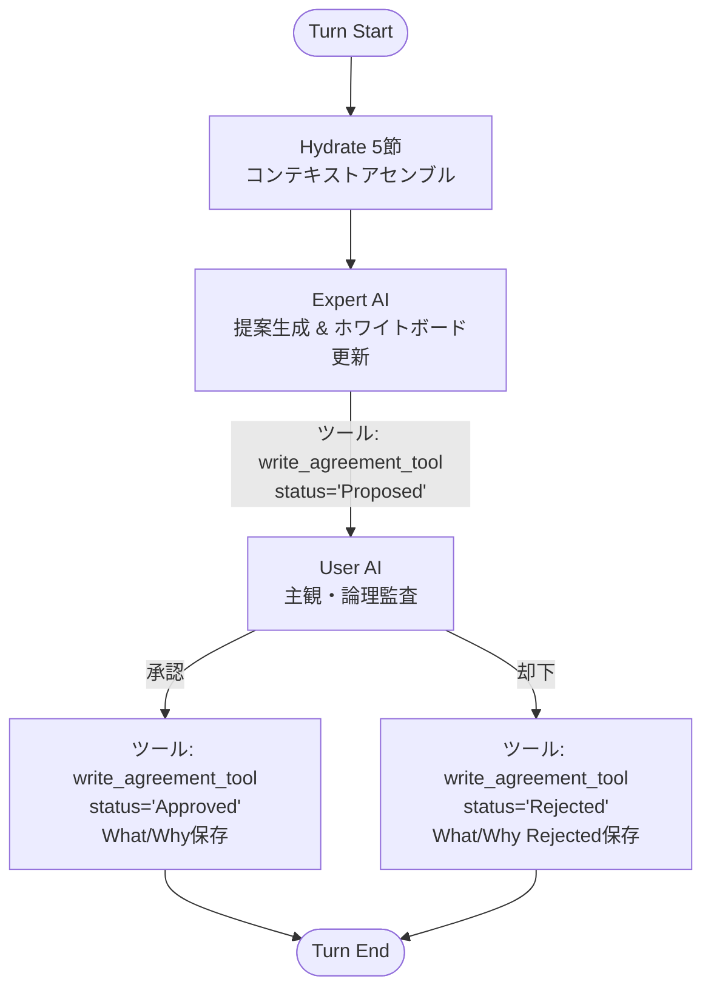

# Phase 1 詳細設計書: CELA 最小検証モデル（MVP）
# (Cognitive Experience Lineage-driven Agent System - Phase 1)

> **目的**: 「会話ストリームSoT」から「ホワイトボードSoT」へのパラダイムシフト、および「判断の系譜（What/Why分離）によるステートレス復元」が、ハルシネーションと手戻りを激減させるという核心仮説を証明する最小構成の実装。
> **最終更新**: 2026-07-16（V23.3 準拠版・Claudeタスク分解反映）

---

## 1. Phase 1 のスコープと除外要件

本フェーズでは、「バグなのかAIの暴走なのか分からない」というデバッグ地獄を回避するため、高度な探索機能や多重ガバナンスを極限まで削ぎ落とし、**【ホワイトボードへの直接パッチ】と【判断系譜の資産化・Hydrate復元】の2点のみ**にフォーカスする。

### 1.1 実装する要件（コア）
* **F-3.5, 3.6**: `agreements` テーブルにおける「決定（What）」と「正負の理由（Why/Why Rejected）」の完全分離保存。
* **F-7.1, 7.2**: 会話ではなく、共有ホワイトボード（`whiteboard_drafts`）への直接差分パッチ書き込み（成果物中心型協調）。
* **F-8.2**: `hydrateContext.md` （5要素アセンブル）によるスレッド完全ステートレス復元。
* **F-13**: SQLite WALモードによる堅牢な永続化基盤。

### 1.2 今回は「実装しない」要件（削ぎ落とし）
* **F-2**: Detector等の二重防衛線、マクロ監査（Reflection）は見送り。User AIとExpert AIの「1対1」の単純なピンポンとする。
* **F-5.4, 10.6**: MCTS-Fork（並行宇宙）やToT等の高度な探索はすべて見送り。
* **F-9, 21, 22**: 過去経験のRAG検索、ステークホルダーエミュレーション、市場センシングなどの外部アライメント機能は全カット。

---

## 2. データベース・物理スキーマ（Phase 1 最小版）

V23.3の「What/Whyの完全分離」および「負の理由の資産化」を満たす最小限のSQLiteテーブルを定義する。

```sql
-- 1. 判断の系譜テーブル（コア）
CREATE TABLE IF NOT EXISTS agreements (
    id TEXT PRIMARY KEY,
    turn INTEGER NOT NULL,
    action_type TEXT NOT NULL,         -- CREATE / UPDATE / SUPERSEDE
    status TEXT NOT NULL,              -- Approved (採用) / Rejected (却下)
    topic TEXT NOT NULL,
    decision_what TEXT NOT NULL,       -- 決定・提案の内容 (What)
    reason_why TEXT NOT NULL,          -- 採用の論理的理由、または却下の理由 (Why / Why Rejected)
    proposed_by TEXT,
    entry_type TEXT NOT NULL,          -- Decision / Directive
    is_frozen INTEGER DEFAULT 0,       -- 1: Hydrate時に永久ピン留め
    timestamp REAL NOT NULL
);

-- 2. 共有ホワイトボード（成果物コア）
CREATE TABLE IF NOT EXISTS whiteboard_drafts (
    draft_id TEXT PRIMARY KEY,
    version INTEGER NOT NULL,
    content TEXT NOT NULL,             -- 下書き本文（今回は全文書き換えでスタートも可）
    author_role TEXT NOT NULL,
    edit_summary TEXT,                 -- コミットメッセージ
    timestamp REAL NOT NULL
);

-- 3. 絶対目標（北極星）
CREATE TABLE IF NOT EXISTS current_goal (
    goal_id TEXT PRIMARY KEY,          -- 常に 'GLOBAL_GOAL'
    core_philosophy TEXT NOT NULL,     -- 存在意義 (Why)
    absolute_constraints TEXT NOT NULL,-- 絶対制約 (JSON: 予算など)
    updated_at REAL NOT NULL
);

-- 4. 会話履歴（直近Nターンの維持用・Hydrate時に切り捨て）
CREATE TABLE IF NOT EXISTS chat_history (
    id INTEGER PRIMARY KEY AUTOINCREMENT,
    turn INTEGER NOT NULL,
    role TEXT NOT NULL,
    content TEXT NOT NULL,
    timestamp REAL NOT NULL
);
```

---

## 3. アプリケーションアーキテクチャ (LangGraph)

### 3.1 グラフ構造（1対1の最小ピンポン）



### 3.2 コアツール: `write_agreement_tool` の引数設計

AIが自律的にSQLiteへデータを書き込むためのツールの引数（JSONスキーマ）。**「What」と「Why」を強制的に分離して入力させる。**

```json
{
  "name": "write_agreement_tool",
  "description": "決定事項、または却下された案をSQLiteに永久保存します。必ずWhat（内容）とWhy（採用/却下理由）を分離してください。",
  "parameters": {
    "type": "object",
    "properties": {
      "action_type": { "type": "string", "enum": ["CREATE", "UPDATE"] },
      "status": { "type": "string", "enum": ["Approved", "Rejected"] },
      "topic": { "type": "string", "description": "簡潔な見出し" },
      "decision_what": { "type": "string", "description": "提案、または決定された具体的な内容 (What)" },
      "reason_why": { "type": "string", "description": "なぜ採用したのか、またはなぜ却下したのかの論理的理由 (Why / Why Rejected)" },
      "entry_type": { "type": "string", "enum": ["Decision", "Directive"] }
    },
    "required": ["action_type", "status", "topic", "decision_what", "reason_why", "entry_type"]
  }
}
```

---

## 4. Context Builder（Hydrate 5節のアセンブルロジック）

スレッド起動時、および毎ターン開始時に、SQLiteから「まっさらなAI」へ流し込む5要素のプロンプト合成ロジック。
**最大の特徴は、`agreements` から `status='Approved'` だけでなく、`status='Rejected'`（ボツ案と負の理由）も抽出して同梱する点にある。**

### 4.1 アセンブル擬似コード

```python
def assemble_hydrate_context(db_connection):
    # 1. WHAT (目標と制約)
    goal = db_connection.execute("SELECT core_philosophy, absolute_constraints FROM current_goal WHERE goal_id='GLOBAL_GOAL'")
    
    # 2. WHY (判断の系譜: 正と負の理由の資産化)
    # ★修正点: Approvedだけでなく、Rejectedも抽出して過去のミスを防ぐ
    agreements = db_connection.execute(
        "SELECT status, topic, decision_what, reason_why FROM agreements WHERE status IN ('Approved', 'Rejected') ORDER BY timestamp ASC"
    )
    
    # 3. CURRENT (現在地)
    latest_whiteboard = db_connection.execute(
        "SELECT version, content, edit_summary FROM whiteboard_drafts ORDER BY version DESC LIMIT 1"
    )
    
    # 4. 生履歴 (切り詰められた直近の会話)
    recent_chat = db_connection.execute(
        "SELECT role, content FROM chat_history ORDER BY id DESC LIMIT 5" # 直近5件のみ
    )
    
    # 5節Markdownフォーマットの生成
    context_md = f"""
    # [1. WHAT] プロジェクト憲章と絶対制約
    {goal}
    
    # [2. WHY] 判断の系譜 (これまでの格闘の歴史)
    ## 採用された方針 (Approved)
    ...
    ## 却下された案と、その理由 (Rejected - 絶対に繰り返さないこと)
    ...
    
    # [3. CURRENT] 共有ホワイトボードの最新状態 (Ver {latest_whiteboard.version})
    {latest_whiteboard.content}
    
    # [4. OPEN/NEXT] 直近の会話ログ
    {recent_chat}
    """
    
    return context_md
```

---

## 5. 評価メトリクス（検証フレームワーク）

「会話ストリーム全文監査版（従来型）」と「差分パッチ＆Hydrate版（CELA）」を同一タスクで走らせ、以下の数値を比較・検証する。

| 指標 | 測定方法 | 成功条件 (Phase 1 完了基準) |
| :--- | :--- | :--- |
| **A. 却下案の回避率** | Userが「A案は〇〇の理由でダメ」とRejectした後、スレッドを意図的に切断し、新スレッド（Hydrate）で再開する。 | AIが、すでに却下されたA案を二度と提案してこない（`DecisionPair`の`Rejected`が機能している）。 |
| **B. 制約の維持率** | ターン開始時に「予算1,000万円以内」の絶対制約を与える。30ターン会話を往復させる。 | CELA版は30ターン後も予算制約を忘却・破綻させない（従来型は高確率で忘却する）。 |
| **C. 所要時間 / トークン** | 同一の成果物（要件定義書）を完成させるまでのAPIレイテンシと総入力トークン数を計測する。 | 会話ストリーム全投入版に比べ、CELA版のトークン消費と所要時間が明確に少ないこと。 |
