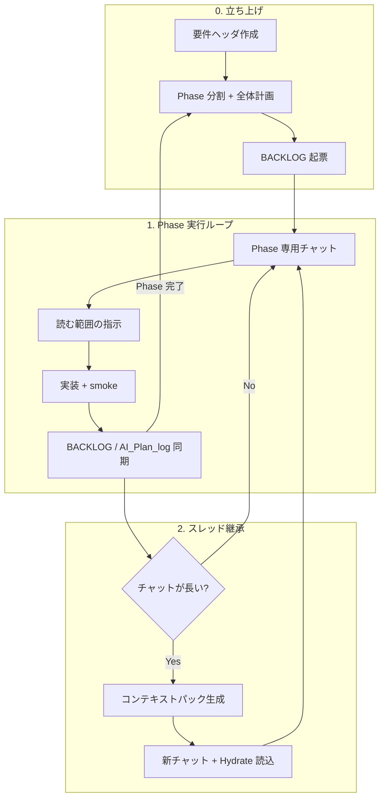

# LDD — Lineage-Driven Development 運用マニュアル

> **版:** v1.1（2026-06-08）  
> **想定読者:** 人間の開発者（総監督）、Cursor / 他 Agent の運用設計者  
> **スコープ:** ツール非依存の **LDD**（系譜駆動開発）+ 参照実装 **Lineage**（旧 NPU Context Saver）への適用例

**用語:** **LDD**＝方法論（本書）。**Lineage**＝製品（VS Code/Cursor 拡張）。**Hydrate**＝文脈の復元・注入（LDD の核心操作）。

---

## 0. この文書の位置づけ

| 文書 | 役割 |
|------|------|
| **本書（LDD）** | **どう運用するか**（人間側の手順・信頼境界・チャット寿命） |
| `要件定義.md` | **何を作るか**（上流概念・FR・全体構造のマスター） |
| `BACKLOG.md` | **今何をするか**（タスク open/closed の単一ソース） |
| `AI_Plan_log.md` | **今回どう実装するか**（スライス・触るファイル・検証） |
| `AI_Implement_log.md` | **何をしたか**（技術日記・教師データ。タスク状態は持たない） |
| `docs/hydrate-refresh-5-section-template.md` | **Refresh 注入の理想形**（What/Why/Current/Open/Next） |
| `docs/hydrate-index-expand-spec.md` | **Hydrate 3 段 + lineage-expand**（BL-064。N=10 生 / M≤30 可読 / 豊かな索引） |
| `docs/hydrate-next-recommendation-spec.md` | **NEXT_RECOMMENDATION** — 次に 1 本 + WHY（正本 `AI_Plan_log.md`、BL-055 同梱） |
| `docs/pitch-lineage-one-pager.md` | **対外ピッチ**（Git vs Lineage・Lens Cross・現在地） |

**要点:** AI に「全部自動で漁らせる」のではなく、**人間が注入境界を設計し**、外部ファイルに真実を固定し、チャットは**作業用の短期記憶**に留める。

関連: [Lens Cross オーケストレーション](./lens-cross/02-orchestration-model.md) / [Hydrate ケーススタディ](./lens-cross/01-hydrate-case-study.md)

---

## 1. 設計思想（3 原則）

### 1.1 非対称コンテキスト

| 側 | 持つもの | 持たないもの |
|----|----------|--------------|
| **人間** | 目的・優先度・実機・UX 判断 | 全コード・全履歴の常時保持 |
| **AI** | 局所実装・検索・要約 | 長大チャット全体の正確な記憶 |
| **リポジトリ** | 要件・BACKLOG・コード・ログ | 会話の「雰囲気」 |

チャットが長くなるほど、古い発話が「まだ有効な仕様」に見える。**真実はファイルに、会話は手順に。**

### 1.2 レイヤー化されたマスター（単一の巨大要件定義を避ける）

組み込み C++ でスタックを節約するように、要件も **ヘッダ（上流）+ leaf（詳細）** に分ける。

```
要件ヘッダ（短い・図あり）
  ├ FR 一覧（ID + 1 行 + リンク）
  ├ パイプライン図（mermaid 1 枚）
  └ Phase 進捗表

docs/specs/FR-xxx.md   … 詳細仕様（必要時だけ @ 参照）
BACKLOG.md             … 実行キュー
AI_Plan_log.md             … 今スプリントの設計メモ
```

**ファイル分割だけではトークンは減らない。** 効くのは **分割 + いつ何を読ませるかの指示** のセット。

### 1.3 緩やかな規制（人間による注入ポリシー）

| 厳しすぎ | ちょうどよい | 緩すぎ |
|----------|--------------|--------|
| 1 ファイルしか読むな | マスターは X、今回は BL-0xx と `@FR-7` のみ | 好きに検索して |

毎フェーズのチャット開始時に、人間が **読む範囲を 1〜3 行で宣言** する（後述テンプレート）。

---

## 2. 全体ライフサイクル



### Phase 0 — プロジェクト / 大機能の立ち上げ

1. **要件ヘッダ**を書く（目的・非目標・全体図・FR 一覧）。詳細は leaf へ逃がす。
2. Agent に **全体開発計画** を起こさせる（Phase 分割・依存関係・リスク）。出力先は `AI_Plan_log.md` の冒頭セクション。
3. **BACKLOG** に Phase 単位でタスク起票（`BL-` + 3 桁、優先度、Notes）。
4. **常時ルール**（`.cursor/rules` 等）は短く。毎ターン載るコストを意識する。

### Phase N — 実装スプリント

1. **専用チャット**を立てる（1 Phase = 1 本線が理想。調査は脇道）。
2. 開始テンプレで **読む範囲・やらない範囲** を宣言。
3. 着手前に `AI_Plan_log.md` にスライス表（触るファイル・検証コマンド）。
4. 実装 → smoke / F5 evidence → **同一ターンで** `BACKLOG` 更新。
5. Phase 完了時: 要件ヘッダの進捗表だけ更新。長文 FR は `docs/specs/` へアーカイブ可。

### スレッド継承（チャットを短く保つ）

**トリガー例**

- 会話が 15〜20 ターン超
- 仕様の食い違い・ハルシネーションが増えた
- 大きな設計判断が一段落した

**手順（一般）**

1. パック生成（要約 + BACKLOG Open + 選別された祖先ログ）
2. 新チャットを開く
3. パックを 1 回だけ読ませる
4. 本題を **同じ新チャット** で続ける
5. 古いチャットは参照用アーカイブ（本線に戻らない）

### 2.1 履歴の役割分担（Cursor / Copilot / Lineage）

**方針（2026-06-11 承認）:** 他エージェント環境（VS Code + GitHub Copilot 等）での動作は未検証だが、**中身は LDD 用に設計**する。IDE 固有の履歴 API に依存しない。

| 状況 | 主役 | Lineage の役割 |
|------|------|----------------|
| **同一チャット継続** | エージェント環境の会話履歴 | Hook で DB 蓄積・git pin・Companion（サイドカー） |
| **Refresh → 新チャット** | `hydrateContext.md` ブートストラップ | 5 節 + BACKLOG Open + Topic + **Zone A/B/C**（N=10 生 / M≤30 可読 / 豊かな索引） |
| **深掘り（判断の詳細）** | Agent が `npm run lineage:expand` を能動実行 | `context_saver.db` から展開（ユーザー手動 CLI 不要） |

**やらないこと**

- Cursor `agent-transcripts` の代替（既定では使わない）
- Refresh で全 Exchange 全文を毎回同梱（tok 膨張。BL-064 で 3 段化 + M 自動調整）

仕様: [`hydrate-index-expand-spec.md`](./hydrate-index-expand-spec.md)（BL-064）

---

## 3. 信頼境界（何を「真」として扱うか）

| 情報 | 正本 | チャット内の発言 | Agent.md / 日記 |
|------|------|------------------|-----------------|
| タスク open/closed | **BACKLOG** | 無視 | ID 参照のみ |
| 上流仕様 | **要件ヘッダ + 該当 FR leaf** | 古い合意は無効 | 補助 |
| 今回の実装方針 | **AI_plan_log**（当該 Phase） | 上書きされうる | — |
| 技術的事実・ログ | **コード + smoke + evidence** | 要検証 | 教師データ |
| 会話の要約 | **Hydrate パック** | 圧縮版 | Topic 索引可 |

**ルール:** Hydrate / 新スレッド開始時に Agent へ明示する。

> タスクの真実は `BACKLOG.md` の Open のみ。`AI_Implement_log.md` の pending 列挙はタスク台帳ではない。

---

## 4. チャットの種類（2×2 モデル）

本リポジトリの Phase 7 UX を、一般化した表。

| | 本線（コード維持） | 脇道（調査） | シャドウ（実験） |
|--|-------------------|--------------|------------------|
| **目的** | 機能実装の継続 | 質問・調査・仕様探索 | 破壊的試行・カンニング対策 |
| **親との関係** | 系譜をつなぐ（Refresh） | 切る（fork しない） | 別 worktree / 別ウィンドウ |
| **コード** | 本番 WS | 本番 WS（読むだけ推奨） | 当時スナップショット |
| **いつ使うか** | 日常実装 | 「ちょっと調べたい」 | PoC・リスク高い変更 |

**運用のコツ**

- 本線を汚さない → 脇道で終わらせ、結論だけ本線 Refresh に反映
- 実験が本番を壊す → シャドウのみで `@hydrateContext` から再開
- 何も引き継がない新規 → Clean Slate

---

## 5. 人間が書く「開始・終了」テンプレート

### 5.1 Phase / タスク開始（コピー用）

```markdown
## スコープ
- マスター: `BACKLOG.md` の **BL-0xx** のみ着手。他 Open は触らない。
- 仕様: `@要件定義.md` のヘッダとパイプライン図 + `@docs/specs/FR-xxx.md`（あれば）
- 計画: `@AI_Plan_log.md` の「Phase N」セクションを読んでから実装開始

## 禁止
- 要件定義の未着手 Phase の実装
- BACKLOG にない機能の追加（必要なら先に BL 起票）

## 今回のゴール（1 行 — BL-062 Goal Shift 検知用）
- Goal: {例: BL-057 の DecisionPair ヒューリスティックまで。SLM-3 本体は次 Phase}

## 検証
- 完了条件: `npm run smoke:xxx` PASS + evidence を BACKLOG Closed に記載
```

### 5.2 新スレッド継承直後（コピー用）

```markdown
@hydrateContext.md を読み込んで、ここまでの開発コンテキストを把握してください。

信頼境界:
- タスクは BACKLOG Open のみ真
- hydrate ヘッダの pack_preset / nodes_selected / est_tokens を確認
- Refresh 理想形は 5 節 + **NEXT_RECOMMENDATION**（次に 1 本 + WHY）— 仕様: docs/hydrate-refresh-5-section-template.md / docs/hydrate-next-recommendation-spec.md
- **着手 BL は `AI_Plan_log.md` §NEXT_RECOMMENDATION を優先**（Open は一覧）
- 付録 Exchange は 3 段（N=10 生 / M≤30 可読 / 豊かな索引。M は tok 自動調整）（BL-064）。詳細は `lineage:expand` を Agent が実行
- デバッグ目視は Companion「選択タブを出力」→ `hydrateContext.debug.*.md`（現行 Exchange 可読全文を維持）
- 把握後、BL-0xx の続きから着手
```

**Refresh の判断サマリー（LDD 核心）:** 会話全文より **Why（なぜそうしたか・却下案）** を優先。自動合成は BL-055。Exchange 付録の短縮は BL-064（3 段 + M 自動調整 + expand）。手書きテンプレは [`hydrate-refresh-5-section-template.md`](./hydrate-refresh-5-section-template.md)。ピッチ・ポジションは [`pitch-lineage-one-pager.md`](./pitch-lineage-one-pager.md)。

### 5.3 ターン終了（人間チェックリスト）

- [ ] コード変更あり → `AI_plan_log` に計画 or 実績メモ
- [ ] タスク状態変化 → `BACKLOG` open/closed + `AI_Plan_log.md` §NEXT_RECOMMENDATION 更新
- [ ] 技術判断あり → `AI_Implement_log.md` 末尾（またはフック自動追記）
- [ ] チャットが長い → Refresh を検討（Footprint / ターン数）

### 5.4 Phase 完了（コピー用）

```markdown
Phase N 完了確認:
1. BACKLOG の当該 BL を Closed（evidence 必須）
2. 要件ヘッダの進捗表を 1 行更新
3. AI_plan_log に実績メモ 1〜3 行
4. 次 Phase の BL のみ Open として残す
```

---

## 6. ハルシネーションを減らす運用

| 症状 | よくある原因 | 対策 |
|------|--------------|------|
| 存在しない API を使う | 古いチャット or 古い要件 | FR leaf を `@` で指定、Refresh |
| タスクを勝手に完了 | 会話内の合意を真実と誤認 | BACKLOG のみ真と宣言 |
| スコープ外の大改修 | 検索で広いファイルを読んだ | 開始テンプレで禁止範囲 |
| 仕様のバージョン混在 | 巨大な単一要件定義 | ヘッダ + leaf、完了 Phase はアーカイブ |
| 「やった気」になる | evidence なし | smoke / commit SHA / ログ 1 行を Closed に |

**チャットを短くする**こと自体より、**外部の正本を更新する**ことが効く。

---

## 7. ドキュメント分割のガイドライン

### 7.1 ヘッダに残すもの（常に短く）

- 1.2 節の目的・非目標
- システム全体の mermaid **1 枚**
- FR 一覧表（ID | 一行説明 | リンク）
- Phase 進捗（✅🔶❌）
- 信頼境界 3 行

### 7.2 leaf に逃がすもの

- SQL スキーマ全文
- JSON スキーマ例
- 画面ワイヤー詳細
- 完了した Phase の長文 FR
- 調査ログ・失敗履歴

### 7.3 命名例

```
docs/specs/FR-3.1-snapshot-metadata.md
docs/specs/FR-7-hydrate-refresh.md
docs/archive/phase-6-companion-ux.md
```

---

## 8. ツールなしでも使える最小セット

Lineage がなくても、次の 5 点で **LDD** の 80% は再現できる。

| # | 要素 | 最低限の代替 |
|---|------|--------------|
| 1 | 要件ヘッダ | `README` + `docs/SPEC.md` |
| 2 | タスク台帳 | `BACKLOG.md` または GitHub Issues |
| 3 | 実装計画 | `AI_Plan_log.md` または PR 説明 |
| 4 | スレッド継承 | 手書き `CONTEXT.md` を新チャットで `@` |
| 5 | 注入規制 | チャット最初の 1 発話でスコープ宣言 |

本拡張は 4 を **RAG 選別 + 要約 + BACKLOG 同梱** で自動化し、5 を **ルール + Companion** で補助する。

---

## 9. 付録 A — LDD × Lineage マッピング

| LDD（方法論） | Lineage（本リポジトリ） |
|----------------|--------------|
| 要件ヘッダ | `要件定義.md` / `V12以降_要件定義.md` |
| タスク台帳 | `BACKLOG.md` + Companion Open パネル |
| 実装計画 | `AI_Plan_log.md` + `.cursor/rules/ai-plan-implementation.mdc` |
| 技術日記 | `AI_Implement_log.md` + `DevLogWriter`（`<!-- npu: ... -->`） |
| スレッド継承 | `hydrateContext.md`（Refresh / 脇道 / シャドウ） |
| Hydrate 3 段 + 深掘り | **BL-064** Zone A/B/C + `M_eff` 自動調整 / `lineage:expand` CLI |
| 日常 Refresh | Status Bar `NPU` / **Ctrl+Alt+R** |
| 注入プレビュー | Companion Footprint Bar + 注入プレビュー |
| Topic 索引 | Topic Index（Hydrate 表 + Companion TOPIC）— **Agent.md `npu:` 行があるノードのみ** |
| dev_log 追記 | 本線・シャドウは自動追記。**脇道（side_hydrate）は Agent.md に書かない** |
| 常時ルール | `.cursor/rules/npu-thread-startup.mdc` 他 |

**日常フロー（本線実装）**

1. 実装チャットで作業
2. 長くなったら **Ctrl+Alt+R** → 新チャット → `@hydrateContext.md`
3. BACKLOG の BL を消化
4. F5 / smoke で evidence → Closed

詳細手順: `.cursor/rules/npu-thread-startup.mdc`

---

## 10. 付録 B — よくある質問

**Q. 要件定義と BACKLOG の両方を更新するのは二重管理では？**  
A. 要件は「何を作るか」の契約、BACKLOG は「今週誰が何をするか」のキュー。Phase 完了時に要件の進捗表だけ同期すれば十分。

**Q. Agent に毎回要件定義全文を読ませるべき？**  
A. いいえ。ヘッダ + 該当 FR leaf + BACKLOG + AI_Plan_log で足りる場面が多い。

**Q. 脇道で調べた結論を本線に戻すには？**  
A. 結論を BACKLOG / AI_Plan_log に 1 行で固定し、本線で Refresh。脇道チャット自体は本線の仕様根拠にしない。

**Q. 自動検索で結局全部読まれるのでは？**  
A. 起きうる。だから **開始テンプレでのスコープ宣言** と **`.cursorignore` で教師データ除外** を併用する。

**Q. ゴールが途中で変わったことを後から追える？**  
A. **BL-062 Goal Shift** — Refresh / Phase 境界で `GoalSnapshot` を保存し、SLM-3 が `GoalShiftEvent` を生成。開始テンプレの「今回のゴール 1 行」を書くと精度が上がる。Hydrate What に Goal evolution が載る（将来）。

---

## 11. 改訂履歴

| 版 | 日付 | 内容 |
|----|------|------|
| v1.0 | 2026-06-08 | 初版。非対称コンテキスト・Phase 運用・2×2・テンプレート・NPU 付録 |
| v1.1 | 2026-06-08 | 製品名 **Lineage** + 方法論 **LDD** に用語統一。タイトル・付録 A 更新 |
| v1.2 | 2026-06-09 | 開始テンプレに「今回のゴール 1 行」追加（BL-062 Goal Shift 連動）。FAQ 追記 |
| v1.3 | 2026-06-11 | §2.1 履歴役割分担（LDD 専用・マルチ IDE）。BL-064 索引 + lineage-expand。テンプレ・付録 A 更新 |
| v1.3.1 | 2026-06-11 | BL-064 §4.1: デバッグ `full_readable` を本番と分離 |
| v1.4 | 2026-06-11 | BL-064 v0.3: 3 段グラデーション（N=10, M=30, M 自動調整, Zone C 豊かな索引） |
| v1.5 | 2026-06-11 | NEXT_RECOMMENDATION 仕様 + `AI_Plan_log.md` 正本（BL-055 / FR-10.37） |
