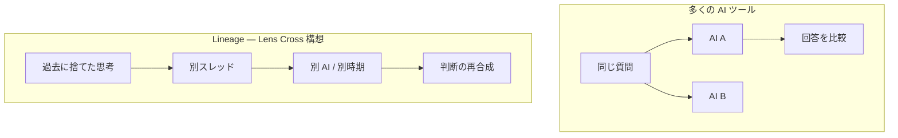

# Lineage — ピッチ 1 枚

> **版:** v1.1（2026-06-11）  
> **用途:** 自己紹介・投資家・転職・コミュニティ投稿（3 分説明想定）  
> **詳細:** [`lineage-product-vision.md`](./lineage-product-vision.md) / `要件定義.md` / [LDD 運用](./Linage-driven-development-operations.md)

---

## 一言

**Lineage は、AI 時代の Git です。**

| | Git | Lineage |
|---|-----|---------|
| **保存するもの** | コードの系譜 | **判断の系譜** |
| **単位** | commit / branch | trigger / COMPASS / evidence / Exchange |
| **再現** | ある時点のツリー | ある時点の「なぜそう決めたか」 |
| **マージ（将来）** | branch merge | 脇道・**Lens Cross** による視点合成 |

---

## 解く問題（原点）

**本当の痛み:** チャット切替は合理的だが、新スレッドは **初めまして** になり **議論の調子（tuning）** が戻らない。ダッシュボードだけでは **次タスク** は戻っても **一緒に考えていた空気** は戻らない。

1. **調子の喪失** → 再説明・再チューニングの認知コスト（System 1 で AI を受けたいのに System 2 で記録しろ）  
2. **チャットが長い** → 忘却・tok・ハルシネーション → 切替を余儀なくされる  
3. **マルチ AI / ツール散在** → 採用・理由・却下案が取れない  

Lineage は会話ログの倉庫ではなく、**次の会話を stranger にしない層** + **あとから説明できる判断の系譜（LDD）** です。

---

## 何が違うか（競合との差）

| 次元 | Linear / Jira / Chat 履歴 | Lineage + LDD |
|------|---------------------------|---------------|
| 単位 | Issue・メッセージ | Issue + **チャット寿命** + **読むファイル集合** |
| 真実 | Issue 本文 | **BACKLOG** + コード + smoke evidence |
| 継承 | 引き継ぎメモ | **Hydrate** + **Exchange / 直近 N 生**（調子） |
| 却下案 | 通常は残らない | **Companion Reason Card** + 将来 **Lens Cross** |

**投資・差別化のフック:** FR-14.3 **Lens Cross** — 並列プロンプトではなく、**系譜を交叉**させる。現時点で同等の第一級機能を持つ SaaS はほぼない。

---

## 製品（今動いているもの）

**Lineage** — VS Code / Cursor 拡張（旧 NPU Context Saver）  
**LDD** — 上記を回す運用方法論（人間が注入境界を設計）

| 機能 | 状態（2026-06-08） |
|------|---------------------|
| チャットフック + ローカル SLM 要約 | ✅ cursor-native / Ollama / **AMD NPU (FLM)** |
| Timeline・Rollback・Mute・スレッド DAG | ✅ |
| **Refresh**（本線・軽量 Hydrate） | ✅ Status Bar / Ctrl+Alt+R |
| 脇道 / シャドウ（2×2 継承） | ✅ Git pin + worktree |
| Footprint・注入プレビュー | ✅ |
| Topic Index・LLM status | ✅ v0.12.0 |
| Exchange 要約 v2 | 🧪 BL-045 smoke PASS・F5 残 |
| **5 節 Hydrate 自動合成** | 📋 BL-055（テンプレ仕様済） |
| Lens Cross 実装 | 📋 FR-14.3（資料・要件のみ） |

**ベータ:** 個人の日常開発で Refresh 運用可能。次は Lineage リブランド（BL-044）と判断サマリー自動化（BL-055）。

---

## ビジネス（方針のみ）

- **一発 SaaS ではなく** AI 協働パラダイム後の **継続需要**（MRR・データ蓄積・信頼）
- **Free:** ローカル索引層（圧縮・RAG・Hydrate・Timeline）
- **Pro / Team:** アーカイブ・監査・Lens Cross・同期（`V12以降_要件定義.md`）
- **初期 BEACHHEAD:** ソフトウェア開発（フック容易）→ 企画・研究へドメインパック

---

## プロダクトラダー（3 段）

| 段 | 製品 | 状態 |
|----|------|------|
| **下（原点）** | **Lineage for AI Chat** — Gemini Web + Self-Healing + Hydrate core | 📋 設計 |
| **中（今）** | **Lineage for Develop** — 本 VS Code/Cursor 拡張 | 🧪 実装中 |
| **上（将来）** | **LDW OS** — AI 協働の入り口・API 中継・横断監査 | 📋 構想 |

詳細: [`lineage-product-vision.md`](./lineage-product-vision.md)

## ロードマップ（短縮）

| 時期 | 焦点 |
|------|------|
| **今（Phase 10）** | 5 節 Hydrate・Segment・Reason Card・リブランド（BL-044） |
| **次** | **Lineage for Gemini**（Chrome + heal サーバー）プロトタイプ |
| **Phase 11** | `.lineage/` Git・task provider |
| **将来** | **LDW OS** / **Lens Cross** |

---

## デモの流れ（3 分）

1. **問題:** 長い Agent チャット → 仕様がチャットとコードでズレる  
2. **Hook:** ターンごとにローカル要約 → Timeline に判断が積み上がる  
3. **Refresh:** Ctrl+Alt+R → 新チャット → `@hydrateContext.md` → BACKLOG Open だけが真  
4. **差:** Git で `git log`、Lineage で **「なぜその設計か」** が辿れる（将来 Lens Cross で却下案も）

---

## 正直な限界（信頼のため）

- **調子** は直近 N 生 + Exchange に依存 — 要約だけでは不足
- **監査 / 却下案** は Companion + ユーザーメモ習慣に依存
- **Lens Cross** は構想・要件段階（ピッチの核、実装はこれから）
- Cursor **Agent Read 横取り** は API 制約（シャドウ worktree で緩和）
- チーム版・同期は Phase 11 以降

---

## リンク

| 文書 | 内容 |
|------|------|
| [プロダクトビジョン](./lineage-product-vision.md) | 3 段ラダー・原点・Self-Healing |
| [GitHub README 草案](./github_readme.md) | 英語・公開用 |
| [5 節 Hydrate テンプレ](./hydrate-refresh-5-section-template.md) | What/Why/Current/Open/Next |
| [LDD 運用マニュアル](./Linage-driven-development-operations.md) | 人間側の手順 |
| [Lens Cross](./lens-cross/README.md) | 交叉オーケストレーション |
| `BACKLOG.md` | 実行キュー（単一ソース） |

**リポジトリ:** `NPU-Context-Saver`（表示名移行中 → **Lineage**）
