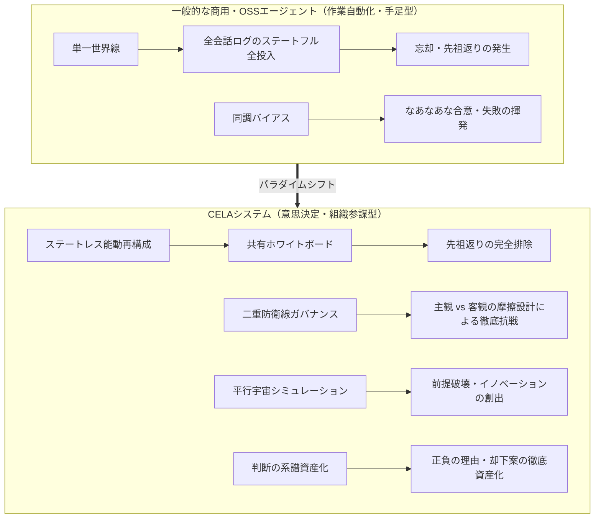
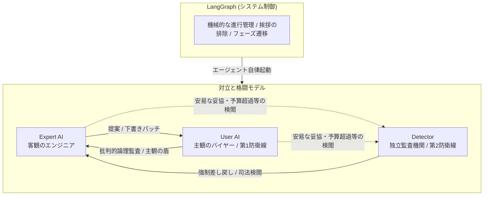
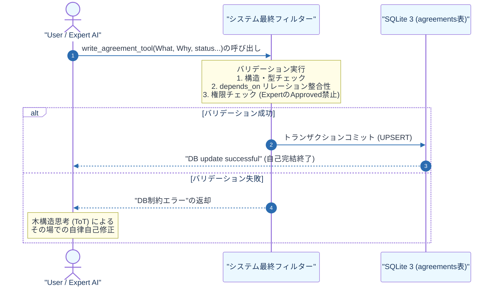
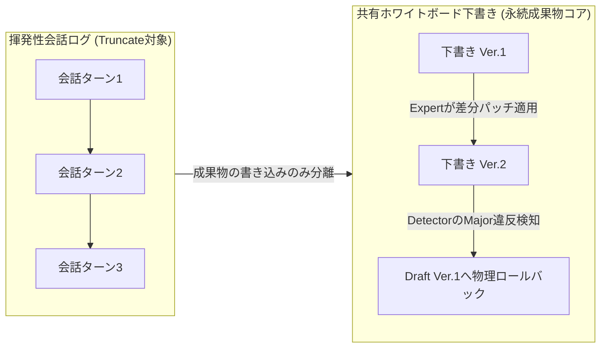
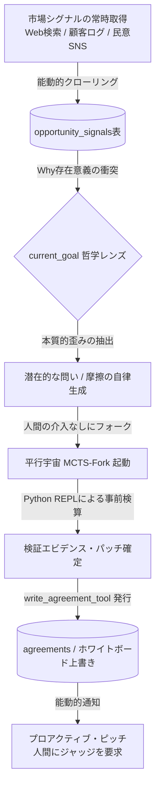
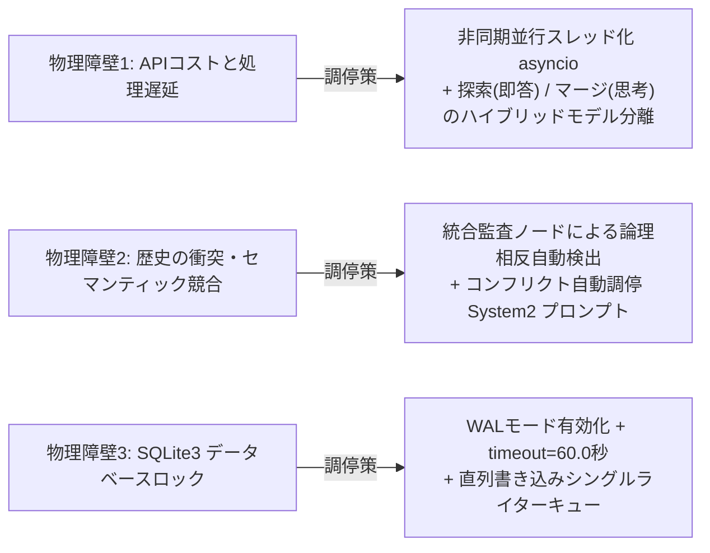

# 要件定義書: CELA — 認知型経験系譜駆動マルチエージェントシステム
# (Cognitive Experience Lineage-driven Agent System)

> **作成方法**: ソースコード `linage_orcha_aiai_4pat_agent_state_change10.py` (ver.10) のリバースエンジニアリング、および「Lineage (旧NPU Context Saver) 構想における『判断の系譜』・正負の理由の資産化・Hydrate 5節フォーマット」の完全統合設計
> **最終更新**: 2026-07-16（バージョン23.0・判断の系譜（Lineage）/ 正負理由の徹底資産化 統合決定版）

---

## 1. システム概要

| 項目 | 内容 |
| :--- | :--- |
| **システム名** | CELA — 認知型経験系譜駆動マルチエージェントシステム (Cognitive Experience Lineage-driven Agent) |
| **目的** | 複雑な利害と物理制約が衝突する意思決定において、「何を決めたか（What）」だけでなく**「なぜ決めたか（正の理由：採用・成功）」と「なぜ他を却下したか（負の理由：不採用・否決・失敗）」の『判断の系譜（Decision Lineage）』を永続的な資産として蓄積**し、ハルシネーションなき要件定義と自律型先回り提案（プロアクティブピッチ）を実現する知能OS。 |
| **方式** | LangGraph ステートマシン + 階層型モデル制御 + 3レイヤー外部メモリ（SQLite 3による物理永続化 / 共有ホワイトボード / RAG対応 Lessons Learned DB） + 各世界線の動的マルチブランチ・オーケストレーション |
| **実行モード** | **ステートレス・アクティブ再構成モード（唯一の標準動作モード）** |

---

### 1.1 「コードの系譜」から「判断の系譜（Lineage）」へのパラダイムシフト

本システム「CELA」は、2026年現在の主要な商用・OSS自律型AIエージェントツール（Claude Code、OpenAI Operator/Codex、Cursor、CrewAI、AutoGPT等）と比較して、根本的に異なるパラダイム（立ち位置）に設計されている。

既存ツールが「作業を自動化する高性能な手足（シングルタスク実行機）」として、Gitを用いて「結果（コード）」の系譜を管理するツールであるならば、CELAは**「なぜその結果に至ったのか、そしてなぜ他の選択肢を棄却したのか」という『理由（Why）』の系譜を管理するOS**である。
正の理由（成功・採用）と、ボツになった負の理由（失敗・不採用）を構造化して保存・相互追跡可能にすることで、AIは人間と同等、あるいはそれ以上の「組織的記憶と説明責任」を獲得する。



| 比較軸 | 一般的な商用・OSSエージェント<br>(Claude Code, OpenAI Operator, Cursor等) | CELA<br>(認知型経験系譜駆動システム) |
| :--- | :--- | :--- |
| **主たる設計思想** | **作業自動化（Automation）**<br>人間から与えられたコード生成やWeb操作、リサーチのタスクを高速に代行する。 | **意思決定ガバナンス（Governance）**<br>複雑な物理制約（予算・納期等）と人間的価値観が衝突する中で、超合理的な要件定義書を自律編纂する。 |
| **協調モデル** | **会話・スレッド維持型（Conversational）**<br>単一のメッセージ履歴（スレッド）の保持期間を最大化することに注力し、チャットログの時系列（文脈の流れ）に依存して成果物の整合性を維持しようとする。コンテキストの肥大化によりスレッドを破棄せざるを得なくなった際、文脈が断絶するため、ユーザーが「これまでの議論の経緯」や「過去にボツになった代替案の理由」を新スレッドへ再プロンプトとして手動入力する初期化コスト（文脈の断絶）を伴う。 | **成果物中心型（Artifact-Centric）**<br>会話は成果物を書き換えるための「使い捨ての道具（パッチ生成手段）」と定義する。全エージェントが中央の「共有ホワイトボード（下書き）」を囲み、差分パッチ（F-7）のみを上書き適用して制御する。成果物（ホワイトボード）と意思決定の系譜はSQLite（外部State）に明示的に分離して外在化されているため、スレッドをいつでも破棄・新規移行でき、再起動後も最新のホワイトボードと系譜から瞬時に前ターンの文脈を復元して議論を再開できる。|
| **コンテキスト管理** | **履歴依存・延命管理（消極的トリミング）**<br>対話ストリーム（messages 配列）を SoT（信頼できる唯一の情報源）とし、裏でウインドウのスライドや要約を行ってコンテキストを維持する。これは「長大な履歴からの情報の削り落とし（引き算）」であるため、ターン数が累積すると「初期に確定した大前提」や「却下済みの仕様」のグラデーションが薄まり、先祖返りやハルシネーションが発生しやすくなる。 | **ステートレス能動再構成（F-8）**<br>エージェントは毎ターン完全にステートレスな状態で起動される。メッセージ履歴は直近数件に絞り込み、毎ターンSQLiteからクエリした「Goal（目的）」、「DecisionPair（正負の決定系譜）」、および現在の「Whiteboard（成果物の最新下書き）」から、最適化されたコンテキストを都度能動的に合成（Hydrate）する。これにより、常にモデルの最高解像度の推論性能を維持する。 |
| **同調バイアスの制御** | **同調（なあなあ）の発生**<br>エージェント同士が安易に相手の意見を肯定・妥協し、中庸で凡庸な設計に落ち着きやすい。 | **二重防衛線ガバナンス（F-2.1）**<br>User AIの主観的・論理的徹底抗戦 ＋ Detectorの第3者司法検閲により、健全な摩擦を起こす。 |
| **膠着（デッドロック）** | **フリーズ、または諦め**<br>予算制約などの矛盾に直面した際、無限ループに陥るか「解決不能」とエラーを出してハングアップする。 | **マルチブランチ並行世界シミュレーション（F-10.6）**<br>そもそも論に視座を引き上げ、複数の世界線ブランチをフォークさせて同時並行探索する。 |
| **経験の永続性** | **セッション限りの揮発性**<br>一度セッションを閉じると、過去に犯した手痛い失敗や技術的罠の教訓を綺麗さっぱり忘却する。 | **経験のDNA伝承（Lessons Learned: F-9）**<br>過去のプロジェクトでの「状況・手段・失敗・教訓」をSQLiteに蓄積。次回起動時にRAGで事前インジェクションする。 |

---

## 2. 機能要件

### F-1: マルチエージェント議論管理
本システムでは、議論の「進行管理」および「合意事項の外部抽出ノード」を完全に排除する。進行はLangGraphが機械的に制御し、合意事項はエージェント自身が思考プロセスの一環として自律的にデータベースへ直接書き込む。



| ID | 要件 | 説明 |
| :--- | :--- | :--- |
| F-1.1 | タスクプランニング | 絶対目標（Goal）を複数の独立した「フェーズ」に分解する。各フェーズは3次元属性（抽象度・スコープ・時間軸）を持つ。 |
| F-1.2 | オーケストレーション | SQLiteの `agreements`（合意DB）の最新状態に基づき、現在のタスクに最も適したエキスパートを自動選択する。 |
| F-1.3 | エキスパート実行 | 選択されたエキスパートがタスクを遂行。自律DB書き込みツール（F-3.1）を駆使し、ホワイトボードおよび合意DBを直接更新する。 |
| F-1.4 | **ユーザーAI（発注者）発話生成の再定義（批判的承認者）** | **【責務の完全刷新】** 進行管理や挨拶などの余計な発話を一切禁止し、**「主観物価値観（こだわり・政治・人間的都合）」の注入**と、「冷徹な批判的論理監査（論理破綻・計算ミス・都合の良い前提の看破）」に特化させる。<br><br>**【批判的読解・検閲ルール】** User AIは「承認（Approve）権限を持つ絶対的なゲートキーパー」として、Expert AIの提示したホワイトボード（下書き）に対し、以下の2軸で厳格に突っ込み（批判）を加え、容易にApproveしてはならない：<br>1. **主観的・感情的検閲**: 「例：このシステムフローは、スマホを持たない高齢者住民を無視した独りよがりな設計になっていないか？」<br>2. **客観的・批判的論理監査**: 「例：このシミュレーションの計算結果は、前提条件である年間維持費3,000万円上限と本当に矛盾していないか？ 適当な数字でごまかしていないか？」 |
| F-1.5 | ターン制御と延長 | 最大 30 ターン（可変）の制約内で動作。QA（Reviewer）差し戻し時に 5 ターン自動延長（最大 3 回まで）。 |

---

### F-2: 監査・品質保証（ガバナンスと二重防衛線）
ハルシネーション（嘘）や議論の迷走、計算ミスを自律検知して制御する。

| ID | 要件 | 説明 |
| :--- | :--- | :--- |
| F-2.1 | **Detector（独立監査）と二重防衛線構造** | **【二重防衛線（Defense in Depth）の確立】**<br>・**第1防衛線 (User AIによる能動的検閲)**: 交渉の当事者として、主観の歪みや都合の良い前提条件を看破。不承認（Reject）または条件付き承認（Approved with Conditions）を突き返す。<br>・**第2防衛線 (Detectorによる客観的監査)**: 独立した第3者（司法）として、両者が妥協したり見落とした「倫理・安全リスク」および「物理上限（予算のtotal_cap超過）」を、会話履歴から直接検知して強制的に差し戻す。 |
| F-2.2 | Reflection（内省監査） | 3ターンごとにマクロなゴール監査を実行。議論の「収束（completed）」「停滞（stagnant）」「進行中」を判定。 |
| F-2.3 | Reviewer（QA審査） | 最終成果物を絶対目標と照合し、網羅性・検証データ（具体的な数値・根拠）の有無を厳格に審査。不合格時はリテイク。 |
| F-2.4 | Integrator（統合監査） | 各タスクの成果物を物理結合し、フェーズ間・タスク間の論理的・数値的な横断矛盾を自動チェック。 |
| F-2.5 | Resource Arbiter（資源調停） | グローバル制約（予算等のtotal_cap）の超過を自動計算し、フェーズ間の再配分案を提示。 |

---

### F-3: 自律的合意・決定管理と「判断の系譜」の資産化（★大幅拡張）
外部の独立した書記ノードによる「抽出」を完全撤廃し、エージェント自身にDB/ファイル操作の手足（ツール）を与える。同時に、意思決定のWhat/Whyを完全分離し資産化する。



| ID | 要件 | 説明 |
| :--- | :--- | :--- |
| F-3.1 | **自律的DB書き込み（Tool Calling）の内包** | **【抽出ノードの撤廃】** User AIおよびExpert AIに対し、合意（Decision）、指示（Directive）、成果物（Deliverable）をSQLiteへ直接書き込むための専用ツール（`write_agreement_tool`）を装備させる。 AIは自問自答の末に確定した結論を、第三者のパースを介さず、**自らの意志で直接データベースにインジェクション（UPSERT）**する。 |
| F-3.2 | **システム最終フィルター（ガードレール）** | **【バリデーション・インターセプター】** AIがツールを叩いてSQLiteにデータを書き込もうとした瞬間、システム（LangGraphのラップロジック）が「最終フィルター」として割り込み、以下の機械的バリデーションを実行する：<br>1. **構造チェック**: 3次元属性、proposed_by、entry_type などの必須フィールドの有無。<br>2. **リレーション整合性**: depends_on に指定された過去の合意IDが実際にDB内に実在するかの整合性。<br>エラーが検知された場合、SQLiteへのコミットを拒否し、AIへ「DB制約エラー」として即時通知してその場で自己修正（ToT）を強いる。 |
| F-3.3 | ファイル上書き保護と引き継ぎ | Deliverable（成果物）の更新時、AIから新しい本文の提示がない、あるいは短い要約のみが出力された場合、最終フィルターが自動的に既存のファイルパス（FILE_PATH:）を検出してロックし、次バージョンへ物理パスを安全に引き継ぐ。 |
| F-3.4 | 成果物ファイルの自律生成 | AIが `entry_type="Deliverable"` としてツールを発行した際、最終フィルターは本文を `log/deliverables/` 配下にMarkdownファイルとして自動物理保存し、生成されたファイルパスをSQLiteの `content` フィールドに格納する。 |
| F-3.5 | **DecisionPair と AI Reason の完全分離（★V23新規）** | AIが合意DBにデータを書き込む際、`hypothesis_decision` の記述を**「決定内容（Decision_What: What）」**と**「採用の理由（Reason_Why: Why）」**に物理カラムレベルで厳格に分離する。単なる直感的出力や結果の書き下しを許さず、論理的な背後関係・選択因子の説明責任を強制記録する。 |
| F-3.6 | **「負の理由（Rejected）」の徹底資産化（★V23新規）** | 提案や世界線がUser AI（またはDetector）によって却下（Reject）された場合、単にエラーメッセージとして流すのではない。**「提案内容（What）」と「却下された理由（Why Rejected）」をセット（DecisionPair）としてSQLiteの `agreements` 表に status="Rejected" で永久保存する**。これにより、「過去のボツ案とその否決理由」が未来の同じミスの再発や無駄な手戻りを防ぐ強力なアクティブ知財となる。 |

---

### F-4: 異常系ハンドリング

| ID | 要件 | 説明 |
| :--- | :--- | :--- |
| F-4.1 | 差し戻しリトライ | User/Expertが「major（制約矛盾）」判定を受けた場合、直近のNG発言を履歴（およびSQLiteメッセージテーブル）からポップし、3回までリトライを許可。 |
| F-4.2 | 割り込み強制停止 | highリスク（倫理違反）検知時は即時にHalt（強制停止）。QA差し戻しおよびファシリテーションが3回超過時も停止。 |
| F-4.3 | APIリトライ | 接続失敗や高負荷エラー発生時、指数バックオフ（[8, 16, 32, 64, 128]秒）を用いて最大5回自動リトライ。 |

---

### F-5: 認知アーキテクチャとハイブリッド探索

| ID | 要件 | 説明 |
| :--- | :--- | :--- |
| F-5.1 | リアルタイムツールグラウンディング | エキスパートノード（手足・即答型）が、実データ取得用の「Web検索」および、厳密な数値シミュレーション用の「Python REPL」を実行できるようにする。 |
| F-5.2 | 思考モードの動的ルーティング | 全ノードで一律に思考モデルを使用するのを避け、以下のように役割分担を行う。<br>・**司令塔・監査役**（PM, Detector, Reflection, Reviewer）: 「思考モード（o1, DeepSeek-R1等）」を使用。<br>・**実行部隊**（Expertロール）: 「即答モード（GPT-4o, deepseek-v4-flash等）」を使用。 |
| F-5.3 | 経験の構造化保存 | 議論の失敗が発生した際、`[状況] ➔ [とった手段] ➔ [結果] ➔ [教訓]` の形式で「経験のグラフ構造（JSON）」に変換し、外部の `lessons_learned` テーブルに蓄積する。 |
| F-5.4 | セマンティックMCTSとToTのハイブリッド探索 | ・**ミクロ（ToT型ローカル探索）**: 1つのフェーズ内では、直近の「分かれ目」に戻ってやり直すToT（DFS）を適用（`retry_count`による差し戻し）。<br>・**マクロ（MCTS型グローバルワープ）**: 議論の膠着（`deadlock_counter >= 3`）が発生した際、SQLiteから過去の失敗の原因（失敗のDNA）を抽出し、類似した「失敗パターンの回避策（アナロジー）」を動的にコンテキストに補間。視野の広い代替手段を創出する。 |

---

## 2.1 高度意思決定＆認知制御システム要件

### F-6: SQLite 3 完全永続化とステートレス・アクティブ再構成

CELAシステムは、コンテキスト・トークンの爆発的増加や「却下された古いアイデアのゾンビ化（仕様の先祖返り）」を防ぐため、従来の生ログ全蓄積型（ステートフル動作）を完全に排除する。
代わりに、**「SQLite永続化に基づくステートレス・アクティブ再構成（5要素アセンブル）」を唯一の標準動作**とし、データの堅牢性と超高密度なコンテキスト制御を両立させる。

| ID | 要件 | 説明 |
| :--- | :--- | :--- |
| F-6.1 | スキーマ自動生成 | システム起動時、指定のSQLiteデータベースファイル（`lineage_orchestrator.db`）に自動接続し、全物理テーブル（後述）が存在しない場合はDDLを実行して自動生成する。 |
| F-6.2 | トランザクション制御 | LangGraphの各ノードが実行・完了するたびに、インメモリ状態の差分をSQLiteの対応テーブルに即時UPSERTし、トランザクションを明示的にコミットする。 |
| F-6.3 | ステートレス・ブートストラップ | メッセージ履歴の切り詰め（Truncate）が行われた際、SQLiteの `agreements` 表から「確定合意されたデータ（Approved）」のみを抽出・アセンブルし、完全にクリーンで知的な状態からコンテキストを自律的に復元する。 |

---

### F-7: 共有ホワイトボード（下書き）パターン



| ID | 要件 | 説明 |
| :--- | :--- | :--- |
| F-7.1 | 下書き（たたき台）の分離 | 会話ログとは完全に切り離された、現在作成中の成果物そのものの物理テキスト（Markdown形式）を `whiteboard_drafts` テーブルにバージョン管理付きで保存する。 |
| F-7.2 | 差分パッチ（セクション）修正 | エキスパートAI（Expert）は、一から成果物全文を書き直すのではなく、現在のホワイトボードのテキストから「ユーザーに指示されたセクション（章・行）」のみを特定して差分書き込みを行う。 |
| F-7.3 | バージョン管理とロールバック | 単発監査（Detector）により、新しく更新された下書き（例: Ver.4）にmajor判定（制約違反）が出された場合、Ver.4の下書きをSQLite上から破棄し、前バージョン（Ver.3の正常な状態）へホワイトボードの状態を即座にロールバックする。 |

---

### F-8: Hydrate Refresh 5節に基づくコンテキスト能動再構成（★完全刷新）

AIのコンテキスト忘却と「会話の調子（チューニング）」の喪失を防ぐため、Lineageメソッドに基づく厳格な5節構造でプロンプトを能動的に再構成（アセンブル）する。

| ID | 要件 | 説明 |
| :--- | :--- | :--- |
| F-8.1 | 非対称メモリ圧縮 | 会話履歴を切り詰める際、以下の非対称パースを行いアセンブルする。<br>・**User（問い）**: 生のニュアンスやこだわりを100%保持するため、一切要約せず**生データ（Raw Message）**として結合する。<br>・**AI（応答）**: 前置きや冗長表現を削ぎ落とすため、意思決定の要点のみを箇条書き等に**高度要約（Summarized Message）**して結合する。<br>・**注記**: 圧縮・結合時に、HTMLやMarkdown外注コメントタグ（`<comment-tag>`）で囲まれた履歴や非ファクトデータはノイズとして判定し、コンテキスト圧縮の対象から自動排除する。 |
| F-8.2 | **Hydrate Refresh 5節プロトコル（★V23完全刷新）** | コンテキスト再起動（アセンブル）時、以下の5つの独立した要素をSQLiteからクエリして抽出し、単一のシステムプロンプトとして統合してモデルに渡す。<br>1. **What (製品憲章)**: 絶対目標・存在意義・現在のフェーズと予算・リソース等の絶対物理制約。<br>2. **Why (判断系譜：正負の理由)**: 確定した設計方針（Approved：正の理由）に加え、**過去に却下された案と「なぜ却下したか」（Rejected：負の理由・Why Rejected）**をDecisionPairから直接抽出・同梱する。これによって同じ議論のループを物理的に回避する。<br>3. **Current (現在地)**: 共有ホワイトボード（たたき台）の最新バージョンと、現在適用されている最新のパッチ状態。<br>4. **NEXT_RECOMMENDATION (自律1手・先回りピッチ)**: システム（SLM-3等）が自律推論した「次にやるべき1手とその論理的理由」。<br>5. **Open / Next (未解決課題と生履歴)**: 現状の未解決タスク（Pending Actions）と、直近の生会話（Raw Message, 直近N件は生ログ、それより古いものは要約）のセット。 |
| F-8.3 | **Freeze（神ノードピン）機能（★V23新規）** | 泥臭い政治的妥協、ステークホルダーが激怒する「地雷条件」、あるいは絶対に覆してはならない「神の決定」に対し、人間またはシステムが `is_frozen=1` フラグ（📌）を立てる。Freezeされたノードは履歴切り詰めの対象から完全に除外され、Hydrate 5節の「Why」に永久にピン留めされて引き継がれ続ける。 |

---

### F-9: 類似経験（Lessons Learned）のRAG（Retrieval-Augmented Generation）検索

| ID | 要件 | 説明 |
| :--- | :--- | :--- |
| F-9.1 | sqlite-vec拡張によるSQLネイティブ・ハイブリッド検索 | SQLite3の公式ベクトル検索拡張モジュールである sqlite-vec をロードし、標準SQL内でメタデータフィルタとベクトル類似度計算を同時に実行する。


例: SELECT lesson_id FROM lessons_learned WHERE category = 'BUDGET' ORDER BY vec_distance_cosine(vector_embedding, ?) LIMIT 3;


これにより、Python側への不要なデータ転送（全件ロード）を避け、高速なPre-filtering型のRAGを実現する。 |
| F-9.2 | 失敗の事前枝刈り（Pruning） |RAGによって引き当てられた過去の失敗教訓を、新しく進もうとしているルートの「事前禁止制約」としてエージェントの思考コンテキストに注入し、同じ轍を踏むのを未然に防ぐ。 |

---

### F-10: カーネマンの知見に基づく「脱バイアス」＆「平行宇宙シミュレーション」制御

| ID | 要件 | 説明 |
| :--- | :--- | :--- |
| F-10.1 | システム1とシステム2の制御 | ・**システム1**: 即答モデル（GPT-4o等）を用いて素早く具体的な成果物（ホワイトボード）を埋める。<br>・**システム2**: 思考モデル（o1等）を用いて論理的整合性を厳格に監査・査読する。 |
| F-10.2 | 確証バイアスとアンカリングの検知および「悪魔の代弁者」の強制起動 | 議論がわずか数ターンで収束に傾き、代替案の検討履歴が合意DBにない状態、あるいは初期提示の数値に強く固執している状態を検出した瞬間、通常遷移を遮断し、「悪魔の代弁者」を起動。逆方向の代替アプローチの提案を強制する。 |
| F-10.3 | フレーミング効果と損失回避の克服 | 停滞時、ファシリテーターが「この制約下でイノベーションを起こさなかった場合に生じる機会損失」という逆のフレーミングにプロンプトを書き換え、エージェントに大胆な決断を促す。 |
| F-10.4 | UCB探索パラメーターの動的ブースト | 議論の評価スコアが横ばいのまま規定ターン数進んだ場合、MCTSにおける「探索係数（$C$値）」の値をプログラム側で強制的に3〜5倍にブーストし、未知の領域の探索を強制する。 |
| F-10.5 | 前提破壊挑戦（Assumptions Disruption）の受容とLineage検証 | 過去に承認された意思決定や大前提を覆す「突飛な提案（ちゃぶ台返し）」が出された場合、システムはこれをエラーとして弾きださず、「前提破壊挑戦」として受容する。挑戦者に対し定量的根拠や代替ロジックの提示を要求し、監査役が承認した場合はLineageを書き換える。 |
| F-10.6 | ゴール抽象化に伴う「多分岐ブランチ並行探索（MCTS-Fork）」 | 議論がどうしても制約条件と衝突してデッドロックに陥った際、ファシリテーターが介入して上位目的（Why）まで「抽象度のエスカレーション」を実行し、代替アプローチを示す複数のブランチ（世界線：並行宇宙）を動的にフォークさせて別スレッドで並行探索させる。 |
| F-10.7 | **マルチブランチの統合評価と「負の歴史」の保存（★V23拡張）** | 並行して走らせた各ブランチの検証結果に対し、統合監査役およびReviewerが「MCTSスコア」と「意思決定の系譜」を横断評価する。最も優秀なブランチを「マスター・ホワイトボード」へマージする。この際、**不採用となったブランチ（敗れた平行宇宙）は破棄せず、「却下された代替案（Rejected）」と「なぜマスターに勝てなかったかの理由・計算結果（Why Rejected）」としてDecisionPair化し、`agreements` 表へ徹底的に負の資産として永続保存する。** |

---

### F-21: ステークホルダー主観エミュレーション（人間の領分との接着）

User AIが「単なる進行役」から「主観的バリュー・オーナー」へ刷新されたことに伴い、人間の泥臭い主観（わがまま・政治・感情・利害・民意）をシステム的にサンプリング・注入し、エミュレートするための構造化要件を定義する。

| ID | 要件 | 説明 |
| :--- | :--- | :--- |
| F-21.1 | ステークホルダー・プロファイリングDBの構築 | インプットとして、プロジェクトに関わる主要な利害関係者のペルソナデータを構造化（JSON）し、SQLite内の `stakeholder_profiles` テーブルに格納する。これには「譲れない一線（絶対死守制約）」、「潜在的懸念（心理的抵抗）」、「政治的力関係（発言権重み）」を定義する。これにより、人間は「サンプリングデータの初期投入」に徹することができる。 |
| F-21.2 | 動的主観合成（バリュー・エンベディッド・プロンプティング） | User AIは、固定された単一のプロンプトで動くのではなく、議論のトピック（例: 予算配分、運行ルート、UX設計）に応じて、関連するステークホルダーのプロファイルをSQLiteから動的にクエリし、それらの声をブレンドした「複合的な主観（フィルター）」を脳内に動的合成（アセンブル）してExpert AIに批判をぶつける。 |
| F-21.3 | 認知葛藤（Cognitive Dissonance）による能動的エスカレーション | AI同士の議論（主観 vs 客観）が完全に平行線をたどり、MCTSにおける各ブランチの期待値（Q値）がすべて閾値を下回る「政治的・物理的デッドロック」に陥った場合、システムは議論を強制一時停止する。AIが自律解決できない「究極の政治的・価値観的決断」のみをピンポイントで抽出し、人間のプロジェクトオーナーへ「能動的エスカレーション（SOS）」を行うHuman-in-the-Loop機構を確立する。 |

---

### F-22: 哲学・市場のメタ能動アライメント（自律問い立て＆先回りピッチ）

人間からお題（プロンプト）を与えられるのを受動的に待つリアクティブな設計を完全に破壊し、自らのミッション（哲学：Why）を軸に市場データ（需要：What/Who）を能動的にセンシング・屈折させ、まだ誰も気づいていない潜在課題に対する解決策（下書きパッチ）を自律的に編纂・先回り提案（プロアクティブ・ピッチ）する。



| ID | 要件 | 説明 |
| :--- | :--- | :--- |
| F-22.1 | 常時環境センシングと機会発掘（OpportunityScout） | Expertロール群に常駐監視用サブクラスとして `OpportunityScout` を配備する。Web検索（Tavily等）、顧客の動的行動データ、競合他社のリリース情報をクローリングし、SQLiteの `opportunity_signals` 表へ物理ログ蓄積する。 |
| F-22.2 | 哲学・市場のメタ能動アライメント（Philosophy-Market Alignment） | センシングされた外環境データを、単にブームとして処理せず、SQLiteの `current_goal`（Why: 哲学・存在意義）と衝突させアライメントを実行する。 表面的な顕在需要（例:「バスを増便せよ」）を哲学レンズで能動屈折させ、「彼らが本質的に解決したいのは『移動』ではなく、集まる場所の喪失に伴う『孤独』という歪み（摩擦）である」というメタ認知「潜在的問い」を自律生成する。 |
| F-22.3 | プロアクティブ・ピッチ（先回り下書き自動編纂） | 抽出された潜在的問いに対して、人間の介入なしにバックグラウンドでMCTS-Fork（F-10.6）をフォーク起動。Python REPLによるコスト・生存シミュレーションを事前実行し、検証エビデンスを確保した段階で、**自ら `write_agreement_tool` を発行してホワイトボード（たたき台）を次バージョンに上書きコミットする。** 人間（FDE等）に対して、「最新の市場環境から潜在課題を発見し、検証した結果をV23.0の下書きとして先回り反映しました。ジャッジをお願いします」と能動的提案を通知するピッチループを完成させる。 |
| F-22.4 | **GoalShiftEvent（ゴール変容監査）（★V23新規）** | MCTS-Forkの先回りシミュレーションや、物理的な壁（予算上限突破等）に激突して当初の目標（Goal）がピボット（変容）した際、「なぜゴールを変えたのか」「どの情報（Evidence）からそのピボットを正しいと判断したか（Why Shifted）」をGoalShiftEventとしてSQLiteに永久保存し、将来の監査・説明責任（アカウンタビリティ）を担保する。 |

---

## 2.2 実装時における現実的制約と技術的考慮事項

本システムは、高度な認知制御と並行シミュレーションを行う仕様上、実際のプログラム実装時に深刻な技術的・物理的ボトルネックが発生しやすい。これらを未然に防ぐため、以下の防御設計および調停ロジックの実装を義務付ける。



| ID | 要件 | 説明 |
| :--- | :--- | :--- |
| **F-11** | **APIコストおよびレイテンシ（実行遅延）の抑制とモデル分離の最適化** | **【設計対策】** 1. **非同期並行スレッド化**: Pythonの `asyncio` または `ThreadPoolExecutor` を用い、フォークした子グラフの探索を同時並行で処理させ、待機時間を1スレッド実行時間分に短縮する。 2. **探索・マージ時におけるハイブリッドモデル戦略**: 各並行世界の探索は、安価で高速な「即答モデル」を割り当て、最終決定（マージ・採用判定）を行う瞬間のみ「重量思考モデル」にスイッチして熟考させる。 |
| **F-12** | **マルチブランチ合流時における「セマンティック・マージコンフリクト（論理競合）」の自動調停** | **【設計対策】** 1. **コンフリクト自動検出**: 統合監査ノードは、マージ対象テキスト間に明白な物理仕様・論理の相反（例:「バス停を廃止してリース解約」と「バス停にシニアカー配備」が同一仕様書内に混在）がないか検出し、競合箇所を特定する。 2. **論理競合調停（Conflict Resolution）ノード**: 競合が検出された場合、マージ調停専用のシステム2プロンプトを起動し、論理的な歪みを解消して矛盾なく統合した新しい仕様書パッチを自律生成させる。 |
| **F-13** | **SQLite 3 におけるマルチスレッド書き込み競合（Database Locked）の回避** | **【設計対策】** 1. **WAL（Write-Ahead Logging）モードの有効化**: データベース接続 of 初期化時に、必ず `PRAGMA journal_mode=WAL;` および `PRAGMA synchronous=NORMAL;` を実行し、読込と書込の競合を大幅に緩和する。 2. **接続タイムアウトの延長**: `sqlite3.connect('lineage_orchestrator.db', timeout=60.0)` を指定し、最大60秒間自動待機させる。 3. **直列書き込みキュー（Single Writer）パターンの適用**: （必須）データベースの更新処理をすべて一元管理する「書き込み用シングルスレッドバックグラウンドキュー」を経由させ、物理的な同時書込アクセスを排除する。 |
| **F-14** | **SQLiteベクトル拡張（sqlite-vec）の依存関係管理** | 【設計対策】
lessons_learned.vector_embedding (BLOB) に対する類似度検索を実現するため、実行環境（Python）には pip install sqlite-vec を必須要件とする。DBコネクション初期化時に db.enable_load_extension(True) および sqlite_vec.load(db) を実行し、C拡張モジュールを安全に読み込む初期化ルーチンを確実に実装すること。|


---

## 3. 非機能要件

| ID | 要件 | 説明 |
| :--- | :--- | :--- |
| N-1 | 拡張性 | エキスパートロールは16種類定義されており、新しい専門ドメインを容易に追加可能。 |
| N-2 | トレーサビリティ | 全判断ログ、合意DB、Lessons Learned、ホワイトボード下書きをSQLiteに完全保存。意思決定の親子関係（`depends_on`）もデータベースで管理。 |
| N-3 | 記憶の高密度化 | 会話の生ログは非対称メモリ圧縮（F-8.1）に従って切り詰められ、SQLite上のAgreements DBから必要な前提のみをプロンプト補間するため、トークン消費効率を従来比70%以上改善する。 |
| N-4 | 意思決定の系譜化（Decision Lineage） | 各合意レコードに `depends_on` 参照を保存し、DAG（有向非巡回グラフ）を形成。 |
| N-5 | データベースの堅牢性 | SQLite接続はシングルライターとし、マルチスレッド/並列アクセス時のデータベースロック（BusyError）を回避する設計。 |

---

## 4. データベース・物理モデル（SQLite 3 設計）

ローカルの SQLite 3 データベースにおける詳細なテーブル設計を定義する。

### 4.1 decisions テーブル（判断・監査ログ）

```sql
CREATE TABLE IF NOT EXISTS decisions (
    id TEXT PRIMARY KEY,               -- 'D-' + timestamp_ms 形式
    timestamp REAL NOT NULL,           -- Unixエポックタイム
    who TEXT NOT NULL,                 -- 判断主体 (orchestrator/detector/reflection等)
    what TEXT NOT NULL,                -- 判断内容
    why TEXT NOT NULL,                 -- 判断理由
    reason_missing INTEGER DEFAULT 0   -- 理由が欠落しているか（0:いいえ, 1:はい）
);
```

### 4.2 agreements テーブル（★V23判断系譜コア・スキーマ拡張）

決定事項（What）と採用・却下の理由（Why）を完全に物理分離し、永久ピン留めフラグ（is_frozen）と親子関係を追加。

```sql
CREATE TABLE IF NOT EXISTS agreements (
    id TEXT PRIMARY KEY,               -- 'AG-' + timestamp_ms 形式
    turn INTEGER NOT NULL,             -- 抽出・記録されたターン数
    action_type TEXT NOT NULL,         -- CREATE / UPDATE / SUPERSEDE
    status TEXT NOT NULL,              -- Proposed / Approved / Rejected / Superseded
    topic TEXT NOT NULL,               -- 簡潔なタイトル
    decision_what TEXT NOT NULL,       -- 決定・提案の具体的記述・内容 (What)
    reason_why TEXT NOT NULL,          -- 採用の論理的理由、または却下の理由 (Why / Why Rejected)
    evidence TEXT,                     -- 決定または否決の客観的根拠となったログ、実測値、エラー等
    proposed_by TEXT,                  -- 提案者（expert_xxx / user）
    entry_type TEXT NOT NULL,          -- Decision / Directive / Deliverable
    phase_id TEXT,                     -- 関連するフェーズID
    is_frozen INTEGER DEFAULT 0,       -- 1: Hydrate時に永久ピン留め (Freeze)して削除から保護
    depends_on TEXT,                   -- 依存する親Agreement IDのJSON配列 (DAG系譜)
    resource_claims TEXT,              -- リソース消費・要求のJSON文字列（例: '{"予算": 1000000}'）
    timestamp REAL NOT NULL            -- タイムスタンプ
);
CREATE INDEX IF NOT EXISTS idx_agreements_topic ON agreements(topic);
CREATE INDEX IF NOT EXISTS idx_agreements_status ON agreements(status);
```

### 4.3 lessons_learned テーブル（経験データベース）

```sql
CREATE TABLE IF NOT EXISTS lessons_learned (
    lesson_id TEXT PRIMARY KEY,        -- 'L-' + timestamp_ms 形式
    category TEXT NOT NULL,            -- 失敗の主原因カテゴリ (例: BUDGET_LIMIT / UX_HARDWARE等)
    context_trigger TEXT,              -- 失敗時の前提・制約条件のJSON文字列
    action_taken TEXT NOT NULL,        -- 失敗した具体的な手段・提案内容
    negative_outcome TEXT NOT NULL,    -- それによって生じた矛盾・却下理由
    abstracted_wisdom TEXT NOT NULL,   -- 次回以降に類推適用（アナログ）可能な抽象化された教訓
    vector_embedding BLOB,             -- RAG高速検索用ベクトル情報
    context_boundary TEXT,             -- 適用限界条件（例: '{"budget_max": 100000}'）
    created_at REAL NOT NULL           -- 作成されたUnixタイムスタンプ
);
```

### 4.4 whiteboard_drafts テーブル（共有ホワイトボード下書き履歴）

```sql
CREATE TABLE IF NOT EXISTS whiteboard_drafts (
    draft_id TEXT PRIMARY KEY,         -- 'DF-' + timestamp_ms 形式
    phase_id TEXT NOT NULL,            -- 対象フェーズID
    task_id TEXT NOT NULL,             -- 対象タスクID
    version INTEGER NOT NULL,          -- 版数 (1, 2, 3...)
    content TEXT NOT NULL,             -- 下書きの本文（成果物のMarkdownデータ全文）
    author_role TEXT NOT NULL,         -- 最後に編集したエージェント（expert_xxx / user）
    edit_summary TEXT,                 -- 編集内容のサマリー（コミットメッセージ）
    timestamp REAL NOT NULL            -- 編集日時エポックタイム
);
CREATE INDEX IF NOT EXISTS idx_whiteboard_drafts_phase_task ON whiteboard_drafts(phase_id, task_id);
```

### 4.5 chat_history テーブル

```sql
CREATE TABLE IF NOT EXISTS chat_history (
    id INTEGER PRIMARY KEY AUTOINCREMENT,  
    turn INTEGER NOT NULL,             -- 会話が発生したターン番号
    role TEXT NOT NULL,                -- user / assistant / system
    content TEXT NOT NULL,             -- メッセージ本文
    timestamp REAL NOT NULL            -- タイムスタンプ
);
```

### 4.6 stakeholder_profiles テーブル（★F-21主観プロファイル）

```sql
CREATE TABLE IF NOT EXISTS stakeholder_profiles (
    profile_id TEXT PRIMARY KEY,       -- 'STK-' + 識別子
    name TEXT NOT NULL,                -- ステークホルダー名 (例: 高齢者代表, 財政課長)
    category TEXT NOT NULL,            -- 属性 (politics / user / budget / operator)
    veto_triggers TEXT NOT NULL,       -- 譲れない制約・地雷条件のJSON配列
    concern_factors TEXT NOT NULL,     -- 心理的抵抗・不安因子のJSON配列
    influence_weight REAL DEFAULT 1.0, -- 政治的発言権の重み (0.1 〜 5.0)
    updated_at REAL NOT NULL           -- タイムスタンプ
);
```

### 4.7 opportunity_signals テーブル（★F-22自律センシング）

```sql
CREATE TABLE IF NOT EXISTS opportunity_signals (
    signal_id TEXT PRIMARY KEY,        -- 'SIG-' + timestamp_ms 形式
    source_type TEXT NOT NULL,         -- web_search / customer_log / social_media / patent
    raw_payload JSON NOT NULL,              -- センシングした生データ（JSON）
    detected_friction TEXT,            -- 哲学レンズによって抽出された潜在的摩擦・問いの内容
    cognitive_score REAL DEFAULT 0.0,  -- 哲学アライメント度合い (0.0 〜 1.0)
    status TEXT DEFAULT 'Unprocessed', -- Unprocessed / Forking / Pitched / Ignored
    created_at REAL NOT NULL           -- タイムスタンプ
);
```

### 4.8 current_goal テーブル（★F-22 Why哲学目標）

```sql
CREATE TABLE IF NOT EXISTS current_goal (
    goal_id TEXT PRIMARY KEY,          -- 'G-' + 識別子
    core_philosophy TEXT NOT NULL,     -- 哲学：Why (我々が解決すべき本質的な価値)
    absolute_constraints TEXT,         -- 物理的/財務的絶対制約（JSON配列：予算上限等）
    updated_at REAL NOT NULL           -- タイムスタンプ
);
```

### 4.9 goal_shift_events テーブル（★F-22.4）

```sql
CREATE TABLE IF NOT EXISTS goal_shift_events (
    shift_id TEXT PRIMARY KEY,         -- 'GS-' + timestamp_ms 形式
    timestamp REAL NOT NULL,           -- 変容が発生したUnixエポックタイム
    shift_kind TEXT NOT NULL,          -- 変容の種類 (scope_expand / narrow / architecture_pivot / constraint_hit / silent_drift)
    from_goal_state TEXT NOT NULL,     -- 変更前の目標状態（JSON、または過去の current_goal のスナップショット）
    to_goal_state TEXT NOT NULL,       -- 変更後の目標状態（JSON）
    reason_why TEXT NOT NULL,          -- なぜゴールを変えざるを得なかったのか（Why Shifted）
    evidence TEXT,                     -- ゴール変更の決定的な根拠（シミュレーション結果、市場シグナル等）
    triggered_by TEXT NOT NULL         -- 何によって引き起こされたか (MCTS_Fork_Result / Human_Override / OpportunityScout)
);

CREATE INDEX IF NOT EXISTS idx_goal_shift_kind ON goal_shift_events(shift_kind);
```

---

## 5. アーキテクチャと認知制御フロー

### 5.1 グラフ構造と自律ルーティング

```mermaid
flowchart TD  
    subgraph MicroFlow["ミクロ制御：局所ToT探索 & 自律DB書き込みツール実行（即答モデル）"]  
        Entry([Entry]) --> task_planner
        task_planner --> generate_user_utterance
        generate_user_utterance -->|自身でwrite_agreement_tool実行| DB_Sync[(SQLite 3 DB)]
        generate_user_utterance --> user_detector
          
        user_detector -->|major/retry < 3| generate_user_utterance
        user_detector -->|clear| orchestrator
          
        orchestrator --> expert
        expert -->|ツール呼び出し: Python/Web検索/write_agreement_tool| DB_Sync
        expert --> expert_detector
          
        expert_detector -->|major/retry < 3| expert
    end

    subgraph MacroFlow["マクロ制御：MCTS世界線ワープ & 多次元ガバナンス（思考モデル）"]  
        user_detector -->|retry >= 3: 膠着| reflection
        expert_detector -->|retry >= 3: 膠着| reflection
        expert_detector -->|clear: 通常ターン終了| reflection
          
        reflection -->|stagnant/drift| LessonsLearned[lessons_learned テーブル]  
        LessonsLearned -->|教訓の動的プロンプト注入| facilitator  
          
        %% プロアクティブピッチループの追加  
        reflection -->|OpportunityScoutがシグナル検出| facilitator  
        facilitator -->|哲学レンズ屈折 / MCTS-Fork| generate_user_utterance  
          
        reflection -->|ready_for_review / completed| integrator  
          
        integrator -->|横断矛盾あり| orchestrator  
        integrator -->|矛盾なし| arbiter  
          
        arbiter -->|予算超過調停| orchestrator  
        arbiter -->|クリア| reviewer  
          
        reviewer -->|passed=true| END([正常終了])  
        reviewer -->|passed=false| LessonsLearned  
    end

    style Entry fill:#e1f5fe  
    style MicroFlow fill:#f9f9f9,stroke:#0288d1,stroke-width:2px  
    style MacroFlow fill:#fffde7,stroke:#fbc02d,stroke-width:2px  
    style DB_Sync fill:#b2dfdb,stroke:#00695c,stroke-width:2px  
    style END fill:#c8e6c9
```

### 5.2 ノード一覧

| ノード | 責務 | 使用モデル・動作モード |
| :--- | :--- | :--- |
| **task_planner** | 目標をフェーズに分解。 | 即答モデル |
| **generate_user_utterance** | 投入された `stakeholder_profiles` および市場機会を脳内に合成し、主観的こだわりと冷徹な論理監査の両面からExpertを批判。自らDB/ファイル更新ツール（`write_agreement_tool`）を実行。 | 思考モデル / ステートレス |
| **user_detector** | 第2防衛線。Userのアクションがグローバル物理上限を破っていないか第3者客観監査。 | 思考モデル（低温 0.2） |
| **orchestrator** | 最新のAgreements DBの状態に基づき、次にペンを握るべきExpertロールを動的選定。 | 即答モデル |
| **expert** | 即答モデルと各種ツール（Python/検索）を駆使し、ホワイトボードの下書きにのみ集中して差分パッチを適用。自律DBツールを実行。 | 即答モデル ＋ リアルツール |
| **expert_detector** | 第2防衛線。Expertの差分コードや提案が、絶対数値上限を破っていないか検算・監査。 | 思考モデル（低温 0.2） |
| **reflection / facilitator** | 3ターン毎にマクロゴール監査。常時 `OpportunityScout` シグナルを監視し、哲学レンズと市場データにズレ（摩擦）を検知した瞬間、裏でMCTS-Fork（平行宇宙）を自動フォーク起動、先回りしてホワイトボードにVNext下書きを自動コミットし（プロアクティブ・ピッチ）、人間にジャッジ（承認）を求める。デッドロック時は人間へエスカレーション（SOS）。 | 思考モデル / RAG経験検索 |
| **integrator** | 全成果物の物理結合 ＆ セマンティック調停マージ（競合解決）。 | 思考モデル |
| **arbiter** | グローバルリソースの超過調停。 | 即答モデル |
| **reviewer** | 絶対目標に基づく最終品質QA審査。 | 思考モデル |
| **halt** | システムの強制安全停止。 | 機械的停止（イベントトリガー） |

---

## 11. 用語集

| 用語 | 説明 |
| :--- | :--- |
| **絶対目標(Goal)** | プロジェクトの達成すべき最終目標。全エージェントの行動指針。 |
| **ゴールドリフト** | 議論が当初の目標から逸脱していく現象。 |
| **決定事項DB(Agreements DB)** | 会話から抽出された合意・決定・成果物を管理するデータベース。 |
| **3次元属性** | 抽象度(abstraction_level)/スコープ(scope)/時間軸(time_axis)の3軸メタデータ。 |
| **ステートレスモード** | 全会話ログではなく、決定事項DBのみを引き継ぐ軽量モード。 |
| **フェーズ** | 絶対目標を分解した独立した作業単位。3次元属性を持つ。 |
| **Halt** | 異常検出時のシステム強制停止状態。 |
| **ガードレール** | エージェントが絶対目標を常に参照するよう強制する仕組み。 |
| **Directive** | 意思決定の指示、タスク発行エントリ。 |
| **Deliverable** | 作成された成果物ドキュメント本体（仕様書など）。 |
| **システム1** | ダニエル・カーネマンの定義による、高速、直感的、無意識な認知システム。本要件定義書では「即答型エージェント」を指す。 |
| **システム2** | カーネマンの定義による、低速、論理的、努力を要する認知システム。本要件定義書では「思考モデルによる監査役」を指す。 |
| **確証バイアス** | 自分の仮説を支持する情報ばかりを集め、反証となる情報を無視する傾向。AIが自らの最初の提案に安易に同調する現象として現れる。 |
| **セマンティック・マージコンフリクト** | 異なるブランチの成果物を結合した際、言葉の並びとしては繋がっても、設計の仕様（論理）が物理的・時間的・経済的に矛盾する現象。 |
| **哲学・市場のメタ能動アライメント** | センシングした市場データを、自らの存在意義（Why哲学レンズ）に通して屈折させ、本質的な「潜在的問い」を自律生成するメタ認知処理。 |
| **DecisionPair** | A（提案）➔ U（判断）を「What（決定・棄却内容）」と「Why / Why Rejected（採用・却下理由）」に明確に分離し、セットで永続管理・系譜化する枠組み。 |
| **Hydrate Refresh 5節** | AIにコンテキストと会話のチューニングを完璧に引き継ぐための構造（What/Why/Current/NEXT_RECOMMENDATION/Open_Next）。 |
| **Freeze (📌)** | 意思決定の系譜のうち、履歴削除保護対象とし、常にコンテキストの最上段に同梱・ピン留めし続ける機能。 |
| **GoalShiftEvent** | 物理・政治的衝突によって目標（Goal）がピボットした際、「なぜそれを変えたか」の正当な判断証拠を監査イベントとして記録する機構。 |

---

## 12. バージョン履歴

| バージョン | 最終更新 | 変更点 |
| :--- | :--- | :--- |
| v10 - v15 | 2026-07-16 | 基本設計から、SQLite永続化、ホワイトボード、カーネマン脱バイアス、平行宇宙フォークの統合。 |
| v16.0 | 2026-07-16 | 物理実装のボトルネック調停（APIコスト、論理マージ衝突、SQLiteロック問題）の策定。システム名を『CELA』へ変更。 |
| v17.0 | 2026-07-16 | ステートフルモードの完全排除。「ステートレス・アクティブ再構成モード（5要素アセンブル）」への一本化。 |
| v18.0 | 2026-07-16 | User AIの「批判的承認者化（進行管理の排除）」、およびUser AIとDetectorによる「二重防衛線ガバナンス」の策定。 |
| v19.0 | 2026-07-16 | 独立した意思決定抽出（Extractor）ノードを完全撤廃。各AIプロンプトに専用の自律DB書き込みツール（`write_agreement_tool`）を直接内包させ、最終フィルター（F-3.2）に特化する構造へとグラフを刷新。 |
| v20.0 | 2026-07-16 | CELAシステムの商用・OSSに対する決定的な先進性と立ち位置の違いを技術定義。 |
| v21.0 | 2026-07-16 | User AIを主観的バリュー・オーナーに深化させ、政治・民意をサンプリング注入する F-21: ステークホルダー主観エミュレーション を追加。デッドロック時の能動エスカレーションを確立。 |
| v22.0 | 2026-07-16 | 哲学・市場のメタ能動アライメント（自律問い立て＆先回りピッチ：F-22）を追加。`opportunity_signals`, `current_goal` テーブルを追加。 |
| **v23.0** | **2026-07-16** | **「コードの系譜」から「判断の系譜（Decision Lineage）」への完全なパラダイムシフトを宣言。「正の理由（採用）」と「負の理由（却下：Why Rejected）」を徹底的に分離・資産化する要件（F-3.5, F-3.6, F-10.7）を統合。Hydrate Refresh 5節（F-8.2）の強制、Freeze機能（F-8.3）の追加、`agreements` スキーマにおける決定事項（What）と採用・却下理由（Why）の物理分離、および目標ピボット監査のための `GoalShiftEvent`（F-22.4）を追加。さらに図表の表現をすべてMermaid記法へと完全リファクタリング。** |
